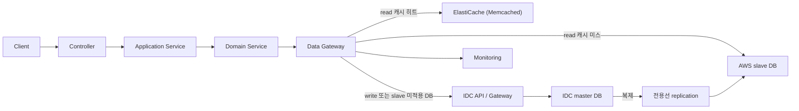
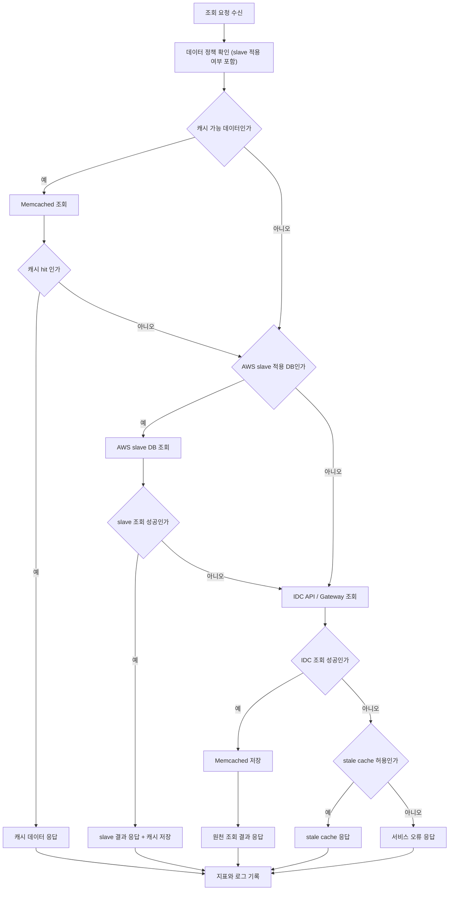
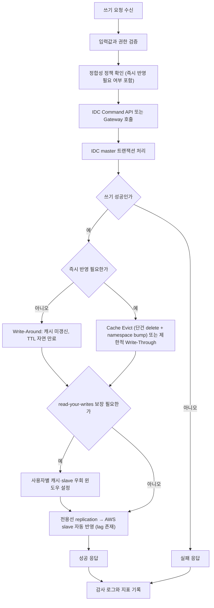
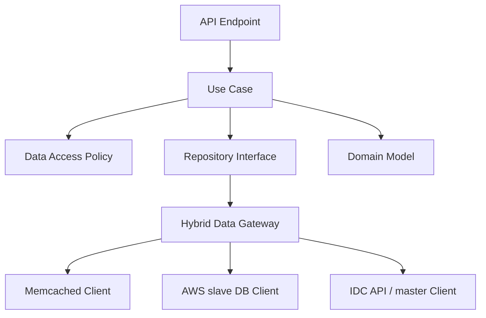
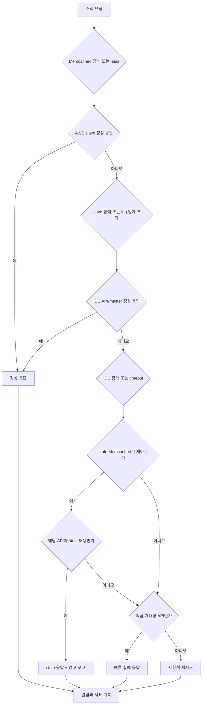

# 하이브리드 DB 운영 시 서비스 레이어 처리 프로세스

## 목적

IDC DB를 원천 데이터로 유지하면서 AWS 환경의 서비스가 함께 운영될 때, 서비스 레이어가 어떤 판단과 처리를 맡아야 하는지 정리한다. 핵심은 서비스가 DB 위치를 직접 노출하지 않고, 데이터 접근 정책과 정합성 경계를 명확히 소유하는 것이다.

## 기본 전제

- IDC DB는 원천(master) 저장소다.
- AWS 측에는 동일 엔진의 **slave DB**를 두고, 전용선을 통한 replication으로 동기화한다.
- AWS 서비스의 read는 **AWS slave DB**를 1차 경로로 사용하며, 그 앞단에 **ElastiCache for Memcached**를 둬 SELECT 결과를 TTL 캐싱한다.
- write는 IDC master로 단일화한다(직접 또는 IDC API/Gateway 경유).
- CDC + 별도 Read Model 분리 방식은 **본 단계에서 채택하지 않는다**(과거 시도 실패 이력 반영). 추후 도메인별로 별도 검토 가능.
- slave 미적용 DB가 있는 경우, 해당 데이터는 IDC API/Gateway 직접 조회 + 짧은 TTL 캐시로 처리한다.
- 신규 서비스에서 SP 직접 호출은 피하고, 레거시 경계 변경은 별도 승인 대상으로 본다.
- 구독 결제·이용권 차감·보유 도서 변경처럼 강한 정합성이 필요한 흐름은 캐시를 주 경로로 두지 않으며, slave 대신 master를 직접 조회한다.

## 채택된 구조 요약

| 구성 요소 | 선택 | 비고 |
|-----------|------|------|
| 원천 DB | IDC MSSQL master | 변경 없음 |
| AWS read 경로 | AWS MSSQL slave (전용선 replication) | 모든 legacy DB를 slave로 두는 것을 목표로 하되, **자체 DB부터 1차 적용** |
| 캐시 | ElastiCache for Memcached | TTL 기반 cache-aside, SELECT 결과 캐싱 |
| 쓰기 경로 | IDC master 직접 또는 IDC API | 단일 경로 |
| Read Model 분리 | 본 단계 미채택 | CDC 운영 부담·과거 실패로 보류 |
| 캐시 역할 | slave QPS·SP CPU 부담 흡수 + 짧은 stale-while-error | **망 지연 자체를 줄이는 용도가 아님** |

## 캐시 전략 표준 (REF-A-3484)

팀 전사 표준 [Query Result Caching Strategy](https://aladincommunication.youtrack.cloud/articles/REF-A-3484/Query-Result-Caching-Strategy)가 캐시 정책의 source of truth다. **본 문서는 max/tobe/서재 3개 서비스 적용 매핑이며, KB와 충돌 시 KB가 우선한다.** 본 문서의 캐시 처리는 다음 7개 패턴을 단계적으로 겹쳐 적용한다.

| # | 패턴 | 적용 단계 | 핵심 동작 |
|---|------|----------|----------|
| 1 | Cache-Aside + 초단기 TTL | 기본 (모든 read 캐시) | Memcached 우선 → miss는 slave/IDC 조회 후 저장 |
| 2 | TTL Jitter | 캐시 저장 시점 | 기본 TTL ± 랜덤 jitter(±10~20%)로 만료 분산 |
| 3 | Multi-Get | 목록·전시 | 다건 키 일괄 조회, miss만 Bulk Select 후 결과 합성·정렬 |
| 4 | Hot Key 분산 + Consistent Hashing | 고QPS·공유 키 | mall/device/segment/page 기준 키 분리 후 노드 분산 |
| 5 | Refresh-Ahead | Hot Key 만료 임박 | Refresh Worker가 만료 직전 선갱신, 사용자 요청은 계속 Hit |
| 6 | Write-Around (쓰기 기본) | 일반 조회성 데이터 | master만 갱신, 캐시는 짧은 TTL로 자연 만료 |
| 7 | Cache Evict / 제한적 Write-Through | 즉시 반영 필요 | 관련 키 삭제 또는 최신값 직접 저장 |

추가로 운영 안정성 패턴: **Fail-Open**(get/set 오류 시 slave/master 우회) + **Circuit Breaker**(오류율 임계 초과 시 일정 시간 캐시 우회)은 모든 적용 서비스 공통이다.

서비스별 어떤 패턴을 어디에 적용하는지는 [서비스별 캐시 전략 적용](#서비스별-캐시-전략-적용) 절에서 다룬다.

## 전체 구조



서비스 레이어에서 중요한 분기점은 `Data Gateway`다. Controller나 UseCase가 Memcached, AWS slave, IDC API를 직접 고르지 않게 하고, Gateway가 API별 정책과 데이터 출처 DB(slave 적용 여부)에 따라 조회 위치와 fallback을 결정한다.

## 조회 프로세스

### Cache-aside 기본 조회



이 흐름에서 서비스 레이어가 가져야 할 판단은 다음과 같다.

| 판단 항목 | 서비스 레이어 책임 |
|-----------|-------------------|
| 캐시 가능 여부 | API와 데이터 성격별로 정의 |
| TTL | 데이터 변경 빈도, replication lag, stale 허용 시간을 합산 기준으로 정의 |
| cache key | 도메인 식별자 + 언어 + 채널 + **출처 DB 식별자** 포함 (3개 서비스는 단일 테넌트라 tenant 컬럼 불필요) |
| slave 사용 여부 | 데이터의 출처 DB가 slave 적용 대상인지 정책 표로 관리 |
| fallback 허용 여부 | 장애 시 stale 데이터를 보여줘도 되는지 판단 |
| 원천 조회 경로 | slave 미적용 DB는 IDC API 우선, 불가피한 경우 DB Gateway |
| 강한 정합성 필요 시 | slave 우회 → IDC master 직행 (예: 이용권 차감 직전 보유 상태·구독 권한 재검증) |

## 쓰기 프로세스

쓰기는 **Write-Around가 기본**이다(REF-A-3484). 서비스는 command 처리 후 IDC master로만 쓰고, slave는 replication으로 자연 동기화되며, **일반 조회성 데이터의 캐시는 짧은 TTL로 자연 만료**한다. **즉시 반영이 필요한 데이터에 한해** Cache Evict(단건 delete + 그룹 namespace bump) 또는 제한적 Write-Through로 보완한다.



구현 원칙:

- 서비스 코드는 IDC master에만 write하고, AWS slave에는 절대 직접 write하지 않는다(slave는 read-only).
- **일반 조회성 데이터는 Write-Around** — master만 갱신하고 캐시는 짧은 TTL로 자연 만료한다. 명시적 무효화는 하지 않는다.
- **즉시 반영 필요 데이터(가격·권한·판매상태 등)만** 트랜잭션 성공 직후 동기적으로 Cache Evict 또는 제한적 Write-Through. 실패 시 보상 로직 또는 짧은 TTL이 백업.
- replication lag로 인해 쓰기 직후 같은 사용자가 read하면 stale 가능 → **read-your-writes**가 필요한 API는 **마스터 직행** 또는 **사용자별 캐시 우회 윈도우**(예: 5초간 master read) 설계.
- 동시 write 금지: IDC와 AWS에 같은 데이터를 동시에 쓰면 부분 실패, 순서 꼬임, 재처리 난이도가 커진다.

## 서비스 레이어 내부 구조



권장 역할 분리는 다음과 같다.

| 계층 | 역할 |
|------|------|
| API Endpoint | 요청 파라미터와 인증 컨텍스트 수신 |
| Use Case | 업무 흐름 조립, 읽기와 쓰기 유스케이스 분리 |
| Data Access Policy | 캐시 가능 여부, TTL, stale 허용 여부, slave 적용 여부, 정합성 수준 정의 |
| Repository Interface | 도메인 관점의 조회와 저장 계약 제공 |
| Hybrid Data Gateway | Memcached, AWS slave, IDC master/API 중 실제 접근 경로 선택 |
| Domain Model | DB 위치와 캐시 정책을 모르는 순수 업무 규칙 유지 |

## Memcached 적용 시 고려사항

ElastiCache for Memcached는 Redis와 달리 다음 제약을 가진다. 서비스 레이어가 이를 흡수해야 한다.

| 제약 | 서비스 레이어 대응 |
|------|---------------------|
| key-value만 지원 (List/Hash/Set 없음) | SELECT 결과를 JSON 직렬화 후 단일 value로 저장 (Newtonsoft.Json 통일). value > 200KB는 gzip 압축, 1MB 초과는 저장 거부 |
| pattern delete (`KEYS`/`SCAN`) 없음 | 그룹 무효화는 **namespace 버저닝** 사용. 변경 시 namespace 카운터 `incr`로 일괄 무효화. 단건은 명시적 `delete` |
| persistence·replication 없음 | 노드 재시작 = 캐시 전부 손실 가정. **stampede 보호**(in-process single-flight, `add` 락) + **TTL jitter ±10~20%** + **warm-up 스크립트** 필수 |
| TTL 전 LRU eviction 가능 | "miss는 정상" 전제로 코드 작성. negative result도 짧은 TTL로 캐시 가능 |
| key 250B / value 1MB 한계 | 긴 composite key는 SHA-1 해시 fallback. 큰 result set은 페이지 슬라이싱 |
| Pub/Sub·Lua 없음 | 캐시 무효화 broadcast는 앱 레벨 fan-out 또는 짧은 TTL 의존 |
| 노드 추가/제거 시 일부 key rehash | **AWS ElastiCache Cluster Client (auto-discovery)** 필수 |

### 캐시 키 컨벤션

```
v{ver}:{service}:{domain}:{sourceDb}:{lang}:{id}
예: v1:max:book:WebCatalog:ko:itemId=12345
    v1:tobe:content:Tobe:userId=42:page=3
    v1:library:user-books:Library:userId=42
```

- `service`로 max·tobe·library(서재) 구분 → 클러스터 공유 시 충돌 방지.
- `sourceDb` 포함 → slave 적용 여부에 따라 운영 시 디버깅·정책 분기 용이.
- 250B 초과 시 뒤쪽 부분만 SHA-1 해시.

### slave 적용 여부에 따른 캐시 정책 분기

KB 표준에 따라 **쓰기 기본은 Write-Around**(TTL 자연 만료)이며, 즉시 반영이 필요한 영역만 Cache Evict로 보완한다.

| 출처 DB | 기본 쓰기 정책 | 즉시 반영 필요 시 | 비고 |
|---------|--------------|-------------------|------|
| 자체 DB | Write-Around (분 단위 TTL + jitter, 자연 만료) | Cache Evict (단건 delete + namespace bump) | replication lag만큼 추가 stale 허용 |
| 공유·외부 DB | Write-Around + 매우 짧은 TTL (30초~1분) | TTL only (외부 write 무효화 채널 없음) | 외부 직접 write를 lag으로도 못 잡음 |
| 강한 정합성 영역 | 캐시 우회 (bypass 윈도우) | — | 이용권 차감·구독 결제 직전 master 재검증 |

### .NET 4.8 구현 표준

- **클라이언트**: AWS ElastiCache Cluster Client for .NET (EnyimMemcached fork, auto-discovery 지원). .NET 8은 EnyimMemcachedCore.
- **타임아웃**: connect 100ms / read 50ms / write 100ms — 짧게.
- **서킷브레이커**: Polly로 캐시 장애 시 즉시 slave/IDC 직행 fallthrough.
- **Repository 결합 방식**: Decorator 패턴 (`CachedXxxRepository : IXxxRepository`). 기존 Repository 비침투.
- **DI**: max-api / tobe는 Unity Container. 사내 공통 패키지 `Aladdin.Cache`로 추출.
- **직렬화**: Newtonsoft.Json. payload에 `v` 필드(스키마 버전) 포함.

## 서비스별 캐시 전략 적용

본 문서의 적용 대상은 **max(만권당), tobe(투비컨티뉴드), 서재** 3개 서비스로 한정한다. 다른 서비스(storefront·bazaar·naru·aasm)는 본 하이브리드 DB 모델 적용 대상이 아니다.

### 패턴별 적용 매트릭스

| 패턴 | max | tobe | 서재 |
|------|:---:|:----:|:----:|
| 1. Cache-Aside + 초단기 TTL | ◉ | ◉ | ◉ |
| 2. TTL Jitter | ◉ | ◉ | ◉ |
| 3. Multi-Get | ◉ | ◉ | ◉ |
| 4. Hot Key 분산 + Consistent Hashing | ◉ | ◉ | △ |
| 5. Refresh-Ahead | ◉ | △ | △ |
| 6. Write-Around | ◉ | ◉ | ◉ |
| 7. Cache Evict / Write-Through | ◉ | ◉ | ◉ |
| Fail-Open + Circuit Breaker | ◉ | ◉ | ◉ |

◉ 핵심 적용 / △ 제한적 적용

### max (만권당)

| 패턴 | 적용 영역·방법 |
|------|--------------|
| Cache-Aside | 도서 상세, 카테고리, 코드성 데이터 → Memcached 우선, miss 시 slave (Step 1 이후) |
| TTL Jitter | 모든 캐시 set 시점에 ±10~20% jitter |
| Multi-Get | 도서 목록, 베스트셀러, 신간, 카테고리 페이지의 도서 ID 묶음 조회 |
| Hot Key 분산 | 메인 전시, 인기 카테고리, 베스트셀러 → `mall`(전체/eBook/POD) × `device`(web/app) 기준 키 분리 |
| Refresh-Ahead | 메인 전시, 베스트셀러, 인기 카테고리 상위 N건 → 만료 30~60초 전 Refresh Worker로 선갱신 |
| Write-Around | 도서 메타, 카테고리, 코드성 데이터 변경 (master만 갱신) |
| Cache Evict | 가격·판매상태 변경, 운영 노출 토글 → 단건 delete + namespace bump |
| Fail-Open | Memcached 장애 시 slave 직행, slave 장애 시 IDC API 우회, Polly 서킷브레이커 |

리스크: 기존 Redis 사용처(인벤토리·세션 등)와 Memcached 역할 분리 → Step 2 전수조사 작업 필요. pattern-delete 의존 코드는 namespace bump로 변환.

### tobe (투비컨티뉴드)

| 패턴 | 적용 영역·방법 |
|------|--------------|
| Cache-Aside | 블로그·콘텐츠 상세, 카테고리, 작가 정보 (1차는 Tobe 자체 DB만) |
| TTL Jitter | 동일 |
| Multi-Get | 블로그 목록, 작가별 콘텐츠 묶음, 카테고리 페이지 콘텐츠 ID 묶음 |
| Hot Key 분산 | 메인 전시, 인기 콘텐츠, 작가 베스트 → `mall × device × segment`(독자/작가) 분리 |
| Refresh-Ahead | 메인 전시, 인기 콘텐츠 (자체 DB 영역만, 공유 DB 영역은 보류) |
| Write-Around | 콘텐츠 메타, 카테고리 변경 (master만 갱신) |
| Cache Evict | 권한·구독 상태 변경, 노출 토글 |
| Fail-Open | 동일 |

리스크: 5개 DB 중 4개가 공유 DB → 외부 write 무효화 채널 부재 영역은 Cache-Aside를 보류하고 짧은 TTL + jitter만 운영.

### 서재

| 패턴 | 적용 영역·방법 |
|------|--------------|
| Cache-Aside | 사용자 보유 도서·이용권, 도서 메타 조회 |
| TTL Jitter | 동일 |
| Multi-Get | 사용자 라이브러리 목록 조회 시 도서 ID 묶음 조회 |
| Hot Key 분산 | 사용자 단위 데이터 비중이 커서 hot 영역 적음 → 메인 진입 데이터(추천·배너)에 한해 적용 |
| Refresh-Ahead | 메인 진입 캐시에 한정 적용 |
| Write-Around | 도서 등록·메타 변경 (master만 갱신) |
| Cache Evict | 권한·구독 상태 변경, 보유 도서 추가/삭제, 이용권 변경 |
| Fail-Open | 동일 |

리스크: AWS 인프라 이관과 캐시 도입 동시 진행 시 장애 원인 분리 어려움 → 이관 안정화(2주) 후 캐시 도입(Step 3). SP 호환성 확인 선행.

## 데이터 단위 처리 체크

### 적용 서비스별 DB 구성

| 서비스 | 자체 DB | 공유 DB | 1차 캐시 적용 범위 |
|--------|--------|--------|------------------|
| max | EbookCms 등 | WebCatalog, WebMarket, Alibaba | 자체 DB부터, 공유 DB는 합의 후 |
| tobe | Tobe | WebCatalog, WebMarket, Alibaba (공유 4개) | 자체 DB만 (공유 DB는 외부 write 무효화 채널 부재) |
| 서재 | 서재 자체 DB | (이관 진행 중) | AWS 인프라 이관 안정화(2주) 후 |

### 데이터 단위별 처리 매트릭스

| 데이터 단위 | 원천 | 캐시 정책 (TTL) | 무효화 | 정합성 | 비고 |
|------------|------|---------------|--------|--------|------|
| 도서 메타 | max WebCatalog | 중간 TTL (5~10분) + jitter | Write-Around (자연 만료) | eventual | 가격·판매상태와 분리 |
| 도서 가격·판매상태 | max WebCatalog | 매우 짧은 TTL (30초~1분) | Cache Evict (즉시) | 비교적 강한 정합성 | 주문 직전 master 재검증 필수 |
| 카테고리 | max WebCatalog | 긴 TTL (30분~1시간) | Cache Evict (운영 변경 시) | eventual | Hot Key 분산 + Refresh-Ahead 후보 |
| 코드성 데이터 | max | 긴 TTL (30분~1시간) | Cache Evict (변경 시) | eventual | Hot Key 분산 후보 |
| 콘텐츠·블로그 메타 | tobe Tobe DB | 중간 TTL (5~10분) + jitter | Write-Around | eventual | 자체 DB 영역만 1차 적용 |
| 작가 정보 | tobe Tobe DB | 중간 TTL (5~10분) | Write-Around | eventual | — |
| 메인 전시·인기 콘텐츠 | tobe Tobe DB | 짧은 TTL (1~5분) + jitter | Refresh-Ahead 선갱신 | eventual | Hot Key 핵심 영역 |
| 사용자 보유 도서·라이브러리 | 서재 자체 DB | 짧은 TTL (1~3분) | Cache Evict (보유 변경 시) | 강한 정합성에 가까움 | 사용자 단위 키, hot 비중 낮음 |
| 이용권·구독 상태 | 서재 또는 원천 서비스 | 짧은 TTL (1~3분) | Cache Evict (변경 시) | 강한 정합성 | 권한성 데이터, stale 허용 시간 짧게 |
| 운영 배너·공지 | 각 서비스 | 긴 TTL (30분~1시간) | Cache Evict (운영 변경 시) | eventual | 서비스별 운영 주체 분리로 장애 영향 축소 |
| 감사 로그 | 각 서비스 | 캐시 불필요 | — | append-only | — |

## 장애와 fallback 판단

조회 경로는 `Memcached → AWS slave → IDC API/master` 3단 방어를 가진다. 단계별 실패 시 다음 단계로 fallthrough하되, API 성격에 따라 stale 응답을 허용할지 빠른 실패를 택할지가 갈린다.



fallback 원칙:

- **Memcached 장애**: 즉시 slave 직행. 캐시 의존도 0 (서킷브레이커로 빠르게 우회).
- **slave 장애 또는 replication lag 임계 초과**: IDC API/master로 fallthrough. lag 임계는 데이터별 정의 (예: 30초 이상이면 master).
- **IDC 장애**: 마지막 보루로 stale 캐시. 단, **stale 허용 여부는 API별 사전 정의** 필수.
- **구독 결제·이용권 차감 같은 거래성 API**: stale 응답 의미 없음 → 빠르게 실패 + 알림.
- **Cold start (캐시 통째로 비워진 상태)**: 모든 요청이 slave로 향함 → slave가 정상이면 큰 문제 없음. 단, slave QPS 폭증 모니터링 + warm-up 스크립트 준비.

## 구현 체크리스트

### 정책·구조
- API별로 `strong consistency`, `eventual consistency`, `cacheable`, `slave 적용 여부` 4축을 표로 정의한다.
- Repository 또는 Gateway 계층에서만 Memcached, AWS slave, IDC API 접근을 허용한다.
- Controller와 Use Case에는 DB 위치 분기 로직을 넣지 않는다.
- 쓰기 경로는 IDC master 단일화. AWS slave에 직접 write 절대 금지.

### 캐시 키·TTL·무효화
- cache key에는 `service`, `domain`, `sourceDb`, `channel`, `language`, `user scope` 등 조회 결과를 바꾸는 조건과 출처 DB 식별자를 포함한다 (3개 서비스 단일 테넌트라 `tenant`는 미사용).
- TTL은 `데이터 변경 빈도 + replication lag + stale 허용치`를 합산해 산정하고 ±10~20% jitter를 적용한다.
- **쓰기는 Write-Around가 기본**(REF-A-3484). 일반 조회성 데이터는 master만 갱신하고 캐시는 짧은 TTL로 자연 만료.
- **즉시 반영 필요 데이터(가격·권한·판매상태 등)만** Cache Evict(단건 `delete` + 그룹 `namespace bump`) 또는 제한적 Write-Through.
- payload에 스키마 버전(`v` 필드) 포함. value 200KB 초과 시 gzip 압축, 1MB 초과 시 저장 거부.

### Multi-Get·Hot Key·Refresh-Ahead
- 목록·전시 조회는 단건 Get 대신 **Multi-Get**으로 묶어 호출. 일부 miss는 MSSQL Bulk Select로 채우고 원래 순서로 합성.
- 서비스별 **Hot Key 후보 목록**을 사전 정의(메인 전시, 인기 상품, 베스트셀러, 카테고리 트리, 공통 코드, 앱 초기화 설정 등).
- Hot Key는 mall/device/segment/page 기준 키 분리 후 Consistent Hashing으로 노드 분산.
- 상위 Hot Key는 **Refresh Worker**가 만료 30~60초 전 선갱신. 사용자 요청은 계속 Cache Hit 처리.
- Refresh Worker 실패 시 일반 Cache-Aside 흐름으로 자연 폴백(별도 장애 처리 불필요).

### Memcached 운영
- AWS ElastiCache Cluster Client (auto-discovery) 사용.
- connect 100ms / read 50ms / write 100ms 타임아웃, Polly 서킷브레이커.
- **Fail-Open**: get/set 오류 시 즉시 slave/master 우회. **Circuit Breaker**: 오류율 임계 초과 시 일정 시간 캐시 우회 후 Half-Open 복구.
- Stampede 보호: in-process single-flight 또는 `add` 분산 락 (Refresh-Ahead 미적용 영역에서 특히 중요).
- Cold start 대비 warm-up 스크립트 준비 (top-N hot key).
- Negative caching (404·empty) 짧은 TTL로 허용.

### slave 운영 연계
- replication lag 임계값(예: 30초)을 정의하고 임계 초과 시 master 라우팅.
- read-your-writes가 필요한 사용자 흐름은 쓰기 직후 N초간 master 라우팅.
- read-only SP 분류 작업을 사전에 수행. 부수효과 있는 SP는 master 전용.
- SP/DDL 변경 시 slave 동기 확인 절차를 변경 게이트에 포함.

### 관측 지표
- `cache hit ratio`, `cache evictions`, `cache item count`, `cache value size 분포`
- `slave latency`, `slave QPS`, `replication lag`
- `IDC API latency`, `timeout count`, `fallback count`
- per-prefix(서비스·도메인·sourceDb) hit ratio.

### 변경 관리
- DB 변경, SP 변경, 프로덕션 배포, 레거시 경계 변경은 별도 승인 대상.
- DB 변경 PR 체크리스트에 "관련 캐시 키 영향" 항목 추가.

## max·tobe·서재 적용 순서

1차 적용 대상 3개 서비스 모두 .NET Framework 4.8 + MSSQL + SP 결합 구조이며, 다음 순서로 단계 적용한다.

### 사전 조건 (인프라·공통)

| 항목 | 결정 사항 |
|------|-----------|
| Replication 기술 | SQL Server Transactional / AlwaysOn AG / DMS 중 택일, 인프라 결정 후 문서화 |
| slave 대상 DB 1차 | **자체 DB 우선**: Tobe, EbookCms, 서재 자체 DB |
| slave 대상 DB 2차 | 공유 DB(WebCatalog, WebMarket, Alibaba)는 다른 팀과 합의 후 |
| WebLog | slave 제외 (write-heavy, 분석 별도 파이프라인) |
| ElastiCache 클러스터 | 서비스별 분리 권장 (블래스트 반경) |
| 공통 캐시 SDK | `Aladdin.Cache` 사내 NuGet 패키지로 추출 |

### 단계별 적용

| 단계 | 대상 | 작업 | 통과 기준 |
|------|------|------|-----------|
| Step 0 | 공통 SDK | `Aladdin.Cache` 패키지(인터페이스·Decorator·Polly·메트릭) 작성 | 부하테스트 1k qps 기준 P99 < 5ms, 캐시 down 시 fallthrough 동작 |
| Step 1 | tobe (자체 Tobe DB) | slave 안정화 후 read-only 영역(블로그 상세, 카테고리, 인기) 캐시 적용 | hit ratio ≥ 70%, P99 응답시간 개선, stale 사고 0건/2주 |
| Step 2 | max | 기존 Redis 인벤토리 → Memcached 마이그레이션 매핑. `Cache/*` 엔드포인트 영향 분석. 점진 전환 | pattern-delete 사용처 100% namespace bump로 변환, 무효화 시나리오 회귀 테스트 통과 |
| Step 3 | 서재 | AWS 인프라 이관 안정화(2주) 후 캐시 도입 | 이관 후 SP 호환성 확인, 캐시 도입 전후 응답시간 비교 |
| Step 4 | 공유 DB 확장 | WebCatalog 등 공유 DB의 slave 합의 후 캐시 정책 확장 | 다른 팀과 무효화 채널 합의, TTL 정책 공동 합의 |

### 서비스별 주요 리스크

| 서비스 | 핵심 리스크 | 대응 |
|--------|-------------|------|
| max | 기존 Redis와 Memcached의 역할 정리 미명확 시 운영 부담 2배. pattern-delete 의존 코드 손실 위험 | Redis 사용 전수조사 + 일원화 또는 명확한 분리 정책 |
| tobe | 5개 DB 중 4개가 공유 DB → 외부 write 무효화 채널 없음 | 1차 적용은 Tobe 자체 DB로 한정 |
| 서재 | 인프라 이관과 캐시 도입 동시 진행 시 장애 원인 분리 어려움 | 이관 안정화 후 캐시 도입, 단계 분리 |

### 인프라·기획 측 확인 필요 사항

- Replication 기술 선택과 SP/DDL 변경 절차
- slave 대상 DB 최종 명단 (자체 vs 공유)
- 전용선 대역폭 한계와 replication lag SLA
- master 장애 시 failover 정책 (자동/수동, slave promote 여부)
- MSSQL 라이선스 모델
- read-your-writes 보장이 필요한 API 사전 도출

## 한 줄 요약

서비스 레이어는 DB를 직접 고르는 코드가 아니라, 데이터 성격과 출처 DB의 slave 적용 여부에 따라 `Memcached → (AWS slave) → IDC master` 경로를 선택하는 완충 계층이 되어야 한다. 캐시 정책은 KB 표준(REF-A-3484)을 따르고, 본 문서는 그 적용 매핑이다. 캐시는 망 지연을 줄이는 도구가 아니라 slave 부하·SP CPU·짧은 stale-while-error를 흡수하는 보조 계층이며, 강한 정합성이 필요한 흐름은 항상 master 직행이다.
