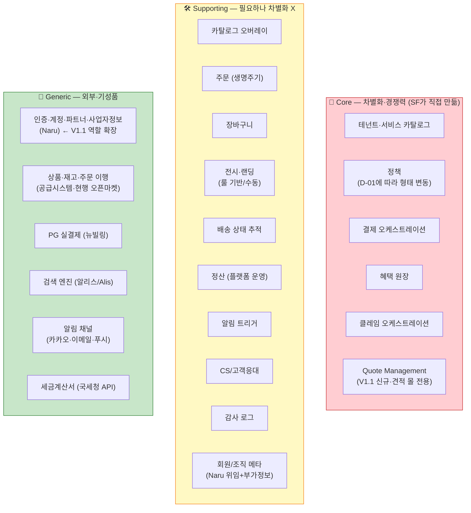
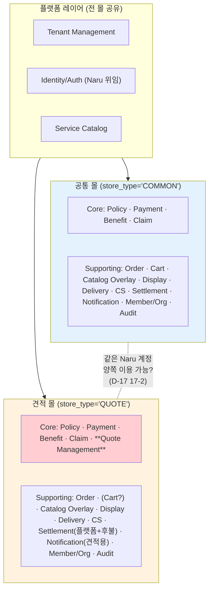
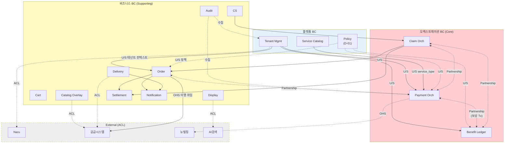
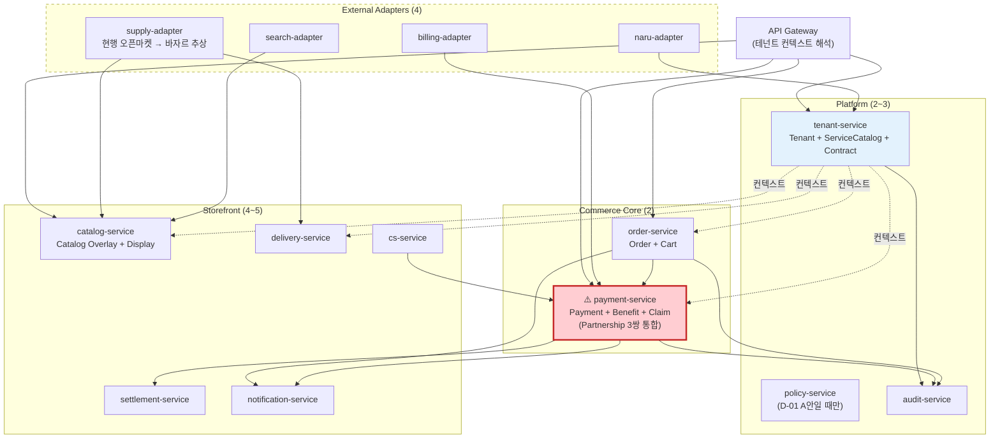

# 스토어프론트 DDD 분류 — 서브도메인·Bounded Context·Context Map

> **목적**: 현재 설계 자료를 DDD 언어(서브도메인·Bounded Context·Aggregate·Context Map)로 재정리.
> **사용처**:
> - DEV2-5298 (Bounded Context Map 확정) 작업의 **직접 입력**
> - 이벤트 스토밍 기술 세션([guide.md](../event-storming/b2b-store-event-storming-guide.md)) **참조 자료**
> - 5월 외주 인력(BE 1 + FE 1) **온보딩 자료**
> **작성**: 2026-04-20, 김정민 · **V1.1 반영**: 2026-04-21
> **상태**: 초안 — 이벤트 스토밍 Phase 3(애그리거트·경계) 결과로 업데이트 예정
> **주의**: 본 분류는 **가설**. 특히 D-01(정책 엔진 위치)이 미결인 상태라 Policy BC 유무에 따라 BC 수가 흔들림.
>
> **V1.1 반영 (2026-04-21)**: 기획 V1.1로 **공통 14 + 견적 7 = 21 비즈니스 도메인** 확장. Core BC에 **Quote Management** 추가. 공통 몰과 견적 몰은 **별도 테넌트(`store_type`)**. AI검색 → **알리스(Alis)** 명명. Naru 역할 확장 (계정 + 파트너 + 사업자정보 마스터). 근거: [b2b-store-domain-v11-reflection.md](../domain/b2b-store-domain-v11-reflection.md)
>
> **MVP 상태**: 미결. V1.1의 "MVP 제외" 표시는 **잠정**. 기획 + 이벤트 스토밍 양쪽 산출물 통합 후 확정.
>
> **MVP 원칙 (2026-04-21 확정)**: (1) **설계단 고려, 실 구현 Phase 분리** — MVP는 훅·인터페이스·스키마 컬럼만 포함, 실 기능 구현은 요구 시점. (2) **대량구매(견적 몰) 선행 라이브 가능성** 열려 있음 — Quote Management BC는 공통 Core와 독립적이어야 함.

---

## 목차

0. [기획자 도메인 분류(4/17) ↔ DDD 매핑](#0-기획자-도메인-분류417--ddd-매핑)
1. [서브도메인 3분류 (Core / Supporting / Generic)](#1-서브도메인-3분류)
2. [Bounded Context 목록 (V1.1 — Core 7 + Supporting 14 + 외부 4)](#2-bounded-context-15개--외부-4개)
3. [Context Map — BC 간 관계](#3-context-map--bc-간-관계)
4. [Published Language 후보](#4-published-language-후보)
5. [Aggregate 목록](#5-aggregate-목록-일관성-경계)
6. [설계 함의 5개](#6-ddd-관점-설계-함의-5개)
7. [중요 불확실성](#7-중요-불확실성)
8. [워크숍 후 업데이트 규칙](#8-워크숍-후-업데이트-규칙)
9. [MSA 진화 경로 — BC → Service 매핑](#9-msa-진화-경로--bc--service-매핑)
10. [다중 공급원 확장 가능성 — 제3 마켓 수용](#10-다중-공급원-확장-가능성--제3-마켓-수용)

---

## 0. 기획자 도메인 분류(4/17) ↔ DDD 매핑

> **출처**: YouTrack [DEV2-A-1064](https://aladincommunication.youtrack.cloud/articles/DEV2-A-1064) — 4/17 회의 "B2B 구매 여정 기반 서비스 도메인 분류 및 추상화"
> **목적**: 기획자가 구매자 여정 관점에서 잡은 13개 "도메인"을 DDD 관점의 서브도메인·BC와 매핑.
> **결론**: 기획자 13개는 엄밀히 말하면 **서브도메인이 아니라 BC(기능 단위) 초안**이다. 관점이 구매자 여정이라 B2B 특유의 5개 영역(테넌트·결재·계약·모니터링·프로모션)이 표면에 안 드러나 있다. 우리 DDD 맵(§1·§2)에 이미 다수 반영.

### 0.1 관점 차이

| 관점 | 기준 | 산출물 | 쓰임 |
|------|------|--------|------|
| **기획자 (4/17)** | end-user 구매 여정 | 전시 → 주문 → 구매 후 (3단계·13 도메인) | 화면·기능 설계, 기획서 |
| **DDD (본 문서)** | 비즈니스 역량 / 팀 경계 | 핵심 / 지원 / 일반 서브도메인, BC | 시스템·팀 경계, 모듈·서비스 분할 |

두 관점 모두 필요하고, 서로 **교차 검증**되어야 한다. 기획자 모델에 없는 게 우리 B2B 핵심이면 설계 누락 신호, 우리 모델에 없는 게 기획자 관점에 있으면 비즈니스 요구 누락 신호.

### 0.2 매핑표 — 기획자 13개 → 본 문서 §2 BC

| 기획자 영역 | 기획자 도메인 | 본 문서 BC (§2) | 분류 | 비고 |
|-------------|--------------|-----------------|------|------|
| 전시 | 카탈로그 | Catalog Overlay | Supporting | 원천 = 공급시스템(바자르) |
| 전시 | 가격 | **Policy** (가격정책 포함) | **Core** | D-01·D-02, B2B 계약가·쿠폰룰 |
| 전시 | 재고 | *(외부)* 공급시스템 | External | Catalog Overlay로 참조 |
| 전시 | 전시 | Display | Supporting | 프로모션·기획전·공지·랜딩 포함 (D-04 4-6, 4-11) |
| 전시 | 검색 | *(외부)* 알리스(Alis) | External | Display에서 쿼리 위임 |
| 주문 | 장바구니 | Cart | Supporting | — |
| 주문 | 주문 | Order | Supporting | 독립 주문 엔티티 (D-07) |
| 주문 | 결제 | **Payment Orchestration** | **Core** | 외부 실결제 = 뉴빌링 |
| 주문 | 배송 | Delivery | Supporting | 상태 추적 중심, 이행은 공급시스템 |
| 주문 | 클레임 | **Claim Orchestration** | **Core** | D-03, B2B 정책 오케스트레이션 |
| 구매 후 | 정산 | Settlement (플랫폼) · Settlement (후불)† | Supporting | 견적 몰은 후불 분리 (V1.1) |
| 구매 후 | 혜택 | **Benefit Ledger** | **Core** | D-02, 혜택 원장·쿠폰 |
| 구매 후 | 알림 | Notification | Supporting | 트리거=SF, 채널=Generic |

† Settlement는 **구매자용 결제 정산이 아니라 플랫폼 ↔ 제휴사 정산**. 기획자 문서의 "정산"과 용어는 같지만 의미 차이 주의.

### 0.3 기획자 모델에서 표면에 안 드러난 B2B 핵심 5개

구매자 여정 관점이라 여정 밖 영역(테넌트 운영·내부 워크플로우·관리자 기능)이 배경으로 빠졌다. 본 문서 §2에는 대부분 반영되어 있으나 **Approval은 누락** 상태.

| 영역 | 본 문서 BC (§2) | 기획자 문서 흔적 | 본 문서 반영 |
|------|-----------------|------------------|--------------|
| **테넌트·조직** | Tenant Management, Member/Organization | "계정 = Naru 위임"으로 상위 가정 | ✅ Core + Supporting |
| **계약 관리** | Contract/Partnership | "검토 필요 > 계약 관리"로 부분 인지 | ✅ Supporting (V1.1 신규) |
| **구매 품의·결재** | *(Approval BC 미도입)* | 언급 없음 | 🔄 **4/22 확정**: Approval BC 신규 X, **회원별 구매·배송 제한 정책**으로 대체 (Member BC 정책 필드) |
| **구매 모니터링·분석** | Monitoring | "검토 필요 > 주문 상품 모니터링" | ✅ Supporting **MVP 포함 (4/22 확정)** — 제휴몰 관리자 주문현황·주문량 뷰 |
| **프로모션·기획전** | Display에 통합 | "현업 니즈 > 프로모션 및 기획전" | ✅ Display BC에 흡수 |

### 0.4 후속 작업

1. **Approval BC 확인** — 4/20 이벤트 스토밍 때 기획자에게 "기업 구매 품의·승인 워크플로우"가 MVP 필요한지 확인. 필요 시 §1 Supporting 또는 Core에 추가
2. **Naru 위임 가정 검증** — 기획자가 "계정=Naru 위임"으로 넘긴 부분이 테넌트·조직·권한 전체를 포함하는지 질의 (D-11, D-13 재확인)
3. **매핑표 역방향 반영** — 기획자 문서(DEV2-A-1064)에 "본 매핑표 링크" 제안 (기획↔설계 간 이중 추적성 확보)

---

## 1. 서브도메인 3분류



### 분류 기준

| 분류 | 기준 | 투자 방식 |
|------|------|----------|
| **Core** | 이 부분이 경쟁력이다. 기성품으로 대체 불가 | 최고 인력·직접 구현·테스트 가장 꼼꼼 |
| **Supporting** | 필요하지만 차별화 아님. SF 자체 구현해야 함 | 단순·견고하게. 최적화는 나중에 |
| **Generic** | 기성품/외부 시스템으로 대체 가능 | ACL로 격리·외부 위임 |

### 관찰

- **Core가 5개**로 일반 SaaS보다 많음 — "설정만으로 몰 생성" 가치 실현에 정책·결제·혜택 **모두에서 차별화** 필요
- **Generic 6개**가 SF의 **레버리지** — Naru·뉴빌링·AI검색·공급시스템 재사용 덕에 Core에 집중 가능
- **Supporting 9개**는 필요하지만 직접 차별화는 아님. **공수 최적화 대상**

---

## 2. Bounded Context 15개 + 외부 4개

### Core BC (7) — MVP는 4개

| BC | 주요 Aggregate | 관련 D-XX | 소속 몰 | MVP |
|----|-------------|----------|--------|:---:|
| **Tenant Management** | `Tenant`, `ServiceSubscription`, `Contract` | D-06, D-13, **D-17** | 전 몰 | ✅ |
| **Service Catalog** | `ServiceDefinition` | D-10 | 전 몰 | ✅ `service_type='book_mall'` 하드코딩 |
| **Policy** *(D-01에 따라 존재·비존재)* | `Policy`, `PolicyVersion` | **D-01** | 전 몰 | ❌ **MVP B안**: 독립 BC 없음, 각 영역 내재 |
| **Payment Orchestration** | `PaymentTransaction`, `PaymentBreakdown`, `CancelEvent` | D-02, D-12 | 공통 + 견적 | ✅ 뉴빌링 단건결제 + **제휴사 전용 포인트 어댑터 (단건)** (4/22 확정 — 알라딘 포인트 미적용) |
| **Benefit Ledger** | `BenefitAccount`, `LedgerEntry`, `Coupon` | D-02 | 공통 + 견적 | ❌ **Payment BC 내부 어댑터로 흡수** (제휴사 전용 포인트만, 단건) |
| **Claim Orchestration** | `ClaimCase`, `ReversalStep` | D-03 | 공통 + 견적 | ❌ **Order BC 상태 전이로 흡수** (취소만) |
| **Quote Management** *(V1.1 신규)* | `QuoteRequest`, `QuoteMatching`, `QuoteDocument`, `QuotePricePolicy`, (CRM 소속 미결) | **D-08**, D-18 | **견적 몰 전용** | ❌ 견적 몰 Phase 2b |

### Supporting BC (11)

| BC | 주요 Aggregate | 비고 | MVP |
|----|-------------|------|:---:|
| Catalog Overlay | `ProductOverlay`, `PriceOverlay` | 공급시스템 원본 + SF 오버레이. MVP는 가격 오버레이만 | ✅ |
| Order | `Order`, `OrderItem`, `DeliveryGroup?` | 독립 주문 엔티티 (D-07). **MVP는 Cart·Claim(취소) 흡수**. DeliveryGroup은 D-19에 따라 Phase 2 | ✅ |
| Cart | `CartSession` | **MVP: Order BC에 흡수** (별도 BC 승격은 Phase 2 검토) | 🟡 Order 흡수 |
| Display | `LandingLayout`, `Campaign`, `Notice` | 프로모션·기획전·공지·룰 기반 vs 수동 편성 (D-04 4-6, 4-11). MVP는 기본 랜딩 + 카테고리 + 단순 베스트셀러 | ✅ |
| Delivery | `Shipment`, `TrackingEvent` | 공급시스템 이행 상태 추적. 복수 배송지는 Phase 2 (D-19) | ✅ 단일 배송지 |
| Settlement (플랫폼) | `Settlement`, `Report` | 월 정산·수수료 | 🟡 **MVP는 수동 CSV export**, 자동 집계 Phase 2 |
| Settlement (후불) *(V1.1)* | `Receivable`, `PaymentDueNotice` | 견적 몰 후불 채권 관리 | ❌ 견적 몰 Phase 2b |
| Notification | `NotificationMessage` | 트리거 SF, 채널 Generic. 견적 몰은 단계별 이메일 전용 | ✅ 알라딘 기존 알림 시스템 연동 |
| CS/고객응대 | `ClaimInquiry`, `SupportTicket` | D-16. V1.1 공식화 | 🟡 **MVP는 이메일·전화 수동 대응**, SF 내장 도구 Phase 2 |
| Member/Organization *(V1.1 신규)* | `OrganizationProfile`, `VerificationStatus`, `Department`, `ContactPerson` | Naru 참조 + SF 부가 메타 (D-11 11-8~11, D-13 13-15) | 🟡 **MVP는 Naru 위임 + 조직 유형 필드 예약**, 수기 인증 Phase 2 |
| Review *(V1.1 신규)* | `ProductReview` | 임직원 채널 확장 시 | ❌ Phase 2+ |
| Monitoring *(V1.1 신규)* | `OrderStatView`, `OrderVolumeView` | **4/22 확정 — MVP 포함**: 제휴몰 관리자 주문현황·주문량 조회 (허용 불가 품목 감지는 Phase 2+) | ✅ MVP |
| Contract/Partnership *(V1.1 신규)* | `Partnership`, `ContractTerm` | **✅ 4/21 결정**: D-13 계약 관리(Tenant Mgmt의 Contract Aggregate)와 **단일 BC 통합**. MVP는 Read 중심(하드코딩 기본 계약), Phase 2에 Write UI·갱신 프로세스·제휴사 등록 | 🟡 설계 훅만 |
| Channel/Access *(V1.1 신규)* | `ChannelAccessPolicy`, `TenantDomainBinding` | 제휴사별 전용 URL·SSO. 임직원 채널 확장 시 | ❌ Phase 4+ |
| Audit | `AuditEntry` | D-14. **MVP 제외 — 설계 훅만 유지** | ❌ 설계 훅만 |
| ~~Approval~~ | — | 🔄 **4/22 확정 — BC 신규 X**: 상사 승인 워크플로우가 아니라 **회원별 구매·배송 제한** 방식. Member BC의 정책 필드(`purchase_restriction`, `delivery_restriction`)로 흡수 | ❌ BC 불필요 |

### External Systems (6) — ACL로 격리

| 외부 | 역할 | ACL 대상 BC | MVP | 비고 |
|------|------|-----------|:---:|------|
| **Naru** | IdP + **계정·파트너·사업자정보 마스터** (V1.1 확장) | Member/Organization, Tenant Mgmt | ✅ | V1.1 Q1: 계정 + 파트너 + 사업자정보 전부 Naru |
| **공급시스템** (현행 오픈마켓) | 상품·재고·주문 이행 | Catalog Overlay, Delivery | ✅ | 바자르는 컨셉, 실체는 오픈마켓 |
| **뉴빌링** | PG 실결제 | Payment Orchestration | ✅ | 단건결제만 MVP. 복합·정기결제 Phase 2 |
| **알리스(Alis)** | 검색 엔진 | Display (검색 쿼리) | ✅ | V1.1: "AI검색"의 공식 이름 |
| **알라딘 포인트 시스템** *(내부 외부)* | 포인트 차감·적립·환원 | Payment (어댑터) | ✅ | MVP는 Benefit Ledger 대신 이 시스템과 직접 연동 |
| **알라딘 알림 시스템** *(내부 외부)* | 주문·배송 알림 발송 | Notification | ✅ | MVP는 SF 독자 알림 없이 기존 시스템 연동 |

**합계 (MVP 기준 — b2b-store-mvp-definition-0422.md 정렬)**: 내부 **Core 4 (Tenant·Service Catalog·Payment·Order 확장) + Supporting 6 = 10 BC** + 외부 **6개**.
**합계 (전체 V1.1 구조)**: 내부 **Core 7 + Supporting 14 = 21 BC** + 외부 **6개** + 플랫폼 레이어 안의 3.
**MVP 제외 BC**: Policy(각 영역 내재), Benefit Ledger(Payment 어댑터 흡수), Claim Orchestration(Order 상태 흡수), Quote Management, Settlement(후불), Review, Contract/Partnership(설계 훅만), Channel/Access, Audit(설계 훅만), Cart(Order 흡수). **상세**: [b2b-store-mvp-definition-0422.md](../domain/b2b-store-mvp-definition-0422.md)
**MVP 편입 변경 (4/22)**: **Monitoring** MVP 승격(❌ → ✅), Approval BC 불필요 확정, Payment BC 알라딘 포인트 어댑터 → **제휴사 전용 포인트 어댑터**로 전환.

### 2-bis. 몰 분리 구조 (V1.1 — 공통 몰 vs 견적 몰)

> **V1.1 Q7 반영**: 공통 고객과 견적 고객은 **다른 테넌트(다른 몰)**. 테넌트 모델에 `store_type` 축 추가. D-17 참조.



**핵심 관찰**
- Core BC **7개 중 6개**는 두 몰에서 공유 (Tenant Mgmt·Service Catalog·Policy·Payment·Benefit·Claim)
- **Quote Management만 견적 몰 전용**
- Supporting BC 대부분 공유, 단 **Settlement은 플랫폼 정산 + 후불 정산 2개**로 갈라짐
- Notification은 공통 (주문·배송·클레임) + 견적용 (단계별 이메일) 2가지 구성

### 테넌트 격리 모델 (V1.1 반영)

| 축 | 값 | 의미 |
|----|----|------|
| `tenant_id` | UUID | 제휴사·고객사 식별 |
| `store_type` | `COMMON` / `QUOTE` / (향후 확장) | 몰 유형 |
| `service_type` | `book_mall` / (향후 `music_mall`·`gwangwondang`·`lms` …) | 서비스 카탈로그 구독 (**테넌트 단위, 다중 가능**) |
| `category` *(D-20 4/22 확정)* | `도서` / `중고도서` / `도서굿즈` / (향후) | **상품 속성** (공급시스템 원천 enum). 반품·청약철회·배송 정책 분기 축 |
| `supply_source_id` | `aladin` / (향후) | 공급원 (§10) |

**D-20 확정 (4/22)**: `category`는 **상품 속성**, `service_type`은 **테넌트 구독**. 두 축 분리. 장바구니는 카테고리 섞어 담기 허용 (도서 + 굿즈). 카테고리별 정책 매트릭스는 [MVP 정의 §12](../domain/b2b-store-mvp-definition-0422.md) 참조.

정책 키 차원: 기존 `(tenant, service, policy_type)` → `(tenant, store_type, service, policy_type, category?)` 최대 5차원. MVP는 `service_type='book_mall'` 고정 + `category` 축만 추가. D-17 결정에 따라 `store_type` 흡수 여부 결정.

---

## 3. Context Map — BC 간 관계



### 관계 패턴별 해석

| 패턴 | 예시 | 함의 |
|------|------|------|
| **Customer-Supplier (U/S)** | Tenant Mgmt → Order·Payment·Benefit (tenant 컨텍스트 공급)<br/>Service Catalog → Payment (service_type)<br/>Policy → 전 비즈니스 BC | 플랫폼이 "공급자"로 컨텍스트 전파. D-06 결정에 따라 전달 방식(요청 헤더 vs 게이트웨이) 갈림 |
| **Partnership** ⚠️ | Order ↔ Payment<br/>Payment ↔ Benefit *(보상 Tx 핵심)*<br/>Claim ↔ (Payment + Benefit) | 일관성을 **같이** 책임짐. 독립 배포 어려움. **한 팀이 소유** 권장 |
| **Anti-Corruption Layer** | Catalog Overlay → 공급시스템<br/>Delivery → 공급시스템<br/>Tenant Mgmt → Naru<br/>Display → AI검색 | 외부 오염 방지. 공급시스템은 컨셉 단계라 ACL을 **특히 두껍게** 필요 |
| **Open Host Service** | Order → 공급시스템 (주문 이행)<br/>Payment → 뉴빌링 | 표준 프로토콜로 외부와 통신 |

### Partnership 3쌍 (전체 V1.1) → MVP 1쌍

```
전체 V1.1:
 Order ──Partnership── Payment Orch ──Partnership── Benefit Ledger
                            ▲
                            │
                            Partnership
                            │
                            ▼
                       Claim Orch

MVP (4/22 확정):
 Order ──Partnership── Payment Orch
   │                         │
   │ (취소 상태 흡수)            │ (알라딘 포인트 어댑터)
   └─ Claim 흡수              └─ Benefit 흡수
```

전체 V1.1의 3쌍이 **같이 일관성을 잡는다**. MVP에서는 Benefit·Claim 흡수로 **1쌍(Order ↔ Payment)만** 실제 Partnership. 결과:
- **같이 배포·같이 테스트** (계약 테스트 필수)
- 보상 트랜잭션(D-02 2-1)이 여기서 결정됨 — MVP는 단일 DB 로컬 트랜잭션으로 대체 가능
- MVP에서 Order·Payment **한 팀 소유** 자연스러움

---

## 4. Published Language 후보

BC 간 공유되는 "공용 어휘"가 될 개념. 정의가 바뀌면 여러 BC가 함께 바뀌므로 **변경 비용이 가장 큰 개념**.

| 후보 | Publisher | 구독 BC | 영향 |
|------|----------|--------|------|
| `service_type` (도서몰·음반몰·만권당·LMS…) | Service Catalog | Policy, Payment, Benefit, Order, Display, RBAC | D-10 결정 핵심 |
| `tenant_context` (tenant_id + service_type + policy snapshot) | Tenant Mgmt | 전 내부 BC | D-06 결정 |
| `money amount breakdown` (PG·포인트·쿠폰·외상 분할) | Payment Orch | Benefit, Claim, Settlement | D-02·D-12 |
| 도메인 이벤트 페이로드 규약 | 각 Aggregate | 해당 이벤트 구독자 전부 | 이벤트 스토밍 산출물 |
| `auth_type` enum (NARU / SIMPLE / PARTNER_CODE / ALADIN) | Tenant Mgmt | Auth, 모든 API Gateway | D-08 연동 |

---

## 5. Aggregate 목록 (일관성 경계)

```
Platform
  ├ Tenant
  │   ├ ServiceSubscription      — 테넌트가 구독한 서비스
  │   └ Contract                 — 계약 (D-13)
  ├ ServiceDefinition            — 서비스 카탈로그 엔트리
  └ Policy                       — (tenant, service, policy_type) scoped
      └ PolicyVersion            — 변경 이력 (D-14 감사 연동)

Orchestration (Core)
  ├ PaymentTransaction           — 결제 건
  │   ├ PaymentBreakdown         — 결제수단별 분할
  │   └ CancelEvent              — 부분취소 이력
  ├ BenefitAccount               — 포인트 원장
  │   └ LedgerEntry              — 차감·적립·환원
  ├ Coupon
  │   └ CouponUsage
  └ ClaimCase                    — 클레임 본체
      └ ReversalStep             — 환원 순서 (혜택→PG)

Business (Supporting)
  ├ Order
  │   └ OrderItem
  ├ CartSession
  ├ ProductOverlay
  ├ PriceOverlay
  ├ LandingLayout
  ├ Campaign                     — 프로모션·기획전
  ├ Notice                       — 공지·팝업
  ├ Shipment
  │   └ TrackingEvent
  ├ Settlement
  │   └ Report
  ├ NotificationMessage
  ├ ClaimInquiry                 — CS 도구
  └ AuditEntry
```

---

## 6. DDD 관점 설계 함의 5개

### ① Core 7개는 팀 규모(5~7명) 대비 크다 → MVP Core 3개로 축소

일반적으로 한 팀은 Core 1~2개에 집중. MVP에서 Core를 **3개 + 플랫폼 1개**로 축소 ([MVP 정의](../domain/b2b-store-mvp-definition-0422.md) §4):

- **MVP Core (3개)**: Tenant Management, Service Catalog, Payment Orchestration
- **각 영역 내재**: Policy (D-01 B안 — 각 Core에 내장된 Policy Aggregate로)
- **타 BC 흡수**:
  - Benefit Ledger → **Payment BC 내부 어댑터** (알라딘 포인트 연동만)
  - Claim Orch → **Order BC 내부 상태 전이** (취소만, 상태 머신)
  - Quote Management → Phase 2b (견적 몰)

### ② Partnership 3쌍 — 보상 트랜잭션이 여기서 산다

Order·Payment·Benefit·Claim **4 BC가 같이 움직임**. 독립 배포 이상. 권장:

- **한 팀이 소유**
- **계약 테스트** 필수 (BC 간 이벤트 스키마 깨짐 감지)
- 보상 트랜잭션(D-02 2-1) 결정이 이 4개에 모두 영향

### ③ ACL 5개 필수 — 공급시스템은 특히 두껍게

공급시스템이 컨셉 단계라 현행 오픈마켓 API를 그대로 노출하면 미래 바자르 전환 시 **전 BC가 깨짐**. 권장:

- 공급시스템 ACL = "현행 오픈마켓 어댑터"
- 내부 BC는 **바자르 컨셉의 추상 인터페이스**만 알기
- 어댑터 계층이 오픈마켓 → 바자르 추상을 매핑

### ④ D-01(정책 엔진 위치)이 BC 수를 바꾼다

| D-01 결정 | 결과 |
|----------|------|
| **(A) 독립 정책 엔진** | **Policy BC 1개**, 총 15 BC. 운영자 UX 좋음. 전 BC가 Policy에 의존 |
| **(B) 각 영역 내재** | **Policy BC 없음**, 총 14 BC. 각 Core BC에 Policy Aggregate 내장 |

두 시나리오 모두 설계 가능. 선택 기준:
- **운영자가 "한 화면에서 모든 정책 설정"**을 원함 → (A)
- **개발 속도·각 영역 자율성** 우선 → (B)

### ⑤ Service Catalog BC는 전략적 위치

`service_type` 차원이 **Published Language**로 전 Core BC에 전파됨. 이 enum이 바뀌면 마이그레이션 비용 큼.

- MVP는 **하드코딩**(D-10) — 도서몰 1개만
- 2번째 서비스 실 고객 확정 후 enum 확장
- 추상화를 실제 요구보다 먼저 하지 않기

---

## 7. 중요 불확실성

| 불확실성 | 영향 | 해소 시점 |
|---------|------|----------|
| **Approval BC 필요성** ⚠️ 신규 | 기획자 4/17 여정에 누락된 B2B 구매 품의·승인. Must로 오면 MVP Core 재편 | 2026-04-20 이벤트 스토밍 + 4/22 기획자 협의 |
| **D-01** 정책 엔진 위치 | **MVP는 B안(각 영역 내재) 권장**. Phase 2 재평가 시 Policy BC 승격 가능성 | MVP 후 첫 정책 충돌 시점 |
| **공급시스템 인터페이스** 방향 (α/β/γ) | Catalog Overlay·Delivery BC의 ACL 두께 | 팀장·아키텍처 합의 (이번 주) |
| **D-10** 서비스 카탈로그 MVP 하드코딩 | Service Catalog BC 필요성, `service_type` Published Language 정립 시점 | 이벤트 스토밍 |
| **Partnership Order↔Payment 소유권** | MVP 1쌍이지만 한 팀 소유 권장 | 5월 외주 투입 시 역할 분담 |
| 본 BC 21개 초안 자체 (MVP 10개) | 워크숍 Phase 3에서 흔들릴 가능성 | 2026-04-20 |

---

## 8. 워크숍 후 업데이트 규칙

2026-04-20 이벤트 스토밍 워크숍 Phase 3(애그리거트 도출·BC 경계) 결과로 본 문서 업데이트:

| 업데이트 대상 | 트리거 |
|-------------|-------|
| BC 목록 (15개 → 실제 수) | Phase 3 결과 벽 사진 + 디지털화 |
| Context Map 다이어그램 | 새 BC 추가·제거 시 |
| Aggregate 목록 | 워크숍에서 발견된 새 Aggregate 반영 |
| Partnership·ACL 관계 | BC 관계 재정의 시 |
| D-01 결정 반영 (Policy BC 유무) | 워크숍 Phase 4 결정 후 |

업데이트 후 **DEV2-5298 티켓**에 본 문서 링크 + 요약 1단락 코멘트.

---

## 9. MSA 진화 경로 — BC → Service 매핑

> **전환 원리**: DDD의 BC는 **논리 경계**, MSA의 Service는 **배포·운영 경계**. 두 개는 **1:1이 아니다**. Partnership 쌍은 묶고, 변경 축·성능 특성이 다르면 쪼갠다. 15 BC를 그대로 15 서비스로 쪼개면 5~7명 팀에 운영 지옥.

### 9.1 핵심 원칙

1. **15 BC ≠ 15 서비스** — Partnership 쌍은 묶음
2. **Modular Monolith 먼저** — MVP는 1~2 서비스. 점진 추출
3. **Partnership 압축** — Payment + Benefit + Claim을 한 서비스로 (보상 트랜잭션 로컬화)
4. **변경 축·성능 특성 다르면 분리** (OLTP vs 배치, 읽기 vs 쓰기)

### 9.2 최종 목표 구조 (Phase 3~5)

내부 **9~10 서비스** + 외부 어댑터 **4개**.



### 9.3 서비스별 경계

| 서비스 | 포함 BC | 소유 Aggregate | 분리 근거 |
|--------|--------|-------------|----------|
| **tenant-service** | Tenant Mgmt + Service Catalog | Tenant, ServiceSubscription, Contract, ServiceDefinition | 플랫폼 경계. 전 서비스에 컨텍스트 공급 |
| **policy-service** *(D-01 A안일 때만)* | Policy | Policy, PolicyVersion | 운영자 UX 중심. B안이면 생략·각 서비스 내장 |
| **order-service** | Order + Cart | Order, OrderItem, CartSession | 주문 생명주기 일관성 |
| **⚠️ payment-service** | Payment + Benefit + Claim (3 BC) | PaymentTransaction, BenefitAccount, Coupon, ClaimCase, LedgerEntry | **Partnership 3쌍 압축** — 보상 Tx 로컬화. 금융 규제 경계 |
| **catalog-service** | Catalog Overlay + Display | ProductOverlay, PriceOverlay, LandingLayout, Campaign, Notice | 읽기 많음, 캐시 전략 다름 |
| **delivery-service** | Delivery | Shipment, TrackingEvent | 공급시스템 ACL 성격 |
| **settlement-service** | Settlement | Settlement, Report | 배치 특성, OLTP와 분리 |
| **notification-service** | Notification | NotificationMessage | 비동기·외부 채널 어댑터 |
| **cs-service** | CS | ClaimInquiry | D-16. 땡큐 재사용 시 어댑터 형태로 축소 가능 |
| **audit-service** | Audit | AuditEntry | 전 서비스 publish → 수집기 |

**외부 어댑터 4**: naru-adapter, supply-adapter(오픈마켓 → 바자르 추상), billing-adapter, search-adapter.

### 9.4 Partnership 처리 — payment-service의 3 BC 통합

가장 중요한 결정.

| 옵션 | 구조 | 평가 |
|------|------|------|
| **A) payment + benefit + claim = 1 서비스** | 3 BC 한 서비스 | ✅ 보상 Tx 로컬 DB Tx / ✅ 운영 단순 / ⚠️ 서비스 비대화 |
| **B) 3개 서비스로 분리** | payment / benefit / claim 독립 | ❌ Saga 필수 / ❌ 장애 모드 분산 |
| **C) payment + benefit = 1, claim 별도** | 2 서비스 | ⚖️ 클레임 배치 특성 강해지면 타당 |

**권장 경로**: A로 시작 → 클레임 볼륨 커지면 C로 진화.

### 9.5 Modular Monolith → MSA 점진 추출 로드맵

| Phase | 시점 | 구조 | 서비스 수 | 추출 동기 |
|-------|-----|------|---------|----------|
| **Phase 1 (MVP)** | 2026 Q3 | Modular Monolith (BC 경계는 코드 모듈) | 1 + 어댑터 1~2 | 첫 고객 라이브 속도 |
| **Phase 2** | 2~3번째 고객 온보딩 | tenant-service 분리 | 2 + 어댑터 | 테넌트 컨텍스트 경계 명확화 |
| **Phase 3** | 금융 감사·규제 요구 | payment-service 추출 | 3 + 어댑터 | 보안·규제 경계 |
| **Phase 4** | 읽기 트래픽 증가 | catalog + delivery 추출 | 5 + 어댑터 | 독립 스케일링 |
| **Phase 5** | 팀 확장 | settlement, notification, cs, audit 분리 | 9~10 + 어댑터 | 팀 자율성 |

**추출 순서 원칙**:
1. 경계가 가장 명확한 것 먼저 (tenant)
2. 규제·보안 경계 (payment)
3. 성능 특성이 다른 것 (catalog, settlement)
4. 독립 스케일링·팀 자율성 필요한 것 (notification)

### 9.6 절대 원칙 — 분리 여부

**❌ 분리 안 할 쌍**

| 쌍 | 이유 |
|---|------|
| Payment ↔ Benefit | 보상 Tx 분산 시 Saga 지옥 |
| Order ↔ Cart | 사용 흐름 일치 |
| Tenant ↔ Service Catalog | 컨텍스트 공급자 상호 의존 |

**✅ 분리해야 할 쌍**

| 쌍 | 이유 |
|---|------|
| Tenant ↔ Order | 변경 주기 완전히 다름 |
| Payment ↔ Settlement | OLTP vs 배치 |
| Catalog ↔ Notification | 트래픽 패턴·변경 주기 |

### 9.7 Schema per Tenant × MSA

현재 [tenant-model.md](./b2b-store-tenant-model.md)는 Schema per Tenant. MSA 전환 시:

| 옵션 | 구조 | 장단점 |
|-----|-----|-------|
| **A) 서비스 × 테넌트 스키마** | N 서비스 × M 테넌트 = N×M 스키마 | 완전 격리 / 스키마 수 폭발 |
| **B) 서비스당 단일 DB + `tenant_id`** | Row-Level 격리 | 운영 단순 / 격리 약화 |
| **C) 하이브리드** ← 권장 | Core(Tenant·Payment)는 A, Supporting은 B | 규제 민감 영역만 엄격 격리 |

**권장 C**. 금융 + 테넌트 기본 정보는 A, 읽기 중심(catalog·display)은 B.

### 9.8 리스크·고려 사항

1. **팀 규모 대비 서비스 수** — 5~7명에 10 서비스는 무리. **Phase 1은 Modular Monolith**가 정답
2. **Event Bus 인프라** — Partnership 쌍이 서비스로 분리되면 Kafka·RabbitMQ 필수. 도입 시점 결정 필요
3. **분산 트레이싱** — 서비스 3개 넘으면 OpenTelemetry·Jaeger 필요 (D-14 감사와 별개)
4. **외주 투입 시기** (5월 BE 1 + FE 1) — MSA 교육·인프라 구축 비용 vs Modular Monolith 생산성

### 9.9 용어 정리 — BC vs Service

| 계층 | 역할 | 개수 |
|------|------|------|
| **Domain (DDD)** | 논리 경계 — BC | 15 내부 + 4 외부 |
| **Service (MSA)** | 배포·운영 경계 | 9~10 내부 + 4 어댑터 |
| 관계 | N BC : 1 Service (Partnership 압축) | — |

워크숍 후 BC 확정되면 **본 MSA 분리안도 함께 업데이트** ([§8 참조](#8-워크숍-후-업데이트-규칙)).

---

## 10. 다중 공급원 확장 가능성 — 제3 마켓 수용

> **질문**: 향후 SF가 알라딘 상품이 아닌 **제3 마켓(쿠팡·11번가 등) 상품**을 바자르 경유 없이 **자체 연동**하게 된다면 현재 설계가 이를 수용할 수 있는가?
>
> **결론**: 수용 가능 (8/10). 현재 설계의 "공급 시스템 ACL"이 사실상 이 확장을 위해 열어둔 문. 단 지금은 **훅만 심어두고**, 실구축은 실 고객 요구가 나온 Phase 3+.

### 10.1 시나리오의 의미 — 사업 정체성 변화

```
현재:     "알라딘 B2B 전용몰"                (공급 = 알라딘 단일)
        ↓
시나리오: "이종 상품 통합 B2B 커머스 플랫폼"    (공급 = 알라딘 + N개 외부)
```

경쟁 구도 변화: 쿠팡 비즈니스·11번가 B2B·SAP Ariba. 본업(도서) 역량 분산 리스크 vs 카테고리(전자제품·생활용품) 확장 기회.

### 10.2 두 시나리오 — 복잡도 완전 다름

**(a) 테넌트별로 공급원 선택 — 쉬움**

```
테넌트 A (삼성전자 DS)  → 도서몰       → 알라딘 공급
테넌트 B (LG생활건강)   → 생활용품몰    → 쿠팡 공급
```

한 테넌트는 한 공급원. `service_type` 차원에 `supply_source_id` 축 추가.

**(b) 한 주문에 여러 공급원 혼합 — 어려움 (Phase 4+)**

```
한 바구니: 알라딘 책 3권 + 쿠팡 USB 2개
  → 배송 분리 (공급원 이행)
  → 결제 통합 (사용자는 1회)
  → 정산 분할 (SF → 각 공급원, 수수료 공제)
  → 클레임 분기 (반품 정책 다름)
```

### 10.3 현재 설계의 확장 친화도

#### ✅ 이미 확장 친화적

| 설계 자산 | 확장 친화 이유 |
|---------|-------------|
| **공급 시스템 ACL** (§3) | 바자르·오픈마켓 어댑터가 N개 어댑터로 일반화 가능 |
| **`service_type` 차원** (D-10) | `(tenant, service, supply_source, policy)`로 확장 여지 |
| **SF = 결제·혜택·클레임 오케스트레이터** | 공급원 늘어도 오케스트레이션 중심 유지 |
| **Multi-tenant Schema per Tenant** | 공급원별 분리 자연스러움 |
| **Catalog Overlay BC** | 원본이 N곳이어도 SF 오버레이 구조 동일 |

#### ⚠️ 단일 공급원 전제 (바꿔야 할 부분)

| 설계 포인트 | 단일 전제 | 다중 공급원 영향 |
|----------|---------|--------------|
| 상품 식별자 (SKU/ISBN) | 바자르 기준 | 공급원별 식별 체계 다름 → 내부 통합 SKU 필요 |
| 배송 정책 | 알라딘 단일 | 공급원별 배송비·방식·지연 다름 |
| 반품·교환 | 단일 정책 | 공급원별 반품 창구·기한·수수료 다름 |
| 정산 | 테넌트 → 알라딘 단방향 | SF → N 공급원 수수료 분할 정산 |
| 세금계산서·거래 주체 | SF가 판매자 | 통신판매중개 vs 판매업 법적 구분 필요 |
| 재고 조회 | 바자르 단일 | 공급원별 실시간 조회 + 정합성 |

### 10.4 BC·MSA 변화 예상

| BC | 현재 | 다중 공급원 시 |
|----|-----|-------------|
| — | (없음) | **Supply Source BC** 신규 — 공급원 정의·계약·수수료 |
| Catalog Overlay | 바자르 원본 + SF 오버레이 | N 공급원 **통합 카탈로그 + 중복 제거** |
| Delivery | 공급시스템 이행 | **공급원별 이행 어댑터** |
| Claim Orch | SF 통합 | **공급원별 반품 창구 분기**. SF가 조율, 공급원 정책 따름 |
| Payment Orch | SF 오케스트레이터 | 동일 + **공급원별 수수료 계산** |
| Settlement | 단일 정산 | **다자간 정산** (SF → N 공급원) |

MSA 어댑터 확장:

```
현재:   supply-adapter (오픈마켓 1개)
미래:   supply-adapter-aladin
        supply-adapter-coupang
        supply-adapter-11st
        supply-adapter-{N}
        ↓ 공통 포트 ↓
        SupplyAdapter (Hexagonal Architecture)
```

### 10.5 💡 지금 심어둘 저비용 훅 3개

**핵심 — 지금 구축은 안 하되, 미래 마이그레이션 비용을 회피하는 최소 장치**.

| 훅 | 비용 | 가치 |
|----|-----|------|
| **훅 1. `supply_source_id` 필드 예약** | 상품·주문·정산 스키마에 컬럼 1개. MVP 고정값 `'aladin'` | 나중에 컬럼 추가 마이그레이션 회피 |
| **훅 2. Supply Adapter 인터페이스 정의** | 인터페이스 파일 1개 (`getProduct`, `checkStock`, `placeOrder`, `trackShipment`, `processCancel`) | 제3 마켓 어댑터 추가 시 기존 코드 수정 없음 |
| **훅 3. 정산·계약 스키마에 공급원 필드** | `settlement`, `contract` 테이블에 컬럼 2개 (`supply_source_id`, `supply_commission_rate`) | 다자간 정산 도입 시 마이그레이션 불필요 |

### 10.6 ❌ 지금 하지 말 것

| 하지 말 것 | 이유 |
|----------|------|
| 실제 제3 마켓 어댑터 구현 | 스코프 폭발. MVP는 알라딘만 |
| 통합 카탈로그 구축 (공급원 N개 병합) | 중복 제거·식별 체계 복잡. 실 요구 전 추상화 금지 |
| 다중 공급원 정산 시스템 | 첫 고객이 요구한 적 없음 |
| Supply Source BC 신설 (논리 경계) | 현 공급 단일이라 YAGNI. 2번째 공급원 실제 요구 시 |

### 10.7 Phase 로드맵

| Phase | 시점 | 공급 상태 |
|------|-----|---------|
| **Phase 1 (MVP)** | 2026 Q3 | 알라딘 단일. `supply_source_id = 'aladin'` 고정. 훅 3개만 심음 |
| **Phase 2** | 2번째 서비스 (음반몰) | 여전히 알라딘 단일. 서비스 카탈로그만 확장 |
| **Phase 3** | **제3 마켓 첫 고객 확정 시** | 첫 외부 공급원 어댑터 구현. 시나리오 (a) 지원 |
| **Phase 4+** | 다중 공급원 묶음 주문 요구 시 | 시나리오 (b). 정산·배송 분할·통합 카탈로그 |

**트리거**: Phase 3는 "실제 고객이 제3 마켓 상품을 요구"했을 때만 착수. 그 전엔 훅만 유지.

### 10.8 종합 평가 (8/10 — 확장 가능)

| 항목 | 점수 | 비고 |
|-----|-----|------|
| 공급 어댑터 패턴 적용 여부 | 9/10 | 이미 ACL 구조 있음 |
| 데이터 모델 확장성 | 7/10 | `supply_source_id` 훅 필요 |
| 비즈니스 로직 분리 | 8/10 | SF 오케스트레이터가 단일 책임 |
| 정산·법적 구조 | 5/10 | 통신판매중개 vs 판매업 구분 신규 논의 |
| 팀 역량 확장 | 6/10 | 외부 마켓 API 통합 경험 적음 |

**해석**: 지금 설계를 크게 바꿀 필요 없음. **훅 3개 + 이 문서**만 남겨두면 충분. 본격 구축은 실 고객 요구 전엔 금지.

### 10.9 관련 의사결정

- **D-07** 주문 플로우 — 지금 "공급시스템 이행"이 추상화되어 있으면 확장 시 유리
- **D-10** 서비스 카탈로그 MVP 하드코딩 — `supply_source`도 함께 하드코딩하되 컬럼은 예약
- **D-13** 계약 관리 — 다자간 계약 구조 확장 여지 고려

---

## 관련 문서

- **[mvp-definition-0422.md](../domain/b2b-store-mvp-definition-0422.md)** — **MVP 정의 (4/22)**. 본 문서의 MVP 상태 열과 정렬 기준
- [event-storming-planning.md](../event-storming/b2b-store-event-storming-planning.md) — 기획 워크숍 진행
- [event-storming-guide.md](../event-storming/b2b-store-event-storming-guide.md) — 기술 세션 가이드
- [event-storming-simulation.md](../event-storming/b2b-store-event-storming-simulation.md) — 워크숍 결과 사전 시뮬레이션
- [domain-decisions.md](../domain/b2b-store-domain-decisions.md) — D-01~D-20 + A-01~A-05 마스터 레지스트리
- [multi-storefront-platform-direction.md](../scope/multi-storefront-platform-direction.md) — 플랫폼 정의·Supply/Demand
- [tenant-model.md](./b2b-store-tenant-model.md) — Schema per Tenant
- [meeting-minutes-0415.md](../meetings/b2b-store-meeting-minutes-0415.md) / [0417.md](../meetings/b2b-store-meeting-minutes-0417.md) — 선행 회의 결과

---

## 용어집

| 용어 | 정의 |
|------|------|
| **Domain** | 비즈니스 전체 문제 영역. 여기선 "멀티테넌트 커머스 오케스트레이션 플랫폼" |
| **Subdomain** | 도메인의 일부. Core / Supporting / Generic 3분류 |
| **Bounded Context (BC)** | 특정 모델이 유효한 경계. 기술·팀적 경계 |
| **Aggregate** | 일관성 경계. 하나의 트랜잭션 단위로 변경되는 객체 묶음 |
| **Partnership** | 두 BC가 같이 성공·실패하는 관계. 긴밀한 협력 |
| **Customer-Supplier (U/S)** | 한 BC가 다른 BC에 의존. 공급자가 소비자 요구를 반영 |
| **Anti-Corruption Layer (ACL)** | 외부 모델이 내부를 오염시키지 않도록 변환하는 경계 |
| **Open Host Service (OHS)** | 공통 프로토콜로 다수 소비자를 지원하는 서비스 |
| **Published Language** | BC 간 공유되는 공용 어휘 |
| **Context Map** | BC 간 관계의 전체 지도 |
