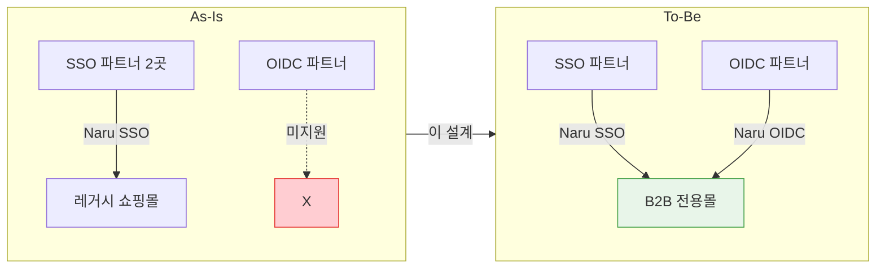
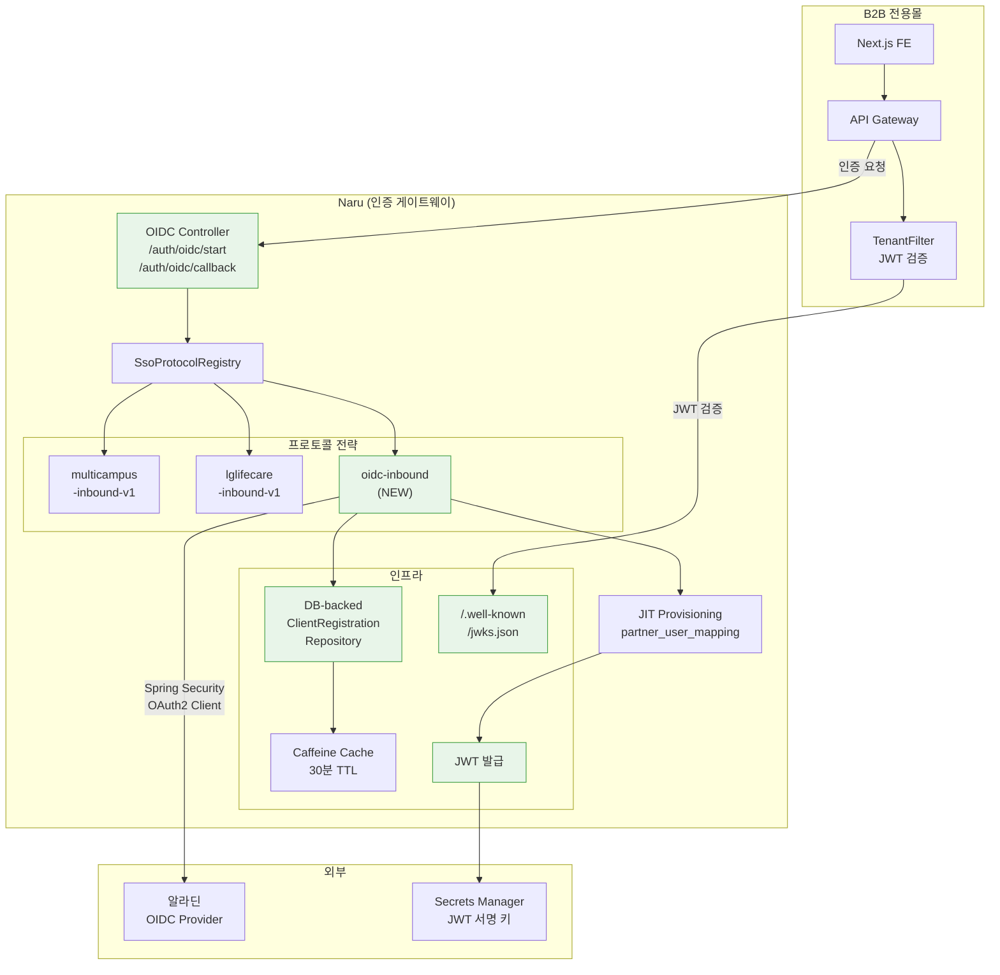
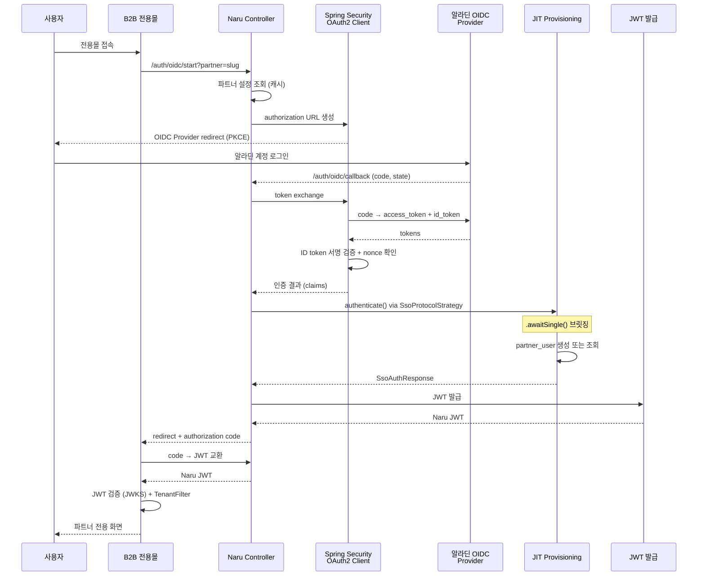
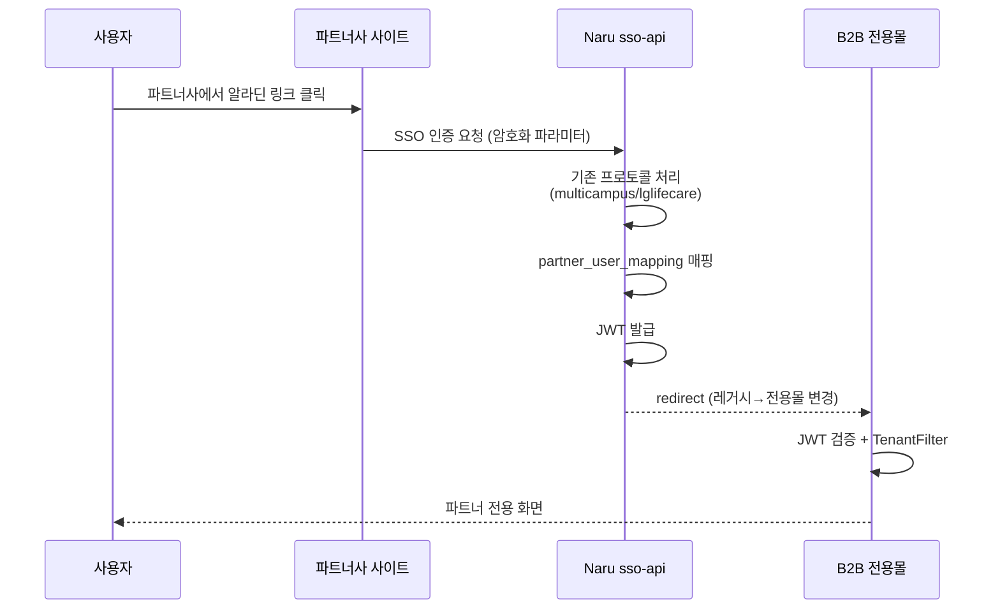
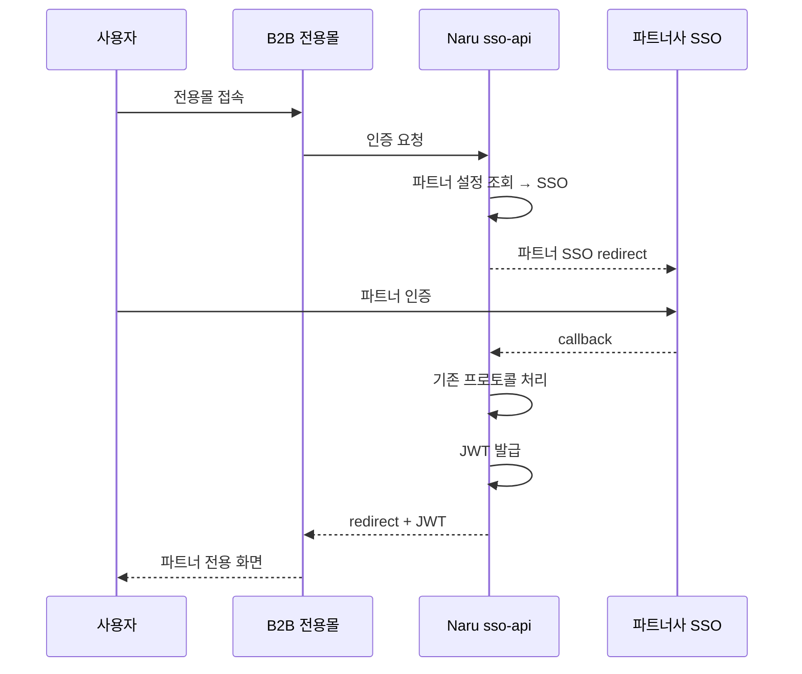
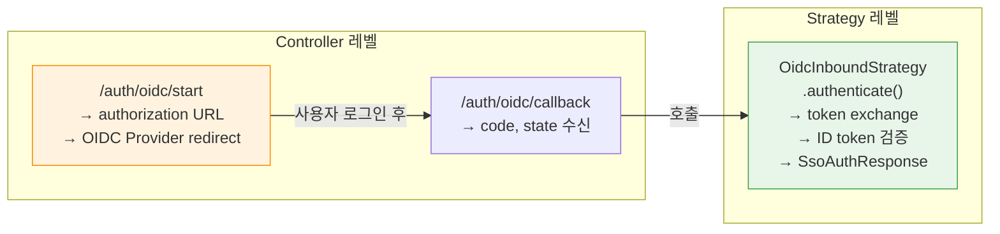
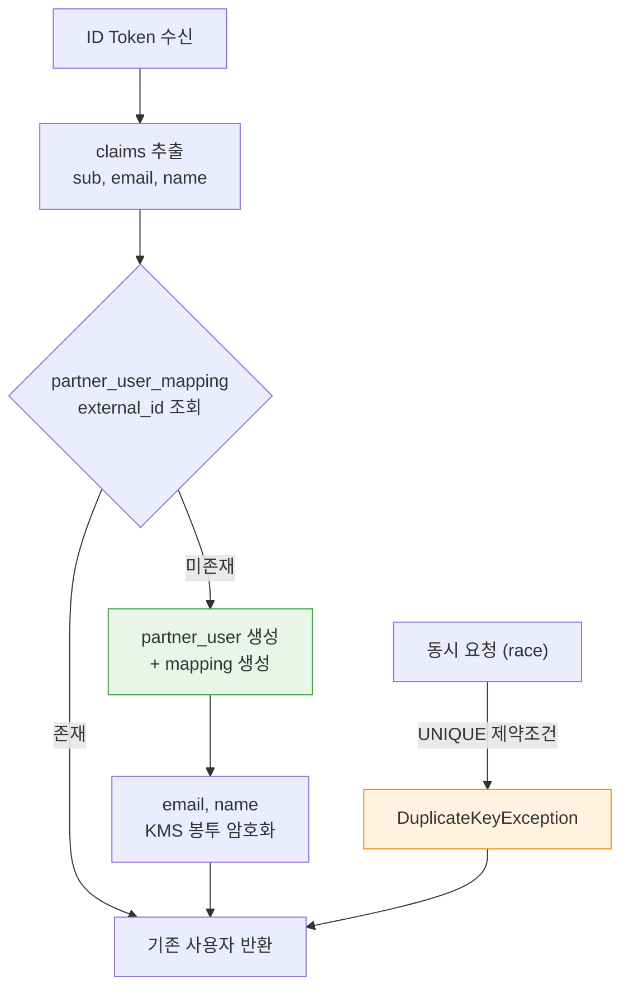
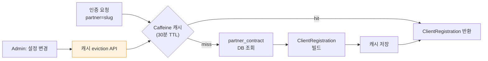
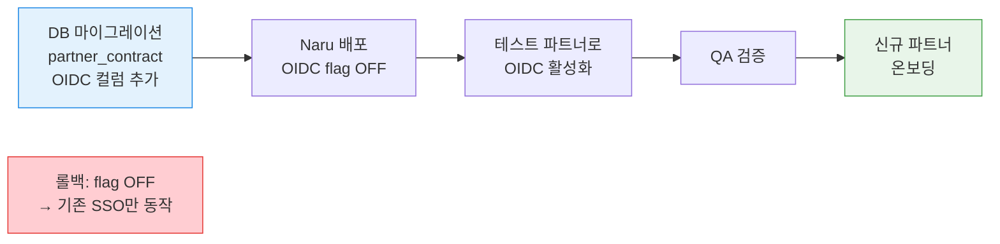

# B2B 전용몰 Naru-OIDC 파트너 인증 연동 설계

> 작성일: 2026-04-10 | 작성자: 김정민 | 상태: APPROVED
> 관련 티켓: [DEV2-5287](https://aladincommunication.youtrack.cloud/issue/DEV2-5287) (사용자 풀 현황 분석)
> 상위 티켓: [DEV2-5283](https://aladincommunication.youtrack.cloud/issue/DEV2-5283) (SaaS 플랫폼 컨셉)
> 리뷰: CEO review CLEAN + Eng review CLEAN (2026-04-10)

---

## 1. 문제 정의

B2B 전용몰의 모든 인증은 Naru를 통과해야 한다. 현재 Naru는 커스텀 SSO 프로토콜(멀티캠퍼스, LG 라이프케어)만 지원하며, 알라딘 OIDC는 미지원.



| 현재 상태 | 인증 플로우 | 랜딩 |
|----------|-----------|------|
| SSO 파트너 (멀티캠퍼스) | 파트너사 → Naru SSO | 레거시 쇼핑몰 |
| SSO 파트너 (LG 라이프케어) | 파트너사 → Naru SSO | 레거시 쇼핑몰 |
| OIDC 파트너 (신규) | 미지원 | N/A |

---

## 2. 결정 사항 요약

| # | 결정 | 선택 | 근거 | 대안 |
|---|------|------|------|------|
| D1 | 인증 책임 | **Naru가 전담** | 전용몰은 인증 로직 없음, 단일 게이트웨이 | 전용몰이 OIDC 직접 처리 |
| D2 | OIDC 구현 방식 | **Spring Security OAuth2 Client** | 프레임워크가 PKCE, token refresh, 검증 자동 처리 | OIDC 직접 구현 / Naru를 OIDC Provider화 |
| D3 | 토큰 전달 | **Naru → 전용몰: JWT** | Stateless, 표준, 테넌트 정보 포함 | Session cookie / Secrets Manager 공유 |
| D4 | JWT 키 공유 | **JWKS 엔드포인트** | 키 로테이션 자동, 표준 패턴, 다른 서비스도 검증 가능 | Secrets Manager 직접 공유 |
| D5 | OIDC 2-step 처리 | **Controller 레벨 redirect** | 기존 `SsoProtocolStrategy` 인터페이스 변경 없음 | 인터페이스에 initiateAuth() 추가 |
| D6 | 인터페이스 호환 | **Coroutines 브릿징** | `.awaitSingle()`로 Mono → suspend fun 변환 | 인터페이스를 Mono 반환으로 변경 |
| D7 | OIDC 설정 캐시 | **Caffeine 30분 TTL** | 설정 변경 드뭄, eviction API로 즉시 반영 가능 | 5분 TTL / 캐시 없음 |
| D8 | JWT 서명 키 관리 | **Secrets Manager** | 기존 Naru 패턴 유지, KMS는 파트너별 데이터 암호화 전용 | KMS 서명 |

---

## 3. 시스템 아키텍처



> 초록색 = 신규 컴포넌트

---

## 4. 인증 플로우

### 4.1 OIDC 파트너 (신규, 전용몰 직접 접속)



### 4.2 SSO 파트너 (기존, 파트너사 사이트 출발)



### 4.3 SSO 파트너 (기존, 전용몰 직접 접속)



---

## 5. 핵심 설계 상세

### 5.1 기존 인터페이스와의 호환

기존 Naru의 `SsoProtocolStrategy`는 single-call `suspend fun` 패턴이다.

```kotlin
// 기존 인터페이스 (변경 없음)
interface SsoProtocolStrategy {
    val protocolType: String
    suspend fun authenticate(request: SsoAuthRequest): SsoAuthResponse
}
```

OIDC는 2-step redirect 패턴이므로, **Controller에서 redirect를 처리**하고 `authenticate()`는 callback 단계에서만 호출한다.



### 5.2 Naru JWT Claim

```json
{
  "sub": "<partner_user_mapping.id>",
  "tenant_id": "<partner.slug>",
  "auth_method": "OIDC | SSO",
  "partner_id": 123,
  "roles": ["BUYER"],
  "iss": "naru",
  "exp": 1800,
  "iat": 1712732400
}
```

- 서명 키: Secrets Manager (기존 패턴)
- 공개키: `/.well-known/jwks.json` (Naru account-api, 내부 네트워크)
- 만료: 30분

### 5.3 OIDC 사용자 매핑 (JIT Provisioning)



| ID Token Claim | Naru 필드 | 비고 |
|---------------|----------|------|
| `sub` | `partner_user_mapping.external_id` | 사용자 식별자 |
| `email` | `partner_user.email` | KMS 봉투 암호화 저장 |
| `name` | `partner_user.name` | KMS 봉투 암호화 저장 |
| `iss` | 검증용 | 알라딘 OIDC Provider 확인 |

### 5.4 동적 ClientRegistration

Spring Security의 `InMemoryReactiveClientRegistrationRepository`는 immutable. DB 기반 커스텀 구현 필요.



**PoC 검증 항목:**
1. 런타임에 2개 이상 테넌트에 대해 authorization request 올바르게 생성
2. 미등록 테넌트 요청 시 명확한 에러 반환
3. DB 설정 변경 후 서버 재시작 없이 반영 확인

---

## 6. 변경 범위

| 컴포넌트 | 변경 내용 | 유형 | 위치 |
|----------|----------|------|------|
| `OidcInboundStrategy` | Spring Security OIDC를 감싸는 SSO 전략 | 신규 | adapters/sso/ |
| `OidcAuthController` | /auth/oidc/start, /auth/oidc/callback | 신규 | apps/sso-api/ |
| `TenantClientRegistrationRepository` | DB 기반 동적 ClientRegistration | 신규 (PoC 후) | adapters/sso/ |
| `JwtIssuer` + JWKS 엔드포인트 | Naru JWT 발급 + 공개키 노출 | 신규 | adapters/security/ |
| `partner_contract` | OIDC 설정 컬럼 추가 | 수정 | DB migration |
| `service_endpoint` | 랜딩 URL을 전용몰로 변경 | 수정 | DB data |
| `SsoProtocolRegistry` | oidc-inbound 자동 등록 | 변경 없음 | @Component 자동 |

---

## 7. Failure Modes

| 실패 시나리오 | 영향 | 대응 | 사용자 경험 |
|-------------|------|------|-----------|
| OIDC Provider 다운 | OIDC 파트너 로그인 불가 | 재시도 1회 → 에러 페이지 + 알림 | "인증 서비스 일시 중단" |
| Token exchange 실패 | 인증 중단 | 재시도 1회 → 에러 페이지 | "인증 처리 중 오류" |
| ID token 서명/만료 검증 실패 | 인증 거부 | 보안 감사 로그 + 403 | 403 Forbidden |
| Nonce 불일치 (CSRF 의심) | 인증 거부 | 보안 감사 로그 + 403 | 403 Forbidden |
| JIT Provisioning race condition | partner_user 중복 | UNIQUE 제약조건, 기존 반환 | 정상 (투명) |
| 파트너 비활성 상태 | 로그인 차단 | status 확인 + 403 | "파트너 비활성 상태" |
| JWT 서명 키 로드 실패 | JWT 발급 불가 | 시작 시 fail-fast + 감사 로그 | 에러 페이지 |
| 미등록 파트너 ID | 인증 차단 | 에러 반환 | "등록되지 않은 파트너" |
| 필수 claim 누락 (sub, email) | 매핑 불가 | 보안 로그 + 거부 | 403 Forbidden |

---

## 8. 배포 전략



- DB 마이그레이션: backward-compatible (기존 레코드는 null)
- Feature flag: 환경변수로 OIDC 활성/비활성
- 롤백: flag off → 기존 SSO만 동작
- 기존 SSO regression 테스트 필수

---

## 9. Logout 로드맵

| Phase | 범위 | 설명 |
|-------|------|------|
| **MVP** | 전용몰 세션 종료만 | Naru/OIDC Provider 세션 유지. 단순 redirect |
| **Phase 2** | RP-initiated logout | Naru → OIDC Provider end_session_endpoint |
| **Phase 3** | Back-channel logout | OIDC Provider → Naru 세션 종료 알림 |

---

## 10. Open Questions

| # | 질문 | 상태 | 비고 |
|---|------|------|------|
| ~~Q1~~ | Naru → 전용몰 인증 전달 방식 | **결정: JWT** | D3 참조 |
| Q2 | 기존 SSO 파트너 전환 시점 | 미결정 | MVP에서 바로? 안정화 후? |
| Q3 | 알라딘 OIDC Provider claim 스펙 | 확인 필요 | sub, email, name 외 추가 claim? |
| Q4 | OIDC consent 화면 필요 여부 | 확인 필요 | 파트너 계약으로 대체 가능? |
| Q5 | 동적 ClientRegistration 가능 여부 | **PoC 검증 대상** | InMemory는 immutable → DB 기반 필요 |

---

## 11. 다음 단계 (The Assignment)

### 산출물 1: Claim 매핑 테이블

DEV2-5287 분석 결과 + 알라딘 OIDC Provider claim 스펙을 기반으로, OIDC claim → Naru 필드 매핑 문서 작성.

### 산출물 2: 동적 ClientRegistration PoC

WebFlux + Spring Security OAuth2 Client 환경에서 DB 기반 `ReactiveClientRegistrationRepository` 구현.

**성공 기준:**
- [ ] 런타임에 2개 이상 테넌트에 대해 authorization request 올바르게 생성
- [ ] 미등록 테넌트 요청 시 명확한 에러 반환
- [ ] DB 설정 변경 후 서버 재시작 없이 반영 확인

---

## 12. 제약 조건

- Naru: Spring Boot 3.5.6 + Kotlin 2.0.20 + Spring Security 6.x + WebFlux (sso-api)
- 전용몰은 인증 로직 직접 처리 안 함. 반드시 Naru 통과
- 기존 SSO 파트너 인증 무중단
- 알라딘 OIDC Provider는 별도 존재 (Naru는 RP 역할만)
- Schema per Tenant 기반 멀티테넌시 결정 완료

## 13. NOT in scope

| 항목 | 근거 |
|------|------|
| 기존 알라딘 B2B 회원 마이그레이션 | MVP 이후 |
| OIDC Provider 자체 개발/수정 | 별도 시스템 |
| Back-channel / RP-initiated logout | Phase 2-3 |
| 전용몰 FE 인증 UI | 전용몰 별도 설계 |
| Admin OIDC 설정 화면 | Admin 별도 설계 |
| Google/Azure AD OIDC 지원 | 향후 확장 |
