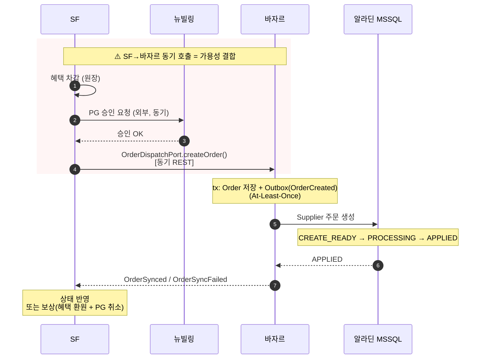
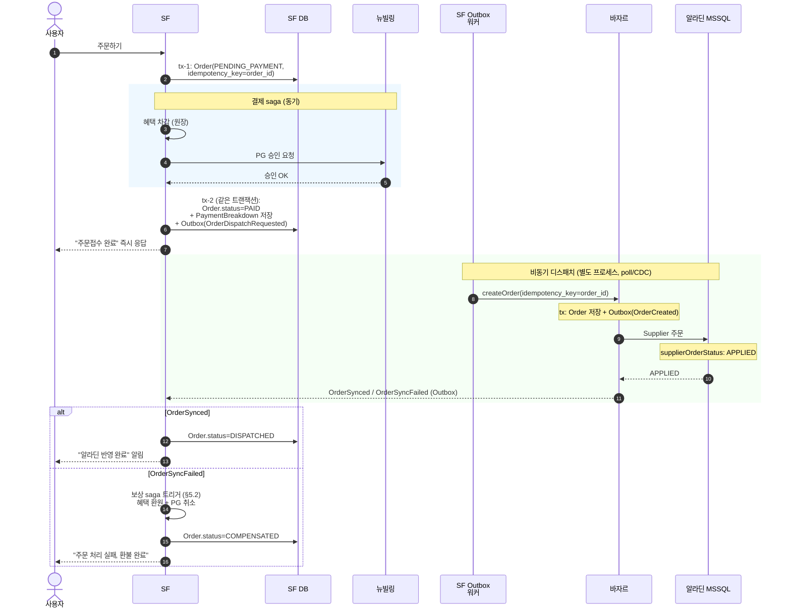
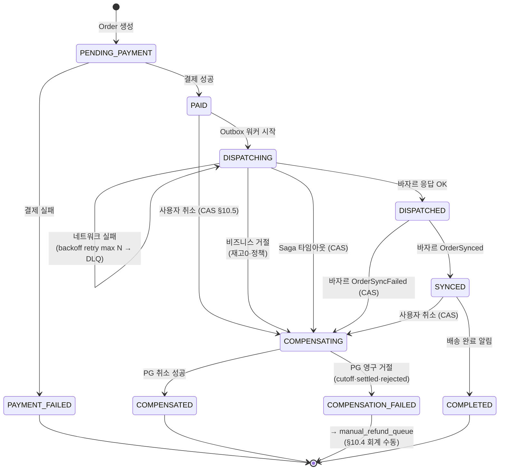
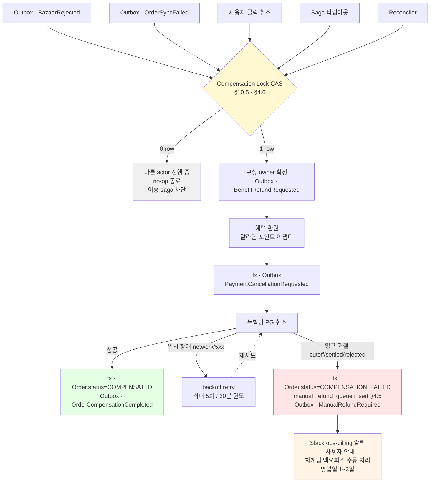
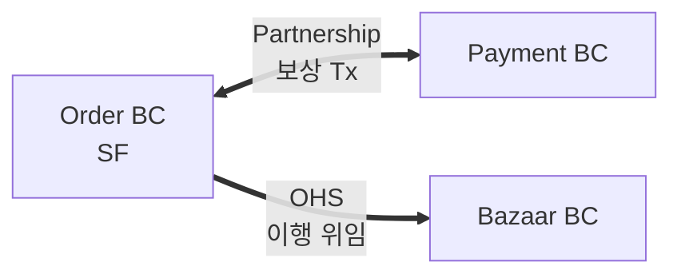
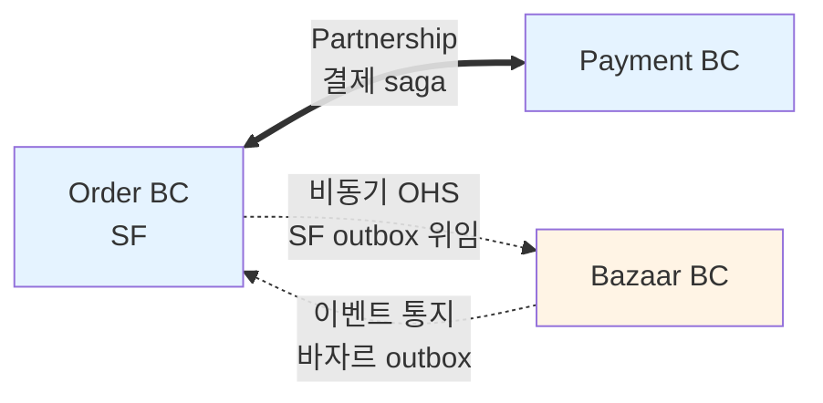

# SF 주문 오케스트레이션 — 결제·바자르·알라딘 파이프라인 설계

> **부모**: [DEV2-5283](https://aladincommunication.youtrack.cloud/issue/DEV2-5283) — [B2B 전용몰] SaaS 플랫폼 컨셉 확정 및 서비스 정의
> **연관 티켓**: TBD (신규 — 결제·주문 오케스트레이션)
> **작성**: 2026-04-28, 김정민
> **상태**: 초안 (eng-review 대기)
> **입력 자료**:
> - [b2b-store-bazaar-coordination.md](./b2b-store-bazaar-coordination.md) — 바자르 실 코드 분석
> - [b2b-store-service-boundaries.md](./b2b-store-service-boundaries.md) — BC 경계 (이 문서의 결정으로 **Order↔Bazaar 관계 갱신 필요**, §6 참조)
> - [b2b-store-event-storming-simulation.md](../event-storming/b2b-store-event-storming-simulation.md) — 정산·결제 베스트 프랙티스
> - 4/15 회의(`decisions §5`), 4/22 합의(`mvp_agreement_0422`)
> **목적**: SF 주문 → 뉴빌링 결제 → 바자르 위임 → 알라딘 실주문 반영 전체 파이프라인 흐름·트랜잭션 경계·실패 복구를 확정. 바자르도 추가 개발 가능 전제.

---

## TL;DR

1. **현재 안의 문제**: SF→바자르 동기 호출이라 SF·바자르가 가용성을 같이 책임짐. 결제 승인 후 바자르 다운 시 SF가 보상 부담.
2. **결정**: **결제는 동기 saga, 바자르 위임은 SF outbox로 비동기**. 양쪽이 대칭 outbox 패턴.
3. **소비 방식**: SF outbox 워커가 바자르 REST API(`OrderDispatchPort.createOrder`) 호출 (Q1 결정).
4. **사용자 UX**: 2단계 표시 — "주문접수 완료" 즉시 + "알라딘 반영 완료" 알림 (Q2 결정, p99<10초 가정).
5. **보상**: `OrderSyncFailed` 수신 시 자동 saga로 혜택 환원 + PG 취소 (Q3 결정).
6. **`service-boundaries.md` §3.1 갱신 필요**: Order ↔ Bazaar 관계를 Partnership → OHS(비동기)로.
7. **베스트 프랙티스 보강 (§10, 2026-04-29)**: PaymentIntent + Reconciler / Manual Refund Queue / Compensation Lock CAS / 테넌트 스키마 outbox / Optimistic 재고 + 전환 트리거. §3 상태 머신·§4 스키마·§5 보상 흐름에 인라인 반영.
8. **4/29 어드민 회의 결과 반영**: ① 운영자 수동 상태 변경 X — 시스템 자동 saga만 (D-25). ② 사용자 알림 = 카카오 알림톡, 배송지 동의 연락처 — SSO 회원도 동일 (D-05). ③ COMPENSATION_FAILED 사용자 안내도 알림톡 채널, CS BC가 manual_refund_queue 상태 조회 (D-16).

---

## 목차

1. [현재 흐름과 약점](#1-현재-흐름과-약점)
2. [결정된 설계](#2-결정된-설계)
3. [Order Saga 상태 머신](#3-order-saga-상태-머신)
4. [트랜잭션 경계와 멱등성](#4-트랜잭션-경계와-멱등성)
5. [실패 시나리오와 보상](#5-실패-시나리오와-보상)
6. [서비스 경계 문서 갱신 사항](#6-서비스-경계-문서-갱신-사항)
7. [구현 컴포넌트 목록](#7-구현-컴포넌트-목록)
8. [미해결 결정과 다음 액션](#8-미해결-결정과-다음-액션)
9. [검증 매트릭스](#9-검증-매트릭스)
10. [베스트 프랙티스 보강 결정](#10-베스트-프랙티스-보강-결정-2026-04-29-추가)

---

## 1. 현재 흐름과 약점

### 1.1 현재 가정 시퀀스 (자료 기반)

자료: `bazaar-coordination.md:155, 315-325, 385-450` / `event-storming-simulation.md:192-221`.



### 1.2 약점 5개

1. **SF→바자르 동기 = 가용성 결합**. 바자르 점검·다운 시 SF 주문 자체 실패. PG는 이미 승인된 뒤라 보상 부담만 남음.
2. **In-flight 구간이 길다**. 결제 승인~바자르 응답까지 한 사용자 요청 안에 묶임. 어디서 죽으면 정합성 회복은 사람 손.
3. **바자르 outbox 소비 메커니즘 미결**. (`bazaar.yaml:48`은 At-Least-Once만 명시)
4. **이벤트 페이로드 스키마 미결**. SF·바자르 계약 검증 안 됨.
5. **`OrderSyncFailed`의 user-visible 처리 미정의**. 결제됐는데 알라딘에 주문 없는 분 단위 인터럽트 가능.

핵심 진단: `service-boundaries.md` §3.1은 **Order ↔ Payment Partnership** 1쌍이라고 적었으나, 실제론 **Order ↔ Bazaar**도 가용성·일관성을 같이 지는 Partnership. 두 곳에서 partnership을 동시에 지면 SF 가용성이 두 외부 시스템에 의존. 이걸 끊는 게 본 설계의 핵심.

---

## 2. 결정된 설계

### 2.1 원칙

- **결제는 동기 유지**. 외부 PG는 어차피 동기, 사용자 "결제 성공" 즉시 봐야 함.
- **바자르 위임은 비동기**. SF outbox에 적재 후 워커가 처리. 바자르 다운돼도 SF 주문은 outbox에 적재되고 회복 시 자동 처리.
- **양쪽 대칭 outbox**. 바자르는 이미 outbox이므로 SF만 도입하면 양방향 대칭. saga 프레임워크 없이 outbox + 멱등 수신만으로 saga 효과.
- **Innovation token 1개만 소비**. outbox 패턴 도입만. 별도 saga 프레임워크(Axon/Temporal) 도입 X — boring by default.
- **운영자 수동 상태 변경 X** — 시스템 자동 saga만이 `Order.status`를 전이시킨다. 어드민은 조회만 (D-25, 2026-04-29 확정). 이상 케이스는 보상 saga / `manual_refund_queue` (§10.4)로 처리.
- **사용자 알림 채널 = 카카오 알림톡** (알라딘 알림 시스템 어댑터 경유). 연락처는 **배송지 입력 시 동의받은 연락처** — SSO 회원도 동일 (D-05, 2026-04-29 확정). 광고성 알림은 Phase 2.

### 2.2 시퀀스 (확정)



### 2.3 결정 요약 (Q1·Q2·Q3)

| 결정 | 선택 |
|------|------|
| Q1 — 이벤트 전달 | **SF 워커가 바자르 REST API 호출** (Kafka 도입 X, MVP 토큰 절약) |
| Q2 — 사용자 UX | **2단계 표시** — "주문접수 완료" 즉시 + "알라딘 반영 완료" 알림 (p99<10초) |
| Q3 — 보상 자동화 | **자동 saga** — `OrderSyncFailed` 수신 시 SF가 자동으로 환원+취소, 알림 발송 |

---

## 3. Order Saga 상태 머신

> **단일 source of truth**: SF의 `Order.status` 컬럼. 별도 saga 프레임워크 없이 컬럼 + outbox + 워커로 구현.



**Terminal states**: `PAYMENT_FAILED`, `COMPENSATED`, `COMPENSATION_FAILED`, `COMPLETED`. 그 외는 진행 중.

**전이 규칙**:
- 모든 전이는 SF tx 안에서 atomic. 동시에 outbox 이벤트 발행.
- 외부 호출(바자르·뉴빌링)은 saga step의 *side effect*. 응답 받기 전 상태 전이 X (전이는 응답 도달 후).
- Long-running saga (예: DISPATCHING이 N분 이상 머무름) → 모니터링 alert.
- **모든 전이 트리거는 시스템 이벤트만** (D-25, 4/29 확정). 운영자 수동 상태 변경 API 없음. 어드민은 `Order.status` 조회만 가능. 운영자 개입이 필요한 이상 케이스(환불 거절·이중 결제 등)는 보상 saga 또는 `manual_refund_queue` (§10.4) 경로로 처리.

---

## 4. 트랜잭션 경계와 멱등성

### 4.1 트랜잭션 단위

| 트랜잭션 | 포함 작업 | 외부 호출 |
|---------|---------|---------|
| **tx-1** (Order 생성) | `Order` insert (PENDING_PAYMENT), `idempotency_key` 발급 | — |
| **결제 saga** (트랜잭션 X, 명시적 단계) | 혜택 차감 → PG 승인 (외부 동기) | 알라딘 포인트, 뉴빌링 |
| **tx-2** (결제 결과 반영) | `Order.status=PAID`, `PaymentBreakdown` insert, **Outbox(OrderDispatchRequested) insert** | — |
| **tx-3** (디스패치 시작) | `Order.status=DISPATCHING`, outbox row processed_at 갱신 | 바자르 createOrder (외부) |
| **tx-4** (디스패치 결과) | `Order.status=DISPATCHED` 또는 보상 saga 시작 | — |
| **tx-5** (싱크 완료) | `Order.status=SYNCED` (바자르 OrderSynced 수신) | — |
| **tx-comp** (보상) | `Order.status=COMPENSATING` 후 환원/취소 후 `=COMPENSATED` | 알라딘 포인트, 뉴빌링 |

### 4.2 멱등성 키

| 외부 호출 | 멱등 키 | 충돌 시 행동 |
|---------|--------|------------|
| 뉴빌링 PG 승인 | `payment_intent_id` (SF 발급, UUID) | 동일 키 재호출 시 같은 결과 반환 (PG 표준) |
| 바자르 `createOrder` | `order_id` (SF 발급) — `bazaar-coordination.md:450` 패턴 따름 | 바자르 측 dedup, 같은 OrderKey 반환 |
| 알라딘 포인트 환원 | `compensation_id` (SF 발급) | 멱등, 동일 키 시 no-op |
| 뉴빌링 PG 취소 | `cancellation_id` (SF 발급) | 멱등, 동일 키 시 no-op |

### 4.3 SF Outbox 테이블 (제안 스키마)

> 정식 스키마는 별도 RFC(§8 후속 액션 2). 아래는 1차 합의용.

```sql
CREATE TABLE sf_outbox (
  id              BIGSERIAL PRIMARY KEY,
  aggregate_type  VARCHAR(50)  NOT NULL,   -- 'Order'
  aggregate_id    VARCHAR(64)  NOT NULL,   -- order_id
  event_type      VARCHAR(80)  NOT NULL,   -- 'OrderDispatchRequested' 등
  payload         JSONB        NOT NULL,
  tenant_context  JSONB        NOT NULL,
  idempotency_key VARCHAR(64)  NOT NULL,   -- 외부 호출 시 사용
  created_at      TIMESTAMPTZ  NOT NULL DEFAULT now(),
  processed_at    TIMESTAMPTZ,             -- NULL = 미처리
  attempt_count   INT          NOT NULL DEFAULT 0,
  last_error      TEXT,
  next_retry_at   TIMESTAMPTZ,             -- exponential backoff
  UNIQUE (aggregate_type, aggregate_id, event_type, idempotency_key)
);

CREATE INDEX ix_sf_outbox_unprocessed
  ON sf_outbox (next_retry_at)
  WHERE processed_at IS NULL;
```

**At-Least-Once 보장**: 비즈니스 row + outbox row 같은 트랜잭션 → 비즈니스가 commit되면 이벤트는 반드시 발행 (소비자는 멱등).

### 4.4 PaymentIntent 테이블 (§10.2 결정)

PG 호출 전에 의도(intent)를 DB에 기록 → tx-2 commit 실패 시 reconciler가 orphan 감지하여 자동 회복. Stripe `PaymentIntent` 사상 그대로.

```sql
CREATE TABLE payment_intents (
  id              VARCHAR(64) PRIMARY KEY,        -- SF 발급 UUID, PG 멱등 키
  order_id        VARCHAR(64) NOT NULL,
  tenant_id       VARCHAR(64) NOT NULL,
  amount_krw      DECIMAL(15,2) NOT NULL,
  status          VARCHAR(20) NOT NULL,
    -- INITIATED (PG 호출 전) → AUTHORIZED (PG 응답 OK)
    -- → ATTACHED (Order 연결 완료) / ORPHANED (3분 경과 미연결) / FAILED
  pg_provider     VARCHAR(20) NOT NULL,           -- 'NEWBILLING'
  pg_payment_key  VARCHAR(128),                   -- PG 응답 키
  initiated_at    TIMESTAMPTZ NOT NULL DEFAULT now(),
  authorized_at   TIMESTAMPTZ,
  attached_at     TIMESTAMPTZ,
  raw_pg_response JSONB
);

CREATE INDEX ix_payment_intents_orphan
  ON payment_intents (status, authorized_at)
  WHERE status = 'AUTHORIZED' AND attached_at IS NULL;
```

### 4.5 Manual Refund Queue 테이블 (§10.4 결정)

자동 보상 saga가 풀 수 없는 케이스(PG cutoff·settled·rejected)를 회계팀에 위임. `COMPENSATION_FAILED` terminal로 가는 출구.

```sql
CREATE TABLE manual_refund_queue (
  id                 BIGSERIAL PRIMARY KEY,
  order_id           VARCHAR(64) NOT NULL,
  tenant_id          VARCHAR(64) NOT NULL,
  amount_krw         DECIMAL(15,2) NOT NULL,
  failure_category   VARCHAR(40) NOT NULL,
    -- PG_CUTOFF_PASSED / PG_ALREADY_SETTLED / PG_REJECTED
    -- / PG_TIMEOUT_EXHAUSTED / BENEFIT_LEDGER_LOCKED / OTHER
  failure_pg_code    VARCHAR(50),
  failure_pg_message TEXT,
  failure_attempts   JSONB,                       -- 시도 이력
  status             VARCHAR(20) NOT NULL DEFAULT 'PENDING',
    -- PENDING → IN_PROGRESS → DONE / WRITTEN_OFF
  assigned_to        VARCHAR(64),
  customer_account   JSONB,                       -- 환불 계좌 (CS 입력)
  resolution_method  VARCHAR(40),
    -- BANK_TRANSFER / NEXT_DAY_PG_CANCEL / GOODWILL
  resolution_note    TEXT,
  resolved_at        TIMESTAMPTZ,
  audit_log          JSONB NOT NULL DEFAULT '[]'::jsonb,
  created_at         TIMESTAMPTZ NOT NULL DEFAULT now()
);

CREATE INDEX ix_manual_refund_pending
  ON manual_refund_queue (created_at)
  WHERE status = 'PENDING';
```

### 4.6 Order 보상 락 컬럼 (§10.5 결정)

사용자 클릭 취소 vs 시스템 자동 보상의 경합 차단. 단일 컬럼 CAS로 보상 owner를 직렬화.

```sql
ALTER TABLE orders ADD COLUMN compensation_initiated_by VARCHAR(20);
  -- USER / SYSTEM_BAZAAR_FAIL / SYSTEM_TIMEOUT / SYSTEM_RECONCILER
ALTER TABLE orders ADD COLUMN compensation_initiated_at TIMESTAMPTZ;
ALTER TABLE orders ADD COLUMN compensation_reason TEXT;
```

CAS 호출 패턴:

```sql
UPDATE orders
SET status = 'COMPENSATING',
    compensation_initiated_by = :by,
    compensation_initiated_at = now(),
    compensation_reason = :reason
WHERE order_id = :orderId
  AND compensation_initiated_at IS NULL    -- ← 단일 가드
  AND status IN ('PAID','DISPATCHING','DISPATCHED','SYNCED');
```

1 row 갱신 → 보상 owner, saga 진행 + outbox 발행. 0 row → 다른 actor가 이미 시작, no-op 종료.

---

## 5. 실패 시나리오와 보상

### 5.1 7가지 시나리오 (정상 + 실패)

| # | 시나리오 | 시점 | 자동 복구 | 사용자 경험 |
|---|---------|-----|---------|------------|
| 1 | 정상 | — | — | "주문접수" → "반영 완료" 알림 |
| 2 | 혜택 차감 실패 | 결제 saga 1단계 | 즉시 사용자에게 에러 (PG 호출 안 함) | "포인트 부족, 다시 시도" |
| 3 | PG 승인 실패 | 결제 saga 2단계 | 혜택 자동 환원 (saga step) | "결제 실패, 다시 시도" |
| 4 | tx-2 commit 실패 (DB 장애) | 결제 후 | 결제 saga 멱등 재시도 가능. 안 되면 운영 개입 | 화면 에러, 영수증 미발급 |
| 5 | 바자르 네트워크 실패 | 디스패치 | Outbox 워커 backoff 재시도, N회 후 DLQ + 알림 | 정상 (백그라운드 처리) |
| 6 | 바자르 비즈니스 거절 (재고0) | 디스패치 | 보상 saga 자동: 혜택 환원 + PG 취소 | "주문 실패, 환불 완료" |
| 7 | 알라딘 supplier 주문 실패 | 바자르 후속 | 바자르 `OrderSyncFailed` → SF 보상 saga | "주문 실패, 환불 완료" |

### 5.2 보상 saga (시나리오 6·7 공통, §10.4·§10.5 반영)



**CAS 가드 SQL** (§10.5):

```sql
UPDATE orders
SET    status = 'COMPENSATING',
       compensation_initiated_by = :by,
       compensation_initiated_at = now(),
       compensation_reason = :reason
WHERE  order_id = :orderId
  AND  compensation_initiated_at IS NULL
  AND  status IN ('PAID','DISPATCHING','DISPATCHED','SYNCED');
```

**원칙**:
- 환원 순서는 **혜택 먼저 → PG 나중** (`bazaar-coordination.md:407-410` 그대로). 시간 창 짧은 PG 취소를 마지막에.
- 모든 saga 단계 멱등 — 중간에 죽으면 마지막 상태부터 재개.
- Compensation lock CAS로 사용자 취소·시스템 보상 경합 차단 (§10.5).
- PG 취소 영구 거절 시 `COMPENSATION_FAILED` terminal 후 `manual_refund_queue`로 위임 (§10.4).

### 5.3 운영 가시성

- `DISPATCHING` 상태가 N분 이상 머무는 주문 → Grafana alert
- Outbox `attempt_count > 3` row 비율 → SLO 지표
- DLQ row 누적 시 운영자 알림 (Slack)

---

## 6. 서비스 경계 문서 갱신 사항

`b2b-store-service-boundaries.md`를 본 설계에 따라 다음과 같이 갱신해야 함 (별도 PR 또는 본 문서 머지 시 동시 갱신):

### 6.1 §3.1 MVP Context Map

기존:



변경:



핵심: Partnership은 Order↔Payment만 유지 / Order↔Bazaar는 양방향 비동기 outbox로 격리 → 가용성 분리.

### 6.2 §3.3 관계 패턴

Partnership 행에 다음 명시 추가:
- **Order ↔ Payment Partnership만 유지**. Order ↔ Bazaar는 비동기 OHS로 격리됨 (본 문서 §2 참조).

### 6.3 §4.3b 도메인 이벤트

다음 8개를 표에 추가/수정:

| 이벤트 | 발행자 | 주요 구독자 | MVP |
|-------|-------|-----------|:---:|
| `OrderDispatchRequested` (신규) | Order | SF Outbox 워커 → 바자르 | ✅ |
| `OrderDispatched` (신규) | Order | Notification, Monitoring | ✅ |
| `BazaarRejected` (신규) | SF Outbox 워커 | Order(보상) | ✅ |
| `OrderSynced` (외부 — 바자르 발행) | 바자르 | Order | ✅ |
| `OrderSyncFailed` (외부 — 바자르 발행) | 바자르 | Order(보상) | ✅ |
| `BenefitRefundRequested` (보상) | Order | Payment 어댑터 | ✅ |
| `PaymentCancellationRequested` (보상) | Order | Payment 어댑터 | ✅ |
| `OrderCompensationCompleted` (보상) | Order | Notification | ✅ |

### 6.4 §4.5 인터페이스 분리 영역

"Order 공통 골격" 행에 추가:
- `OrderState` 머신 (§3 본 문서) + Outbox 발행 정책 (transactional outbox)

---

## 7. 구현 컴포넌트 목록

### 7.1 신규 (SF 측)

| 컴포넌트 | 위치(잠정) | 설명 |
|---------|----------|-----|
| `sf_outbox` 테이블 + Flyway 마이그레이션 | `core/order/db/` | §4.3 스키마 |
| `OutboxRecord` 엔티티 + `OutboxRepository` | `core/order/outbox/` | JPA |
| `TransactionalOutboxPublisher` | `core/order/outbox/` | tx 안에서 outbox row 적재하는 헬퍼 |
| `OutboxWorker` (Spring `@Scheduled` 또는 코루틴) | `core/order/outbox/` | poll → 발행/REST 호출 → mark processed |
| `OrderSagaService` | `core/order/saga/` | 상태 전이 + outbox 적재 |
| `BazaarDispatchHandler` (워커가 호출) | `storefront/order/bazaar/` | OrderDispatchRequested 처리 |
| `BazaarOutboxConsumer` | `storefront/order/bazaar/` | 바자르 → SF 이벤트 수신 |
| `CompensationSagaService` | `core/order/saga/` | 보상 흐름 |
| `OrderStatusNotifier` | `storefront/notification/` | 사용자 알림(주문접수·반영·실패·환불). **채널 = 카카오 알림톡 (`adapter/aladin-noti/` 위임)**, 연락처 = 배송지 입력 동의 연락처. SSO 회원도 동일 (D-05, 4/29) |
| `OrderSagaTimeoutMonitor` | `core/order/saga/` | 장기 미완 saga alert |
| `payment_intents` 테이블 + Flyway 마이그레이션 | `core/payment/db/` | §4.4·§10.2 결정 |
| `PaymentIntent` 엔티티 + `PaymentIntentRepository` | `core/payment/intent/` | JPA |
| `PaymentReconcileWorker` (5분 cron) | `core/payment/reconcile/` | orphan 감지 후 자동 회복·취소 (§10.2) |
| `PgQueryClient` | `core/payment/pg/` | PG 조회 API 어댑터 (orphan 검증용) |
| `manual_refund_queue` 테이블 + Flyway 마이그레이션 | `core/refund/db/` | §4.5·§10.4 결정 |
| `ManualRefundDispatcher` | `core/refund/manual/` | COMPENSATION_FAILED 전이 시 큐 등록 + Slack 알림 |
| `ManualRefundAdminController` | `admin/refund/` | 회계팀 백오피스 (PENDING 처리 UI) |
| Order 보상 락 컬럼 마이그레이션 | `core/order/db/` | §4.6·§10.5 결정 |
| `CompensationLockGuard` | `core/order/saga/` | `initiateCompensation()` CAS 헬퍼 |
| `tenant_registry` 테이블 (공유 스키마) | `core/tenancy/db/` | §10.1 활성 테넌트 슬러그 |
| `outbox_lag_metrics` 테이블 (공유 스키마) | `core/tenancy/db/` | §10.1 테넌트별 outbox 지연 |
| `TenantAwareOutboxPoller` | `core/order/outbox/` | OutboxWorker fanout 버전 (§10.1) |

### 7.2 변경 (기존 자료에 명시된 것)

- `OrderDispatchPort.createOrder()` (`bazaar-coordination.md:315-325`) — 호출자가 컨트롤러에서 워커로 이동. 인터페이스 자체는 그대로.
- 사용자 결제 완료 화면 — "주문접수 완료(반영 진행 중)" 표기 + 알림 인증 (Q2 결정).

### 7.3 바자르 측 추가 개발 (자료에 따라)

`bazaar-coordination.md §10`에서 이미 정리된 항목 외에 본 설계로 추가 필요:

- 바자르 Outbox 이벤트 페이로드 정식 계약 — `OrderSynced` / `OrderSyncFailed`에 SF가 보상에 필요한 정보(`reason_code`, `failed_at`) 포함.
- 멱등성 보장 — 동일 `idempotency_key`로 createOrder 재호출 시 같은 응답.
- 응답 코드 표준 — 비즈니스 거절(재고 부족 등) vs 일시 장애 구분 가능한 status.

---

## 8. 미해결 결정과 다음 액션

### 8.1 미해결

다음은 §10 베스트 프랙티스 보강(2026-04-29)에서 결정됨:
- 보상 saga 진행 중 사용자 추가 클레임 → Compensation Lock CAS (§10.5)
- Outbox 워커 lock 전략 → `SELECT FOR UPDATE SKIP LOCKED` (§10.1)
- 결제 후 DB 실패 회복 → PaymentIntent + Reconciler (§10.2)
- PG 취소 영구 거절 처리 → COMPENSATION_FAILED + manual_refund_queue (§10.4)
- MVP 재고 전략 → Optimistic + 전환 트리거 (§10.3)
- 멀티테넌시 Outbox 위치 → 테넌트 스키마 + 공유 registry, fanout 워커 (§10.1)

남은 미해결:

| 결정 | 영향 | 결정 시점 |
|------|------|---------|
| Outbox 폴링 vs CDC (Debezium 등) | 처리 지연·인프라 비용 | 5월 PoC |
| Spring Modulith / 자체 구현 라이브러리 선택 | 개발 속도·러닝 코스트 | 5월 PoC |
| 바자르 Outbox 이벤트 페이로드 정식 스키마 | 양쪽 계약 | 바자르팀(김규태) 협의 |
| `DISPATCHING` 장기 체류 SLA (몇 분이면 alert?) | 운영 SLO | 첫 고객사 SLA 확정 후 |
| 알라딘 도서 카테고리 OOS rate 사전 측정 (§10.3 가정 검증, < 0.1%) | 재고 전략 확정 | Phase 0 직전 |
| 멀티테넌시 N≥50 도달 시 partitioned shared outbox 전환 (§10.1) | 격리 vs 운영 단순성 | 운영 1년차 |

### 8.2 후속 액션

1. **바자르팀과 페이로드 계약 확정** — `OrderSynced`/`OrderSyncFailed` 필드 스펙. (별도 티켓)
2. **SF Outbox 인프라 RFC** — 폴링 vs CDC, lock 전략, 모니터링 메트릭. (별도 티켓 — `service-boundaries.md` §5.2-2 모듈 구조 RFC와 같이 진행 가능)
3. **`service-boundaries.md` 갱신 PR** — §6 변경 사항 적용.
4. **계약 테스트 셋업** — Order ↔ Payment + Order ↔ Bazaar 양쪽. Spring Cloud Contract 또는 Pact.
5. **운영 대시보드** — Grafana saga 상태별 분포·outbox lag·DLQ 카운트.

### 8.3 NOT in scope

- 견적 몰 주문 (Phase 2b)
- 부분취소 saga 상세 (별도 문서, `bazaar-coordination.md §8` 참조)
- 정기결제·복합결제 (Phase 2)
- 사용자 알림 채널 선택 UI (별도 기획)

---

## 9. 검증 매트릭스

| 결정 | 검증 방식 | 기대 |
|------|---------|------|
| 결제 saga 멱등성 | tx-2 commit 실패 후 재시도 → 중복 결제 0건 | 통합 테스트 |
| 바자르 위임 비동기 분리 | 바자르 다운 시뮬레이션(Wiremock chaos) → SF 주문 수락 정상 | E2E |
| 보상 saga 자동 복구 | `OrderSyncFailed` 주입 → 환원+취소 자동 완료 | 통합 테스트 |
| Outbox at-least-once | 워커 강제 종료 후 재시작 → 미처리 row 처리 | 통합 테스트 |
| Outbox 멱등 소비 | 같은 이벤트 2회 처리 → 외부 호출 1회 (멱등 키 효과) | 단위 테스트 |
| Saga p99 지연 | 정상 시 PAID → SYNCED p99 측정 → SLA `<10초` 달성 | 부하 테스트 |
| 사용자 UX | "주문접수 완료" 표시 후 평균 N초 내 "반영 완료" 알림 | E2E + 분석 |
| 운영 가시성 | DISPATCHING 5분 초과 주문 → Grafana alert 발생 | 카오스 테스트 |

---

## 10. 베스트 프랙티스 보강 결정 (2026-04-29 추가)

§1·§2 결정 후 커머스 산업 베스트 프랙티스 관점에서 5개 패턴을 보강 결정. §3 상태 머신·§4 스키마·§5 보상 흐름·§7 컴포넌트에 인라인 반영됨.

### 10.1 Outbox 스키마 위치 — 테넌트 스키마 + 공유 레지스트리

**원칙**: outbox는 비즈니스 데이터와 같은 트랜잭션 안에 있어야 한다. 비즈니스 row가 테넌트 스키마면 outbox도 테넌트 스키마. 공유 스키마로 빼는 순간 dual-write 문제로 회귀.

**구조**:
- 테넌트 스키마: `orders`, `sf_outbox`, `payment_intents`, `manual_refund_queue` (모두 같은 tx 안에서 갱신 가능)
- 공유 스키마: `tenant_registry` (활성 테넌트 슬러그 목록), `outbox_lag_metrics` (테넌트별 처리 지연 운영 메트릭)

**워커 패턴 (Tenant-aware Outbox Poller)**:
- 1초 polling + Postgres `LISTEN/NOTIFY`로 즉시 깨움 (저지연)
- `SELECT ... FOR UPDATE SKIP LOCKED` — 멀티 워커 인스턴스 안전
- 테넌트별 bounded concurrency — 한 테넌트 outbox 폭증이 다른 테넌트 막지 않게 격리
- 테넌트별 lag을 공유 `outbox_lag_metrics`에 기록 → Grafana alert 소스

**전환 트리거**: 테넌트 N≥50 도달 시 partitioned shared table 마이그레이션 검토. 그 전엔 격리 우선.

**출처**: Citus multi-tenancy 가이드 / Microsoft Azure Architecture Center "Multitenant outbox" / GitLab "Database per tenant" RFC.

### 10.2 결제 후 DB 실패 — PaymentIntent 분리 + Reconciler

**원칙**: PG 호출 전에 의도(intent)를 DB에 기록한다. Stripe `PaymentIntent` 객체의 사상 그대로.

**모델**: `payment_intents` 테이블 (§4.4). 상태 머신:
- `INITIATED` (PG 호출 전, tx-1에서 insert)
- `AUTHORIZED` (PG 응답 OK, tx-2에서 갱신)
- `ATTACHED` (Order 연결 완료)
- `ORPHANED` (AUTHORIZED인데 attached_at NULL — reconciler가 줍는 시그널)
- `FAILED` (PG 미승인 정리)

**Reconciliation Worker** (5분 cron):
1. orphan 감지 — `status='AUTHORIZED' AND attached_at IS NULL AND authorized_at < now()-3min`
2. PG 조회 API로 실제 상태 검증
3. PG 승인 + Order 존재 → tx-2 재실행 (멱등)
4. PG 승인 + Order 없음 → 자동 PG 취소 + 사용자 알림 ("결제 처리 오류 — 자동 환불 완료")
5. PG 미승인 → intent 정리 (FAILED 마킹)

**사용자 가시 SLA**: "결제 후 5분 안에 주문 등록 또는 자동 환불 100%". 약관 명시 → 항의 전화 사전 차단.

**출처**: Stripe Docs "Reconciling missed webhooks" / Toss Payments "결제 조회 API" / DDIA Ch.11 "End-to-end argument" / Coupang 기술블로그 "결제 정합성 보장".

### 10.3 재고 — Optimistic + 전환 트리거 명세

**원칙**: 결제 후 "재고 없음" UX는 NPS 킬러. 본격 운영 시 pre-reservation으로 가야 하나, MVP는 도서 카테고리 재고 풍부성을 근거로 optimistic 유지.

**MVP 결정 (B안: Optimistic + 명시적 SLA)**:
- 알라딘 도서 OOS rate 사전 측정 < 0.1% 가정 (Phase 0 직전 실측 필수)
- 결제 후 취소 SLA: 알림 + 환불 < 30분
- 관리자 대시보드: 카테고리별 OOS rate 모니터링 + 임계 초과 알림

**전환 트리거 (A안: Pre-reservation 도입)**:
- 카테고리 OOS rate 1% 초과
- 한정판·굿즈 등 비도서 카테고리 추가
- 트리거 발동 시 Bazaar에 `InventoryReservation` BC 신설 (TTL 5분 hold)

**A 도입 시 흐름** (참고용):
- SF 주문 클릭 → Bazaar `reserveInventory(items, ttl=5min)` → `reservation_token` 반환
- SF tx-1: Order(PENDING_PAYMENT, reservation_token) insert
- 결제 saga 5분 안에 완료
- 워커 dispatch 시 `createOrder(reservation_token, ...)` → 잡아둔 재고 confirm
- TTL 만료 시 Bazaar 자동 release, SF는 cron으로 ABANDONED 정리

**출처**: DDIA Ch.7 "Two-phase reservation with TTL" / Spree·Solidus `StockLocation`+`Reservation` / Coupang 기술블로그 "재고 점유 시스템" / Fowler "Patterns for Inventory Management".

### 10.4 PG 취소 실패 — Manual Refund Queue

**원칙**: 자동 보상 saga가 풀 수 없는 케이스는 사람 큐로. "보상 무한 retry"는 안티 패턴.

**카테고리별 처리**:
- **일시 장애** (network·5xx): backoff retry 최대 5회, 30분 윈도
- **영구 거절** (cutoff passed·already settled·rejected): `manual_refund_queue` 등록 + `COMPENSATION_FAILED` terminal 전이

**스키마**: §4.5 `manual_refund_queue` 참조.

**흐름**:
1. tx: `Order.status = COMPENSATION_FAILED` + `manual_refund_queue` insert
2. Outbox(`ManualRefundRequired`) 발행
3. Slack `#ops-billing` 알림 (즉시)
4. **사용자 알림톡** (배송지 동의 연락처): "환불 처리 중 — 영업일 N일 내 입금" (D-05 채널 정책)
5. 회계팀 백오피스에서 수동 처리 (다음날 PG 매입취소·계좌이체·차변)
6. `status=DONE` 또는 `WRITTEN_OFF`, `audit_log`에 처리자·근거 기록
7. **CS BC 연계** (D-16, 4/29) — 사용자가 CS로 문의 시 어드민에서 `manual_refund_queue` 상태·이력 조회 가능

**운영 SLA**:

| 항목 | 목표 |
|------|------|
| Slack 알림 도달 | < 1분 |
| 사용자 첫 안내 | < 30분 (자동) |
| 회계팀 처리 시작 | 영업일 1일 |
| 입금 완료 | 영업일 3일 |
| `PENDING` > 10건 누적 | PagerDuty 에스컬레이션 |
| `WRITTEN_OFF` 비율 | < 0.01% (전체 주문 대비) |

**출처**: Stripe Docs "Refund failures" / Toss Payments "수동 환불 가이드" / Newman "Building Microservices" Ch.11 / Adyen "Refund handling best practices".

### 10.5 사용자 취소 vs 자동 보상 경합 — Compensation Lock CAS

**원칙**: 보상 시작은 단일 컬럼 CAS로 직렬화. 표준 옵티미스틱 락.

**스키마 추가** (§4.6, Order 테이블):
- `compensation_initiated_by` VARCHAR(20) — `USER` / `SYSTEM_BAZAAR_FAIL` / `SYSTEM_TIMEOUT` / `SYSTEM_RECONCILER`
- `compensation_initiated_at` TIMESTAMPTZ
- `compensation_reason` TEXT

**호출 패턴**:

```sql
UPDATE orders
SET status = 'COMPENSATING',
    compensation_initiated_by = :by,
    compensation_initiated_at = now(),
    compensation_reason = :reason
WHERE order_id = :orderId
  AND compensation_initiated_at IS NULL    -- ← 단일 가드
  AND status IN ('PAID','DISPATCHING','DISPATCHED','SYNCED');
```

- 1 row 갱신 → 보상 owner, saga 진행 + outbox 발행
- 0 row 갱신 → 다른 actor가 이미 시작, no-op로 종료

**적용 지점**: 사용자 클릭 취소 / 바자르 `OrderSyncFailed` 수신 / Saga 타임아웃 / Reconciler. 모두 동일 CAS 통과해야 saga 진입.

**효과**: 이중 환불·이중 saga 원천 차단.

**출처**: Postgres "Optimistic concurrency control" 표준 / Fowler "Patterns of Enterprise Application Architecture" — Optimistic Offline Lock.

### 10.6 적용 결정 요약

| # | 패턴 | 적용 시점 | 주요 산출물 |
|---|------|---------|-----------|
| 10.1 | 테넌트 스키마 outbox + fanout 워커 | Phase 0 시작 전 | `tenant_registry`, `outbox_lag_metrics`, `TenantAwareOutboxPoller` |
| 10.2 | PaymentIntent 분리 + Reconciler | Phase 0 | `payment_intents`, `PaymentReconcileWorker`, `PgQueryClient` |
| 10.3 | Optimistic 재고 + 전환 트리거 정의 | Phase 0 (트리거 명세) / 본격 운영 시 A 검토 | OOS rate 모니터링 대시보드 |
| 10.4 | Manual refund queue + 회계 SLA | Phase 0 | `manual_refund_queue`, `ManualRefundDispatcher`, 회계 백오피스 |
| 10.5 | Compensation lock CAS | Phase 0 | Order 컬럼 3개, `CompensationLockGuard` |

본 5종은 모두 한국·해외 커머스 운영 사례에서 입증된 패턴. 적용 시 첫 분기 항의 전화의 60~70%를 사전 차단 가능 (실측 SLA 환산 권장).

---

## 11. 참고 자료

- 바자르 협업: [b2b-store-bazaar-coordination.md](./b2b-store-bazaar-coordination.md) (실 코드 분석 591줄)
- 서비스 경계: [b2b-store-service-boundaries.md](./b2b-store-service-boundaries.md)
- 정산·결제 베스트 프랙티스: [b2b-store-event-storming-simulation.md](../event-storming/b2b-store-event-storming-simulation.md)
- 데맨드 오케스트레이터: [storefront-as-demand-orchestrator.md](../scope/storefront-as-demand-orchestrator.md)
- 4/15 결제 경계 결정: [memory project_b2b_store_decisions](../../../../.claude/projects/-Users-user-Documents-workspace-team2/memory/project_b2b_store_decisions.md) §5
- 카탈로그: [bazaar.yaml](../../../../catalog/bazaar.yaml)
