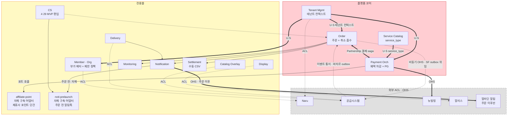
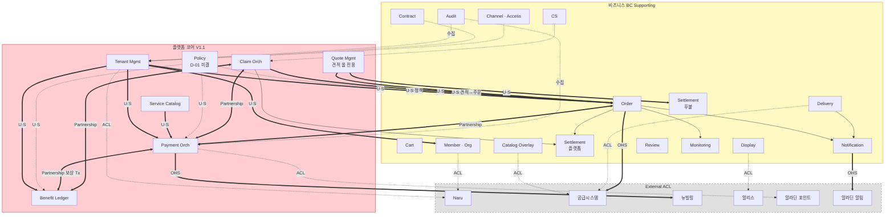

# 스토어프론트 서비스 경계 + Context Map (확정본)

> **티켓**: [DEV2-5298](https://aladincommunication.youtrack.cloud/issue/DEV2-5298) — 서비스 경계 확정 + Context Map 작성
> **부모**: [DEV2-5283](https://aladincommunication.youtrack.cloud/issue/DEV2-5283) — [B2B 전용몰] SaaS 플랫폼 컨셉 확정 및 서비스 정의
> **작성**: 2026-04-28, 김정민
> **상태**: 초안 (eng-review 대기)
> **입력 자료**: [b2b-store-ddd-classification.md](./b2b-store-ddd-classification.md) (V1.1, 분석·가설 자료)
> **목적**: 분석 자료에 흩어진 결정을 **서비스 경계 / Context Map / 공통 스키마 계획** 3개 산출물로 확정. 외주(BE 1 + FE 1, 2026-05 투입) 온보딩과 모듈 구조 결정의 기준점.

---

## TL;DR

1. **서비스 경계** — 코어(플랫폼 소유) / 전용몰(서비스 소유) / 외부(ACL/OHS) 3축으로 확정. MVP는 전용몰 모놀리스 안에 코어를 `core/` 패키지로 동거, MSA 전환 시 `b2b-core-lib`로 추출.
2. **Context Map** — V1.1 기준 내부 21 BC + 외부 6, MVP 기준 내부 10 BC + 외부 6. Partnership(=공동 일관성) 1쌍(Order↔Payment), ACL 5건, OHS 2건. 2개 Mermaid 다이어그램으로 표현(MVP / V1.1).
3. **공통 스키마 계획** — 전용몰 우선 구현, **공통화는 두 번째 몰/채널 등장 시점까지 보류**(Rule of Three). 단 (a) Published Language 5개, (b) `tenant_context`·`service_type`·`category` 3축, (c) 결제·정산 금액 분할 스키마 — 이 3개는 **MVP부터 추상 인터페이스**로 분리해 추후 추출 비용을 낮춘다.

---

## 목차

1. [범위와 가정](#1-범위와-가정)
2. [서비스 경계 — 3축](#2-서비스-경계--3축)
3. [Context Map (Mermaid)](#3-context-map-mermaid)
4. [공통 스키마 계획](#4-공통-스키마-계획)
5. [미해결 결정 및 다음 액션](#5-미해결-결정-및-다음-액션)
6. [참고 자료](#6-참고-자료)

---

## 1. 범위와 가정

### 1.1 이 문서가 확정하는 것

- **소유권** — 어떤 BC를 누가 소유(설계·구현·운영)하는지
- **경계** — BC 간 인터페이스 종류(U/S, Partnership, ACL, OHS)
- **공통화 시점** — 전용몰 우선 구현 전제 하에서, 어떤 스키마를 언제 공통화할지

### 1.2 이 문서가 확정하지 않는 것

| 영역 | 결정 위치 |
|------|----------|
| 정책 엔진 위치(D-01) | 이벤트 스토밍 Phase 3 후 별도 결정 |
| 멀티테넌트 격리 모델 | [b2b-store-tenant-model.md](./b2b-store-tenant-model.md)에서 확정 (Schema per Tenant) |
| Naru OIDC 통합 상세 | [b2b-store-naru-oidc-integration.md](./b2b-store-naru-oidc-integration.md) |
| 바자르 협업 인터페이스 | [b2b-store-bazaar-coordination.md](./b2b-store-bazaar-coordination.md) |
| 테넌트 모델 `store_type` 흡수(D-17) | 4/29 ~ 5월 초 결정 예정 |
| 첫 고객사 확정에 따른 결제·배송 구체화 | 첫 고객사 확정 후(주차 미정) |

### 1.3 전제

- **MVP 범위** = 4/22 기획자 협의([memory project_b2b_store_mvp_agreement_0422](../../../../.claude/projects/-Users-user-Documents-workspace-team2/memory/project_b2b_store_mvp_agreement_0422.md))로 합의된 Must 8 + Should 변동 + 모니터링 편입
- **모놀리스 출발** — 전용몰 단일 Spring Boot/Kotlin 애플리케이션 안에 `core/` 패키지 + 도메인 BC. MSA는 전환 경로만 확보하고 미루기([memory project_b2b_store_decisions](../../../../.claude/projects/-Users-user-Documents-workspace-team2/memory/project_b2b_store_decisions.md) — Phase 0 의사결정 4)
- **신규 백엔드 = Kotlin + Spring Boot** ([CLAUDE.md](../../../../CLAUDE.md) 핵심 규칙)
- **공급시스템** — 컨셉상 "바자르"이나 실체는 현행 오픈마켓. ACL을 두껍게 가져가야 향후 바자르로 전환 시 안전 ([b2b-store-bazaar-coordination.md](./b2b-store-bazaar-coordination.md))

---

## 2. 서비스 경계 — 3축

### 2.1 3축 정의

| 축 | 소유 주체 | 경계 의미 | 구현 단위 |
|---|----------|----------|----------|
| **플랫폼 코어 (Platform)** | 스토어프론트 플랫폼 팀 | 멀티 몰·멀티 채널 공통 자산. 차별화 가치의 원천. | MVP: `core/` 패키지 / 향후: `b2b-core-lib` |
| **전용몰 (Storefront)** | 전용몰 도메인 팀 | 1차 라이브 대상 몰의 도메인 로직. 코어 위에서 동작. | MVP: 전용몰 애플리케이션 모듈 |
| **외부 연동 (External)** | 외부 시스템 + ACL을 SF가 소유 | SF가 직접 만들지 않는 기성품·내부 외부. ACL/OHS로 격리. | 어댑터 패키지(`adapter/{system}`) |

```
┌──────────────────────────────────────────────────────────────────────┐
│                       플랫폼 코어 (Platform)                          │
│  Tenant Mgmt · Service Catalog · Payment Orch · Order(공통)           │
│  [Policy] [Benefit Ledger] [Claim Orch] [Quote Mgmt]  ← 비-MVP        │
└──────────────────────────────────────────────────────────────────────┘
                              ▲ U/S 컨텍스트 공급
                              │
┌──────────────────────────────────────────────────────────────────────┐
│                     전용몰 (Storefront, MVP 1차)                      │
│  Catalog Overlay · Display · Delivery · Notification · Monitoring     │
│  Cart(Order 흡수) · CS(수동) · Member/Org(Naru 위임 + 부가)             │
│  Settlement(수동 CSV) · Audit(설계 훅만)                               │
└──────────────────────────────────────────────────────────────────────┘
                              ▲ ACL / OHS
                              │
┌──────────────────────────────────────────────────────────────────────┐
│                        외부 연동 (External)                           │
│  Naru · 공급시스템 · 뉴빌링 · 알리스 · 알라딘 포인트 · 알라딘 알림        │
└──────────────────────────────────────────────────────────────────────┘
```

### 2.2 BC 분류표 (V1.1 전체 21 + 외부 6)

> **범례**:
> - **소속**: `코어` = 플랫폼 코어 / `전용몰` = 전용몰 / `코어+전용몰` = 코어가 인터페이스·골격, 전용몰이 특화 구현 (분리선은 §2.5)
> - **MVP**: ✅ = MVP 포함, 🟡 = MVP에 부분/대체 형태로 포함 (예: 수동 운영, 다른 BC 흡수, 설계 훅만), ❌ = MVP 제외

#### Core BC (V1.1 7개 / MVP 3.5개)

| BC | 소속 | 책임 | MVP | 근거 |
|----|------|------|:---:|------|
| **Tenant Management** | 코어 | 테넌트 생명주기, 격리, 컨텍스트 전파(`tenant_id`, `store_type`, `service_type`, `category`). MVP 기본 정보 = **이름·로고만** (전용 URL·몰 On/Off는 Phase 2). 플랫폼 공통 정책(배송비 기본·몰타입별 화이트리스트)은 본 BC 안의 별도 영역으로 분리 | ✅ | D-06, D-13, D-17, D-26, D-27, [admin-scope-0423.md](../admin/b2b-store-admin-scope-0423.md) — 멀티테넌트 핵심. [tenant-model.md](./b2b-store-tenant-model.md) |
| **Service Catalog** | 코어 | `service_type` 정의·구독 관리 | ✅ 하드코딩(`book_mall`) | D-10 — MVP는 단일 enum, 향후 다중 |
| **Payment Orchestration** | 코어+전용몰 | 코어: `PaymentBreakdown`·보상 트랜잭션·부분취소 골격 / 전용몰: 어댑터 5종 | ✅ | D-02, D-12 — 뉴빌링은 PG 실결제만. 어댑터 분리선 §2.5 |
| **Order** | 코어+전용몰 | 코어: 애그리거트·상태 전이·도메인 이벤트 정의 / 전용몰: 검증 룰·회원 제한 적용·화면 흐름. **운영자 수동 상태 변경 X — 시스템 자동 전이만** (D-25, 4/29 확정) | ✅ | D-07, D-25 — Cart·Claim 흡수가 MVP 구조. 분리선 §2.5 |
| Policy | 코어 | 정책 엔진 | ❌ MVP B안: 각 영역 내재 | D-01 미결 — Phase 2 결정 |
| Benefit Ledger | 코어 | 포인트 원장 | ❌ Payment 어댑터 흡수 | D-02 — MVP는 알라딘 포인트 + 제휴 포인트 어댑터로 충분. **운영자 직접 포인트 지급 기능 없음** (4/29 확정) |
| Claim Orchestration | 코어 | 환불·반품·교환 오케스트레이션 | ❌ Order 상태 흡수 | D-03 — MVP는 취소만, 반품·교환 Phase 2 |
| Quote Management | 코어 | 견적 요청·매칭·견적서 | ❌ 견적 몰 Phase 2b | D-08, D-18 — V1.1 신규, 견적 몰 전용 |

#### Supporting BC (V1.1 14개 / MVP 10개) — 모두 전용몰 소속

| BC | 책임 | MVP | 근거 |
|----|------|:---:|------|
| Catalog Overlay | 공급시스템 원본 + 가격·전시 오버레이 | ✅ 가격 오버레이만 | D-04 — 상품 원천은 공급시스템 |
| Display | 랜딩·카테고리·큐레이션·베스트셀러·신간·공지 | ✅ 기본 셋 | 4/22 합의 + D-24(4/29) — 베스트셀러·신간 = **알라딘 B2C 데이터 + 테넌트 노출 범위 필터** (자체 집계 X). 공지·안내 콘텐츠는 P1~P2 |
| Delivery | 공급시스템 이행 상태 추적 | ✅ 단일 배송지 | D-19 — 멀티 배송지는 첫 고객사 확정 후 |
| Notification | 거래성 알림 트리거 (주문확인·배송), 채널은 외부(알라딘 알림 시스템 연동) | ✅ **MVP 강화** (4/29 확정) | D-05, [admin-scope-0423.md](../admin/b2b-store-admin-scope-0423.md) — SSO 회원도 **배송지 입력 시 동의받은 연락처 기반 알림톡** 발송. 광고성 알림은 Phase 2 |
| Monitoring | 주문현황·주문량 어드민 뷰 | ✅ **MVP 편입** (4/22 확정) | 4/22 메모리 — 슈프림 슈쿠드 스타일 어드민 필수 |
| Cart | 장바구니 세션 | 🟡 Order 흡수 | MVP는 Order BC가 흡수, Phase 2에 별도 BC 검토 |
| CS/고객응대 | 문의 조회·대응, 클레임 연계, 응대 이력 | ✅ **MVP 편입** (4/29 확정) | D-16, [admin-scope-0423.md](../admin/b2b-store-admin-scope-0423.md) — 어드민에서 내용 조회·대응 제공. 채널(자체 vs 알라딘 웹로그인) 별도 결정 |
| Member/Organization | 조직 유형·인증 상태·부서·구매·배송 제한 정책 | 🟡 Naru 위임 + 조직 유형 필드 + `purchase_restriction`/`delivery_restriction` 필드 | 4/22 확정 — Approval BC 대신 회원별 제한 정책 |
| Settlement (플랫폼) | 월 정산·수수료 | 🟡 수동 CSV export | 자동 집계는 Phase 2 |
| Audit | 감사 로그 | 🟡 설계 훅만 | D-14 — MVP는 컬럼·이벤트 훅만 유지 |
| Settlement (후불) | 견적 몰 후불 채권 관리 | ❌ Phase 2b | V1.1 신규 |
| Review | 상품 리뷰 | ❌ Phase 2+ | V1.1 신규 |
| Contract/Partnership | 계약 관리 | ❌ 설계 훅만 | V1.1 신규 — Tenant Mgmt의 Contract Aggregate와 단일 BC 통합 |
| Channel/Access | 제휴사별 전용 URL·SSO | ❌ Phase 4+ | V1.1 신규 |

### 2.3 외부 연동 — 6 시스템

> **선정 기준**: 기성품·내부 외부로 SF가 직접 만들지 않음. ACL(Anti-Corruption Layer)로 격리하거나 OHS(Open Host Service)로 표준 프로토콜.
>
> **ACL 두께**: 외부 모델 변경 가능성·도메인 격차에 따라 두께 차등. **두꺼움** = 풍부한 도메인 모델 + 양방향 변환 / **얇음** = 어댑터 + DTO 분리만.
>
> **자체 구축 영역**: 제휴사 포인트 / 주문 전 단계 알림톡은 SF가 직접 구축. 외부 연동이 아니므로 본 표에서 제외하고 §2.4에서 다룬다.

| 외부 시스템 | 역할 | 관계 종류 | SF 측 어댑터 위치 | ACL 두께 | MVP |
|-----------|------|----------|----------------|---------|:---:|
| **Naru** | IdP + 계정·파트너·사업자정보 마스터 | ACL | `adapter/naru/` | 얇음 (인터페이스 안정) | ✅ |
| **공급시스템** (현 오픈마켓 → 향후 바자르) | 상품·재고·주문 이행 | ACL + OHS | `adapter/supply/` | **두꺼움** (바자르 전환 대비) | ✅ |
| **뉴빌링** | PG 실결제 | OHS | `adapter/billing/` | 얇음 (PG 표준) | ✅ 단건결제만 |
| **알리스(Alis)** | 검색 엔진 | ACL | `adapter/alis/` | 중간 (쿼리 DSL 변환) | ✅ |
| **알라딘 포인트 시스템** | 포인트 차감·적립·환원 | ACL | `adapter/aladin-point/` | 중간 (멱등·재시도 처리) | ❌ V1.1 |
| **알라딘 알림 시스템** | 카카오·이메일·푸시 채널 | OHS | `adapter/aladin-noti/` | 얇음 (메시지 표준) | ✅ 주문 이후만 |

### 2.4 모호한 경계 — 명시적 결정

#### Order BC: 코어 vs 전용몰 분리선

V1.1 분류에서 Order는 Supporting이지만, **다중 몰을 지원하는 순간 공통 골격 필요**. MVP에서 두 영역으로 나눈다:

| 영역 | 위치 | 내용 |
|-----|------|------|
| Order **공통 골격** | 플랫폼 코어 | `Order` 애그리거트, 상태 전이(예: PENDING → PAID → SHIPPED → COMPLETED), 도메인 이벤트 정의 |
| Order **몰 특화** | 전용몰 | 주문 생성 시 검증 룰, 회원 제한 정책 적용, 화면 흐름 |

**결정**: MVP는 같은 모듈에 같이 살되, 패키지 경로로 구분(`core/order/` vs `storefront/order/`). 인터페이스는 코어가 정의(`OrderRepository`, `OrderEventPublisher`), 구현은 양쪽이 분담.

#### Payment BC: 코어 / 전용몰 / 외부 3분할

```
Payment Orchestration (코어)
  ├─ PaymentTransaction 애그리거트
  ├─ PaymentBreakdown (PG·포인트·쿠폰 분할)
  ├─ 보상 트랜잭션 / 부분취소 로직
  ↓
어댑터 (전용몰 모듈 안에 위치, 코어 인터페이스 구현)
  ├─ adapter/billing/ (뉴빌링 OHS) → 외부
  ├─ adapter/aladin-point/ → 외부 (알라딘 포인트)  ※ V1.1
  └─ adapter/affiliate-point/ → 코어가 직접 운영하지 않음, 전용몰 자체 구축 (MVP, 단건만)
```

**핵심**: 제휴 포인트 어댑터는 **전용몰이 자체 구축**(4/15 회의 §4, [decisions](../../../../.claude/projects/-Users-user-Documents-workspace-team2/memory/project_b2b_store_decisions.md)). 다른 채널은 다른 어댑터를 자체 구축. 코어는 어댑터 인터페이스만 정의.

**MVP 스코프**: 제휴사 포인트 **단건 적용**만. 알라딘 자체 포인트 차감·적립·환원은 V1.1로 미룸. 상세는 §2.4 「Affiliate-Point · Noti-Prelaunch — 전용몰 자체 구축」.

#### Affiliate-Point · Noti-Prelaunch — 전용몰 자체 구축

§2.3 외부 연동 표에서 제외된 두 영역. **외부 시스템이 아니라 SF가 직접 구축**하는 어댑터·모듈이지만 외부 시스템 어댑터와 동급의 격리 경계를 갖는다.

| 영역 | 위치 | 역할 | MVP | 비고 |
|-----|------|------|:---:|------|
| **제휴사 포인트** | `adapter/affiliate-point/` (전용몰) | 제휴사별 포인트 차감·적립 (단건) | ✅ 단건만 | Payment Orchestration 코어 인터페이스 구현. 다중 제휴사·복합 적립은 V1.1. 알라딘 자체 포인트(`adapter/aladin-point/`)는 V1.1로 분리 |
| **자체 알림톡** (주문 전) | `adapter/noti-prelaunch/` (전용몰) | 주문처리·CS 단계 카카오 알림톡 발송 | ✅ | 알라딘 알림 시스템(`adapter/aladin-noti/`)은 **주문 확정 이후**만 사용. 그 이전 시점은 SF가 자체 알림톡 채널을 직접 운영 |

**경계선 — 알림 영역**:

```
주문 전 단계 (장바구니·주문처리·결제 대기·CS 처리)
  → adapter/noti-prelaunch/  (전용몰 자체 구축, MVP)

주문 확정 이후 단계 (배송·정산·완료 통지)
  → adapter/aladin-noti/  (알라딘 알림 시스템 OHS, MVP)
```

**근거**: 4/29 결정. 알라딘 알림 인프라는 주문 도메인 이벤트와 결합되어 있어 주문 이전 단계는 커버하지 못함. 주문 전 단계는 전용몰이 트리거·템플릿·발송 채널을 직접 보유.

**코어 인터페이스 영향**: Payment Orchestration·Notification BC가 코어에서 정의하는 어댑터 인터페이스(예: `PointAdapter`, `NotificationAdapter`)를 두 영역 모두 동일하게 구현. 코어는 어떤 어댑터가 외부 OHS인지 자체 구축인지 알지 않는다.

#### Approval — BC 신규 X

V1.1 후보 중 Approval은 BC로 신규하지 않음 — 4/22 합의로 **회원별 구매·배송 제한 정책**(Member BC 정책 필드)으로 흡수.

---

## 3. Context Map (Mermaid)

### 3.1 MVP Context Map (확정)

> **범위**: 내부 10 BC + 외부 5 + 자체 구축 어댑터 2. Partnership 1쌍, ACL 5건, OHS 3건(뉴빌링·바자르·알라딘 알림). V1.1 비-MVP BC는 회색 처리하지 않고 아예 그리지 않음. 알라딘 포인트는 V1.1로 미루어 다이어그램에서 제외.



**범례**

| 화살표 | 관계 | 의미 |
|-------|------|------|
| `==>` 굵은 실선 | U/S, Partnership, OHS(동기) | 강한 결합. 컨텍스트·일관성·표준 프로토콜 |
| `-.->` 점선 | ACL, 비동기 OHS | 외부 오염 방지(어댑터), 가용성 분리(outbox) |
| `-->` 일반 | 비동기 이벤트 | 상태 변화 통지 |

> **주의**: Order ↔ Bazaar는 **비동기 OHS**로 격리. 결제 saga 안에서는 가용성을 같이 책임지지 않음. 상세 흐름·saga·보상은 [b2b-store-order-orchestration.md](./b2b-store-order-orchestration.md) 참조.

### 3.2 V1.1 Full Context Map (참고)

> **범위**: 내부 21 BC + 외부 6. MVP에서 흡수된 BC를 다시 펼친 모습. 단계별 확장 시 참조.



### 3.3 관계 패턴 4종 — 함의

| 패턴 | MVP 적용 사례 | 운영 함의 |
|------|-------------|----------|
| **Customer-Supplier (U/S)** | Tenant Mgmt → Order/Payment/Member, Service Catalog → Payment | "공급자" BC가 컨텍스트를 전파. 변경 시 하위 BC 검증 필요. 컨텍스트 전파 방식은 D-06 미결(→ §5.1) |
| **Partnership** ⚠️ | **Order ↔ Payment만**. Order ↔ Bazaar는 비동기 OHS로 격리됨 ([order-orchestration.md](./b2b-store-order-orchestration.md) §2) | 일관성을 **같이** 책임짐. 같이 배포·같이 테스트(계약 테스트 필수). MVP는 **단일 DB 로컬 트랜잭션 + transactional outbox**로 갈음. MSA 분리 시 보상 saga 구현 필요 |
| **Anti-Corruption Layer (ACL)** | Catalog/Delivery → 공급시스템, Display → 알리스, Tenant/Member → Naru, Payment → 알라딘 포인트 | 외부 모델 변경이 SF로 전파되지 않게. 두께는 §2.3 표 참조 |
| **Open Host Service (OHS) — 동기** | Payment → 뉴빌링, Notification → 알라딘 알림 | 표준 프로토콜로 통신. 인터페이스 안정성 전제 |
| **Open Host Service (OHS) — 비동기** | Order → 공급시스템(바자르) ([order-orchestration.md](./b2b-store-order-orchestration.md)) | SF outbox 적재 + 워커가 REST 호출 + 바자르 outbox로 결과 회수. 가용성 분리 |

---

## 4. 공통 스키마 계획

### 4.1 원칙

1. **전용몰 우선** — MVP는 전용몰 1몰만 라이브. 두 번째 몰/채널이 등장하기 전까지 **공통화는 보류**(Rule of Three: 3번째 사례에서 추상화).
2. **추상 인터페이스 분리** — 단, 향후 공통화가 거의 확실한 5개 영역은 MVP부터 **인터페이스를 코어가 소유**. 구현만 전용몰. 추후 추출 비용을 낮춤.
3. **Premature Abstraction 경계** — 공통화 후보가 아닌 영역(예: Display의 큐레이션 룰, Member의 제한 정책)은 전용몰 안에 자유롭게 코딩. 다음 몰/채널이 와서 비슷한 패턴이 보일 때 추출.

### 4.2 MVP부터 인터페이스 분리할 5개 영역

| 영역 | 인터페이스(코어 소유) | 구현(전용몰) | 근거 |
|------|---------------------|-------------|------|
| **Tenant Context** | `TenantContext`, `TenantContextResolver` | 전용몰 ContextHolder + Coroutines 브릿징 | 모든 BC가 의존. Schema per Tenant + Hibernate 연동([tenant-model.md](./b2b-store-tenant-model.md)) |
| **Service Catalog** | `ServiceDefinition`, `ServiceSubscription`, `service_type` enum | 전용몰 하드코딩(`book_mall`) | 다중 서비스 확장 시 즉시 활용 |
| **Order 공통 골격** | `Order` 애그리거트, `OrderState` saga 머신(7 상태·3 terminal), `OrderEvent`, **transactional outbox 정책** | 몰 특화 검증·화면 흐름 + Outbox 워커 | 다중 몰 진입 시 재사용. 상세 [order-orchestration.md](./b2b-store-order-orchestration.md) §3 |
| **Payment Orchestration** | `PaymentBreakdown`, `PaymentAdapter`(뉴빌링·포인트별 구현체), 결제 saga + 보상 saga 정책 | 어댑터 5종 + 부분취소 룰 | D-02·D-12 핵심. 어댑터 추가가 잦을 영역 |
| **Published Language 5개** (§4.3a) | DTO/이벤트 페이로드 스키마 | — | 변경 비용이 가장 큰 개념 |

### 4.3a Published Language 5개

> **정의**: BC 간 공유되는 공용 어휘. 정의가 바뀌면 여러 BC가 함께 바뀌므로 **변경 비용이 가장 큰 개념**.

| 후보 | Publisher | 구독 BC | MVP 형태 |
|------|----------|--------|---------|
| `service_type` (enum) | Service Catalog | Payment, Order, Display | 단일 값(`book_mall`) 하드코딩, enum 자체는 코어에 정의 |
| `tenant_context` (`tenant_id` + `service_type` + `store_type` + `category` + 정책 스냅샷) | Tenant Mgmt | 전 내부 BC | 5축 중 `tenant_id` + `service_type` + `category`만 우선, `store_type`·정책 스냅샷은 컬럼 예약 |
| `money amount breakdown` (PG·포인트·쿠폰 분할) | Payment Orch | Order(취소), Settlement | MVP는 PG + 제휴 포인트(단건) 2분할. 알라딘 포인트는 V1.1 합류 시 3분할로 확장 (스키마는 다중 포인트 지원하도록 미리 정의) |
| 도메인 이벤트 페이로드 규약 | 각 Aggregate | 해당 이벤트 구독자 | 5~10개 후보 §4.3b |
| `auth_type` enum (NARU / SIMPLE / PARTNER_CODE / ALADIN) | Tenant Mgmt | Auth, API Gateway | MVP는 `NARU`만, enum 정의는 다중 값 |

### 4.3b 도메인 이벤트 후보 (MVP 우선 8개)

> **결정 수준**: 본 문서는 **이벤트 이름·발행자·주요 구독자**까지만 확정. 페이로드 필드 스펙은 별도 RFC(§5.2 후속 액션 3).

| 이벤트 | 발행자 | 주요 구독자 | 페이로드 핵심(잠정) | MVP |
|-------|-------|-----------|------------------|:---:|
| `OrderPlaced` | Order | Payment, Notification, Monitoring | `order_id`, `tenant_context`, `items[]`, `total_amount` | ✅ |
| `OrderPaid` | Order (Payment 결과 반영) | Notification, Monitoring, Settlement | `order_id`, `payment_breakdown`, `paid_at` | ✅ |
| `OrderCanceled` | Order | Payment(보상), Notification, Settlement, Monitoring | `order_id`, `cancel_type` (전체/부분), `refund_breakdown` | ✅ |
| `PaymentRequested` | Payment Orch | (내부 어댑터) | `transaction_id`, `breakdown`, `idempotency_key` | ✅ |
| `PaymentCompleted` | Payment Orch | Order, Settlement | `transaction_id`, `final_breakdown`, `external_refs` | ✅ |
| `PaymentRefundIssued` | Payment Orch | Order, Settlement, Notification | `transaction_id`, `refund_breakdown`, `reason_code` | ✅ |
| `ShipmentDispatched` | Delivery | Notification, Monitoring | `order_id`, `tracking_no`, `carrier` | ✅ |
| `ShipmentDelivered` | Delivery | Order(상태 전이), Notification | `order_id`, `delivered_at` | ✅ |
| `BenefitDebited` *(Phase 2)* | Benefit Ledger | Settlement | — | ❌ V1.1 분리 시 |
| `ClaimOpened` *(Phase 2)* | Claim Orch | Order, Payment, CS | — | ❌ V1.1 분리 시 |

### 4.3c Saga·바자르 위임·보상 이벤트 (8개, MVP 필수)

> **출처**: [b2b-store-order-orchestration.md](./b2b-store-order-orchestration.md) §3, §5. 결제 → 바자르 위임 → 알라딘 반영 saga의 각 단계가 outbox 이벤트로 전이.

| 이벤트 | 발행자 | 주요 구독자 | 페이로드 핵심(잠정) | MVP |
|-------|-------|-----------|------------------|:---:|
| `OrderDispatchRequested` | Order (tx-2 결제 완료 시) | SF Outbox 워커 → 바자르 | `order_id`, `tenant_context`, `items[]`, `idempotency_key` | ✅ |
| `OrderDispatched` | Order (바자르 createOrder 성공) | Notification, Monitoring | `order_id`, `bazaar_order_key`, `dispatched_at` | ✅ |
| `BazaarRejected` | SF Outbox 워커 (비즈니스 거절 수신) | Order(보상 saga 트리거) | `order_id`, `reason_code`, `rejected_at` | ✅ |
| `OrderSynced` *(외부 — 바자르 발행)* | 바자르 | Order(상태 SYNCED) | `bazaar_order_key`, `supplier_order_id`, `synced_at` | ✅ |
| `OrderSyncFailed` *(외부 — 바자르 발행)* | 바자르 | Order(보상 saga 트리거) | `bazaar_order_key`, `reason_code`, `failed_at` | ✅ |
| `BenefitRefundRequested` | Order(보상 saga 1단계) | Payment 어댑터(제휴 포인트, MVP) / 알라딘 포인트(V1.1 합류 시) | `order_id`, `compensation_id`, `refund_amount` | ✅ |
| `PaymentCancellationRequested` | Order(보상 saga 2단계) | Payment 어댑터(뉴빌링) | `order_id`, `cancellation_id`, `pg_transaction_id` | ✅ |
| `OrderCompensationCompleted` | Order(보상 saga 종료) | Notification(사용자 알림) | `order_id`, `compensated_at`, `final_state` | ✅ |

**원칙**:
- **이름 형태**: `<Aggregate><Past-tense Verb>` (Event Storming 표준)
- **페이로드 최소화**: 외부 BC가 필요한 식별자·요약만, 상세는 폴링·조회로
- **`tenant_context` 임베드**: 모든 이벤트는 발행 시점의 테넌트 컨텍스트 스냅샷 포함
- **Transactional Outbox**: 비즈니스 row와 같은 트랜잭션에서 outbox row 적재, At-Least-Once + 멱등 소비

### 4.4 공통화 보류 영역 (전용몰 안에서 자유 구현)

다음은 **두 번째 몰/채널 등장 전까지 추상화하지 않는다**:

- Display의 큐레이션 룰·기획전 편성 로직
- Member/Org의 제한 정책 룰(`purchase_restriction`, `delivery_restriction`)
- CS 처리 워크플로우(MVP는 수동이라 코드 없음)
- Settlement CSV 포맷
- Monitoring 어드민 뷰의 화면 구조

이 영역들은 두 번째 몰/채널이 와서 "거의 같은 형태"가 보일 때 비로소 추출. **추출 비용 < 잘못된 추상화 유지 비용** 시점에서 결정.

### 4.5 패키지 의존 방향 (Hexagonal)

> **원칙**: 도메인은 외부에 의존하지 않음. 어댑터·전용몰이 코어에 의존. `shared`는 누구나 의존 가능한 Published Language 컨테이너.

```
                         ┌──────────────┐
                         │   adapter/    │  외부 시스템 어댑터
                         │  (naru, supply,│  코어 인터페이스 구현
                         │   billing...)  │
                         └───────┬───────┘
                                 │ implements
                                 ▼
┌────────────────┐         ┌──────────────┐
│  storefront/   │ ──────▶ │    core/      │  코어 BC + 인터페이스
│  (전용몰 BC)    │ depends │  (Tenant Mgmt,│
│                │   on    │   Service Cat,│
└────────┬───────┘         │   Payment,    │
         │                 │   Order 골격) │
         │                 └───────┬───────┘
         │                         │
         │                         ▼
         │                 ┌──────────────┐
         └────────────────▶│   shared/     │  Published Language
              depends on   │ (DTO·event·   │  (DTO, 이벤트 페이로드,
                           │  enum)        │   enum)
                           └──────────────┘

금지된 의존:
  ✗ core/ → storefront/        (코어가 몰에 의존하면 다른 몰 추가 시 깨짐)
  ✗ core/ → adapter/            (도메인이 외부에 의존하면 격리 의미 없음)
  ✗ shared/ → core/, storefront/, adapter/  (Published Language는 모두에게 노출되므로 하향 의존 금지)
```

**시행 방법** (별도 RFC §5.2-2에서 확정):
- Gradle multi-module로 의존 강제 (코어는 독립 모듈)
- 또는 ArchUnit 테스트로 패키지 의존 위반 검증
- MVP는 패키지 경로 컨벤션 + 코드 리뷰로 시작, 외주 투입 후 자동 검증 도입

### 4.6 마이그레이션·확장 경로

> **주의**: Phase N 이후의 `store_type`·견적 몰 분리는 D-17(테넌트 모델 `store_type` 흡수)과 견적 몰 라이브 결정에 의존. D-17 결정 전까지는 **잠정 경로**.

```
[MVP — 전용몰 단일 모놀리스]
  ├─ core/                ← 인터페이스 + 코어 BC 4개 (Tenant·Service·Payment·Order 골격)
  ├─ storefront/          ← 전용몰 Supporting BC 10개
  ├─ adapter/             ← 외부 시스템 어댑터 6개
  └─ shared/              ← Published Language

       ↓ (두 번째 몰 등장 + D-17 확정)

[Phase N — 다중 몰 모놀리스]  *D-17 잠정*
  ├─ core/                ← 코어가 진짜 다수에서 사용됨, Policy·Benefit·Claim·Quote BC 분리
  │                          (Quote Mgmt는 코어 BC, 견적 몰만 사용)
  ├─ store-common/        ← 공통 몰 (storefront/ 후신)
  ├─ store-quote/         ← 견적 몰 (Quote Mgmt 사용 + 후불 정산 어댑터)
  ├─ adapter/             ← 어댑터 추가 (다른 PG, 다른 포인트 시스템 등)
  └─ shared/

       ↓ (트래픽·팀 분리 시점)

[MSA — 서비스 분할]
  ├─ b2b-core-lib (라이브러리)
  ├─ tenant-service
  ├─ order-service        ← Partnership(Order ↔ Payment)이 한 서비스에 살거나
  ├─ payment-service        같은 팀이 양쪽을 같이 운영
  ├─ catalog-service
  └─ ...
```

**전환 트리거**:
- **MVP → Phase N**: 두 번째 몰(견적 몰 또는 다른 채널) 라이브 결정 + D-17 확정
- **Phase N → MSA**: 트래픽 격리, 팀 인원 8명 이상, 배포 빈도 차이 등 명확한 신호 등장 시. 그전까지는 모놀리스 유지

---

## 5. 미해결 결정 및 다음 액션

### 5.1 이 문서가 답하지 않은 결정

| 결정 | 영향 | 결정 시점 |
|------|------|----------|
| D-01 정책 엔진 위치 (독립 BC vs 각 영역 내재) | Core BC 수가 4 ↔ 5에서 흔들림 | 이벤트 스토밍 Phase 3 후 |
| D-06 테넌트 컨텍스트 전파 방식 (요청 헤더 vs 게이트웨이 vs 도메인 이벤트) | 모듈 구조·코루틴 브릿징 형태 | 5월 PoC 결과 후 |
| D-17 `store_type` 흡수 여부 | 정책 키 차원이 4축 ↔ 5축, §4.6 마이그레이션 경로 확정 | 4/29~5월 초 |
| 첫 고객사 결제·배송 요건 | Payment·Delivery 어댑터 우선순위 | 첫 고객사 확정 후 |
| 알림 법적 리스크(필수/선택) | Notification BC MVP 여부 | 4월 말 ~ 5월 |
| 자체 알림톡 채널 선정 (카카오 알림톡 직계약 vs 중계 사업자) | `adapter/noti-prelaunch/` 구현 비용 | 4/29 결정 후속 |
| 알라딘 포인트 V1.1 합류 시점·트리거 조건 | `adapter/aladin-point/` 일정, `money breakdown` 3분할 전환 | V1.1 일정 확정 시 |
| Approval 관련 후속 — 회원별 제한 정책 상세 | Member BC 정책 필드 | 4/22 합의 후속 |

### 5.2 이 문서 후속 액션

1. **이벤트 스토밍 Phase 3** — 4/22 결과 반영해 BC 경계·애그리거트 검증. 결과를 [b2b-store-ddd-classification.md](./b2b-store-ddd-classification.md) §2와 본 문서 §2~3에 동기화.
2. **모듈 구조 RFC 작성** — `core/`·`storefront/`·`adapter/`·`shared/` 4개 패키지 트리, 의존 방향 시행 방법(Gradle vs ArchUnit), 테스트 전략. (별도 티켓 — DEV2-?)
3. **Published Language 스키마 RFC** — `tenant_context`, `money breakdown`, §4.3b 8개 + §4.3c 8개 도메인 이벤트 페이로드 필드 스펙. (별도 티켓)
4. **외주 온보딩 자료 빌드** — 본 문서 + DDD classification + tenant model + naru OIDC + bazaar coordination + **order orchestration** 6개 묶음. 5월 첫 주 BE/FE 투입 대상.
5. **계약 테스트 셋업** — Order ↔ Payment Partnership 관계의 계약 테스트(Spring Cloud Contract 또는 Pact). 모놀리스 단일 트랜잭션이라도 인터페이스를 미리 고정.
6. **SF Outbox 인프라 PoC** — 폴링 vs CDC, lock 전략(`SELECT FOR UPDATE SKIP LOCKED` vs Redis), 모니터링 메트릭. (별도 티켓 — 모듈 구조 RFC와 같이 진행 가능). 상세 [order-orchestration.md](./b2b-store-order-orchestration.md) §8.
7. **바자르팀 페이로드 계약 협의** — `OrderSynced`/`OrderSyncFailed` 필드 스펙(`reason_code`, `failed_at` 포함), `createOrder` 멱등성 보장, 응답 코드 표준(비즈니스 거절 vs 일시 장애). (김규태 팀장 협의)

### 5.3 NOT in scope

- 화면 와이어프레임·UI 디테일 → 기획자 산출물
- DB 인덱스·쿼리 최적화 → 구현 단계
- 배포·CI/CD → 별도 RFC
- 정책 엔진 룰 DSL → D-01 결정 후
- 견적 몰 상세 설계 → Phase 2b
- 테넌트 프로비저닝 운영 도구 → Phase 2

### 5.4 이미 존재하는 자료(중복 작성 금지)

| 영역 | 기존 자료 |
|------|----------|
| BC 후보 분석·V1.1 매핑·Aggregate 목록 | [b2b-store-ddd-classification.md](./b2b-store-ddd-classification.md) |
| 멀티테넌트 격리·Schema per Tenant | [b2b-store-tenant-model.md](./b2b-store-tenant-model.md) |
| Naru OIDC 흐름 | [b2b-store-naru-oidc-integration.md](./b2b-store-naru-oidc-integration.md) |
| 바자르 인터페이스·실 코드 분석 | [b2b-store-bazaar-coordination.md](./b2b-store-bazaar-coordination.md) |
| 주문·결제·바자르·알라딘 saga 흐름 | [b2b-store-order-orchestration.md](./b2b-store-order-orchestration.md) |
| 4/17 13개 도메인 → DDD 매핑 | [b2b-store-ddd-classification.md §0](./b2b-store-ddd-classification.md) |
| 이벤트 스토밍 시뮬레이션·정산 베스트 프랙티스 | [b2b-store-event-storming-simulation.md](../event-storming/b2b-store-event-storming-simulation.md) |

### 5.5 결정 검증 매트릭스

> 본 문서의 핵심 결정을 어떻게 추후 검증할지 명시. 검증 실패 시 결정 재검토 신호.

| 결정 | 검증 방식 | 시점 |
|------|---------|------|
| 코어 BC 4개 (MVP) | 모듈 구조 RFC 리뷰 + ArchUnit 테스트 | 5월 PoC |
| Order ↔ Payment Partnership | 계약 테스트(Spring Cloud Contract/Pact) 통과 | 첫 결제 통합 시 |
| Order ↔ Bazaar 비동기 OHS | 바자르 다운 시뮬레이션(Wiremock chaos) → SF 주문 수락 정상 + Outbox 누적 후 회복 시 자동 처리 | E2E. 상세 [order-orchestration.md](./b2b-store-order-orchestration.md) §9 |
| Saga 보상 자동 복구 | `OrderSyncFailed` 주입 → 환원+취소 자동 완료, 사용자 알림 발송 | 통합 테스트 |
| 외부 6 시스템 ACL | 어댑터 단위 통합 테스트 + 외부 모델 변경 시 SF 코드 변경 0이 목표 | 각 어댑터 구현 직후 |
| 공통화 보류 5개 영역 | 두 번째 몰 등장 시 코드 중복 측정. 50% 이상 중복 시 추출, 미만 시 유지 | Phase N 진입 직전 |
| Published Language 5개 | 변경 빈도 측정. 분기당 1회 이하 변경이 목표 | 운영 6개월 후 첫 회고 |
| 도메인 이벤트 8개(MVP) | 이벤트 발행·구독 통합 테스트, 페이로드 스키마 호환성 | RFC 후 구현 시 |
| 패키지 의존 방향 | ArchUnit/Gradle 의존 강제, CI 실패 = 위반 | PoC 완료 직후 자동화 |

---

## 6. 참고 자료

- 분석 자료: [b2b-store-ddd-classification.md](./b2b-store-ddd-classification.md)
- 멀티테넌트: [b2b-store-tenant-model.md](./b2b-store-tenant-model.md)
- 바자르 협업: [b2b-store-bazaar-coordination.md](./b2b-store-bazaar-coordination.md)
- 주문 saga: [b2b-store-order-orchestration.md](./b2b-store-order-orchestration.md)
- Naru OIDC: [b2b-store-naru-oidc-integration.md](./b2b-store-naru-oidc-integration.md)
- 4/22 MVP 합의: [b2b-store-mvp-agreement-0422.md](../meetings/b2b-store-mvp-agreement-0422.md)
- 4/20 워크숍 사전 배포: [b2b-store-meeting-prep-0420.md](../meetings/b2b-store-meeting-prep-0420.md)
- 이벤트 스토밍: [b2b-store-event-storming-simulation.md](../event-storming/b2b-store-event-storming-simulation.md)
- 스코프 정의: [b2b-store-scope-definition-0415.md](../scope/b2b-store-scope-definition-0415.md)
- 데맨드 오케스트레이터 컨셉: [storefront-as-demand-orchestrator.md](../scope/storefront-as-demand-orchestrator.md)
- CEO 리뷰: [b2b-store-ceo-review.md](../reviews/b2b-store-ceo-review.md)
- 카탈로그: [catalog/b2b-store.yaml](../../../../catalog/b2b-store.yaml)
