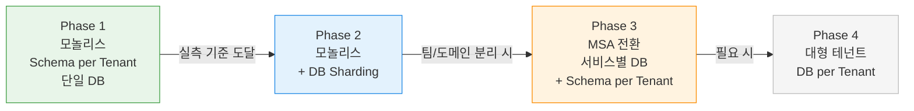
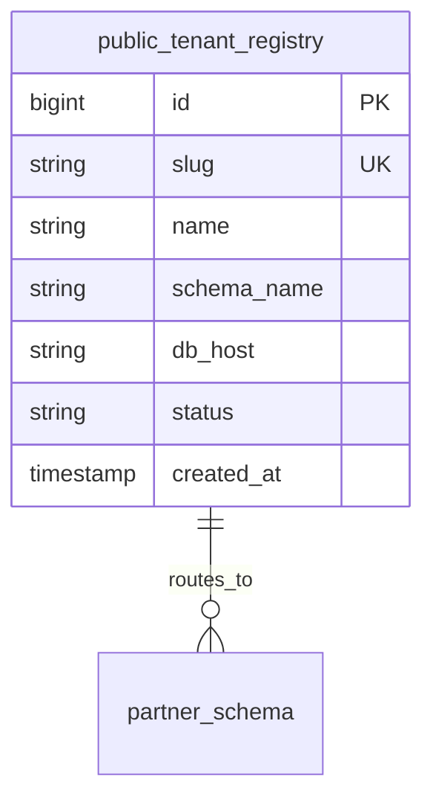
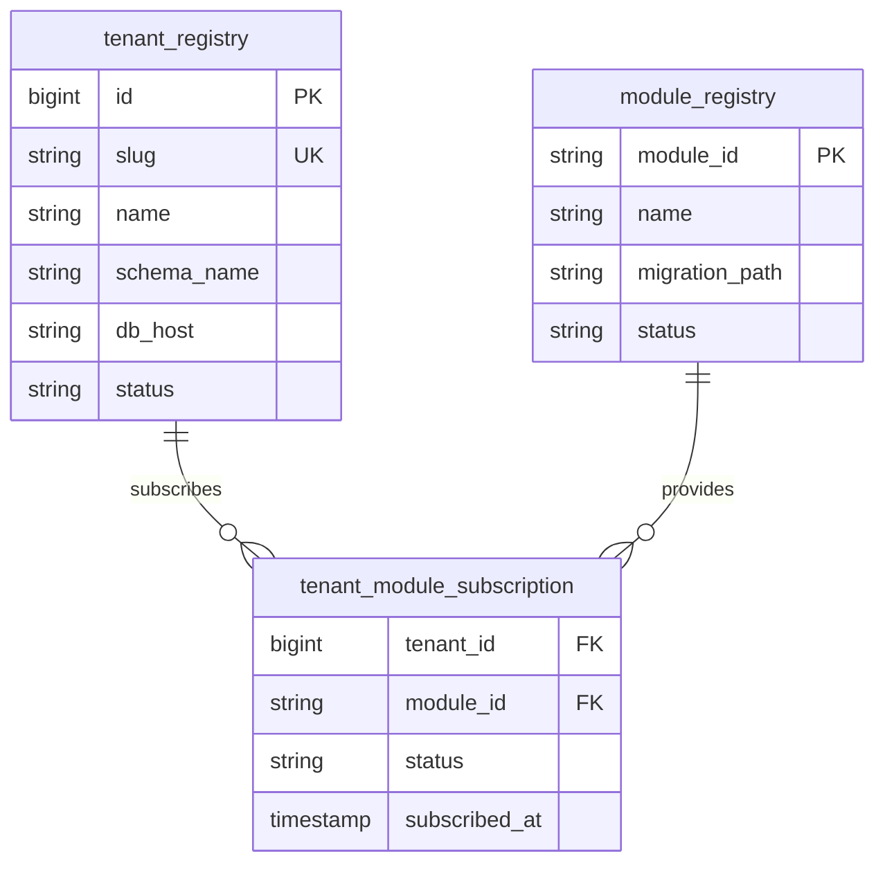
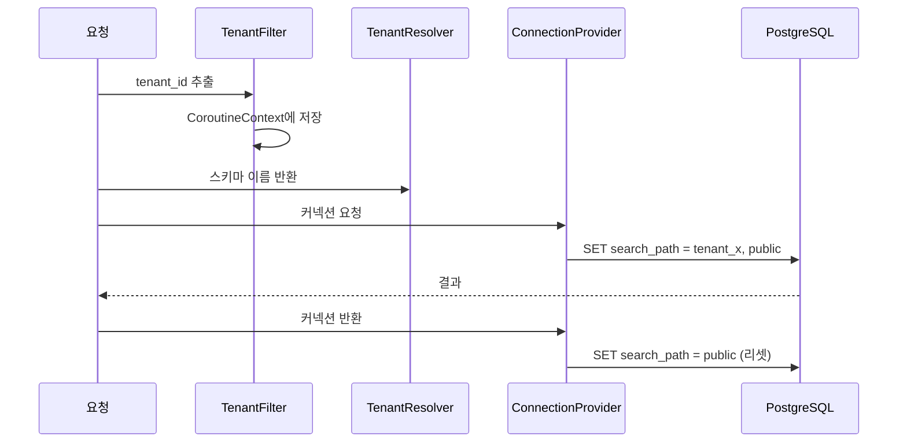
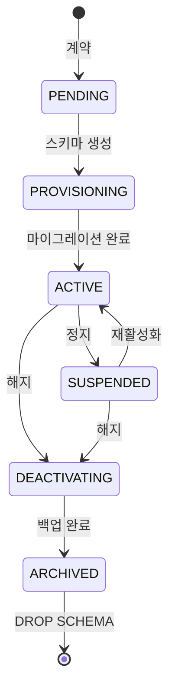

# B2B 전용몰 멀티테넌시 전략

> 작성일: 2026-04-09 | 작성자: 김정민 | 상태: 결정 완료
> 관련 티켓: [DEV2-5285](https://aladincommunication.youtrack.cloud/issue/DEV2-5285), [DEV2-5286](https://aladincommunication.youtrack.cloud/issue/DEV2-5286)
> 상위 티켓: [DEV2-5283](https://aladincommunication.youtrack.cloud/issue/DEV2-5283)

## 결정

**Schema per Tenant (단일 DB) → DB Sharding → MSA 전환 시에도 유지**

## 전략 비교표

| 항목 | Shared DB + Tenant Column | Schema per Tenant | DB per Tenant |
|------|:---:|:---:|:---:|
| 격리 수준 | 낮음 (WHERE 의존) | 중간 (스키마 경계) | 높음 (물리적) |
| 비용 | 낮음 | 낮음 | 높음 |
| 운영 복잡도 | 낮음 | 중간 | 높음 |
| 제휴사 추가 | 레코드 추가 | 스키마 생성 | DB 생성 |
| 데이터 유출 위험 | WHERE 누락 시 유출 | 스키마로 차단 | DB로 차단 |
| 제휴사 해지 | 위험 (DELETE) | 안전 (DROP SCHEMA) | 안전 (DROP DB) |
| 개발자 안전성 | 낮음 | 높음 | 높음 |
| 확장 경로 | 전환 어려움 | DB 분할로 전환 용이 | 이미 최대 |

## 선택 근거

**채택: Schema per Tenant**

| 근거 | 설명 |
|------|------|
| 개발자 안전성 | WHERE 누락 데이터 유출 원천 차단 |
| 프로젝트 정의 부합 | 제휴사별 스키마 격리가 자연스러움 |
| 데이터 민감도 | 민감 데이터는 Naru 관리, DB 격리까지 불필요 |
| 운영 편의 | 제휴사 추가/해지 = 스키마 생성/삭제 |
| 비용 | DB 1대로 시작 |
| 확장 | DB 분할, MSA 전환 시에도 전략 유지 |

**미채택: Shared DB** — WHERE 누락 위험, 인덱스 복잡도, 해지 위험
**미채택: DB per Tenant** — 초기 과잉, 커넥션 풀 관리 복잡, DevOps 투자 필요

## 확장 로드맵



### Phase 1: 모놀리스 + Schema per Tenant, 단일 DB (MVP~)



```
PostgreSQL (단일)
├── public (공용)
│   ├── tenant_registry
│   ├── module_registry
│   └── global_config
│
├── tenant_partner_a (전용몰만 구독)
│   ├── store_product_overlay
│   ├── store_orders
│   ├── store_settlement
│   ├── store_policy_config
│   ├── mangwon_loans         ← 빈 테이블 (미구독)
│   └── mangwon_returns       ← 빈 테이블 (미구독)
│
└── tenant_partner_b (전용몰 + 만권당 구독)
    ├── store_product_overlay
    ├── store_orders
    ├── store_settlement
    ├── store_policy_config
    ├── mangwon_loans         ← 데이터 있음 (구독 중)
    └── mangwon_returns       ← 데이터 있음 (구독 중)
```

### 서비스 모듈 × 테넌트 구독

#### MVP: enum/설정 기반 (모듈 구독 테이블 불필요)

MVP는 전용몰 단일 모듈이므로 `tenant_module_subscription` 테이블은 과잉. 서비스 제한 및 이용 범위는 `partner_contract` 레벨 설정 또는 enum으로 제어.

```kotlin
// MVP: 하드코딩/enum으로 시작
enum class ServiceModule { STORE }  // LMS, MANGWON은 나중에 추가

// partner_contract에 enabled_modules: ["STORE"] 저장
// 또는 단순히 파트너 = 전용몰 사용자로 가정 (MVP에서는 전용몰만 있으니까)
```

Phase 2에서 LMS, 만권당 등 모듈이 추가되면 그때 `module_registry` + `tenant_module_subscription` 테이블로 전환. enum → DB 테이블 전환은 two-way door.

#### Phase 2: DB 기반 모듈 구독 (모듈 추가 시)

모든 스키마는 동일 테이블 구조. 모듈 구독은 애플리케이션 레벨에서 제어.

> JPA/Hibernate가 시작 시 엔티티 매핑을 한 번만 로드. 런타임에 `SET search_path`로 스키마 전환. 따라서 모든 스키마에 동일 테이블 필요. 빈 테이블 오버헤드는 거의 없음.



마이그레이션은 모듈별 분리:

```
migrations/
├── store/           ← 전용몰
├── mangwon/         ← 만권당 (예시)
└── lms/             ← LMS (예시)
```

### 서비스 모듈 추가

테이블이 이미 존재하므로 구독 등록 + 초기 데이터만.


미구독 모듈 API 접근 → HTTP 403 차단. 배포 불필요.

### 제휴사 생성

런타임에 설정만으로 완료. 배포/서버 재시작 불필요.


### Phase 2: DB Sharding (실측 기준 도달 시)

```
                  ┌─────────────────┐
                  │  Primary DB     │
                  │  public 스키마   │ ← tenant_registry, global_config (원본)
                  └────┬────────────┘
                       │ Logical Replication
              ┌────────┴────────┐
              ▼                 ▼
        shard-1 DB         shard-2 DB
        ├── public (복제)   ├── public (복제)
        ├── tenant_a       ├── tenant_n
        └── tenant_b       └── tenant_o
```

- `tenant_registry.db_host`로 라우팅
- `AbstractRoutingDataSource` 도입
- 애플리케이션은 여전히 모놀리스

#### public 스키마 참조 전략

Phase 1에서는 `SET search_path = tenant_x, public`으로 public 테이블을 자연스럽게 참조. Phase 2 샤딩 시 public 데이터를 각 shard에서 참조하는 방법:

| 접근법 | 설명 | 장점 | 단점 |
|--------|------|------|------|
| **A) Logical Replication** | Primary DB의 public → 각 shard로 복제 | 기존 코드 변경 없음 (`search_path` 유지) | 복제 지연 (수 ms), 인프라 관리 |
| **B) 전용 DB 분리** | 공통 데이터를 별도 DB에, 앱이 2개 DataSource | single source of truth | cross-DB JOIN 불가, 앱 레벨 변경 |
| **C) 앱 레벨 캐시** | 시작 시 로드 + 이벤트 기반 갱신 | 가장 빠름 | 캐시 일관성 관리 필요 |

**추천: A + C 혼합.** public 데이터(tenant_registry, global_config)는 변경이 드물고 크기가 작음(수십~수백 레코드). Logical Replication으로 shard에 동기화하되, 앱에서는 Caffeine 캐시로 읽어서 DB 부하 최소화. 변경 이벤트로 캐시 갱신.

**Phase 1 설계 원칙**: tenant ↔ public cross-schema JOIN을 최소화할 것. tenant 스키마 안에서 쿼리가 완결될수록 Phase 2 전환이 쉬워짐.

### Phase 3: MSA 전환 (팀/도메인 분리 시)

Schema per Tenant 전략 유지. 각 서비스가 자기 DB에서 동일 패턴 적용.

```
MSA:
┌──────────┐ ┌──────────┐ ┌──────────┐ ┌──────────┐
│ 테넌트    │ │ 상품      │ │ 주문      │ │ 정산      │
│ 서비스    │ │ 서비스    │ │ 서비스    │ │ 서비스    │
└────┬─────┘ └────┬─────┘ └────┬─────┘ └────┬─────┘
  테넌트 DB     상품 DB       주문 DB       정산 DB
  ├ public      ├ public      ├ public      ├ public
  ├ tenant_a    ├ tenant_a    ├ tenant_a    ├ tenant_a
  └ tenant_b    └ tenant_b    └ tenant_b    └ tenant_b
```

| 변경됨 | 변경 안 됨 |
|--------|-----------|
| 서비스별 독립 DB | Schema per Tenant 전략 |
| REST/gRPC + 헤더로 tenant_id 전파 | SET search_path 방식 |
| MQ 이벤트에 tenant_id 포함 | Hibernate SCHEMA 모드 |
| Saga 패턴 | Flyway 멀티스키마 루프 |

core/ 패키지 → 공유 라이브러리 추출:

```
모놀리스: b2b-store/core/tenant/

MSA:     b2b-core-lib/tenant/   ← Maven/Gradle artifact
         order-service → depends on b2b-core-lib
         settlement-service → depends on b2b-core-lib
```

MSA 전환 시점: 팀이 도메인별로 나뉠 때, 독립 배포 필요 시.

### Phase 4: DB per Tenant (필요 시)

대형 제휴사만 독립 DB 분리. 나머지는 Schema per Tenant 유지. 하이브리드.

## 기술 구현

### Hibernate 네이티브 멀티테넌시

`AbstractRoutingDataSource`는 Phase 2에서 도입. Phase 1은 Hibernate SCHEMA 모드만.

```yaml
spring:
  jpa:
    properties:
      hibernate:
        multiTenancy: SCHEMA
```



### 핵심 컴포넌트

| 컴포넌트 | 역할 | 위치 |
|----------|------|------|
| `TenantFilter` | tenant_id 추출, CoroutineContext 주입 | core/tenant/ |
| `TenantCoroutineContext` | 코루틴 간 테넌트 전파 | core/tenant/ |
| `TenantThreadContextElement` | 코루틴 ↔ ThreadLocal 브릿징 | core/tenant/ |
| `CurrentTenantIdentifierResolver` | Hibernate에 스키마 이름 제공 | core/tenant/ |
| `SchemaMultiTenantConnectionProvider` | SET search_path + 리셋 | core/tenant/ |

### Kotlin Coroutines 기반 (필수)

ThreadLocal이 아닌 CoroutineContext.Element 기반. Hibernate 호출 시에만 ThreadContextElement로 브릿징.

```
요청 → TenantFilter → tenant_id 추출
  → launch(TenantCoroutineContext(tenantId)) {
      Dispatcher 전환해도 유지
      JPA 호출 시 → ThreadContextElement가 ThreadLocal 세팅
      → Hibernate → SET search_path
    }
```

### Flyway 멀티스키마


새 모듈 추가 시 → 배포(코드 + 마이그레이션 포함) → 시작 시 모든 스키마에 자동 적용. `CREATE TABLE`은 밀리초 단위.

### 제휴사 라이프사이클



## 기존 시스템 참조

| 시스템 | 전략 | 역할 |
|--------|------|------|
| Naru | Shared DB (partner 테이블) | 인증/계약/민감 데이터 |
| 바자르 | 단일 테넌트 | 상품 마스터, 오픈마켓 연동 |
| 전용몰 | Schema per Tenant | 거래 데이터 격리 |

상품 원본 = 바자르. 전용몰은 오버레이(가격/노출)만 보유. Salesforce B2B "price book overlay" 패턴.

## 베스트 프랙티스 검증

| 항목 | 판정 | 근거 |
|------|------|------|
| Schema per Tenant | 업계 검증 | 10~500 테넌트 B2B SaaS 표준 |
| SET search_path + public | 프로덕션 검증 | Vlad Mihalcea, Arkency 등 |
| 상품 오버레이 | 업계 표준 | Salesforce B2B price book |
| Hibernate 6.x SCHEMA | 네이티브 지원 | 별도 라이브러리 불필요 |
| Flyway 멀티스키마 | 표준 패턴 | 프로그래밍 방식 실행 |

> Shopify/BigCommerce/Salesforce는 Shared DB + 컬럼 방식. 수백만 SMB 대상이라 프레임워크 레벨 자동 주입 + 물리 샤딩으로 해결. B2B 전용몰(수십 곳 기업 대상)과는 규모가 다름.

## 보완 필요 사항 (PoC에서 검증)

### 커넥션 리셋

`releaseConnection()`에서 `SET search_path = DEFAULT` 필수. 실패 시 테넌트 간 데이터 유출. 통합 테스트 필수.

PgBouncer 도입 시 session pooling mode 사용. transaction pooling은 비호환.

### Flyway 실패 처리

스키마별 try/catch. 실패 시 SUSPENDED 전환 + 알림. 나머지는 계속 진행.

### 바자르 상품 정합성

바자르 상품 삭제 시 오버레이 고아 레코드 발생. Outbox 이벤트 구독 또는 주기적 정합성 배치로 대응.

### 스키마 이름 SQL injection

`SET search_path`에 스키마 이름 직접 삽입. `tenant_registry` 화이트리스트 검증 필수.

## Phase 2 전환 기준

숫자가 아닌 실측 기반:

| 트리거 | 임계값 |
|--------|--------|
| 전체 마이그레이션 시간 | > 60초 |
| PostgreSQL CPU/shared_buffers | 지속 고부하 |
| 커넥션 풀 대기 시간 | 측정 가능 수준 |
| Noisy neighbor | 특정 테넌트가 타 테넌트 성능에 영향 |

## PoC: 멀티테넌시 기술 검증

### 목적

우리 스택에서 실제 동작 검증 + 본 개발 전 레퍼런스 코드 확보.

### 검증 항목

| # | 항목 | 리스크 |
|---|------|--------|
| 1 | Hibernate 6.x SCHEMA 모드 동작 | 6.2 계약 변경 |
| 2 | Kotlin Coroutines → Hibernate 브릿징 | 컨텍스트 누락 |
| 3 | 커넥션 리셋 (HikariCP) | 테넌트 간 데이터 유출 |
| 4 | 런타임 CREATE SCHEMA + Flyway | 락/풀 영향 |
| 5 | public + tenant 크로스 스키마 접근 | 매핑 충돌 |

### 프로젝트 구조

```
b2b-store-poc/
├── core/tenant/
│   ├── TenantCoroutineContext.kt
│   ├── TenantThreadContextElement.kt
│   ├── CurrentTenantResolver.kt
│   └── SchemaMultiTenantConnectionProvider.kt
├── api/
│   ├── TenantProvisioningController.kt
│   └── OrderController.kt
├── domain/
│   └── Order.kt
├── infra/
│   └── TenantAwareFlywayRunner.kt
├── test/
│   ├── TenantIsolationTest.kt
│   ├── ConnectionResetTest.kt
│   ├── CoroutineTenantTest.kt
│   └── RuntimeProvisioningTest.kt
└── resources/
    ├── application.yml
    └── db/migration/
        ├── shared/V001__create_tenant_registry.sql
        └── tenant/V001__create_orders.sql
```

### 성공 기준

| # | 테스트 | 통과 조건 |
|---|--------|----------|
| 1 | 테넌트 A 주문 → 테넌트 B에서 안 보임 | 격리 동작 |
| 2 | withContext(IO) 안 JPA 호출 → 올바른 스키마 | 코루틴 브릿징 |
| 3 | 커넥션 반환 후 search_path = public | 리셋 동작 |
| 4 | API로 테넌트 생성 → 즉시 CRUD | 프로비저닝 |
| 5 | public + tenant 한 요청에서 조회 | 크로스 스키마 |

### 기술 스택

| 항목 | 버전 |
|------|------|
| Spring Boot | 3.5.x |
| Kotlin | 2.0.x |
| Coroutines | 1.9.x |
| Hibernate | 6.x |
| PostgreSQL | 16+ |
| HikariCP | Spring Boot 기본 |
| Flyway | 10.x |
| TestContainers | PostgreSQL |

### PoC 범위 밖

바자르/뉴빌링/Naru 연동, FE 라우팅, Admin UI, 정책 엔진, 성능 테스트.

## 다음 단계

- [ ] **PoC 진행** (4/10~)
- [ ] DEV2-5286: 이 문서 + PoC 결과로 팀 논의
- [ ] 제휴사 수/추가 빈도 확인 (안혜련/이현민)
- [ ] Flyway 실패 처리 설계
- [ ] 바자르 상품 정합성 처리 방안
