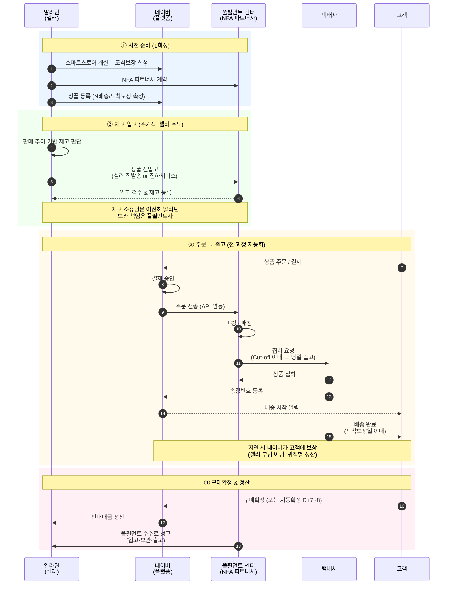
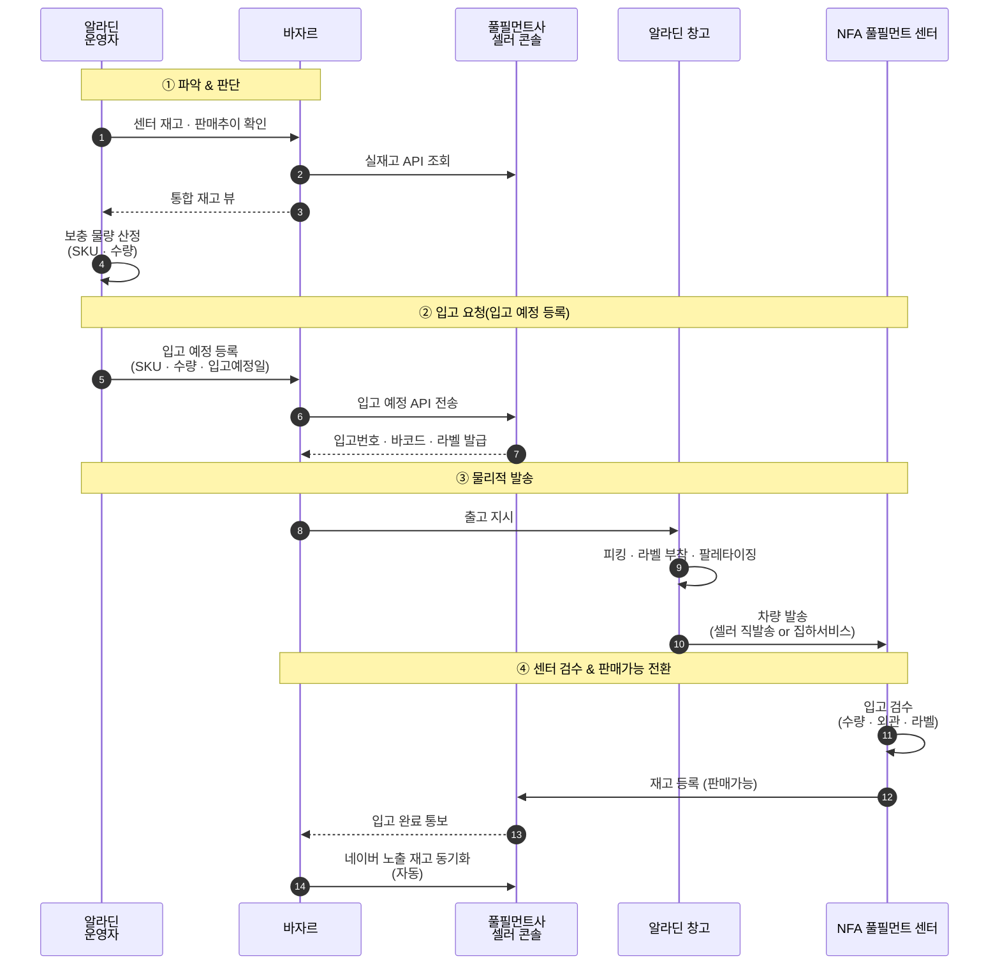

# 네이버 N배송(도착보장) 프로세스 레퍼런스

> **바자르(bazaar)에 네이버 스마트스토어 + N배송 연동을 신규 Vendor로 추가**할 때의 운영·설계 참고 자료.
> B2B 전용몰(스토어프론트)과는 **별개 기능**이다 — 스토어프론트는 자사 수요 채널이고, 본 기능은 바자르의 외부 수요 채널 확장이다.

## 1. 배경

바자르는 현재 **오픈마켓 4개(지마켓·옥션·11번가·쿠팡)** 와 연동하는 멀티벤더 마켓플레이스 오케스트레이터다.
여기에 **네이버 스마트스토어**를 신규 벤더로 추가하면서, 그 안의 **N배송(도착보장)** 옵션까지 수용하려 할 때 발생하는 차이점을 정리한다.

확인할 질문:
- N배송이 일반 오픈마켓 배송과 **무엇이 어떻게 다른가**
- 셀러(알라딘)가 **언제 · 어디서 · 무엇을** 해야 하는가
- 바자르의 **기존 도메인에 어떤 확장**이 필요한가

## 2. 유사 개념과의 구분

혼동하기 쉬운 두 가지 축을 먼저 정리한다.

### 2.1. 스마트스토어 내 배송 옵션: 일반 배송 vs N배송

알라딘이 **스마트스토어 셀러로 입점**한다는 전제에서, 상품별로 선택하는 **배송 속성**의 차이다.

| 구분 | 일반 배송 (판매자 배송) | N배송 (도착보장) |
|---|---|---|
| 재고 위치 | **알라딘 자사 창고** | **NFA 풀필먼트 센터에 선입고** |
| 출고 주체 | 알라딘이 주문 건별 포장·출고 | 풀필먼트사가 자동 피킹·패킹·출고 |
| 택배사 계약 | 셀러가 직접 계약 | 풀필먼트사가 계약한 택배사 (주로 CJ) |
| 도착일 보장 | ✕ (지연 책임은 셀러) | ✓ (지연 시 **네이버가 고객 보상**) |
| 집하 시점 | 주문 후 셀러 포장 완료 시점 (통상 D+0~1 집하) | 주문 즉시 자동 피킹 → Cut-off 이내 당일 집하 |
| 검색 노출 가점 | 일반 | **"도착보장" 필터 우선 노출** |
| 수수료 | 플랫폼 수수료만 | 플랫폼 수수료 + **풀필먼트 수수료(입고·보관·출고)** |
| 재고 운영 부담 | 전 상품을 자사 창고에서 관리 | N배송 지정 상품만 센터에 별도 재고 보유 |
| CS 대응 | 셀러가 전담 | 상품 CS는 셀러, **배송 CS는 풀필먼트사/네이버** |
| 적합 상품 | 회전이 느리거나 SKU 다양도가 큰 상품 | 회전이 빠르고 표준화된 상품 |

**핵심 트레이드오프**: N배송은 수수료와 재고 선입고 부담을 지는 대신, **노출 가점 · 도착보장 신뢰 · 출고 자동화**를 얻는다. 같은 스마트스토어 내에서도 **SKU 별로 혼용**이 가능하다 (일부는 N배송, 일부는 일반 배송).

### 2.2. 판매 모델: N배송(위탁) vs 직매입(사입)

**재고 소유권** 기준의 구분이다. "네이버가 우리 물건을 미리 가져가서 판다"는 구조로 오해하기 쉽지만, 두 모델은 완전히 다르다.

| 구분 | N배송 (도착보장, 위탁) | 직매입 (사입) |
|---|---|---|
| 셀러 주체 | 알라딘 | 네이버 |
| 재고 소유권 | **끝까지 알라딘** | **입고 시점에 네이버로 이전** |
| 입고 판단 | 알라딘이 판매추이 보고 보충 | 네이버가 수요예측 → 알라딘에 B2B 발주 |
| 정산 단위 | 판매 건별 (고객 구매확정 시) | 납품 건별 (PO 기반 B2B 매입) |
| 네이버 서비스 | 네이버 도착보장(NFA) | 네이버 쇼핑 직매입 / 제휴 매입 |
| 유사 모델 | — | 쿠팡 로켓배송 |

본 문서는 **스마트스토어 입점 + N배송(위탁 풀필먼트)** 을 대상으로 한다.

## 3. 프로세스

## 4. 단계별 상세

### ① 사전 준비 (1회성)

- 스마트스토어 개설, 도착보장 프로그램 신청
- NFA(네이버 풀필먼트 얼라이언스) 파트너사 선정 — CJ대한통운 / 파스토 / 품고 등
- 상품 등록 시 **배송 속성**을 "도착보장"으로 지정 (일반배송과 분리 관리)

### ② 재고 입고 (주기적)

- 주문과 무관. **판매 추이·재고 수준**을 셀러가 판단해 선입고
- 운반: 셀러 직발송 또는 파트너사 집하 서비스
- 입고 검수 후 풀필먼트사 시스템에 재고 등록
- 소유권은 알라딘, 보관 책임은 풀필먼트사

### ③ 주문 → 출고 (자동화)

- 고객 주문 결제 → 네이버가 풀필먼트사에 API로 주문 전송
- Cut-off 이내(보통 14~17시) 주문은 **당일 집하 · 당일 출고**
- 송장번호가 네이버에 자동 등록되어 고객에게 통지
- **셀러 개입 없음**
- 도착보장일 미준수 시 **네이버가 고객에 보상** (귀책 분석 후 풀필먼트사/셀러 간 별도 정산)

### ④ 구매확정 & 정산

- 구매확정 또는 자동확정(배송완료 D+7~8) 후 판매대금 정산
- 풀필먼트 수수료(입고·보관·출고)는 별도 청구
- CS 1차 대응은 셀러 책임 (배송 관련 CS는 풀필먼트사/네이버)

## 5. 셀러 관점 요약

| 단계 | 알라딘이 하는 일 | 자동화 영역 |
|---|---|---|
| ① 준비 | 계약 · 상품 등록 | — |
| ② 입고 | **재고 보충 판단 + 센터로 발송** | 입고 검수 · 등록 |
| ③ 주문~출고 | (개입 없음) | 주문 전달 · 피킹 · 집하 · 배송 |
| ④ 정산 | 수수료 확인 · CS 1차 대응 | 정산 처리 |

**알라딘이 실제로 개입하는 지점은 ②와 CS뿐.** 이후 주문~배송은 시스템이 자동 처리한다.

## 6. 재고 파악 & 입고 요청 운영

알라딘이 유일하게 개입하는 루프(**보충 판단 → 입고 요청**)의 실무 운영을 쪼갠 내용. 바자르가 이 루프를 자동화·지원해야 한다.

### 6.1. 어디서 파악하는가 — 3개 창구

| 창구 | 확인 정보 | 주 용도 |
|---|---|---|
| **풀필먼트사 셀러 콘솔 / WMS** (CJ, 파스토, 품고 등) | 실재고, 보관일수, 입출고 이력, 불량/반품 재고 | "지금 센터에 얼마 남았나" |
| **네이버 스마트스토어 판매자센터** | 판매 추이, 노출 순위, **품절 임박 알림**, 도착보장 상품 관리 | "얼마나 팔리고 있나 / 곧 품절인가" |
| **알라딘 자사 ERP/WMS** | 전체 채널 통합 재고, 채널별 할당 | "자사 창고에서 얼마까지 보낼 수 있나" |

파트너사마다 **API를 제공**하므로, 연동 수준이 깊어질수록 위 3개를 바자르 한 곳에서 볼 수 있다.

### 6.2. 언제 보충을 판단하는가 — 트리거

주로 **풀필먼트사 콘솔의 재고 수준**을 기준으로 하되, 판매자센터의 시그널을 같이 본다.

- **안전재고 미달**: 센터 내 재고가 설정 임계치 이하
- **판매 추이 급증**: 최근 N일 판매 속도로 계산한 소진 예상일이 임박
- **품절 임박 알림**: 네이버가 "곧 품절" 배지를 달기 직전 (노출 가점 하락 직전)
- **시즌성 대응**: 특정 시즌 · 프로모션 전 선제 보충
- **정기 보충 주기**: 주간/격주 등 루틴화된 보충
- **파트너사 보충 제안**: 일부 파트너사(파스토·품고 등)는 자체 AI 기반 보충 제안 제공

### 6.3. 어떻게 요청하는가 — 입고 요청 흐름

### 6.4. 자동화 수준별 운영

| 레벨 | 파악 | 판단 | 요청 |
|---|---|---|---|
| **수기 운영** | 담당자가 콘솔 로그인 | 엑셀/경험 기반 | 콘솔에서 수동 입력 |
| **부분 연동** | 파트너사 API로 실재고 수집 | 재고 임계치 알림 자동 | 입고 예정은 수기 |
| **완전 연동** | 판매자센터 + 파트너사 API 통합 | 판매추이 기반 자동 산정 | API로 입고 예정 자동 등록 |

알라딘 같은 **다채널 대규모 셀러**는 보통 **완전 연동**을 목표로 한다. 바자르가 이 계층 역할을 한다.

### 6.5. 핵심 포인트

- **파악은 "풀필먼트사 콘솔"** 이 1차 (실재고), 바자르가 API 수집
- **판단은 "바자르"** 가 중심 (전체 채널 관점에서 보충량 산정)
- **요청은 "풀필먼트사 API or 콘솔"** 로 입고 예정 등록 후 **물리 발송**
- 즉, "요청=입고 예정 등록" 과 "실제 발송"은 **2단계**로 일어난다. 입고 예정이 떠야 센터가 받을 준비를 한다.

## 7. 바자르 추가 기능 관점

바자르에 네이버 스마트스토어 + N배송을 추가할 때의 확장 포인트. (실제 설계는 별도 설계 문서로 분리 필요)

### 7.1. Vendor 확장

- 신규 Vendor: **`NAVER_SMARTSTORE`** 등록 (`vendorType=OPEN_MARKET`, `vendorBusinessScopes=FULL_COMMERCE`)
- 신규 어댑터 모듈 **`vendor-naver`** (기존 `vendor-ebay`, `vendor-st11`, `vendor-http`와 병렬)
- Secrets: `sm-bazaar-{env}-vendor-naver`
- N배송 여부는 **Vendor 속성이 아니라 Order/Product의 플래그**로 취급 (한 벤더 내 혼용 가능)

### 7.2. Fulfillment 도메인 확장 — N배송 분기

기존 Fulfillment 도메인에 **위탁 풀필먼트(consigned)** 개념 추가. 주문 수신 시 N배송 플래그로 분기:

| 주문 유형 | 이행 경로 | 바자르 관여 |
|---|---|---|
| 일반 배송 | 알라딘 공급자 시스템(supplier-aladin)으로 이행 지시 | 기존과 동일 |
| N배송 | NFA가 자동 처리 | **상태 업데이트 수신 · 동기화만** |

### 7.3. 신규 도메인 — 입고 예정 (Inbound)

현재 바자르에 없는 도메인. N배송 전용으로 신설 필요.

- 상태머신: `PLANNED → IN_TRANSIT → RECEIVED → INSPECTED → AVAILABLE`
- 엔티티: 입고번호 · 라벨 · 바코드 · 예정일 · 실입고일 · 검수결과
- 파트너사별 라벨 포맷 차이 → **어댑터 패턴으로 추상화** (vendor 패턴과 동일 철학)

### 7.4. Location 도메인 확장 — 이중 재고

기존 Location 도메인에 **NFA 센터 타입** 추가.

- `LocationType.NFA_CENTER` 추가 (파트너사: CJ / 파스토 / 품고)
- 재고 엔티티에 `(location, quantity, availability)` 모델링
- 가용재고 분리: "자사 출고용" vs "NFA 위탁용"

### 7.5. 보충 판단 엔진 (신규)

안전재고 · 판매추이 · 품절 임박 시그널 기반 보충 제안을 생성하는 배치.

- 스케줄러: **`ReplenishmentBatchScheduler`** (기존 `FulfillmentBatchScheduler` 계열 추가)
- Outbox 이벤트: `ReplenishmentSuggested` · `ReplenishmentInboundRegistered`
- 단계적 도입: **수기 운영 → 임계치 알림 → 판매추이 기반 자동 산정** 순으로 진화

### 7.6. 정산 도메인 확장

- 기존 판매 정산 외에 **풀필먼트 수수료 정산** (입고·보관·출고) 추가
- 도착보장 지연 보상 **귀책 분담(네이버 / NFA / 셀러)** 정산 규칙
- Reconciler 도메인 활용: NFA 콘솔 정산 데이터 ↔ 바자르 기록 대사

### 7.7. 기존 오픈마켓과의 구조 차이

| 항목 | 기존 오픈마켓 (eBay, Gmarket, 11번가) | 네이버 스마트스토어 + N배송 |
|---|---|---|
| 재고 위치 | 알라딘 창고 (이행 시 Supply 경로) | 일반: 알라딘 창고 / N배송: **NFA 센터** |
| 이행 주체 | 알라딘 공급자 시스템 | 일반: 알라딘 / N배송: **NFA 자동** |
| 바자르 관여 | 주문 수신 → 이행 지시 | 주문 수신 → (일반) 이행 지시 / (N배송) **상태 모니터링만** |
| 선입고 개념 | 없음 | **있음** (입고 예정 도메인 신규) |
| 재고 가시성 | 단일 (알라딘 창고) | **이중** (알라딘 + NFA) |
| 정산 수수료 | 플랫폼 수수료만 | 플랫폼 + **풀필먼트 수수료** |

### 7.8. MVP 범위 제안

| 우선순위 | 범위 | 설명 |
|:---:|---|---|
| **P0** | Naver Vendor 어댑터 | 상품 등록 · 주문 수신 · 상태 동기화 (일반 배송만) |
| **P1** | N배송 주문 이행 처리 | N배송 플래그 분기 + NFA 이행 상태 수신·동기화 |
| **P2** | 입고 예정 도메인 | 수기 등록 UI + 재고 가시성(이중 재고) |
| **P3** | 보충 판단 엔진 | 임계치 알림 → 자동 산정 단계 확장 |

### 7.9. 직매입 모델과의 명시적 구분

네이버가 미래에 알라딘에 직매입을 제안할 경우는 **완전히 다른 도메인**이 필요하므로 본 문서 범위에서 제외한다.

- 직매입: **PO 발주 · 납품 · 매입 정산** (B2B 거래)
- N배송(본 문서): **재고 이관 · 판매 정산 · 수수료 정산** (위탁 거래)
- 두 모델을 동시에 수용해야 할 경우, 재고 엔티티에 **소유권(알라딘/네이버) + 거점**을 함께 모델링해야 함
