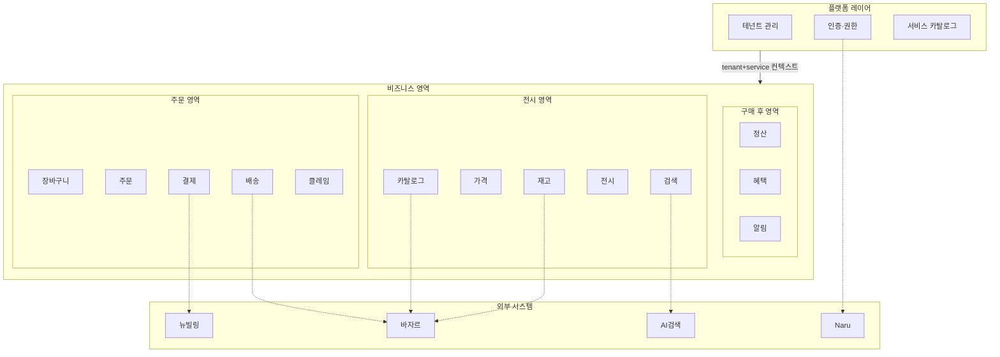
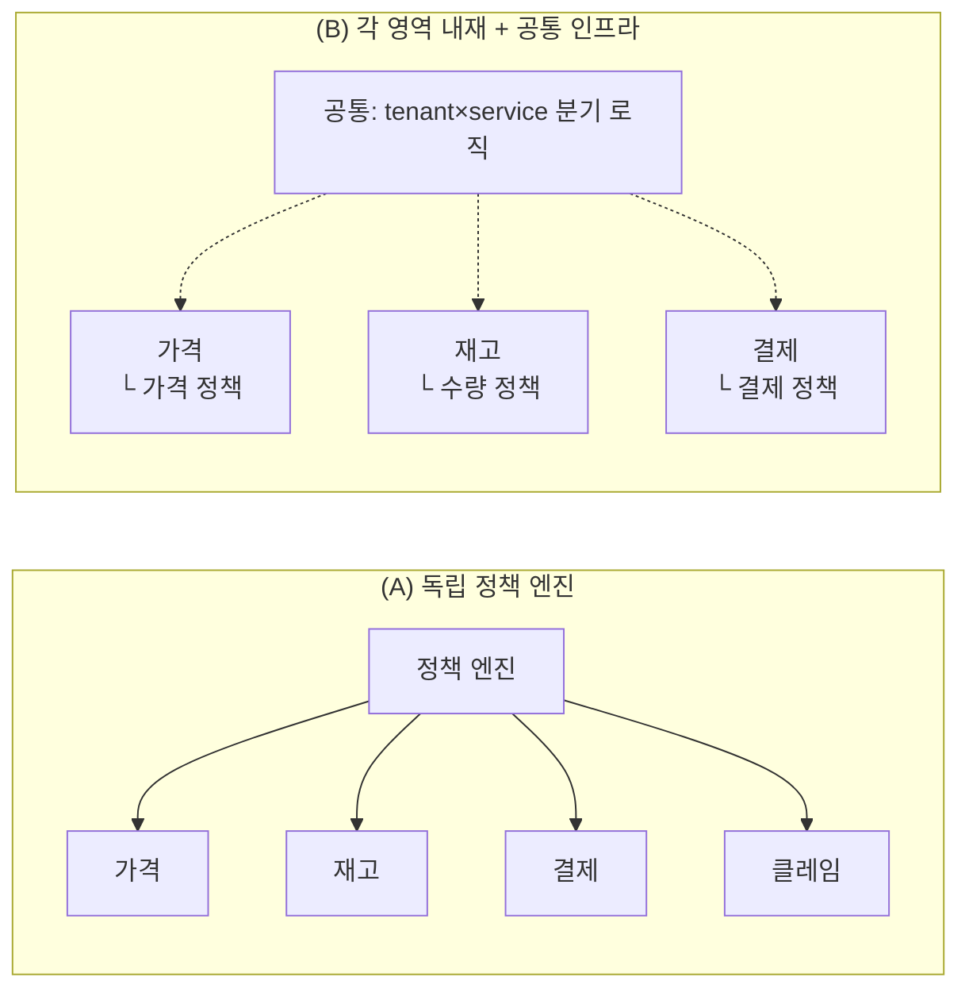
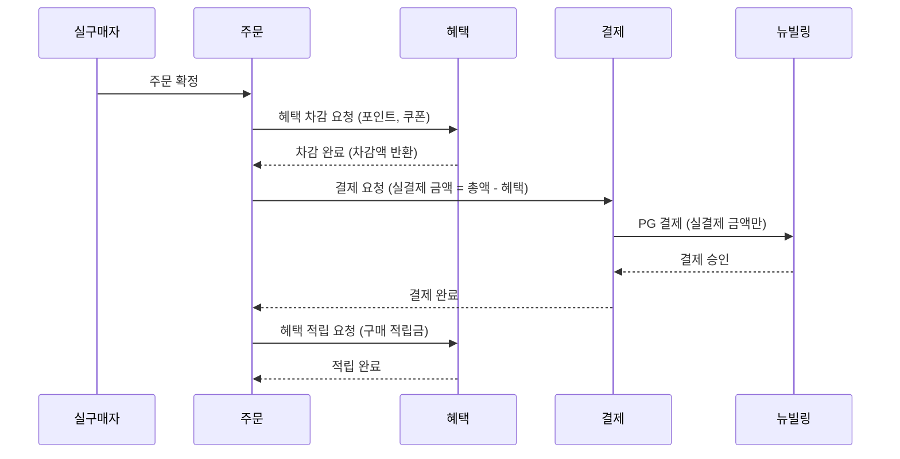
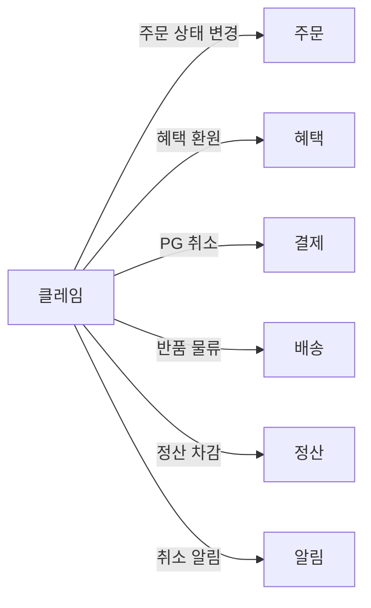
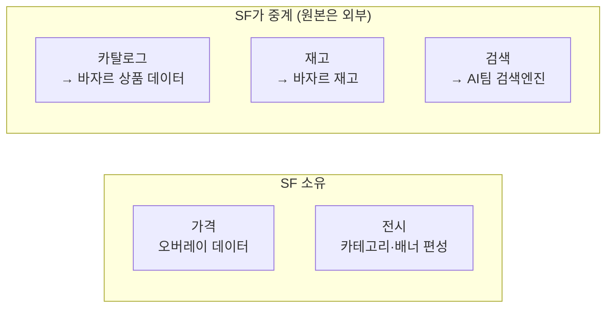
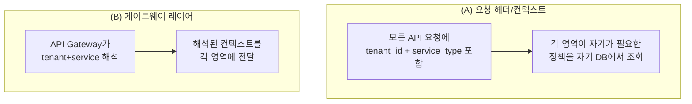

# 스토어프론트 도메인 결정 — 마스터 레지스트리

> 목적: 기획 정의(13개 비즈니스 영역 + 플랫폼 레이어) 기반으로, 결정되지 않은 경계·소유권·구조 질문의 **단일 출처(Single Source of Truth)**.
> 상태: **진행 중** — 결정된 항목은 ✅로 표시
>
> **단일 출처 원칙**: 이벤트 스토밍 워크숍(planning, guide)과 각종 회의 자료에서 발견된 모든 핫스팟·미결정 사항은 이 문서의 **D-XX** 번호로 통합된다. 워크숍 문서는 본 문서의 D-XX를 참조만 한다.
>
> **13영역 공식 확정 (2026-04-17)**: 도메인 분류 체계가 공식화됨 — 전시 5 / 주문 5 / 구매 후 3. 계정 관리는 Naru 전담 → SF 도메인에서 제외. 클레임 = 취소+반품+교환 통합. 근거: [b2b-store-meeting-minutes-0417.md](../meetings/b2b-store-meeting-minutes-0417.md)
>
> **도메인 V1.1 확장 (2026-04-21)**: 기획자 Scope.xlsx "도메인 V1.1" 시트 반영. 공통 14 + 견적 고객 7 = 21 비즈니스 도메인 + 플랫폼 3. 공통 몰과 견적 고객 몰은 **다른 테넌트**. 대량구매 = 견적 고객으로 통합 (D-08 재작성). Naru 역할 확장: 계정 + 파트너 + 사업자정보 마스터. AI검색 → "알리스(Alis)" 명명. 근거: [b2b-store-domain-v11-reflection.md](./b2b-store-domain-v11-reflection.md)
>
> **MVP 상태**: 미결. 현재는 기획 + 이벤트 스토밍 양쪽에서 전체 그림을 그리는 단계. V1.1의 "MVP 제외" 표시는 **잠정**.
>
> **MVP 원칙 (2026-04-21 확정)**
> 1. **설계단 고려, 실 구현은 Phase 분리** — MVP는 모든 도메인·결정을 설계 레벨로 받치되(훅·인터페이스·스키마 컬럼 예약), 실 기능 구현은 요구 시점에. §10 다중 공급원 방식의 일반화.
> 2. **대량 구매(견적 몰)가 먼저 라이브될 가능성 열려 있음** — 현 단계는 공통 MVP 정의이나, 견적 몰 선행 시에도 흡수 가능한 형태로 설계. Quote Management BC가 공통 Core 6개와 독립적이어야 함.

---

## 기획 정의 전체 구조



---

## 결정 목록 요약

| # | 제목 | 영역 | 상태 |
|---|------|------|------|
| D-01 | 정책 엔진 위치 (독립 vs 영역 내재) | 플랫폼·전 영역 | 미결 |
| D-02 | 혜택-결제 경계 + 보상 트랜잭션 | 혜택·결제 | 미결 |
| D-03 | 클레임 소유 범위 | 클레임 | 미결 |
| D-04 | 전시 영역 SF 소유 vs 외부 | 카탈로그·가격·재고·검색 | 미결 |
| D-05 | 알림 위치 | 알림 | 미결 |
| D-06 | 테넌트 컨텍스트 전달 방식 | 플랫폼 | 미결 |
| D-07 | B2B 주문 플로우 (알라딘 표준 vs 분기) | 주문 | 미결 |
| D-08 | 대량구매 고객 플로우 | 주문·인증 | 미결 |
| D-09 | 기존 제휴사 추가 As-Is 조사 | 테넌트 관리 | 미결 |
| D-10 | 서비스별 정책 차이 매트릭스 | 가격·혜택·결제 | 미결 |
| D-11 | 제휴사 관리자 RBAC 범위 | 인증·권한 | 미결 |
| D-12 | B2B 결제수단·세금계산서 발행 경계 | 결제·혜택 | 미결 |
| D-13 | 테넌트·관리자 생명주기 (수정·일시중지·종료·이관) | 테넌트 관리·카탈로그 | 미결 |
| D-14 | 정책·설정 변경 감사 로그 | 플랫폼 공통 | 미결 |
| D-15 | 외부 의존 장애 시 Degraded Mode 정책 | 플랫폼·전 영역 | 미결 |
| D-16 | 고객 CS 관리 환경 (클레임 대응·모니터링) | 주문(클레임)·구매 후 | **V1.1 공식화 / 세부 미결** |
| D-17 | 몰 분리 구조 (공통 몰 vs 견적 몰) | 테넌트 관리 | 미결 |
| D-18 | 견적 가격 정책 (수량 구간 + 조직 유형별 할인율) | 견적·가격 | 미결 |
| D-19 | 복수 배송지 (DeliveryGroup) | 배송 | 미결 (MVP 제외 잠정) |
| D-20 | 상품 카테고리 vs 서비스 분리 원칙 | 카탈로그·서비스 카탈로그 | ✅ **하이브리드 확정 (4/22)** |
| D-21 | 구매 제한 방식 (Approval 워크플로우 vs 회원별 정책) | 회원·주문 | ✅ **회원별 제한 정책 확정 (4/22)** |
| D-22 | MVP 혜택 범위 (알라딘 포인트 vs 제휴사 전용 포인트) | 혜택·결제 | ✅ **제휴사 전용 포인트(단건)만 확정 (4/22)** |
| D-23 | 모니터링 MVP 편입 여부 | 구매 후 | ✅ **MVP 포함 확정 (4/22)** — 주문현황·주문량 뷰 |

**액션 아이템 (결정 아닌 조사·확인)**

| # | 항목 | 담당 |
|---|------|------|
| A-01 | 바자르 주문 이행 API 가용성·스펙 확인 | 안혜련·이현민 |
| A-02 | AI검색 테넌트 필터 지원 여부·일정 | 김정민 |
| A-03 | 장바구니 영속성 주체 조사 (SF vs 바자르) | 안혜련·이현민 |

---

## D-01. 정책 엔진 위치

기존 D3(정책 엔진)은 독립 도메인이었다. 기획 정의에서는 정책이 **각 영역에 내재**돼 있다.

| 정책 종류 | 기획 기준 소속 | 예시 |
|----------|-------------|------|
| 가격 정책 (할인율, 오버레이) | 가격(Pricing) | 정가 기준 15% 할인 |
| 수량 제한 | 재고(Inventory) | 계정당 월 3권 |
| 결제수단 제한 | 결제(Payment) | 카드+복지포인트만 허용 |
| 분야·카테고리 제한 | 전시(Display) 또는 검색(Search) | IT도서만 노출 |
| 환불 정책 | 클레임(Claim) | 7일 이내 전액 환불 |
| 포인트 사용 한도 | 혜택(Benefit) | 주문금액의 80%까지 |

### 선택지



| | (A) 독립 정책 엔진 | (B) 각 영역 내재 + 공통 인프라 |
|--|---|---|
| 장점 | 정책 변경이 한 곳에서 관리됨. 운영자가 정책만 모아서 볼 수 있음 | 기획 직관과 일치. 각 영역이 자기 규칙을 소유 |
| 단점 | 기획 정의와 불일치. 정책 엔진이 모든 영역에 의존 | 정책 변경 시 여러 영역을 건드릴 수 있음. Admin UI에서 정책을 한눈에 보기 어려움 |
| SaaS 영향 | `(tenant, service, policy_type)` 3차원 테이블 | `(tenant, service)` 분기 로직만 공유 라이브러리, 각 영역이 자기 정책 테이블 소유 |
| Admin UI | 정책 관리 = 1개 메뉴 | 영역별 설정 메뉴 안에 정책이 내장 |

**논의 질문:**
- 운영자가 "한 화면에서 모든 정책을 설정"하길 원하나? → (A) 유리
- 아니면 "가격 설정 들어가서 가격 정책, 재고 설정 들어가서 수량 정책"이 자연스러운가? → (B) 유리
- SF 필수 설정 5개(제휴사 생성 / 몰 On·Off / 분야 제어 / 포인트 한도 / 가격·할인율)의 Admin UI 동선은?

**결정:** `[ ]` 미결

---

## D-02. 혜택-결제 경계 + 보상 트랜잭션

기존에 결제(D6) 안에 포인트원장이 있었다. 기획은 **혜택을 독립 영역**으로 분리했다.

### 결제 흐름에서의 관계



### 핵심 질문

| # | 질문 | 영향 |
|---|------|------|
| 2-1 | **혜택 차감 성공 + PG 결제 실패** 시 보상 트랜잭션 전략 (Saga? 2PC?) | 혜택-결제 간 트랜잭션 보장 방식 |
| 2-2 | 혜택(Benefit)이 소유하는 것: 제휴 포인트 원장 + 알라딘 포인트 연동 + 쿠폰 — 맞나? | 혜택 영역 범위 |
| 2-3 | 알라딘 포인트(적립금/마일리지)의 원장이 기존 어디에 있나? SF가 새로 만드나, 기존 시스템 API를 호출하나? | 혜택 영역 구현 방식 |
| 2-4 | 쿠폰은 혜택에 속하나? 별도의 프로모션/마케팅 영역이 필요하진 않나? | 혜택 영역 범위 |
| 2-5 | 부분 취소 시 혜택 먼저 돌려주나, PG 먼저 취소하나? | 환원 순서 규칙 (D-03과 연동) |
| 2-6 | 혜택 차감이 **어디서** 일어나나? 결제 오케스트레이터 안인가, 독립적으로 주문이 호출하는가? | 혜택 영역 호출 주체 |

**결정:** `[ ]` 미결

---

## D-03. 클레임 소유 범위

기획이 클레임을 독립 영역으로 잡았다. 기존에는 취소·환불이 주문(D5)+결제(D6)에 분산됐었다.

### 클레임이 다른 영역에 요청하는 것



| # | 질문 | 선택지 |
|---|------|--------|
| 3-1 | 클레임이 **오케스트레이터** 역할을 하나? (주문·혜택·결제·배송에 순서대로 요청) | (a) 클레임이 오케스트레이션 / (b) 주문이 오케스트레이션하고 클레임은 정책만 |
| 3-2 | 부분 취소 시 환원 순서(혜택 먼저 → PG 나중)는 클레임이 결정하나, 결제가 결정하나? | 클레임 = 정책, 결제 = 실행? |
| 3-3 | 반품·교환은 MVP 범위인가? | MVP는 취소만, 반품·교환은 Phase 2? |

**결정:** `[ ]` 미결

---

## D-04. 전시 영역 — SF 소유 vs 외부 의존

전시 영역 5개(카탈로그, 가격, 재고, 전시, 검색) 중 SF가 실제로 **소유하는 데이터**와 **외부에서 가져오는 데이터**의 경계.



| # | 질문 | 영향 |
|---|------|------|
| 4-1 | **카탈로그(Catalog)**: SF가 바자르 상품을 **캐싱/복제**하나, **실시간 API 호출**하나? | 데이터 정합성 vs 성능 |
| 4-2 | **재고(Inventory)**: SF가 재고 데이터를 소유하나? 아니면 바자르에 실시간으로 물어보나? | 수량 제한 정책은 SF 소유지만, 실재고는 바자르 |
| 4-3 | **검색(Search)**: AI팀 검색엔진이 테넌트별 필터를 지원 안 하면, SF가 자체 검색을 만들어야 하나? → A-02 조사 결과에 따라 판단 | MVP 일정 리스크 |
| 4-4 | **가격(Pricing)**: 오버레이는 SF 소유 확실. 원본 정가·판매가는 바자르에서 실시간? 배치? | 가격 계산 시점 |
| 4-5 | **가격(Pricing)을 독립 BC로 둘지**, 카탈로그에 포함시킬지 | 가격 변경이 상품 데이터 변경과 독립적으로 일어나는가 |

### 전시 영역 세부 기능 (4/17 추가)

| # | 질문 | 영향 |
|---|------|------|
| 4-6 | **프로모션·기획전** — 제휴사 전용 기획전 페이지 구성·노출 제어 기능 필요? SF 안에서 구성? 외부 CMS 연동? | 전시 영역 범위 확장 |
| 4-7 | **공지** — 랜딩 페이지 안내문·팝업 공지 (포인트·구매 제한 분야 안내) 기능 위치 | 전시(Display) 하위 or 테넌트 관리 |
| 4-8 | **SDUI 커스텀** — 고객사가 직접 블록 차트 UI 설정·커스텀 기능 범위. MVP 수준? | 프론트엔드 아키텍처 영향 |
| 4-9 | 프로모션·공지·SDUI를 **기존 5개 전시 도메인 내**에 넣나, **별도 도메인**으로 분리하나? | 13영역 유지 여부 |

### 전시 추가 세부 (V1.1, 4/21 추가)

| # | 질문 | 영향 |
|---|------|------|
| 4-10 | **검색 엔진 = 알리스(Alis) 확정**. AI검색으로 부르던 것과 동일. A-02 조사 대상 "알리스"로 통일 | 외부 의존 명명 통일 |
| 4-11 | 전시 도메인 내부 **룰 기반 자동 편성(베스트셀러·신간) vs 수동 편성(기획전·배너)** 구분. 같은 BC에 두기 vs 분리 | 도메인 설계·운영자 UX |
| 4-12 | 베스트셀러·신간의 룰 파라미터 (집계 기간 7일/30일·출판일 기준 N일·노출 수량·예외 상품 고정/제외) 위치 | 정책 보관 위치 (D-01과 연동) |
| 4-13 | 검색(알리스) 운영자 별도 대응 없음 확정 (운영자 별도 관리 UI 불필요) | Admin UI 범위 축소 |
| 4-14 | **전시 카테고리 별도 편성은 추후 운영** — 상품 카테고리 그대로 사용 | MVP 축소 방향 |

**결정:** `[ ]` 미결

---

## D-05. 알림(Notification) 위치

기획이 알림을 독립 영역으로 잡았다.

| # | 질문 | 선택지 |
|---|------|--------|
| 5-1 | 알림 발송의 트리거는 누가 관리하나? | (a) 각 영역이 알림 영역에 이벤트를 보냄 / (b) 알림이 다른 영역의 이벤트를 구독 |
| 5-2 | 알림 채널(카카오 알림톡, 이메일, 푸시)은 SF가 직접 발송? 기존 알라딘 알림 시스템 연동? | 외부 의존성 |
| 5-3 | MVP에 알림이 포함되나? | 우선순위 |
| 5-4 | **프로모션 알림 수신 동의** (4/17 추가) — B2B 계약상 기본 비동의(Opt-out)인가 기본 동의(Opt-in)인가? | 개인정보 처리·법적 리스크 |
| 5-5 | 알림 유형 분리 — **거래성 알림(주문·배송)** vs **프로모션 알림** 동의 체계 분리? | 법정 의무 vs 마케팅 |
| 5-6 | 테넌트(제휴사)별로 프로모션 알림 정책 다르게 설정 가능? | 계약 기반 운영 |

**결정:** `[ ]` 미결

---

## D-06. 테넌트 컨텍스트 전달 방식

모든 비즈니스 영역이 `(tenant, service)` 컨텍스트를 받아야 한다. 이걸 어떻게 전달하나?



| # | 질문 | 영향 |
|---|------|------|
| 6-1 | 테넌트 컨텍스트 전달 방식 | 모든 API 설계에 영향 |
| 6-2 | 서비스 카탈로그 구독 정보는 어디에 저장? 테넌트 관리? 각 영역? | 데이터 소유권 |
| 6-3 | 서비스 미구독 시 접근 차단은 어디서? | 인증·권한? API Gateway? 각 영역? |

**결정:** `[ ]` 미결

---

## D-07. B2B 주문 플로우 — 알라딘 표준 vs 분기

| # | 질문 | 선택지 |
|---|------|--------|
| 7-1 | 현행 B2B 주문이 알라딘 표준 플로우 그대로인가, 분기인가? | As-Is 조사 필요 (A-01과 연동) |
| 7-2 | SF 주문 = 독립 엔티티 + 바자르에 이행 위임 (KJM 잠정안) — 팀 합의? | 4/17 회의 확정 필요 |
| 7-3 | 바자르 주문 이행 API가 이 패턴을 수용 가능한가? | A-01 조사 결과에 연동 |

**관련 티켓**: DEV2-5295

**결정:** `[ ]` 미결 (4/17 회의 팀장 의사결정 예정)

---

## D-08. 견적 고객 플로우

> **V1.1 업데이트 (2026-04-21)**: 4/15의 "대량구매 고객" = V1.1의 **"견적 고객"**으로 통합·재명명. 대상은 공공기관·학교·일반기업·기타 4개 조직 유형. 공통 몰과 **다른 테넌트(견적 몰)**로 분리.

견적 고객은 B2C식 "장바구니 → 주문 → 결제" 플로우가 아니라 **비회원 요청 → 매칭 → 견적서 → 결제 → 배송 → (세금계산서·후불 정산)**의 **견적 기반 거래**. V1.1에서 견적 고객 전용 7개 도메인이 공식화됨.

### 견적 고객 여정 (V1.1 확정)

```
비회원 요청 → 자동 매칭 → 견적서 발행 → 결제(선불/후불) → 배송 → 세금계산서 → (정산 후불)
```

### 인증·식별

| # | 질문 | 선택지 |
|---|------|--------|
| 8-1 | 견적 요청 시 **비회원 진입** 허용 — 계정 생성은 요청 이후 소급 연결 | V1.1 확정 방향. 구현 방식 결정 필요 |
| 8-2 | `store_type='QUOTE'` 테넌트에 어떤 `auth_type`을 허용? | Naru OIDC + 비회원 토큰 하이브리드? |
| 8-3 | 비회원 요청 이력의 계정 소급 연결 식별자 (이메일·전화·요청ID?) | 식별 스키마 |

### 견적 플로우 (견적 요청 → 매칭 → 견적서)

| # | 질문 | 선택지 |
|---|------|--------|
| 8-4 | **자동 매칭** — 업로드 파일(엑셀·CSV 등) 즉시 파싱·상품 매칭. 매칭 실패 항목 처리 방식 (후보 추천·검색·메모·삭제) | 매칭 엔진 구축 방식 |
| 8-5 | **메모 처리** — 매칭 실패 항목에 고객이 메모 남긴 경우 vs 메모 없는 경우 처리 분기 ("메모 없으면 견적서 자동 생성") | 자동화 경계 |
| 8-6 | **견적서 버전 관리** — 담당자 단가 조정·고객 수정 요청 반영 버전 체인 | 버전 관리 스키마 |
| 8-7 | 견적서 발행 후 결제 링크 자동 전송 방식 (견적 알림 도메인) | 알림 연동 |

### 조직 유형·가격 정책 (D-18와 연계)

| # | 질문 | 선택지 |
|---|------|--------|
| 8-8 | 조직 유형 선택 (공공기관·학교·일반기업·기타) — 인증 전에도 해당 할인율 적용 | 인증-할인 분리 원칙 |
| 8-9 | 조직 유형 **인증 상태** (UNVERIFIED / VERIFIED / REJECTED) 관리 위치 | 회원/조직 BC |
| 8-10 | 인증 불일치 시 **견적 보류 처리** — 담당자 판단 (결제 차단 자동화 vs 수동) | 정책 자동화 수준 |

### 거래 후 플로우 (결제·세금계산서·정산)

| # | 질문 | 선택지 |
|---|------|--------|
| 8-11 | 견적 고객 결제수단 — 선결제(공통 결제) vs 후결제(세금계산서 기반) 분기 시점 | 결제 오케스트레이터 분기 |
| 8-12 | **세금계산서 발행** MVP 제외 (V1.1) — 초기 수동 대응. 자동화 Phase 언제? | MVP 후속 일정 |
| 8-13 | **후불 정산 채권 관리** (MVP 제외) — 납부 기한·입금 확인·미납 알림 자동화 Phase 언제? | Phase 2+ |

### 영업 관리(CRM) 소속

| # | 질문 | 선택지 |
|---|------|--------|
| 8-14 | 영업 CRM 도메인 소속 **미결 (Q5)** — 견적 하위 vs 내부 운영 별도 BC | 이벤트 스토밍 때 결정 |

**관련 티켓**: DEV2-5289, DEV2-5295 (주문 흐름과 경계)

**결정:** `[ ]` 미결 (V1.1로 범위 확정, 세부는 이벤트 스토밍)

---

## D-09. 기존 제휴사 추가 — As-Is 조사

현행에서 제휴사를 추가할 때 실제로 무엇이 일어나는가? (코드 수정? DB? 수동 프로비저닝?)

| # | 질문 | 담당 |
|---|------|------|
| 9-1 | 현행 제휴사 추가 시 개발 작업 목록 | 안혜련/이현민 |
| 9-2 | 수동 작업 비중 | 안혜련/이현민 |
| 9-3 | 평균 소요 기간 | 안혜련/이현민 |

> **목적**: "운영자가 개발자 없이 몰 생성" 목표의 현재 기준선(baseline) 확보. 이 조사 없이는 SaaS 가치 주장이 공허함.

**결정:** `[ ]` 미결 — 조사 기반 판단 필요

---

## D-10. 서비스별 정책 차이 매트릭스

`service_type` 차원(도서몰/음반몰/만권당/LMS/대량구매)에 따라 가격·혜택·결제·권한이 **실제로 얼마나 다른가**?

| # | 질문 | 답변 필요 |
|---|------|----------|
| 10-1 | 가격 정책이 서비스마다 다른가? | 조윤주 |
| 10-2 | 혜택(포인트·쿠폰)이 서비스마다 다른가? | 조윤주 |
| 10-3 | 결제 패턴이 서비스마다 다른가? (단건 vs 정기) | 조윤주 + 김정민 |
| 10-4 | 권한 스코프가 서비스마다 다른가? | 조윤주 |
| 10-5 | 서비스별 차이가 실제로 크지 않다면, `service_type` 차원을 MVP에 하드코딩하고 Phase 2에 확장해도 되는가? | 김규태 |

> **결정 파급도**: D-10의 답에 따라 정책 키가 `(tenant, service, policy_type)` 3차원이냐 `(tenant, policy_type)` 2차원이냐가 갈림.

**결정:** `[ ]` 미결

---

## D-11. 제휴사 관리자 RBAC 범위

4/15 회의에서 2-tier 정책 모델(운영자 상한 + 제휴사 세부) 잠정 확정. 세부 범위는 미결.

| # | 질문 | 선택지 |
|---|------|--------|
| 11-1 | 관리자가 "수정"할 수 있는 범위가 구체적으로 뭔가? (가격, 혜택, 전시 중 어디까지) | 운영자가 상한을 어디까지 내릴 수 있는가 |
| 11-2 | 관리자가 "조회"할 수 있는 범위는? (주문·정산·리포트 다운로드) | 내 테넌트·서비스만? |
| 11-3 | 제휴사 관리자가 여러 서비스를 구독했을 때, 서비스별로 따로 보나? | 서비스 스코프 RBAC 구조 |
| 11-4 | 도서몰 관리자가 음반몰 주문을 볼 수 있는가? | 서비스 간 권한 격리 |

### 주문 상품 모니터링 (4/17 추가)

| # | 질문 | 선택지 |
|---|------|--------|
| 11-5 | **주문 상품 모니터링** — 고객사가 임직원 구매 통계·허용 불가 품목 구매 여부를 점검하는 기능이 MVP에 포함되는가? (V1.1: **MVP 제외 잠정 — 임직원 채널 확장 시**) | 관리자 조회 범위 확장 |
| 11-6 | 모니터링 단위 — **개인별 / 부서별 / 전체 통계** 중 어느 granularity? | 데이터 모델·개인정보 처리 영향 |
| 11-7 | "허용 불가 품목 구매" 탐지 기준 — 검색/전시 영역의 **분야 제한 정책** 위반 이력 조회? | D-04 분야 제한 정책과 연동 |

### 조직 유형·인증 상태 (V1.1, 4/21 추가)

| # | 질문 | 선택지 |
|---|------|--------|
| 11-8 | **조직 유형 인증 상태** (UNVERIFIED / VERIFIED / REJECTED) 관리 주체 — SF 회원/조직 BC | Naru 위임 계정 + SF 부가 메타데이터 |
| 11-9 | 인증 서류 업로드·검증 프로세스 | ✅ **결정 (4/21)**: **담당자 수기 검증** (API 자동화 아님). 고객이 서류 업로드 → 담당자가 확인 → 상태 변경. API 자동화는 Phase 2+ 고려. **A-05 성격 변경**: API 조사 → 수기 프로세스 정의. V1.1 원본: "담당자 불일치 확인 시 견적 보류 처리 가능 (결제 차단은 담당자 판단)" |
| 11-10 | 인증 상태별 권한 차등 (VERIFIED만 후불 결제 가능? REJECTED는 공공기관 할인 박탈?) | 정책 매트릭스 |
| 11-11 | 조직 유형별 담당자 권한 (공공기관 관리자가 학교 할인율 조회 가능?) | 고객사 간 격리 |

**관련 티켓**: DEV2-5288

**결정:** `[ ]` 미결

---

## D-12. B2B 결제수단·세금계산서 발행 경계

B2B 거래의 실체는 **법인카드 / 후결제(외상·여신) / 세금계산서 발행**. 현재 설계 문서에 "세금계산서" 한 번도 나오지 않음. 기획은 *B2C용 알라딘 쿠폰·적립금 통제*까지만 언급.

### 핵심 질문

| # | 질문 | 영향 |
|---|------|------|
| 12-1 | 결제수단 enum에 **법인카드 / 후결제(외상) / 예치금 / 세금계산서 발행 주문** 추가 필요한가? | 결제 스키마 + 뉴빌링 연동 범위 |
| 12-2 | 세금계산서 발행 주체 — 뉴빌링 지원? 국세청 API 직접 호출? 기존 알라딘 회계 시스템 연동? | 외부 의존 추가 여부 |
| 12-3 | 발행 시점 — 결제 완료 즉시? 구매 확정(배송 완료) 후? 월말 일괄? | 이벤트 트리거 위치 |
| 12-4 | 현금영수증(소득공제용)도 B2B에서 필요한가? 또는 사업자 지출증빙용만? | 스키마 간소화 가능성 |
| 12-5 | 사업자 진위 확인 (국세청 API) — 테넌트 생성 시 1회? 결제 시마다? | 테넌트 관리(D-13) 연동 |
| 12-6 | 수정세금계산서(부분 취소·교환 시) 발행 로직 — 클레임(D-03)과 연동 | 클레임 플로우 확장 |

### B2B 특화 UX·계약 의존 (4/17 추가)

| # | 질문 | 영향 |
|---|------|------|
| 12-7 | **"무결제" UX** — 포인트 전액 결제 시 다른 결제수단이 노출되지 않도록 UX 분기 | 체크아웃 플로우 조건부 렌더링 |
| 12-8 | **마일리지 적립 여부** — 기존 알라딘 B2C 계정 연동 시 마일리지·회원 등급 산정 대상 포함 여부가 **계약에 따라 달라짐** → 테넌트·계약별 설정 필요 | D-13 계약 관리와 연동 |
| 12-9 | 마일리지 적립이 SF 소유(혜택 영역)인가, 알라딘 B2C 시스템 연동인가? | 혜택 영역 범위·외부 의존 |

> **파급도**: D-12 결과에 따라 결제 영역 스키마가 크게 달라짐. 법인카드·후결제는 결제수단 차원의 확장이지만, 세금계산서는 **"결제 영역" 안인지 "혜택·정산 영역"으로 분리인지** 판단 필요.

**결정:** `[ ]` 미결

---

## D-13. 테넌트·관리자 생명주기

현재 설계는 **"테넌트 생성"**만 정의. 실제 운영 1년 후 터지는 건 생성이 아니라 **수정·일시중지·종료·이관·데이터 처리**.

### 테넌트 레벨

| # | 질문 | 영향 |
|---|------|------|
| 13-1 | **일시중지** (점검·결제 분쟁·법적 이슈) — 어떤 상태 머신? 진행 중 주문·정산은? | 테넌트 상태 머신 |
| 13-2 | **종료** (계약 만료) — 데이터 보관 기간? 기존 주문·정산·감사 로그 처리? | 데이터 아카이브 정책 |
| 13-3 | **정보 수정** (사업자번호·담당자·계약 조건·결제수단) — 이력 관리 필요? | D-14 감사 로그와 연동 |
| 13-4 | **이관** (제휴사 인수합병 등) — 테넌트 A의 데이터를 테넌트 B로 옮기는 절차 존재? | 마이그레이션 요구사항 |

### 관리자 레벨

| # | 질문 | 영향 |
|---|------|------|
| 13-5 | 제휴사 관리자 **퇴사·권한 이관** — 그 관리자가 만든 정책·설정은 누가 승계? | 권한·소유권 이관 정책 |
| 13-6 | 내부 운영자(SF 팀) **퇴사·역할 변경** — 운영 권한 이관 절차 | 내부 권한 관리 |

### 상품·카탈로그 레벨 (D-04와 연동)

| # | 질문 | 영향 |
|---|------|------|
| 13-7 | 상품 **품절·단종·리콜** — 카탈로그 이벤트 필요? 진행 중 주문·장바구니 영향? | 카탈로그 오버레이 소유(D-04) |
| 13-8 | 상품 정보 **일괄 변경** (바자르 가격 대량 변동 시) — SF 오버레이와 동기화? | 배치 설계 |

### 계약 관리 (4/17 추가)

| # | 질문 | 영향 |
|---|------|------|
| 13-9 | **계약 내용 조회·관리** — 수수료·데이터 활용 권한·마일리지 적립 여부 등 | SF 기능으로 내장? 별도 ERP/CRM 연동? |
| 13-10 | 계약 항목 **필수 목록** — 수수료율·정산 주기·데이터 활용·마일리지 적립·B2C 쿠폰 사용 허용 등 | 계약 스키마 설계 |
| 13-11 | 계약 변경 시 **효력 발생 시점** — 즉시? 차월? 기존 주문·정산에 소급? | 시간축 정책 |
| 13-12 | 계약 조회 권한 — 내부 운영자만? 제휴사 관리자도 자기 계약 조회 가능? | D-11 RBAC 확장 |

### V1.1 반영 (4/21 추가)

**13-9~12 (계약 관리) vs V1.1 (계약/제휴) 차이 — 4/21 확정**

| 측면 | 계약 관리 (13-9~12) | 계약/제휴 (V1.1) |
|------|------------------|---------------|
| 관점 | 이미 체결된 계약 **조회·참조** (Read) | 제휴사 **온보딩·체결·갱신 프로세스** (Write) |
| 시점 | 운영 중 일상 | 라이프사이클 전환점 |
| 대상 | 계약 **데이터** (수수료율·정산 주기 등) | 계약 **이벤트** (등록·조건 설정·갱신 알림) |
| 사용자 | 정산·혜택 BC가 참조 | 내부 운영자 UI |

**통합 방향 (4/21 결정)**: 같은 **Contract Aggregate** 하나로 통합. 기능을 Phase별 분리:
- **MVP 설계**: 13-9~12 Read 중심 + 하드코딩 기본 계약 (설계 훅만)
- **Phase 2 실 구현**: V1.1 계약/제휴의 Write UI·갱신 프로세스·알림

| # | 질문 | 영향 |
|---|------|------|
| 13-13 | ~~통합 여부~~ → ✅ **결정 (4/21)**: **단일 Contract BC로 통합**. 기능은 Phase 분리 (MVP Read / Phase 2 Write) | 원칙 1(설계단 고려) 적용 |
| 13-14 | **"채널/접근" 도메인** (V1.1) — 제휴사별 전용 URL·SSO | ✅ **설계 훅만 MVP**: `tenant_domain_binding` 스키마 예약, SSO 어댑터 인터페이스. 실 구현 Phase 2 |
| 13-15 | Naru 역할 확장 (V1.1 Q1): 계정 + 파트너 + **사업자정보** 마스터. SF 회원/조직·계약은 Naru 참조 + 부가 메타데이터만 소유 | 소유권 경계 명확화 — 원칙 |

**결정:** 🟡 부분 확정 (13-13 통합 방향 ✅, 13-14 설계 훅 ✅, 13-1~8·13-15 미결)

---

## D-14. 정책·설정 변경 감사 로그

SaaS 핵심 가치가 *"운영자가 설정만으로 몰 생성"*인데, **그 설정을 누가 언제 왜 어떻게 바꿨는지 못 추적**하면 운영 리스크 폭발. 현재 문서 전체에 감사 로그 언급 없음.

### 핵심 질문

| # | 질문 | 영향 |
|---|------|------|
| 14-1 | 감사 대상 — 테넌트 CRUD / 정책 변경 / 권한 변경 / 결제·클레임 / 설정 변경 중 어디까지? | 데이터 볼륨·스키마 범위 |
| 14-2 | 저장 위치 — 각 영역이 자기 로그 소유 vs 중앙 "감사" 영역 신설 | 새 영역 필요성 판단 |
| 14-3 | 보관 기간 — 법정 최소(전자상거래법 3~5년)? 더 길게? 영구? | 스토리지·비용 |
| 14-4 | 조회 권한 — 내부 운영자만? 제휴사 관리자도 자기 테넌트 로그 조회 가능? | RBAC 확장 |
| 14-5 | 롤백 기능 — 정책 변경 이력에서 이전 버전 복원 가능? 조회만? | 구현 복잡도 |
| 14-6 | 민감 데이터 마스킹 — 감사 로그에 개인정보·결제수단이 기록되면 어떻게? | 개인정보 처리 |

### 기획과의 연결

4/15 회의에서 정의된 **SF 필수 설정 5개**(제휴사 생성 / 몰 On·Off / 분야 제어 / 포인트 한도 / 가격·할인율)가 **모두 감사 대상**이어야 함. 이게 감사 스코프의 최소 기준선.

**결정:** `[ ]` 미결

---

## D-15. 외부 의존 장애 시 Degraded Mode 정책

외부 4개(Naru, 바자르, 뉴빌링, AI검색) 중 **하나라도 내려가면 전 시스템 기능 상실**. 장애 대응 정책이 문서 전체에 전무.

### 외부별 장애 시나리오

| # | 외부 | 장애 상황 | 결정해야 할 정책 |
|---|------|----------|----------------|
| 15-1 | Naru | 인증 API 다운 | 기존 세션 유지? 신규 로그인 차단? 대체 인증 경로? |
| 15-2 | 바자르 (상품) | 상품 조회 API 다운 | 캐시 stale 허용? 상품 노출 중지? 에러 페이지? |
| 15-3 | 바자르 (재고) | 재고 조회 API 다운 | 재고 무한 가정? 결제 차단? 경고 배너? |
| 15-4 | 바자르 (이행) | 주문 이행 API 다운 | 주문 접수하고 이행 큐에 대기? 완전 차단? |
| 15-5 | 뉴빌링 | 결제 API 다운 | 결제 재시도 큐? 완전 차단? 일시적 예치금 모드? |
| 15-6 | AI검색 | 검색 API 다운 | 카테고리 필터 폴백? 최근 조회 기반 추천? 검색 창 차단? |

### 공통 정책

| # | 질문 | 영향 |
|---|------|------|
| 15-7 | 사용자 안내 메시지 톤·언어 일관성 — 테넌트별 맞춤 가능? | UX 일관성 |
| 15-8 | SLA 합의 존재하는가? 외부 팀과 **장애 통보 채널**은? | 운영 프로세스 |
| 15-9 | 관측 — 외부 장애를 SF가 **먼저 감지**할 방법? (외부 health check 주기?) | 옵저버빌리티 |
| 15-10 | 장애 이력 — 어디에 기록? 테넌트별 영향도 사후 분석 가능? | 감사(D-14)와 연동 |

> **파급도**: D-15는 아키텍처 레벨 결정. 각 BC가 외부 의존에 대한 **circuit breaker·timeout·retry 정책**을 개별 구현할지, 공통 인프라로 제공할지가 여기서 갈림.

**결정:** `[ ]` 미결

---

## D-16. 고객 CS 관리 환경

4/17 회의에서 제기됨. 현재 **땡큐 웹로그인** 같은 CS 도구가 B2C에 존재하는데, B2B 전용몰에는 동일 수준 CS 환경 필요. 클레임 도메인과 관련되나 **"조회·응대 도구" 성격이 별도**.

> **V1.1 업데이트 (2026-04-21)**: "CS/고객응대"가 V1.1에서 **공식 도메인**으로 승격 (구매 후 영역). MVP 포함. 문의 등록·처리 현황 확인·접수·답변·클레임 연계·응대 이력 관리 포함.

### 핵심 질문

| # | 질문 | 영향 |
|---|------|------|
| 16-1 | CS 관리 도구의 **1차 담당자** — 제휴사 관리자? 알라딘 CS팀? 둘 다? | RBAC 설계 |
| 16-2 | 기능 범위 — 클레임 내역 조회 / 현상 확인 / 직접 응대 / 상태 변경 중 어디까지? V1.1은 "문의 접수·답변·클레임 연계·응대 이력 관리" 포함 | 기능 스코프 |
| 16-3 | 기존 **땡큐 웹로그인** 재활용 가능한가, SF 자체 CS 도구 신규 구축인가? | 외부 의존 vs 자체 구축 |
| 16-4 | CS 도구가 **주문·배송·결제 로그까지 통합 조회**하나, 클레임 접수 건만 보는가? | 도메인 경계 (감사 로그 D-14와 연동) |
| 16-5 | 견적 고객 문의 — 공통 CS와 통합? 견적 몰 전용 CS 별도? | 테넌트 분리 구조 영향 (D-17 연동) |

### 관련 문서·연결

- 기존 땡큐 웹로그인 기능 조사는 **A-04 신규 액션**으로 분리 (안혜련·이현민 담당 예정)
- 클레임 도메인(D-03)의 **클레임 처리 이후 조회·모니터링** 관점
- 개인정보 접근 → D-14 감사 로그와 연동

**결정:** `[ ]` 미결

---

## D-17. 몰 분리 구조 (공통 몰 vs 견적 몰)

> **V1.1 (2026-04-21)**: 공통 고객과 견적 고객은 **다른 몰**(다른 테넌트). 테넌트 모델에 `store_type` 축 필요.

### 테넌트별 활성 도메인 매트릭스

| 도메인 | 공통 몰 (`COMMON`) | 견적 몰 (`QUOTE`) |
|--------|:-----------------:|:-----------------:|
| 전시 5 (카탈로그·가격·재고·전시·검색) | ✅ | ✅ |
| 주문 5 | ✅ | ✅ |
| CS/고객응대 | ✅ | ✅ |
| 정산 (플랫폼 운영) | ✅ | ✅ |
| 혜택 | ✅ | ✅ |
| 회원/조직 | ✅ | ✅ (비회원 소급 포함) |
| 알림 공통 | ✅ | ✅ |
| 견적 5 (요청·매칭·견적서·가격 정책·CRM) | ❌ | ✅ |
| 견적 구매 후 (세금계산서·정산(후불)) | ❌ | ✅ |
| 견적 알림 (단계별 이메일) | ❌ | ✅ |
| 리뷰·모니터링·계약/제휴·채널/접근 (MVP 제외) | ⚠️ 잠정 | — |

### 핵심 질문

| # | 질문 | 영향 |
|---|------|------|
| 17-1 | `store_type` enum 값 — `COMMON` / `QUOTE` / (기타 확장 고려) | 테넌트 스키마 |
| 17-2 | 한 고객이 양쪽 몰을 동시 이용 가능한가? | ✅ **결정 (4/21)**: 동시 이용 안 함. 공통 몰과 견적 몰은 **고객 세그먼트도 분리**. 같은 Naru 계정이어도 각 몰은 독립 경험 |
| 17-3 | 테넌트 전환 시 장바구니·주문 이력 공유? 분리? | ✅ **결정 (4/21)**: 17-2 결정에 따라 **분리**. 각 몰의 세션·데이터 독립 |
| 17-4 | 데이터 격리 수준 — 스키마 분리 유지(Schema per Tenant) vs 몰 유형별로 더 강한 격리 | tenant-model 갱신 |
| 17-5 | 결제·정산 통합 여부 — 견적 몰과 공통 몰을 동일 법인이 운영하면 정산 통합 가능한가 | 결제·Settlement 설계 |
| 17-6 | 공통 몰에서도 견적 요청 가능 여부? (CTA "대량 주문 견적 받기" → 견적 몰 리다이렉트) | UX 연결 — **독립 진입**으로 결정된 이상 링크 유도 가능하나 내부 공유 없음 |

**결정:** 🟡 부분 확정 (17-2, 17-3 ✅ / 17-1, 17-4, 17-5 미결)

---

## D-18. 견적 가격 정책 (수량 구간 + 조직 유형 할인율)

> **V1.1 (2026-04-21)**: 견적 고객 가격 정책 신규 도메인. 수량 구간별 단가 + 조직 유형별 할인율 + 고객사별 예외. 고객에게 정책 자체는 노출 안 됨.

### 조직 유형별 할인율 (V1.1 초안)

| 조직 유형 | 할인율 |
|----------|-------|
| 공공기관 | 5% |
| 학교 | 6% |
| 일반기업 | 3% |
| 기타 | 0% |

### 핵심 질문

| # | 질문 | 영향 |
|---|------|------|
| 18-1 | 수량 구간 단가와 조직 유형 할인율 **적용 순서** — 구간 단가 먼저 산출 후 할인율 적용? 구간 단가 자체에 녹이나? | 가격 계산 로직 |
| 18-2 | 고객사별 예외 할인율 **우선순위** — 조직 유형 기본 vs 고객사 예외 | 정책 우선순위 |
| 18-3 | 가격 정책 **버전 관리** — 정책 변경 시 기존 견적서에 소급? 신규부터? | 효력 발생 시점 |
| 18-4 | 할인율 **근거 관리** — 공공기관 5% 근거·승인 프로세스 | 감사(D-14) 연동 |
| 18-5 | 인증 상태(D-11 11-8)와 **무관하게** 할인율 적용 원칙 (V1.1: 인증 전에도 선택 유형 할인율 적용) 확정? | 정책 단순화 |
| 18-6 | 견적 가격 정책 BC를 공통 가격(Pricing) BC와 **통합** vs **분리** | DDD BC 경계 |

**관련 결정**: D-01 (정책 위치), D-04 (가격), D-08 (견적 플로우), D-11 (조직 유형 인증)

**결정:** `[ ]` 미결

---

## D-19. 복수 배송지 (DeliveryGroup)

> **V1.1 (2026-04-21)**: 주문 1건 + 복수 배송지 지원 검토. 공통 기능이나 **MVP 제외 잠정**.

### 핵심 질문

| # | 질문 | 영향 |
|---|------|------|
| 19-1 | `DeliveryGroup` 스키마 — 1 Order : N Shipment. 주문 항목별 배송지 분할 또는 수량 분할 | 주문·배송 BC 스키마 |
| 19-2 | 배송비 계산 — 배송지별 별도 vs 주문 단위 일괄 | 정책·UX |
| 19-3 | 부분 취소·반품 — 배송지 단위 vs 항목 단위 | 클레임 BC 영향 (D-03) |
| 19-4 | 세금계산서(D-12) — 배송지별 vs 주문 단위 발행 | 세금계산서 스키마 |
| 19-5 | 견적 고객 특화 기능 vs 공통 기능 — V1.1은 "공통" 분류 (Q6) | 설계 범위 |
| 19-6 | Phase 2 착수 시점 — 첫 고객 라이브 후? 임직원 채널 확장 시? | ✅ **결정 (4/21)**: **설계 단계에서 고려, 실 구현은 나중**. MVP에 `Shipment`가 `Order`에 1:N 관계가 될 수 있게 **스키마 컬럼·FK 예약**만. 실제 복수 배송지 UX·배송비 분할·세금계산서 분할은 Phase 2+ |

**결정:** 🟡 **설계 훅만 MVP 포함**, 실 구현 Phase 2+ (원칙 1 적용)

---

## D-20. 상품 카테고리 vs 서비스 분리 원칙

> ✅ **확정 (2026-04-22 기획 협의)**: **하이브리드 구조** — 상품 카테고리와 서비스 타입은 **다른 축**.

### 두 축의 정의

| 축 | 의미 | 예시 |
|----|------|------|
| **`category`** (상품 카테고리) | 상품 자체의 분류 속성 (공급시스템이 원천) | 도서 · 중고 도서 · 도서 굿즈 · 음반 · DVD · eBook |
| **`service_type`** (서비스 타입) | 테넌트가 구독하는 **서비스 단위** (SF 플랫폼 개념) | `book_mall` · `music_mall` · `gwangwondang` · `lms` |

관계: 한 `service_type`이 여러 `category`를 포함. 예: `book_mall`은 도서·중고·굿즈·eBook 커버.

### 4/22 협의 확정 사항

| # | 결정 | 의미 |
|---|------|------|
| 20-1 | **한 바구니에 카테고리 섞어 담기 허용** | 임직원이 도서+굿즈+중고 함께 주문 가능. 통합 카탈로그·장바구니·주문·결제 |
| 20-2 | **음반몰·만권당 등 다른 서비스는 MVP(Phase 1) 제외** | `service_type='book_mall'` 하드코딩 |
| 20-3 | **카테고리 레벨 정책 필요** | 반품·배송·청약철회 등 상품 성격별 다른 규칙 |

### 두 축의 정책 분기 원칙

| 정책 종류 | 어느 축 | 이유 |
|---------|-------|------|
| 반품·청약철회 가능 여부 | **카테고리** | 상품 자체 성격 (굿즈 반품 불가, 도서 14일, eBook 즉시 다운 후 X) |
| 배송 방식 | **카테고리** | 상품 형태 종속 (eBook 즉시 / 도서 택배 / 중고 개별포장) |
| 청약철회 기한 | **카테고리** | 전자상거래법 카테고리별 차등 |
| 할인율 | **서비스** | 테넌트-서비스 계약 기반 (도서몰 15% / 음반몰 10%) |
| 결제수단 허용 | **서비스** | 비즈니스 모델 (만권당=정기, 도서몰=단건) |
| 인증 방식 | **서비스 또는 테넌트** | 고객 세그먼트 종속 |
| 분야·카테고리 제한 | **테넌트 정책 × 카테고리** 혼합 | "IT 도서만 노출" 등은 테넌트 정책이 카테고리를 필터 |

### 20-4 ~ 20-9: 세부 미결 (이벤트 스토밍 / 후속)

| # | 질문 | 비고 |
|---|------|------|
| 20-4 | `category` enum 정확한 목록 — 공급시스템과 정합 필요 | A-01 조사 대상 |
| 20-5 | 카테고리별 반품 정책 기본값 매트릭스 | 전자상거래법 + 영업 관점 |
| 20-6 | `TenantSubscription.service_types` 다중 구독 스키마 | MVP는 단일, Phase 2 다중 |
| 20-7 | `Policy`의 `category` 축 추가 여부 — `(tenant, service_type, policy_type, category?)` 4차원 | 스키마 영향 |
| 20-8 | 검색·전시에서 테넌트 분야 제한이 카테고리별로 다르게 걸리는지 | D-04 연동 |
| 20-9 | 장바구니 섞어 담기 시 결제 분할 vs 통합 — 카테고리별 이행 주체 다르면 분리 필요한가 | D-07 연동 |

### 관련 결정

- **D-04** (전시 영역 SF 소유) — 카탈로그 오버레이가 `category` 속성 중계·오버레이 방식
- **D-10** (서비스별 정책 매트릭스) — 서비스 축 정책 매트릭스
- **D-03** (클레임 범위) — 카테고리별 반품 정책 분기
- **D-07** (주문 플로우) — 장바구니 섞어 담기 → 주문 이행 분기 처리

### MVP 적용 (Phase 1)

- `service_type` 고정: `'book_mall'` 하드코딩. 다중 구독 스키마만 예약
- `category` 범위: 도서 · 중고 도서 · 도서 굿즈 (필요 시 eBook)
- 카테고리별 정책:
  - 도서: 14일 청약철회, 택배 배송
  - 중고 도서: 7일 단순 변심 반품, 택배 배송 (공급시스템 확인)
  - 굿즈: 반품 불가 (또는 단순 변심 불가), 택배 배송
- 장바구니 섞어 담기: **지원**. 결제 통합·배송 분리는 공급시스템 이행 API에 따라

### Phase 2+ 다중 서비스 섞어 담기 설계 체크리스트

> 테넌트가 `book_mall + music_mall + gwangwondang` 같이 여러 서비스를 구독했을 때 고려해야 할 설계 질문 집합. MVP(단일 `book_mall`)는 이 복잡도 대부분 **훅만 심어두고 실 구현은 Phase 2+**.

#### 섞어 담기 공식 (핵심 전제)

```
섞어 담기 가능 조건:
  같은 store_type (COMMON vs QUOTE 분리 D-17)
    AND 같은 결제 패턴 (단건 vs 정기 분리)
    AND 테넌트가 관련 service_type 모두 구독 중
```

#### A. Cart · Order 분기 (20-10 ~ 20-14)

| # | 질문 | MVP 영향 |
|---|------|:------:|
| 20-10 | **섞어 담기 공식 확정** — 위 3개 조건 AND 외에 추가 조건 있나? (예: 같은 공급원?) | 훅만 |
| 20-11 | **Cart → Order 분기 시점** — Checkout 진입 시? 결제 직전? 결제 확정 시? | 훅만 |
| 20-12 | **분기 기준 키** — `service_type` 단일? + 결제 패턴? + 공급원? | 훅만 |
| 20-13 | **부분 주문 허용?** — Cart의 일부만 먼저 주문 가능 vs 전체 묶어서만 | 훅만 |
| 20-14 | **공통 배송지 vs Order별 배송지** — 통합 입력 후 각 Order에 복사 | 훅만 |

#### B. 결제 통합 vs 분리 (20-15 ~ 20-19)

| # | 질문 | MVP 영향 |
|---|------|:------:|
| 20-15 | **결제 단위** — 뉴빌링 1회 통합 결제(합산) vs N회 분리 결제 (Order별)? | 훅만 |
| 20-16 | **멱등성 키 설계** — 통합 결제 시 `payment_id = hash(order_ids[])` 등 | Phase 1 단일 주문이라 단순 |
| 20-17 | **부분 실패 처리** — Order A 성공 + Order B 결제 실패 시 롤백 vs 부분 완료 | 훅만 |
| 20-18 | **결제수단 혼합 배분** — 포인트 3000 + 카드 5000을 여러 Order에 어떻게 나누나? | 훅만 |
| 20-19 | **통합 영수증** — 사용자는 1장 받고 내부는 N Order 집계 | Phase 2 |

#### C. 정산 분리 (20-20 ~ 20-22)

| # | 질문 | MVP 영향 |
|---|------|:------:|
| 20-20 | **SettlementLine 분리 기준** — `(service_type, category)` 2차원? 더? | 여정 5 훅 |
| 20-21 | **서비스별 수수료율 우선순위** — 계약(Contract)이 정의, 정산이 참조만. 충돌 시? | 훅만 |
| 20-22 | **환불·취소 시 정산 역기입** — 원 주문 `service_type`에 귀속 | 여정 5 Append-Only 원칙 적용 |

#### D. 이행·배송 분리 (20-23 ~ 20-25)

| # | 질문 | MVP 영향 |
|---|------|:------:|
| 20-23 | **Shipment 분리 모델** — `Order 1:N Shipment` vs `OrderItem:Shipment` | D-19 훅 활용 |
| 20-24 | **배송비 계산** — Cart 합계 1회 vs 서비스별 별도 vs 카테고리별 별도 | 훅만 |
| 20-25 | **배송 상태 추적 UX** — 사용자는 1 주문으로 봄 + 내부 N Shipment 집계 | Phase 2 |

#### E. 세금·회계 (20-26 ~ 20-28)

| # | 질문 | MVP 영향 |
|---|------|:------:|
| 20-26 | **면세/과세 분리 표기** — 도서 면세 + 굿즈 과세 한 주문에 영수증 처리 | MVP에서도 필요 |
| 20-27 | **세금계산서 발행 단위** — 주문 전체 통합 vs 서비스별 분리 vs 카테고리별 | Phase 2 (견적 고객) |
| 20-28 | **현금영수증 vs 세금계산서** 사용자 선택 — 서비스·카테고리별 가능 여부 다름 | Phase 2 |

#### F. 클레임·반품 (20-29 ~ 20-32)

| # | 질문 | MVP 영향 |
|---|------|:------:|
| 20-29 | **취소 단위** — Order 전체 vs OrderItem별 | MVP는 OrderItem 수준 취소 |
| 20-30 | **부분 취소 시 배송비 재계산** — 임계 금액 미만 되면 배송비 청구 | 훅만 |
| 20-31 | **환원 순서 서비스별 차등?** — 도서는 포인트→PG, 음반은 달라야 하나 | D-02·D-03 연동, 공통 원칙 유지 권장 |
| 20-32 | **반품 불가 카테고리 처리** — 굿즈 반품 불가 시 UX (주문 취소 창에서 숨김 vs 표시 후 차단) | MVP 반영 |

#### G. 혜택·포인트·쿠폰 (20-33 ~ 20-35)

| # | 질문 | MVP 영향 |
|---|------|:------:|
| 20-33 | **포인트 적용 단위** — Cart 전체에 % 적용 vs OrderItem별 적용 | MVP는 Cart 전체 단순 |
| 20-34 | **적립 규칙 서비스별 차등** — 도서 1% / 음반 2% 같은 차등 | Phase 2 |
| 20-35 | **쿠폰 적용 범위** — "도서몰 전용 쿠폰" / "특정 카테고리 쿠폰" — 범위 매트릭스 | Phase 2 |

#### H. 재고·가격 (20-36 ~ 20-38)

| # | 질문 | MVP 영향 |
|---|------|:------:|
| 20-36 | **재고 확인 타이밍** — Cart 담을 때 / Checkout 시 / 결제 승인 직전 | MVP는 3단계 모두 확인 권장 |
| 20-37 | **재고 부족 시 부분 주문 허용?** — 일부 품목 빠지고 나머지만 진행 | 훅만 |
| 20-38 | **Cart에 담은 뒤 가격 변동** — 체크아웃에서 재계산 후 사용자 확인 | MVP 반영 |

#### I. UX (20-39 ~ 20-41)

| # | 질문 | MVP 영향 |
|---|------|:------:|
| 20-39 | **바구니 화면** — 서비스별 그룹 표시 vs 플랫 리스트 | Phase 2 |
| 20-40 | **주문 내역 화면** — "1 주문"으로 통합 노출 vs 분리된 N 주문 그대로 | Phase 2 |
| 20-41 | **결제 실패 시 UX** — 부분 성공 시 "재시도 필요" 명확한 안내 | Phase 2 |

#### J. 만권당 (정기결제) 예외 (20-42 ~ 20-44)

| # | 질문 | MVP 영향 |
|---|------|:------:|
| 20-42 | **만권당 Cart 진입 불가 명시** — 사용자가 단건 Cart에 담으려 하면 차단 UX | Phase 2 (만권당 합류 시) |
| 20-43 | **만권당 구독 중복 가입 방지** — 기존 구독자가 또 구독 시도 시 | Phase 2 |
| 20-44 | **만권당 + 단건 혼합 구매 UX** — "구독은 별도 결제됩니다" 사용자 안내 | Phase 2 |

#### K. 다중 공급원 (Phase 3+) — §10 연동

| # | 질문 | MVP 영향 |
|---|------|:------:|
| 20-45 | **서비스별 공급원 다를 수 있음** — `book_mall` = 오픈마켓 / `music_mall` = 자체 음반 창고? | Phase 3 |
| 20-46 | **제3 마켓 섞어 담기** — 쿠팡·11번가 상품 + 알라딘 상품 혼합 시 ACL 연쇄 | Phase 3 |
| 20-47 | **공급원별 이행 SLA 다름** — 주문 UX에 반영 (도서 1일 / 쿠팡 2일) | Phase 3 |

#### L. 인증·권한·검색·전시 (20-48 ~ 20-51)

| # | 질문 | MVP 영향 |
|---|------|:------:|
| 20-48 | **구독 안 된 서비스 상품 노출 차단** — 검색·전시에서 사전 필터 | Phase 2 |
| 20-49 | **검색 결과 서비스별 그룹** vs 통합 | Phase 2 |
| 20-50 | **서비스별 RBAC 관리자** — 도서몰 관리자가 음반몰 주문 볼 수 있나 (D-11) | Phase 2 |
| 20-51 | **카테고리 필터 vs 서비스 필터** UX 양립 — 둘 다 노출 vs 서비스 우선 | Phase 2 |

#### M. 정책 차원 (20-52 ~ 20-54)

| # | 질문 | MVP 영향 |
|---|------|:------:|
| 20-52 | **Policy 차원 확정** — `(tenant, service_type, policy_type, category?)` 4차원 | MVP는 `category` 축만 활용, `service_type` 고정 |
| 20-53 | **정책 우선순위** — 카테고리 vs 서비스 vs 테넌트 정책 충돌 시 (예: "테넌트 반품 허용 / 카테고리 반품 불가") — **법·안전 우선** 원칙 | MVP 반영 (안전 우선) |
| 20-54 | **정책 상속** — 카테고리 기본값을 서비스·테넌트가 오버라이드 허용? | 훅만 |

#### N. 계약·마이그레이션 (20-55 ~ 20-57)

| # | 질문 | MVP 영향 |
|---|------|:------:|
| 20-55 | **서비스별 계약 조항** — Contract BC(D-13)와 `service_type` 다대일 vs 일대일 | Phase 2 |
| 20-56 | **서비스 구독 해제 시** — 기존 Cart·주문·정산 어떻게? | Phase 2 |
| 20-57 | **MVP 단일 → Phase 2 다중 전환 마이그레이션** — 기존 주문에 `service_type` 소급 태깅 | Phase 2 진입 시 |

#### O. 법적·알림 (20-58 ~ 20-60)

| # | 질문 | MVP 영향 |
|---|------|:------:|
| 20-58 | **전자상거래법** — 서비스별 판매자 표기·사업자등록 상이 가능성 | MVP 단일이라 불필요, Phase 2 주의 |
| 20-59 | **알림 템플릿 서비스별** — "도서 주문이 완료됐습니다" vs 통합 문구 | Phase 2 |
| 20-60 | **구독 상태 알림** — 만권당 구독 만료·갱신 알림 체계 | Phase 2 |

### 체크리스트 요약

- **총 51개 후속 결정** (20-10 ~ 20-60). 이 중 **MVP에 직접 영향**은 약 10개, 나머지는 **훅만 심고 Phase 2+**
- **MVP에 반영 필요**: 20-26 (면세/과세 표기), 20-29 (OrderItem 취소 단위), 20-32 (굿즈 반품 불가), 20-36 (재고 3단계), 20-38 (가격 변동), 20-52 (`category` 축), 20-53 (법·안전 우선)
- **Phase 2 진입 직전에 다시 볼 것**: Cart·Order 분기 (A그룹), 결제 통합 (B그룹), 이행·배송 분리 (D그룹), UX (I그룹), 만권당 (J그룹)

**결정:** ✅ **원칙 확정 (4/22)** — 51개 하위 질문 중 MVP 10개만 실 구현, 나머지는 설계 훅

---

## D-21. 구매 제한 방식 (Approval 워크플로우 vs 회원별 정책)

> 4/22 기획자 협의로 확정된 MVP 결정. 이전 DDD 분류(§0.2)에 "Approval BC 누락" 플래그가 있었음.

### 배경

4/17 도메인 분류와 Walking Skeleton 설계에서 **B2B 구매 품의·상사 승인 워크플로우**가 누락 플래그로 남아 있었음. 4/22 협의에서 기획자의 실제 요구는 승인 워크플로우가 아니라 **회원별로 구매 가능 범위·배송지를 제한**하는 정책 수준임이 확인됨.

### 결정 ✅

- **Approval BC 신규 도입 X**
- 대신 **Member BC의 정책 필드**로 해결: `purchase_restriction`(카테고리/금액/품목 제한), `delivery_restriction`(배송지 제한)
- 주문 시 Order BC의 정책 검증 단계에서 Member 정책을 조회하여 차단/통과

### 파급

- `b2b-store-ddd-classification.md` §0.3, §1 Approval 행: "BC 신규 X, Member 정책 필드"로 업데이트
- Walking Skeleton 이벤트에 `회원정책검증됨` 추가 필요 (§7)
- Phase 2+ 에서 조직 레벨 승인 워크플로우가 진짜 필요해지면 그때 Approval BC 신규 검토

---

## D-22. MVP 혜택 범위 (알라딘 포인트 vs 제휴사 전용 포인트)

### 배경

MVP 초안은 "알라딘 포인트 연동만 MVP, 제휴사 포인트는 Phase 2"였음. 4/22 기획자 확인 결과 **제휴사 전용 포인트가 계약 필수**이며, 반대로 **알라딘 포인트는 MVP에서 쓰지 않음**.

### 결정 ✅

- MVP 혜택 = **제휴사 전용 포인트 (단건) 1종만**
- 알라딘 포인트 미적용 (MVP 이벤트·적립·환원 플로우에서 제거)
- Payment BC 내부 어댑터 1개: "제휴사 전용 포인트 어댑터"
- 복합결제 공식: `뉴빌링 단건결제 + 제휴사 포인트 단건 = 복합결제`

### 파급

- `b2b-store-ddd-classification.md` §1 Payment/Benefit 행 업데이트 완료
- Walking Skeleton 이벤트 §7: `포인트차감됨(알라딘 포인트)` → **`제휴포인트차감됨`**, `포인트적립됨` → **`포인트적립됨(제휴)`**
- D-02 혜택-결제 경계 세부 질문 2-2·2-3·2-4는 MVP 스코프에선 "제휴사 단건 포인트"만 소유로 답변

---

## D-23. 모니터링 MVP 편입 여부

### 배경

4/17 기획자 문서의 "검토 필요 > 주문 상품 모니터링"은 DDD 분류에서 **MVP 제외(Phase 3)** 로 잠정 분류했음. 4/22에 기획자가 Phase 2 연기 불가 확정 → MVP 승격.

### 결정 ✅

- **Monitoring BC MVP 포함**
- MVP 범위: **제휴몰 관리자 주문현황·주문량 뷰** (조회 전용)
- MVP 제외: 허용 불가 품목 감지, 이상탐지(AnomalyEvent), 개인별/부서별 세분화
- Aggregate: `OrderStatView`, `OrderVolumeView` (읽기 전용 투영)

### 파급

- `b2b-store-ddd-classification.md` §1 Supporting BC Monitoring 행 업데이트 완료
- MVP 관련 기능 범위 원칙: "각 담당자 설정·조회 부분까지 개발 포함" (DEV2-A-1087) 에 따라 **제휴몰 관리자가 이 뷰를 조회하는 UI까지 MVP**
- 티켓 분해 시 `DEV2-5283` 하위에 "Monitoring BC MVP 스펙 정의" 신규 필요

---

## 액션 아이템 (결정 아닌 조사)

### A-01. 바자르 주문 이행 API 가용성·스펙 확인

**담당**: 안혜련·이현민
**기한**: 이벤트 스토밍 워크숍 전 (2026-04-20 이전)
**영향**: D-07, D-04, D-15 결정의 전제

**조사 결과 (2026-04-20 확정)**: ⚠️ **바자르는 연동 준비 없음. 컨셉 단계**.
- 현행 공급 오케스트레이션은 **오픈마켓 연동**으로 처리 중 (주문 이행·재고·배송 모두)
- "바자르 = Supply 오케스트레이션"은 **미래 설계 컨셉**일 뿐 현존 시스템 아님
- 따라서 D-07 KJM 잠정안(*"SF 주문 → 바자르 이행 위임"*)은 **현실과 괴리** — 재정의 필요
- 전 문서의 외부 시스템 리스트 `Naru / 바자르 / 뉴빌링 / AI검색`에서 **바자르는 "공급 추상화 계층(현행 구현체 = 오픈마켓)"**으로 재표기 권장

**후속 조치**:
- 팀장(김규태)·조윤주 합의 필요: 바자르 추상 계층 구축이 이 프로젝트 스코프에 포함되는가?
- 선택지 (α)~(γ)는 [meeting-prep-0420.md](../meetings/b2b-store-meeting-prep-0420.md) 참조

### A-02. 알리스(Alis) 검색 엔진 테넌트 필터 지원 여부·일정

> **V1.1 명명 (2026-04-21)**: 기존 "AI검색"의 공식 이름 = **알리스(Alis)**. 전 문서에서 명명 통일.

**담당**: 김정민 (AI팀 확인)
**기한**: 이벤트 스토밍 워크숍 전
**영향**: D-04 4-3, 4-10 결정의 전제

확인 항목:
- 알리스 엔진이 `tenant_id` / `service_type` / `category` 필터를 받는 파라미터를 지원하는가
- 지원 일정이 MVP 일정과 맞는가
- 미지원 시 폴백(바자르·DB 직접 필터) 성능은 감수 가능한가
- 견적 몰과 공통 몰의 검색이 동일 인덱스 vs 분리 인덱스

### A-03. 장바구니 영속성 주체 조사

**담당**: 안혜련·이현민
**기한**: 이벤트 스토밍 워크숍 후 가능
**영향**: D-04 또는 주문(Order) 영역 설계

확인 항목:
- 현행 장바구니가 SF(알라딘 프론트)에 있는가, 바자르에 있는가
- 사용자 이탈 후 복귀 시 장바구니 유지 요구사항

### A-04. 땡큐 웹로그인 CS 도구 기능 조사 (4/17 추가)

**담당**: 안혜련·이현민
**기한**: 이벤트 스토밍 워크숍 후 1주 이내
**영향**: D-16 결정의 전제

확인 항목:
- 현재 땡큐 웹로그인에서 CS 담당자가 수행하는 기능 목록
- 클레임 건당 조회 정보 범위 (주문·결제·배송·고객 정보)
- 응대 채널 (전화·메일·채팅) 연동 여부
- 재활용 가능성 vs 신규 구축 필요성 판단

### A-05. 조직 유형 수기 인증 프로세스 정의 (V1.1, 4/21 추가 · 성격 변경)

> **변경 이력**: 초기 "API 조사"로 생성되었으나, 재검토 결과 **수기 인증** 확정 (D-11 11-9). API 자동화는 Phase 2+ 고려.

**담당**: 조윤주 (운영 프로세스) + 김정민 (시스템 연동)
**기한**: 이벤트 스토밍 후 2주 이내
**영향**: D-11 11-9 수기 검증 결정 구체화, Mall Operations BC 담당자 업무 정의

확인·정의 항목:
- **조직 유형별 필요 서류 목록**
  - 공공기관: 공공기관 지정 공문·기관 코드
  - 학교: 학교 사업자등록증·재직 증명
  - 일반기업: 사업자등록증
  - 기타: 자체 기준 (MOU·설립 근거 등)
- **담당자 업무 프로세스**
  - 서류 수령 (SF 업로드 or 이메일)
  - 검토 → 상태 변경 (UNVERIFIED → VERIFIED / REJECTED)
  - 고객 알림 (검증 완료·재요청)
  - 처리 SLA (예: 영업일 2일 이내)
- **견적 보류 처리**
  - 불일치 확인 시 담당자가 견적 보류 (자동 차단 아님)
  - 보류 해제·고객 재확인 요청 플로우
- **재검증 주기** (계약 갱신 시? 연 1회?)
- **감사 이력** — 누가 언제 어떤 상태로 변경했는가 (D-14 연동)

### A-06 (가능성) — 인증 API 자동화 조사

수기 운영 후 **물량 증가 시** API 자동화 검토. Phase 2+ 액션 아이템 후보:
- 국세청 사업자 진위 확인 API (이미 존재, 1순위)
- 공공기관·학교 확인 가능한 API 존재 여부 (Phase 2+ 조사)

---

## 결정 추적

| # | 고민 | 상태 | 결정 | 결정일 | 결정자 |
|---|------|------|------|--------|--------|
| D-01 | 정책 엔진 위치 | `[ ]` 미결 | | | |
| D-02 | 혜택-결제 경계 + 보상 트랜잭션 | `[ ]` 미결 | | | |
| D-03 | 클레임 소유 범위 | `[ ]` 미결 | | | |
| D-04 | 전시 SF소유 vs 외부 | `[ ]` 미결 | | | |
| D-05 | 알림 위치 | `[ ]` 미결 | | | |
| D-06 | 테넌트 컨텍스트 전달 | `[ ]` 미결 | | | |
| D-07 | B2B 주문 플로우 | `[ ]` 미결 | | | |
| D-08 | 대량구매 플로우 | `[ ]` 미결 | | | |
| D-09 | 제휴사 추가 As-Is | `[ ]` 미결 | | | |
| D-10 | 서비스별 정책 매트릭스 | `[ ]` 미결 | | | |
| D-11 | 제휴사 관리자 RBAC (+ 조직 유형 인증) | 🟡 11-9 ✅ (담당자 수기 검증) / 나머지 미결 | 수기 검증 (API는 Phase 2+) | 2026-04-21 | kjm |
| D-12 | B2B 결제수단·세금계산서 | `[ ]` 미결 | | | |
| D-13 | 테넌트·관리자 생명주기 (+ 계약 관리·계약/제휴 통합) | 🟡 13-13, 13-14 ✅ (단일 Contract BC + Phase 분리) / 13-1~8·13-15 미결 | 통합 BC | 2026-04-21 | kjm |
| D-14 | 정책·설정 변경 감사 로그 | `[ ]` 미결 | | | |
| D-15 | 외부 장애 Degraded Mode | `[ ]` 미결 | | | |
| D-16 | 고객 CS 관리 환경 | `[ ]` V1.1 공식화 / 세부 미결 | | | |
| D-17 | 몰 분리 구조 (공통 vs 견적) | 🟡 17-2, 17-3 ✅ (4/21 동시 이용 X) / 나머지 미결 | 몰 독립 운영 | 2026-04-21 | kjm |
| D-18 | 견적 가격 정책 (수량 구간·조직 할인율) | `[ ]` 미결 | | | |
| D-19 | 복수 배송지 (DeliveryGroup) | 🟡 설계 훅만 MVP, 실 구현 Phase 2+ | 원칙 1 적용 | 2026-04-21 | kjm |
| D-20 | 상품 카테고리 vs 서비스 분리 | ✅ 하이브리드 (category 속성 + service 구독) | 섞어 담기 허용·카테고리 정책 | 2026-04-22 | kjm |
| D-21 | 구매 제한 방식 | ✅ **회원별 구매·배송 제한 정책** | Approval BC 신규 X, Member BC 정책 필드로 흡수 | 2026-04-22 | kjm |
| D-22 | MVP 혜택 범위 | ✅ **제휴사 전용 포인트 단건만** | 알라딘 포인트 미적용, Payment BC 어댑터 1개 | 2026-04-22 | kjm |
| D-23 | 모니터링 MVP 편입 | ✅ **MVP 포함** | 제휴몰 관리자 주문현황·주문량 뷰, 허용불가 품목 감지는 Phase 2+ | 2026-04-22 | kjm |
| A-01 | 바자르 이행 API | `[ ]` 조사 중 | | | 안혜련·이현민 |
| A-02 | **알리스(Alis)** 테넌트 필터 | `[ ]` 조사 중 | | | 김정민 |
| A-03 | 장바구니 영속성 | `[ ]` 조사 중 | | | 안혜련·이현민 |
| A-04 | 땡큐 웹로그인 CS 도구 조사 | `[ ]` 조사 중 | | | 안혜련·이현민 |
| A-05 | 조직 유형 **수기 인증 프로세스 정의** (성격 변경) | `[ ]` 정의 중 | | | 조윤주 + 김정민 |

---

## 관련 문서

- 기획 워크숍: [b2b-store-event-storming-planning.md](../event-storming/b2b-store-event-storming-planning.md)
- 기술 가이드: [b2b-store-event-storming-guide.md](../event-storming/b2b-store-event-storming-guide.md)
- 스코프: [b2b-store-scope-definition-0415.md](../scope/b2b-store-scope-definition-0415.md)
- 회의 준비: [b2b-store-meeting-prep-0417.md](../meetings/b2b-store-meeting-prep-0417.md)
- 4/15 회의록: [b2b-store-meeting-minutes-0415.md](../meetings/b2b-store-meeting-minutes-0415.md)
