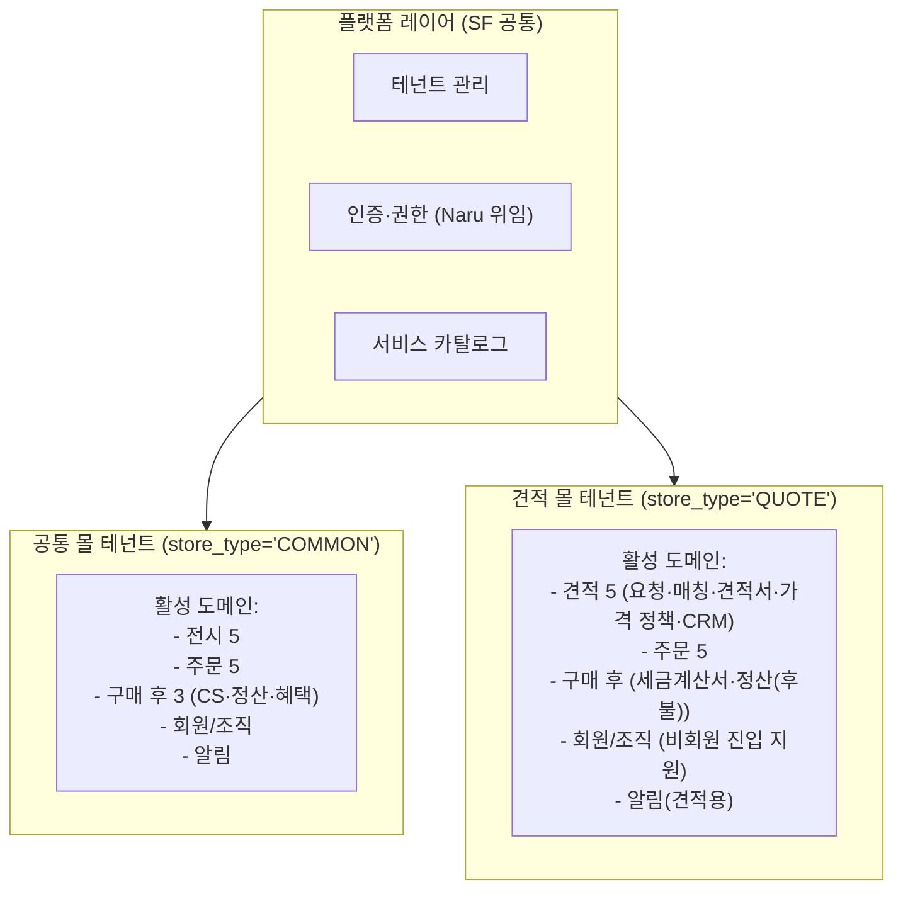

# 도메인 V1.1 반영 — 4/21 기획 스코프 확장 기록

> **작성일**: 2026-04-21, 김정민
> **입력**: 기획자 공유 `Scope.xlsx` — "도메인 V1.1" 시트
> **목적**: V1.1 시트에서 확장된 도메인 구조를 팀 설계 문서(`decisions.md`, `ddd-classification.md`, `scope-definition-0415.md`, `simulation.md`)에 반영하기 위한 마스터 레퍼런스
> **MVP 상태**: **미결**. 현재는 기획 + 이벤트 스토밍 양쪽에서 전체 그림을 그리는 단계. V1.1의 "MVP 제외" 표시는 **잠정** (확정 아님)
>
> **MVP 원칙 (2026-04-21 확정)**
> 1. **설계단 고려, 실 구현은 Phase 분리** — MVP는 모든 도메인·결정을 설계 레벨로 받치되(훅·인터페이스·스키마 컬럼 예약), 실 기능 구현은 요구 시점에. "MVP 제외" 도메인도 **스키마·인터페이스는 MVP에 포함**.
> 2. **대량 구매(견적 몰)가 먼저 라이브될 가능성** 열려 있음 — 현 단계는 공통 MVP 정의이나, 서비스상 견적 몰이 선행 상용화될 수도. 따라서:
>    - 공통 MVP 설계 = 기본 경로
>    - Quote Management BC = 공통 Core 6개와 **독립적** (단독 선행 가능)
>    - 테넌트 모델·결제 오케스트레이터·혜택·클레임은 **양쪽 몰 다 수용 가능**해야 함

---

## 1. V1.1 도메인 구조 전체 (19개 비즈니스 도메인 + 플랫폼 레이어)

V1.1은 **고객 분류 2개**(`공통`, `견적 고객`)로 도메인을 나눴다. 공통은 모든 고객에게 적용, 견적 고객은 별도 몰(다른 테넌트).

### 공통 (14개 도메인, 7영역)

| 영역 | 도메인 | V1.1 MVP 표시 | 4/17 대비 |
|------|--------|:-------------:|----------|
| 전시 | 카탈로그(상품) | ✅ | 알라딘 데이터 사용 명시 |
| 전시 | 가격 | ✅ | + 견적용 수량 구간 단가 포함 |
| 전시 | 재고 | ✅ | 알라딘 데이터 사용 |
| 전시 | 전시 | ✅ | + 룰 기반 자동 편성 (베스트셀러·신간) / 수동 편성 (기획전·배너) 구분 |
| 전시 | 검색 | ✅ | + "알리스" 엔진 명명 |
| 주문 | 장바구니 | ✅ | — |
| 주문 | 주문 | ✅ | — |
| 주문 | 결제 | ✅ | — |
| 주문 | 배송 | ✅ | + 복수 배송지(DeliveryGroup) 검토 필요 (MVP 제외, 공통 기능) |
| 주문 | 클레임 | ✅ | — |
| 구매 후 | **CS/고객응대** | ✅ | **신규 공식화** (기존 D-16 수용) |
| 구매 후 | 정산 | ✅ | 플랫폼 운영 정산으로 한정 (후불 별도 분리) |
| 구매 후 | 혜택 | ✅ | — |
| 구매 후 | **리뷰** | ❌ 잠정 제외 | **신규** (임직원 채널 확장 시) |
| 구매 후 | **모니터링** | ❌ 잠정 제외 | **신규** (임직원 채널 확장 시) |
| **회원** | **회원/조직** | ✅ | **신규**. Naru 위임 + SF 부가 메타데이터 (조직 유형·인증 상태·부서·담당자) |
| 회원 | **계약/제휴** | ❌ 잠정 제외 | 신규 (임직원 채널 확장 시) |
| **접근** | **채널/접근** | ❌ 잠정 제외 | 신규 (제휴사별 전용 URL·SSO, 임직원 채널 확장 시) |
| 알림 | 알림 | ✅ 부분 | 주문·배송·클레임 통합만 포함. 프로모션·공지는 현업 검토 |

### 견적 고객 전용 (7개 도메인, 3영역)

| 영역 | 도메인 | V1.1 MVP 표시 | 핵심 |
|------|--------|:-------------:|------|
| 견적 | **견적 요청** | ✅ | 비회원 요청 가능, 예산·납기·파일 업로드, 조직 유형 선택 필수, 요청 이력 계정 소급 연결 |
| 견적 | **매칭** | ✅ | 업로드 파일 기반 즉시 자동 매칭. 실패 항목 후보 추천·검색·메모·삭제 |
| 견적 | **견적서** | ✅ | 매칭 결과 기반 자동 생성, 담당자 검토 후 발송, 버전 관리 |
| 견적 | **가격 정책** | ✅ | 수량 구간별 단가 + **조직 유형별 할인율** (공공기관 5% / 학교 6% / 일반기업 3% / 기타 0%), 고객사별 예외 |
| 견적 | **영업 관리(CRM)** | ⚠️ 미결 | 담당자 배정·커뮤니케이션 이력. 견적 하위 vs 내부 운영 별도 미결 |
| 구매 후 | **세금계산서** | ❌ 잠정 제외 | MVP 초기 수동 대응 |
| 구매 후 | **정산(후불)** | ❌ 잠정 제외 | 후불 세금계산서 결제 시 채권 관리 |
| 알림 | **알림** | ✅ | 견적 프로세스 단계별 이메일 자동 발송 (접수확인·견적서·결제링크·배송현황) |

### 플랫폼 레이어 (V1.1 시트에 빠졌으나 유지 확정)

4/17 결정 그대로 유지:

| 도메인 | 소유·연동 |
|--------|----------|
| 테넌트 관리 | SF 소유 (몰 단위 테넌트) |
| 인증·권한 | **Naru 위임** (계정·파트너·사업자정보 마스터) + SF 라우팅·RBAC |
| 서비스 카탈로그 | SF 소유 (도서몰·견적몰 등 서비스 정의) |

---

## 2. Q1~Q7 답변 반영 (2026-04-21 확정)

| # | 질문 | 답변 | 반영 방향 |
|---|------|------|----------|
| **Q1** | 회원/조직 vs Naru | **Naru가 계정 + 파트너 + 사업자정보 마스터 관리** | SF "회원/조직"은 Naru 위임 + SF 부가 메타데이터 (조직 유형·부서·인증 상태·담당자) |
| **Q2** | 대량구매 vs 견적 고객 | **동일 개념** | D-08을 "견적 고객 플로우"로 재명명·대폭 확장 |
| **Q3** | 플랫폼 레이어 | **유지**. V1.1은 비즈니스 도메인 시트 | 4/17 플랫폼 레이어 3개 그대로 유지 |
| **Q4** | 알리스 | **AI검색의 공식 이름** | 전 문서에서 "AI검색" → "알리스(Alis)" 명명 통일. A-02도 동일 |
| **Q5** | 견적 CRM 소속 | **미결** | 이벤트 스토밍에서 결정 — D-XX로 별도 추적 |
| **Q6** | 복수 배송지 | **공통 기능. MVP 제외** | D-19 신규, Phase 2 후보로 표시 |
| **Q7** | 공통 vs 견적 고객 몰 | **다른 몰** (테넌트 분리) | 테넌트 모델에 `store_type` 축으로 반영. `공통 몰(임직원 채널)` vs `견적 몰(비회원·법인 견적)` |

---

## 3. 4/17 → V1.1 주요 구조 변화 요약

### 고객 분류 변경

```
4/17 설계              V1.1 구조
───────────────        ────────────────────
4개 타겟 고객:          2개 고객 분류:
- 대량구매 문의 고객     - 공통 (임직원·일반 구매자)
- B2B 제휴사 임직원      - 견적 고객 (공공기관·학교·일반기업·기타)
- 제휴사 운영팀
- 내부 설정 운영자       → 각각 "다른 몰"
```

### 도메인 수 변화

```
4/17 : 13 비즈니스 + 3 플랫폼 = 16개
V1.1 : 공통 14 + 견적 7 = 21 비즈니스 + 3 플랫폼 = 24개
```

신규 비즈니스 도메인 (8개):
- 공통: 회원/조직, 계약/제휴, 채널/접근, CS/고객응대(D-16 수용), 리뷰, 모니터링
- 견적 고객: 견적 요청, 매칭, 견적서, 가격 정책, 영업 관리(CRM), 세금계산서, 정산(후불), 알림(견적용)

### 외부 시스템 명명 업데이트

| 기존 | V1.1 확정 |
|------|----------|
| AI검색 | **알리스(Alis)** |
| 바자르 (공급시스템 컨셉) | 그대로. 현행 오픈마켓 어댑터 유지 |
| Naru | 역할 확장: **계정 + 파트너 + 사업자정보 마스터** |
| 뉴빌링 | 그대로 |

---

## 4. 테넌트 분리 구조 — "다른 몰" 원칙

Q7 답변 반영: **공통 몰**과 **견적 몰**은 별도 테넌트. 테넌트 모델에 `store_type` 축 추가.



### 테넌트별 활성 도메인 매트릭스

| 도메인 | 공통 몰 | 견적 몰 |
|--------|:-------:|:-------:|
| 전시 (카탈로그·가격·재고·전시·검색) | ✅ | ✅ |
| 주문 (장바구니·주문·결제·배송·클레임) | ✅ | ✅ |
| 구매 후 CS/고객응대 | ✅ | ✅ |
| 구매 후 정산 (플랫폼 운영) | ✅ | ✅ |
| 구매 후 혜택 | ✅ | ✅ |
| 구매 후 리뷰·모니터링 (MVP 제외) | ⚠️ | — |
| 회원/조직 | ✅ | ✅ (비회원 소급 연결 지원) |
| 계약/제휴·채널/접근 (MVP 제외) | ⚠️ | — |
| 알림 (주문·배송·클레임 공통) | ✅ | ✅ |
| **견적 5개** (요청·매칭·견적서·가격 정책·CRM) | ❌ | ✅ |
| **견적 구매 후** (세금계산서·정산(후불)) | ❌ | ✅ |
| **견적 알림** (프로세스 단계별 이메일) | ❌ | ✅ |

---

## 5. 후속 문서 업데이트 계획

| 문서 | 변경 |
|------|------|
| `decisions.md` | D-08 대량구매 → **견적 고객**으로 재작성·확장. **D-17 회원/조직 소유권**, **D-18 견적 가격 정책·할인율**, **D-19 복수 배송지** 신규. D-04(알리스 명명·전시 세부)·D-11(조직 유형 인증)·D-13(계약/제휴 MVP 제외)·D-16(CS 공식화) 확장. A-02 "알리스"로 명명 |
| `ddd-classification.md` | Core BC에 **Quote Management** 추가. Review·Monitoring·Contract·Channel/Access Supporting BC 추가 (MVP 잠정 제외 명시). 외부 시스템 명명 업데이트. 테넌트 분리 구조 (§신규) |
| `scope-definition-0415.md` | 상단 박스에 4/21 V1.1 반영 (19 도메인 + 플랫폼 유지, 견적 고객 몰 별도 테넌트) |
| `simulation.md` | 견적 고객 여정 신규 추가 (비회원 요청 → 매칭 → 견적서 → 결제 → 배송 → 후불 정산). 공통 여정은 기존 유지 |

---

## 6. 핵심 불확실성 (이벤트 스토밍 전 해소해야 할 것)

### ✅ 4/21 답변 반영 완료
- ~~Q1 회원/조직 vs Naru~~ → Naru 마스터, SF 부가 메타만
- ~~Q2 대량구매 vs 견적 고객~~ → 동일 개념
- ~~Q3 플랫폼 레이어~~ → 유지
- ~~Q4 알리스~~ → AI검색 공식 이름
- ~~Q6 복수 배송지~~ → 공통, MVP 제외, 설계 훅만 (D-19)
- ~~Q7 공통 vs 견적 몰~~ → 다른 몰 (테넌트 분리)
- ~~D-17 17-2~~ → 동시 이용 안 함 (몰 독립)
- ~~D-11 11-9~~ → **담당자 수기 검증** (API 자동화는 Phase 2+). A-05 성격 변경 (API 조사 → 수기 프로세스 정의)
- ~~D-13 13-13~~ → 단일 Contract BC로 통합, Phase 분리 (MVP Read / Phase 2 Write)
- ~~D-19 19-6~~ → 설계 훅만 MVP, 실 구현 Phase 2+

### 🟡 남은 미결
1. **견적 CRM 소속 (D-08 8-14)** — (A) 견적 하위 vs (B) 내부 운영 독립. 이벤트 스토밍에서 결정 예정
2. **회원/조직 SF 범위** — Naru 마스터 대비 SF 정확한 소유 필드 목록 (조직 유형·부서·담당자 외 무엇까지?)
3. **전시 룰 기반 vs 수동 편성** — 같은 BC 내 하위 모듈 vs 별도 BC
4. **리뷰·모니터링 Phase 2 일정** — "임직원 채널 확장 시"의 구체 트리거

---

## 7. 관련 문서·티켓

- 원본 시트: `Scope.xlsx` — "도메인 V1.1"
- 선행 회의록: 4/15 (DEV2-A-1050), 4/17 (DEV2-A-1064)
- 상위 티켓: DEV2-5283
- 본 문서 기반으로 업데이트되는 문서들: `decisions.md`, `ddd-classification.md`, `scope-definition-0415.md`, `simulation.md`

---

## 8. 이벤트 스토밍 중간점검 (2026-04-22)

> **입력**: `스토어 프론트_이벤트스토밍_260422.pdf` (1페이지, 벽 사진·전사)
> **상태**: 전체 구성 완성 전, 진행 중. 완성 후 정식 `/plan-eng-review` 예정
> **완성도 추정**: **60~65%** — 4개 여정 뼈대는 잡혔으나 애그리거트·정책·핫스팟·Shadow path 부족

### 8.1 범례 (벽 기준)

| 색상 | 의미 |
|------|------|
| 주황 | 도메인 이벤트 |
| 파랑 | 액션 |
| 큰 노랑 | 애그리거트 |
| 보라/핑크 | 정책 |
| 빨강 | **외부 시스템** |
| 초록 | 액터 |
| 회색 | **핫스팟** |

### 8.2 4개 여정 진행 상태

| 여정 | 이벤트 체인 | 완성도 |
|------|-----------|------|
| ① 운영자 (테넌트·정책·활성화) | 테넌트 생성 → 서비스 구독 → 정책 4종(가격·전시·혜택·결제) → 몰 활성화 | 🟢 70% |
| ② 일반 사용자 (공통 몰) | 인증·전시·검색·상세·장바구니·주문·결제(혜택)·배송·클레임 | 🟢 75% |
| ③ 몰 운영자 (관리) | 권한확인 → 정책 조회·수정 → 주문·정산 리포트 | 🟡 50% |
| ④ 견적 사용자 | 비회원 토큰 → 조직 유형 → 파일/예산 → 자동매칭 → 견적서 → 결제 | 🟡 55% |

### 8.3 잘 반영된 것 (기존 결정과의 정합성)

| 항목 | 근거 문서 | 벽 반영 |
|------|---------|-------|
| Naru 경유 멀티테넌트 | 4/15 | ✅ |
| 정책 4종 (가격·전시·혜택·결제) | 4/15 SF 필수 설정 | ✅ |
| SF = 결제 오케스트레이터 (혜택 → PG) | D-02 | ✅ 시퀀스 명확 |
| 외부 파트너 포인트 별도 처리 | D-02 2-3 | ✅ "외부 혜택 처리 요청" |
| 부분 취소 환원 순서 (혜택 → PG) | D-02 2-5, D-03 3-2 | ✅ 시퀀스 명확 |
| 알리스 명명 | V1.1 | ✅ |
| 견적 비회원 + 소급 | V1.1, D-08 8-1, 8-3 | ✅ |
| 조직 유형 선택 | V1.1, D-18 | ✅ 견적 여정 |
| 외부 시스템 4개 표기 (빨강) | — | ✅ 나루·알리스·바자르·뉴빌링·파트너 모두 표시 |

### 8.4 🔴 우선 보강 필요 (다음 세션)

| # | 누락 항목 | 근거 |
|---|---------|------|
| 1 | **애그리거트 경계(BC 후보)** | 이벤트 스토밍 Phase 3 핵심 산출물. 큰 노란 박스는 있으나 BC 묶음 불명확 |
| 2 | **정책(핑크) 스티커 부족** | 이벤트 간 규칙 (D-01·D-02·D-03) 시각화 약함. 현재 주문 구간에 2개만 확인 |
| 3 | **핫스팟(회색) 거의 없음** | decisions.md D-01~D-19 16개 미결이 있는데 벽에 반영 미흡. **이벤트 스토밍의 핵심 가치 상실 우려** |
| 4 | **회원/조직 공통 여정 부재** | V1.1 공통 도메인. 회원가입·조직 수기 인증 (UNVERIFIED→VERIFIED) 없음 |
| 5 | **CS/고객응대 여정 부재** | D-16, V1.1 공식 도메인 |
| 6 | **알림 이벤트 부재** | "주문확인알림발송됨" 같은 이벤트 없음 |
| 7 | **정산 집계 이벤트 부재** | 조회만 있고 집계 트리거 없음 |
| 8 | **Shadow path 부재** | 결제 실패·보상 Tx(D-02 2-1)·외부 장애(D-15) — 이벤트 스토밍 수준의 기본 |
| 9 | **공급시스템 ACL 추상** | 바자르 컨셉·오픈마켓 현행 사실이 "주문 전송 요청" 수준의 추상으로만 |
| 10 | **Mall Operations (몰 담당자 조정)** | 공통 몰 할인·조정 담당자 업무 이벤트 없음 |

### 8.5 🟡 명확화 필요

- **여정 ④ 견적 → 공통 주문 연결** — D-17 "다른 몰" 결정인데 벽에서 결제 이후 연결이 모호
- **"혜택 적립?됨" 물음표** — 적립 정책 결정 필요
- **"견적 담당자" vs "몰 담당자"** 구분 — 같은 내부 인원인지 다른 역할인지

### 8.6 벽 품질 관찰

| 항목 | 상태 |
|------|-----|
| 이벤트 명명 일관성 (~됨 과거형) | ✅ |
| 외부 시스템(빨강) 표기 | ✅ 풍부 |
| 정책(핑크) 표기 | 🔴 부족 (주문 구간에만 2개) |
| 애그리거트 묶음 | 🟡 영역은 있으나 BC 경계 전 단계 |
| 핫스팟(회색) 표기 | 🔴 거의 없음 |
| 액터 구분 | 🟡 견적 담당자 vs 몰 담당자 불명 |

### 8.7 다음 세션 우선순위 (5개)

1. 🔴 **애그리거트 묶음 + BC 경계 그리기** (Phase 3 핵심)
2. 🔴 **정책(핑크) 보강** — 주문·결제·클레임 구간에 10~15개
3. 🔴 **핫스팟(회색) 보강** — D-01~D-19 미결 중 최소 10개를 벽에 시각화
4. 🟡 **누락 여정 5개 보강** — 회원/조직·CS·알림·정산 집계·Mall Operations
5. 🟡 **Shadow path** — 결제 실패·보상 Tx·외부 장애 최소 5개

### 8.8 중간점검의 가장 큰 리스크 1개

**정책(핑크) + 핫스팟(회색) 모두 부족**. 이벤트만 시간 순서로 연결된 상태. 이건:
- "왜 이 이벤트 다음에 저 이벤트가 일어나야 하는지" 규칙이 드러나지 않음
- "어디가 미결인지"가 벽에서 가시화되지 않아 팀 내 의사결정 레버리지가 약함

다음 워크숍 Phase 2·4(커맨드-정책 / 핫스팟 처리)를 **다시 돌려서** 보강 권장.

### 8.9 완성 후 액션

전체 구성 완성 시:
- 정식 `/plan-eng-review` (PDF + ddd-classification.md + decisions.md 조합)
- `simulation.md` 여정 4개 갱신 (예측 vs 실제 diff)
- BC Map 확정 → DEV2-5298 업데이트
