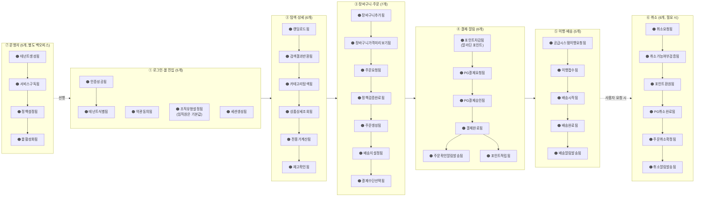

# B2B 스토어프론트 MVP 정의 — 2026-04-22

> **상태**: 4/22 기획자 협의 반영 → **최종 확정본 [DEV2-A-1087](https://aladincommunication.youtrack.cloud/articles/DEV2-A-1087)** 기준 업데이트
> **작성**: 김정민
> **기준**: V1.1 도메인 21개 + 플랫폼 3개를 **첫 고객 = 테넌트 고객(제휴사 or 대량구매)** 기준으로 MVP 축소
> **원칙**: "설계단 고려, 실 구현 Phase 분리" — MVP 제외 도메인도 스키마·인터페이스 훅은 유지
> **결정 선행**: Walking Skeleton 먼저 정의 → 도메인 MoSCoW 분류 → BC 매핑 → Phase 로드맵

---

## 🆕 4/22 최종 확정 변경 사항 (DEV2-A-1087)

협의 전 초안 대비 확정본의 핵심 변경:

| 항목 | 초안 (협의 전) | 최종 확정 (4/22) |
|---|---|---|
| **첫 고객** | 제휴사 임직원 한정 | **테넌트 고객 (제휴사 or 대량구매)** — 18주차 확정 |
| **혜택** | 알라딘 포인트 연동만 | **제휴사 전용 포인트(단건)만** — 알라딘 포인트 **미적용** |
| **모니터링** | MVP 제외 (Phase 3) | **MVP 포함** — 주문현황·주문량 뷰(제휴몰 관리자) |
| **로그인** | Naru OIDC만 | 나루 로그인 + **제휴사 연동 프로토콜 고려** |
| **카탈로그 원천** | "공급시스템(오픈마켓)" | **바자르** 명시 |
| **배송** | 단일 배송지 | 단일 배송지 + **멀티배송지 구조만 준비** |
| **주문** | 정책 검증 | 정책 검증 + **바자르 배송 그룹 정책상 주문 분리 고려** |
| **MVP 범위 확장** | (기능 중심) | **각 담당자 설정·조회 부분까지 개발 포함** |

> 이하 §1~§12 는 협의 전 초안. 위 변경 사항을 먼저 읽고 상충 시 변경 사항이 우선.

---

## 목차

1. [첫 고객 확정](#1-첫-고객-확정)
2. [Walking Skeleton — 최소 완주 경로](#2-walking-skeleton--최소-완주-경로)
3. [도메인 MoSCoW 분류](#3-도메인-moscow-분류)
4. [Bounded Context 매핑 (15 → 10)](#4-bounded-context-매핑-15--10)
5. [Partnership 단순화 (3쌍 → 1쌍)](#5-partnership-단순화-3쌍--1쌍)
6. [규모 비교 (Before / After)](#6-규모-비교-before--after)
7. [Walking Skeleton 이벤트 (~40개)](#7-walking-skeleton-이벤트-40개)
8. [Phase 로드맵](#8-phase-로드맵)
9. [기획자 협의 체크리스트 (30분)](#9-기획자-협의-체크리스트-30분)
10. [관련 결정 사항](#10-관련-결정-사항)
11. [문서 업데이트 규칙](#11-문서-업데이트-규칙)

---

## 1. 첫 고객 확정

**일반 몰 사용자 (B2B 임직원 구매자)** — 예: 삼성전자 DS·LG생활건강 같은 **한 제휴사의 임직원**이 몰에 접속해 도서를 직접 구매.

### 성공 정의

> *"임직원이 도서 1권을 주문해서 받고, 필요하면 취소할 수 있다."*

### 1차 타깃 아닌 것 (Phase 2+)

| 제외 대상 | Phase |
|----------|------|
| 대량 구매 문의 고객 = 견적 고객 (공공기관·학교·일반기업·기타) | **Phase 2b** (2027 Q1) |
| 제휴사 운영팀 (매출 통계·세금 관리) | Phase 3 |
| 내부 설정 운영자 (SF 운영 담당) | MVP 포함이나 UI 간소 |

### 근거

4/15 회의 확정 4개 타깃 고객 중 "B2B 제휴사 임직원 실구매자"가 **가장 단순·검증 가능·빠른 라이브 경로**. 견적 고객은 비회원 플로우·조직 인증·매칭·후불 정산까지 요구해 스코프 2배 이상.

---

## 2. Walking Skeleton — 최소 완주 경로

```
① 로그인(Naru)  →  ② 탐색·검색  →  ③ 상품 상세  →  ④ 장바구니  →
⑤ 주문  →  ⑥ 결제(PG)  →  ⑦ 배송 추적  →  ⑧ 취소(필요 시)
```

이 8단계에 **있는 것 = Must**, 이 경로를 **지원하기 위해 필수인 것 = Should**, 나머지 = Could/Won't.

---

## 3. 도메인 MoSCoW 분류

### ✅ Must (8개) — Walking Skeleton 경로 직접

| # | 도메인 | 영역 | MVP 범위 (축소된 형태) |
|---|--------|-----|--------------------|
| 1 | 인증·권한 | 플랫폼 | Naru OIDC만. 2-tier 정책은 운영자 상한 수준 |
| 2 | 테넌트 관리 | 플랫폼 | 1개 테넌트 기본. Schema per Tenant 구조 유지 |
| 3 | 카탈로그 | 전시 | 공급시스템(오픈마켓) 중계. SF 오버레이는 가격만 |
| 4 | 가격 | 전시 | 정가 + 테넌트 고정 할인율. 수량 구간 단가는 Phase 2 |
| 5 | 재고 | 전시 | 공급시스템 실시간 조회. 캐시 없이 시작 |
| 6 | 주문 | 주문 | 독립 주문 엔티티. 정책 검증 포함 |
| 7 | 결제 | 주문 | 뉴빌링 PG 단건결제만. 복합 결제·정기결제 Phase 2 |
| 8 | 배송 | 주문 | 공급시스템 이행 + 상태 추적 (단일 배송지) |

### 🟡 Should (5개) — 없으면 사용자가 항의

| # | 도메인 | 영역 | MVP 범위 |
|---|--------|-----|--------|
| 9 | 장바구니 | 주문 | 단순 세션 기반 |
| 10 | 클레임 | 주문 | **취소만**. 반품·교환은 Phase 2 |
| 11 | 검색 | 전시 | 알리스 단순 검색. 테넌트 필터 미지원 시 카테고리 필터 폴백 |
| 12 | 전시 | 전시 | 기본 랜딩 + 카테고리. 룰 기반 베스트셀러 단순 |
| 13 | 알림 | 알림 | 기존 알라딘 알림 시스템 연동 (주문확인·배송) |

### 🔵 Could (4개) — Phase 1 후반 또는 Phase 2 초반

| # | 도메인 | 축소 메모 |
|---|--------|---------|
| 14 | 혜택 | 알라딘 포인트 연동만. 제휴 포인트 원장·쿠폰 Phase 2 |
| 15 | 회원/조직 | Naru 회원가입 위임 + SF는 조직 유형 필드 예약. 수기 인증 Phase 2 |
| 16 | 정산 | MVP는 **수동 CSV export**. 자동 집계·상태 머신 Phase 2 |
| 17 | CS/고객응대 | MVP는 **이메일·전화 수동 대응**. SF 내장 CS 도구 Phase 2 |

### ⛔ Won't (현재) — 설계 훅만, 실구현 없음

| # | 영역 | 도메인 |
|---|------|--------|
| 18~24 | 견적 몰 | 견적 요청·매칭·견적서·견적 가격 정책·CRM·세금계산서·후불 정산 (7개) |
| 25~26 | 공통 구매 후 | 리뷰, 모니터링 |
| 27 | 회원 | 계약/제휴 |
| 28 | 접근 | 채널/접근 |

**MVP 제외는 "제거"가 아님**: 스키마 컬럼·인터페이스·도메인 경계는 설계 단계에서 유지. 실 구현만 Phase 2+.

---

## 4. Bounded Context 매핑 (15 → 10)

### Core BC — 4개 (기존 6 → 4)

| BC | 축소 근거 |
|----|---------|
| **Tenant Management** | 1개 테넌트 기본. 구조는 유지 |
| **Service Catalog** | `service_type='book'` 하드코딩. 3차원 정책 키 컬럼만 예약 |
| **Payment Orchestration** | 뉴빌링 PG만. Benefit(알라딘 포인트 연동)과 Claim(취소)은 **이 BC 또는 Order BC에 흡수** |
| ~~Policy~~ | **D-01 B안(각 영역 내재) 강력 권장** — 독립 Policy BC 없음. Phase 2에 재평가 |
| ~~Benefit Ledger~~ | MVP는 알라딘 포인트 연동만 → **Payment 또는 Order 어댑터**로 포함. 자체 원장 Phase 2 |
| ~~Claim Orchestration~~ | MVP는 취소만 → **Order BC 내부 상태 전이**로 흡수 |

### Supporting BC — 6개 (기존 9+ → 6)

| BC | 비고 |
|----|------|
| Order | Cart·Claim(취소만) 흡수 |
| Catalog Overlay | 공급시스템 중계 중심 |
| Display | 간소 랜딩·카테고리 |
| Delivery | 이행 상태 추적 |
| Notification | 알라딘 기존 시스템 연동 어댑터 |
| Member/Organization | Naru 위임 + 조직 유형 필드 |

### External — 5~6개

| 외부 | 역할 |
|------|------|
| Naru | IdP, 계정·파트너·사업자정보 마스터 |
| 공급시스템 (현행 오픈마켓) | 상품·재고·주문 이행 |
| 뉴빌링 | PG 단건결제 |
| 알리스 | 검색 엔진 |
| 알라딘 포인트 시스템 | 혜택 연동 (내부 외부) |
| 알라딘 알림 시스템 | 주문·배송 알림 |

### MVP 제외 BC (설계 훅만)

Quote Management, Review, Monitoring, Contract/Partnership, Channel/Access, Settlement(후불), Mall Operations, Audit.

**합계**: **Core 4 + Supporting 6 = 10 BC** + 외부 5~6.

---

## 5. Partnership 단순화 (3쌍 → 1쌍)

```
기존 V1.1:   Order ↔ Payment ↔ Benefit ↔ Claim   (3 Partnership 쌍)
                  ↓↓↓
MVP:         Order ↔ Payment                      (1 Partnership 쌍)

  ├─ Benefit  = Payment 내부 어댑터 (알라딘 포인트 연동만)
  └─ Claim    = Order 내부 상태 (취소만, 상태 머신)
```

### 효과

- **보상 트랜잭션 복잡도 대폭 감소** — Partnership 4 BC → 2 BC
- **구현 리스크 감소** — Saga 패턴 도입 지연 가능, 단일 DB 로컬 트랜잭션으로 충분
- **팀 분배 단순화** — Order·Payment 한 팀 소유 자연스러움

### Phase 2에 복구될 것

- 제휴 포인트 원장 (자체 Benefit Ledger BC 승격)
- 반품·교환 (Claim Orchestration BC 승격)
- 복합 결제·정기결제 (Payment 확장)

---

## 6. 규모 비교 (Before / After)

| 항목 | V1.1 전체 | MVP | 감소율 |
|------|---------|-----|-------|
| 비즈니스 도메인 | 21 + 플랫폼 3 = 24 | 13 (Must + Should) + 훅 | **46% ↓** |
| Bounded Context | 15 | 10 | 33% ↓ |
| Partnership 쌍 | 3쌍 | 1쌍 | **67% ↓** |
| 이벤트 수 (추정) | ~150 | ~40 | **73% ↓** |
| 외부 시스템 | 4 | 5~6 (+알라딘 내부 2) | 소폭 증가 |
| 예상 팀 소요 기간 | 12~18개월 | **3~4개월** | 75% ↓ |

**→ MVP는 전체의 약 1/3 규모**. 2026 Q3 라이브 현실적.

---

## 7. Walking Skeleton 이벤트 (~40개)



**합계**: 사용자 여정 ~35개 + 운영자 여정 ~5개 = **~40개 이벤트**. 현재 PDF의 절반 수준.

---

## 8. Phase 로드맵

| Phase | 시점 | 범위 | 주요 추가 |
|------|-----|------|---------|
| **Phase 1 (MVP)** | 2026 Q3 | 위 Must 8 + Should 5. 공통 몰·1테넌트·도서몰·임직원·취소 | 일반 몰 사용자 첫 라이브 |
| **Phase 2a** | 2026 Q4 | Could 4개 실 구현 + 반품·교환·복합 결제·제휴 포인트 원장 | 첫 고객 피드백 반영 |
| **Phase 2b** | 2027 Q1 | 견적 몰 Walking Skeleton (견적 요청·매칭·견적서·결제까지) | 2번째 고객 유형 |
| **Phase 3** | 2027 Q2+ | 세금계산서·후불 정산·리뷰·모니터링·Mall Ops·감사 로그 | 운영 성숙 |
| **Phase 4+** | 필요 시 | 채널/접근·SDUI·복수 배송지·다중 공급원 | 확장 |

---

## 9. 기획자 협의 체크리스트 (30분)

- [ ] **첫 고객 = 일반 몰 임직원** 합의 (5분)
- [ ] **Must 8개** 범위 축소안 확인 (8분)
- [ ] **Should 5개** 중 Must 승격·유지·제외 판단 (8분)
- [ ] **Could 4개** 중 Should 승격 있는가 — 특히 혜택·회원/조직 (5분)
- [ ] **Won't 10개** 기획 측 반대 없는지 확인 (2분)
- [ ] **최소 기능 리스트 확정 → 기획 문서에 공식화 (2분)**

### 협의 포인트

**기획자가 "이것도 필요해요" 하면 → 시간 차원으로 되묻기**

- ❌ "이거 빼도 돼요?" (저항 유발)
- ✅ **"6개월 안에 필요해요, 1년 안에 필요해요, 2년 안에 필요해요?"**

6개월 = Must·Should / 1년 = Could / 2년 = Won't.

**현재까지 그린 모든 도메인은 "다 지키되, 언제 할지만 결정"** 프레임.

---

## 10. 관련 결정 사항

### 사전 결정 (협의 전)

| D-XX | 내용 | MVP 방향 | 이유 |
|------|------|--------|------|
| **D-01** 정책 엔진 위치 | 독립 BC vs 각 영역 내재 | **B안 (각 영역 내재) 권장** | Core BC 1개 감소, 정책 4종만이면 단순 폼으로 충분 |
| **D-02** 혜택-결제 경계 | SF 오케스트레이터 확정 | Payment BC 내부 어댑터로 알라딘 포인트 연동만 | MVP 축소 |
| **D-03 3-3** 반품·교환 MVP | 취소만 vs 전부 | **취소만** | V1.1 원칙 유지 |
| **D-07** 주문 플로우 | 독립 주문 vs 공급 래핑 | **독립 주문 엔티티** | KJM 잠정안 유지 |
| **D-10** 서비스 카탈로그 | MVP 하드코딩 | **`service_type='book'` 하드코딩** | 2번째 서비스 확정 시 확장 |
| **D-11 11-9** 조직 인증 | API vs 수기 | **수기** (4/21) | MVP는 임직원이라 인증 자체 간소 |
| **D-13** 계약 관리 | 통합 BC | Contract BC MVP는 Read 중심 | 4/21 결정 |
| **D-17** 몰 분리 | 다른 테넌트 | 공통 몰만 MVP, 견적 몰 Phase 2b | 4/21 결정 |
| **D-19** 복수 배송지 | 설계 훅만 | 단일 배송지 MVP | 4/21 결정 |
| **D-20** 카테고리 vs 서비스 | 하이브리드 | category = 상품 속성 / service = 테넌트 구독. `service_type='book_mall'` 고정, 카테고리 섞어 담기 허용, 카테고리별 정책 | **4/22 확정** |

### 협의 후 확정할 것

- D-08 8-14 영업 CRM 소속 — MVP 제외 확정이면 미결로 남겨도 OK
- Mall Operations BC 확정 여부 — MVP는 Could 수준이면 간소한 담당자 도구만
- 혜택 범위 (알라딘 포인트 연동만 확정?)
- 회원/조직 MVP 포함 여부 — 임직원은 Naru 로그인 자체로 충분하면 Could 유지

---

## 11. 문서 업데이트 규칙

### 기획자 협의 종료 직후 (오늘 2~3시간 내)

- [ ] Must/Should/Could/Won't 확정 결과 반영
- [ ] 관련 D-XX 결정 업데이트 → [`../domain/b2b-store-domain-decisions.md`](./b2b-store-domain-decisions.md)
- [ ] MVP 경계 변경 시 [`../architecture/b2b-store-ddd-classification.md`](../architecture/b2b-store-ddd-classification.md) §2-bis 몰 분리 구조 업데이트
- [ ] [`../event-storming/b2b-store-event-storming-simulation.md`](../event-storming/b2b-store-event-storming-simulation.md)에 MVP 포커스 주석 추가

### 다음 이벤트 스토밍 세션 후

- [ ] Walking Skeleton 이벤트 ~40개 벽에 확정 반영
- [ ] 본 문서의 추정치(이벤트 수·BC 수)와 실제 산출물 diff 기록
- [ ] Phase 1 구현 티켓 분해 → DEV2-5283 하위 세부 티켓

---

## 12. 상품 카테고리 전략 (4/22 확정 — D-20)

### 두 축 분리

```
┌────────────────────────┐       ┌────────────────────────┐
│ category (상품 속성)    │       │ service_type (테넌트 구독) │
│────────────────────────│       │────────────────────────│
│ • 도서                  │       │ • book_mall (MVP ✅)   │
│ • 중고 도서              │◄──┐  │ • music_mall (Phase 2) │
│ • 도서 굿즈              │    │  │ • gwangwondang (P2)    │
│ • eBook                 │    │  │ • lms (P3+)            │
│ • 음반 (P2)              │    │  └────────────────────────┘
│ • DVD (P2)               │    │           │
└────────────────────────┘    │           │ 포함
          ▲                    └───────────┘
          │ 상품 원천: 공급시스템(오픈마켓)    
          │                    ▲
          │                    │ 테넌트 구독
   Product.category             │
                         TenantSubscription
                         .service_types [book_mall, ...]
```

### MVP 범위

| 항목 | MVP (Phase 1) |
|------|-------------|
| `service_type` | `'book_mall'` **하드코딩**. 다중 구독 스키마만 예약 |
| `category` | 도서 · 중고 도서 · 도서 굿즈 (필요 시 eBook) |
| 장바구니 | **카테고리 섞어 담기 지원** — 임직원이 도서+굿즈 함께 주문 가능 |
| 카테고리별 정책 | 반품·배송·청약철회 (아래 표) |

### 카테고리별 정책 (MVP 기본값)

| 카테고리 | 반품 | 청약철회 | 배송 | 비고 |
|---------|------|--------|------|------|
| 도서 | 가능 | 14일 | 택배 | 전자상거래법 기본 |
| 중고 도서 | 7일 내 단순 변심 | 7일 | 택배 | 공급시스템(오픈마켓) 정책 확인 필요 |
| 도서 굿즈 | **반품 불가** | 전자상거래법 예외 검토 | 택배 | 단순 변심 불가 명시 |

### 서비스 레벨 정책 (MVP 기본값)

| 항목 | 값 |
|------|---|
| 할인율 | 테넌트별 고정 (계약) |
| 결제수단 | 뉴빌링 PG 단건 + 알라딘 포인트 |
| 청약철회 | 카테고리별 (위 참조) |
| 분야 제한 | 테넌트 정책 × 카테고리 혼합 (예: IT 도서만) |

### 구현 포인트

1. **Product.category** 컬럼 — 공급시스템 원천 enum 그대로 수용
2. **TenantSubscription.service_types** — 배열 컬럼(다중 구독 지원), MVP는 `['book_mall']` 고정
3. **Policy 차원 확장** — `(tenant_id, service_type, policy_type, category?)` 4차원. MVP는 카테고리 축만 추가, 서비스는 고정
4. **장바구니·주문** — 카테고리 섞어 담기 허용. 배송·클레임 분기는 주문 항목(OrderItem)별 `category`로

### Phase 2+ 확장 지점

- 음반몰·만권당 추가 시 `service_type` 해제 + 새 정책 매트릭스
- 만권당 정기결제 패턴 = 결제 BC 확장 필요
- 카테고리별 SDUI (굿즈 UI와 도서 UI 다르게) — Phase 3

---

## 관련 문서

- 도메인 마스터: [b2b-store-domain-decisions.md](./b2b-store-domain-decisions.md) — D-01~D-20 + A-01~A-05
- V1.1 반영 기록: [b2b-store-domain-v11-reflection.md](./b2b-store-domain-v11-reflection.md)
- DDD·BC·MSA: [../architecture/b2b-store-ddd-classification.md](../architecture/b2b-store-ddd-classification.md)
- 이벤트 스토밍 시뮬레이션: [../event-storming/b2b-store-event-storming-simulation.md](../event-storming/b2b-store-event-storming-simulation.md)
- 스코프: [../scope/b2b-store-scope-definition-0415.md](../scope/b2b-store-scope-definition-0415.md)
- 상위 티켓: DEV2-5283
