# 스토어프론트 이벤트 스토밍 가이드

> **실행일: 2026-04-20 (월) 이후 별도 일정** (기획 워크숍 산출물 확보 후)
> 목적: 유저 여정 기반으로 도메인 이벤트를 도출하고, 팀 전체가 시스템에 대한 공통 이해를 맞추는 워크숍
> 대상 (7명): 김규태(팀장), 조윤주(기획), 강인용, 김정민(아키텍처), 조은흠(FE), 안혜련(B2B BE), 이현민(B2B BE)
> 소요: 2~3시간 (여정별 45분 + 통합 30분)
> 선행: [b2b-store-scope-definition-0415.md](../scope/b2b-store-scope-definition-0415.md) · [b2b-store-meeting-prep-0417.md](../meetings/b2b-store-meeting-prep-0417.md)

---

## 1. 왜 이벤트 스토밍인가

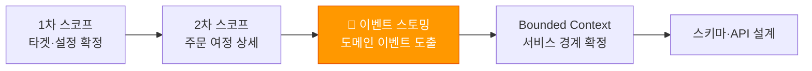

- 유저 여정은 **사용자 관점** → 이벤트 스토밍은 **시스템 관점**으로 전환
- 기획·BE·FE가 같은 타임라인 위에서 "무슨 일이 일어나는가"를 합의
- 도메인 경계(Bounded Context)가 이벤트 흐름에서 자연스럽게 드러남
- 기술 구현 세부 없이 **비즈니스 흐름만** 다루므로 전원 참여 가능

---

## 2. 사전 필독 문서

| 문서 | 핵심 내용 | 읽는 이유 |
|------|----------|----------|
| **[b2b-store-event-storming-planning.md](./b2b-store-event-storming-planning.md) 결과물** | 🟠 이벤트 타임라인, 🔵 커맨드, 🔥 핫스팟 분류 (지금 결정/확인 후/나중에) | **이 워크숍의 출발점** — 빈 벽이 아니라 기획 결과를 보강·재구성 |
| [multi-storefront-platform-direction.md](../scope/multi-storefront-platform-direction.md) | 플랫폼 정의, Supply/Demand 분리, 핵심 결정 | 전체 아키텍처 방향 이해 |
| [b2b-store-scope-definition-0415.md](../scope/b2b-store-scope-definition-0415.md) | 유저 여정 3개, 비즈니스 영역 13개 + 플랫폼 레이어, MVP In/Out | 이벤트 도출의 입력 |
| [b2b-store-meeting-minutes-0415.md](../meetings/b2b-store-meeting-minutes-0415.md) | 타겟 고객 4개, SF 필수 설정 5개, 계정 연동 | 확정된 제약 조건 |
| [b2b-store-meeting-prep-0417.md](../meetings/b2b-store-meeting-prep-0417.md) | 주문 여정 9단계, 결제 오케스트레이터, 서비스 카탈로그 | 최신 아키텍처 방향 |
| [b2b-store-tenant-model.md](../architecture/b2b-store-tenant-model.md) | Schema per Tenant, 멀티테넌시 전략 | 테넌트 격리 이해 |
| [b2b-store-naru-oidc-integration.md](../architecture/b2b-store-naru-oidc-integration.md) | Naru OIDC 인증 설계 | 인증 여정 이해 |

> **인계 관계**: 기획 워크숍은 *"무슨 일이 일어나는가"* + *"어디가 미정인가"*까지를 합의한다. 이 워크숍은 그 결과를 **출발점**으로 *"누가 담당하는가(애그리거트·BC)"*와 *"미정이었던 핫스팟의 기술적 답"*을 결정한다. 같은 작업을 두 번 하지 않는다.

---

## 3. 이벤트 스토밍 기본 요소

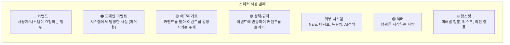

### 스티커 규칙

| 색상 | 요소 | 작성법 | 예시 |
|------|------|--------|------|
| 🟠 주황 | 도메인 이벤트 | **과거형** — "~됨", "~완료됨" | `주문생성됨`, `혜택차감됨` |
| 🔵 파랑 | 커맨드 | **명령형** — "~하다", "~요청" | `주문생성`, `결제승인요청` |
| 🟡 노랑 | 애그리거트 | **명사** — 상태를 가진 엔티티 | `주문`, `테넌트`, `결제` |
| 🟣 보라 | 정책 | **조건 → 행동** | `혜택차감됨 → PG결제요청` |
| 🔴 빨강 | 외부 시스템 | **시스템명** | `Naru`, `바자르`, `뉴빌링` |
| 🟢 초록 | 액터 | **역할** | `실구매자`, `운영자`, `제휴사관리자` |
| 🔥 분홍 | 핫스팟 | **질문/리스크** | `바자르 주문 API 확인 필요` |

---

## 4. 진행 방법

### Phase 1: 기획 산출물 이관 + 보강 (15분)

> **빈 벽에서 시작하지 않는다.** 기획 워크숍에서 합의된 🟠 이벤트 타임라인을 벽에 그대로 옮긴 뒤, 기술 관점에서 **빠진 이벤트만** 보강한다.

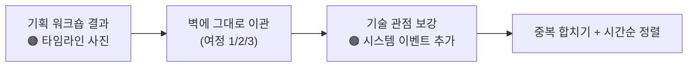

- 기획 워크숍의 **벽 사진 / 디지털화 자료**를 띄우고 동일한 타임라인을 재구성
- 기획에서 빠진 **시스템 내부 이벤트**만 추가 (예: `스키마생성됨`, `재고확인됨`, `정책검증완료됨`, `토큰발급됨`)
- 사용자 가시 이벤트는 **재논의하지 않는다** — 기획 합의 존중
- 추가 기준: *"기술적으로 일어나는데 기획 관점에서는 안 보이는 일"*만

### Phase 2: 커맨드·액터·정책 배치 (30분)

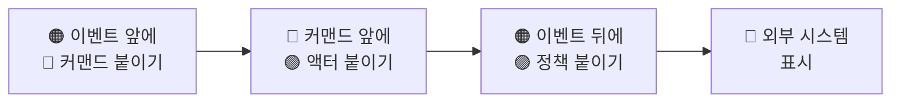

- 각 이벤트 왼쪽에 "그 이벤트를 일으킨 커맨드"를 붙임
- 커맨드 왼쪽에 "누가 요청했는가" 액터를 붙임
- 이벤트 오른쪽에 "이 이벤트가 다른 커맨드를 유발하는가" 정책을 붙임
- 외부 시스템(Naru, 바자르, 뉴빌링)은 🔴 표시

### Phase 3: 애그리거트 도출 + 경계 그리기 (30분)

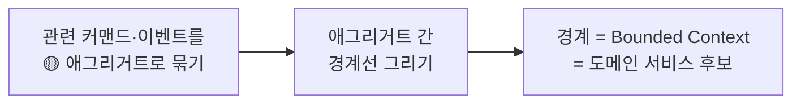

- 같은 데이터를 다루는 커맨드·이벤트를 🟡 애그리거트로 묶음
- 애그리거트 사이에 **경계선** → 이것이 Bounded Context 후보
- 경계선 사이를 넘는 이벤트 = **도메인 간 통신** (비동기 이벤트 or API 호출)

### Phase 4: 핫스팟 해결 + 정리 (15분)

> 기획 워크숍에서 **"확인 후 결정"으로 분류된 핫스팟**과, 이 워크숍에서 새로 드러난 기술 핫스팟을 함께 처리한다.

- 기획 핫스팟 H1~H9 중 미해결 항목 → 기술적 답 도출
- 본 가이드 §6 **"경계가 애매한 지점"** 5개 → 결정 또는 후속 티켓
- 새로 발견된 🔥 (BC 간 통신 방식, 보상 트랜잭션 등) → 사진 + 디지털화 + DEV2-5298 입력

---

## 5. 유저 여정별 이벤트 초안

> 이벤트 스토밍 워크숍 **전에** 퍼실리테이터(KJM)가 미리 뼈대를 잡아두고, 워크숍에서 전원이 보강·수정한다.

### 여정 1: 운영자 — "신규 제휴사 몰 생성"

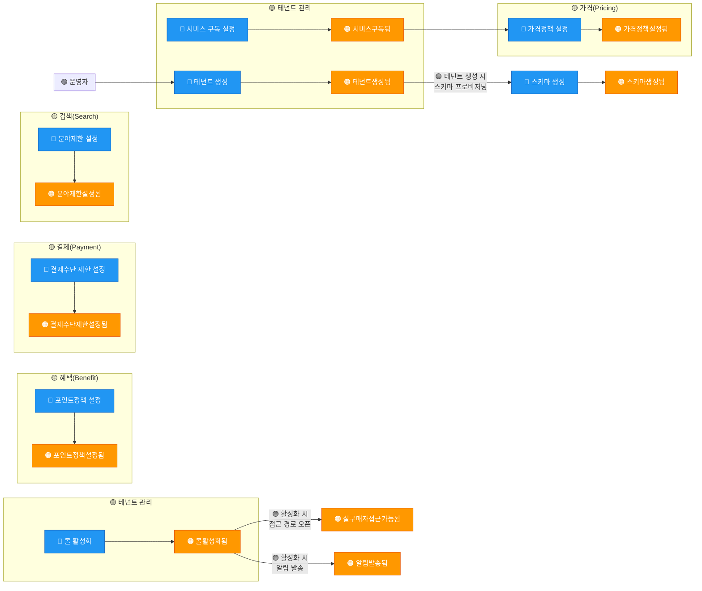

**주요 이벤트 목록:**

| # | 이벤트 (🟠) | 트리거 커맨드 (🔵) | 애그리거트 (🟡) | 비고 |
|---|-----------|-----------------|---------------|------|
| 1 | 테넌트생성됨 | 테넌트 생성 | 테넌트 관리 | Schema per Tenant → 스키마 프로비저닝 정책 연쇄 |
| 2 | 서비스구독됨 | 서비스 구독 설정 | 테넌트 관리 | 도서몰/음반몰/만권당 중 선택 |
| 3 | 가격정책설정됨 | 가격정책 설정 | 가격(Pricing) | (tenant, service, policy_type) 키 |
| 4 | 결제수단제한설정됨 | 결제수단 제한 설정 | 결제(Payment) | 서비스별 분기 |
| 5 | 분야제한설정됨 | 분야제한 설정 | 검색(Search) | 검색엔진 필터 파라미터 연동 |
| 6 | 포인트정책설정됨 | 포인트정책 설정 | 혜택(Benefit) | 제휴 포인트·쿠폰 종류·한도 |
| 7 | 몰활성화됨 | 몰 활성화 | 테넌트 관리 | → 실구매자 접근 가능 |
| 8 | 알림발송됨 | (몰 활성화 후) | 알림(Notification) | 관련 담당자에게 활성화 알림 |
| 🔥 | 스키마생성됨 | 스키마 생성 | 인프라 | 런타임 프로비저닝 — PoC 검증 대상 |

---

### 여정 2: 실구매자 — "상품 구매" (핵심 여정)

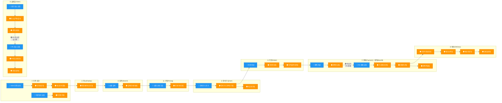

**주요 이벤트 목록:**

| 단계 | 이벤트 (🟠) | 트리거 커맨드 (🔵) | 애그리거트 (🟡) | 외부 시스템 (🔴) | 정책 (🟣) |
|------|-----------|-----------------|---------------|----------------|----------|
| ① | 인증성공됨 | SSO 인증 요청 | 인증·권한 | Naru | auth_type 분기 |
| ① | 테넌트식별됨 | (인증 성공 후) | 테넌트 관리 | - | 테넌트 라우팅 |
| ① | 약관동의됨 | 약관동의 요청 | 인증·권한 | Naru | 개인정보 처리방침 |
| ② | 랜딩페이지로드됨 | (테넌트 진입) | 전시(Display) | - | 랜딩 URL·레이아웃 |
| ③ | 검색결과반환됨 | 상품 검색 | 검색(Search) | AI검색 | 몰타입·분야 제한 |
| ④ | 전용가계산됨 | 상품 상세 조회 | 가격(Pricing) | 바자르 | 가격 오버레이, 서비스별 할인율 |
| ⑤ | 장바구니항목추가됨 | 장바구니 추가 | 장바구니(Cart) | 바자르(재고) | 수량 제한 |
| ⑤ | 재고확인됨 | (장바구니 추가 시) | 재고(Inventory) | 바자르 | 재고 가용성 검증 |
| ⑥ | 주문생성됨 | 주문 생성 | 주문(Order) | - | - |
| ⑥ | 정책검증완료됨 | (주문 생성 후) | 주문(Order) | - | 수량·금액·결제수단 제한 재검증 |
| ⑦ | 혜택차감됨 | 혜택 차감 | 혜택(Benefit) | - | 포인트·쿠폰 종류·한도·서비스별 규칙 |
| ⑦ | PG결제승인됨 | PG 결제 요청 | 결제(Payment) | **뉴빌링** | 실결제 금액만 |
| ⑦ | 결제완료됨 | (혜택+PG 모두 성공) | 결제(Payment) | - | 결제 상태 관리 |
| ⑦ | 혜택적립됨 | (결제 완료 후) | 혜택(Benefit) | - | 구매 적립 규칙 |
| ⑦ | 알림발송됨 | (결제 완료 후) | 알림(Notification) | - | 주문 확인 알림 |
| ⑧ | 주문이행요청됨 | (결제 완료 후) | 배송(Delivery) | **바자르** | 바자르에 이행 위임 |
| ⑧ | 배송시작됨 | (바자르 배송) | 배송(Delivery) | 바자르 | - |
| ⑧ | 배송완료됨 | (배송 완료) | 배송(Delivery) | 바자르 | - |
| ⑧ | 알림발송됨 | (배송 상태 변경 시) | 알림(Notification) | - | 배송 상태 알림 |
| ⑨ | 취소금액산출됨 | 부분 취소 요청 | 클레임(Claim) | - | 할인 재계산, 환원 순서 |
| ⑨ | 혜택환원됨 | (취소 산출 후) | 혜택(Benefit) | - | 포인트·쿠폰 우선 환원 |
| ⑨ | PG취소완료됨 | PG 취소 요청 | 클레임(Claim) | **뉴빌링** | Partial/Full Cancel |
| ⑨ | 알림발송됨 | (취소 완료 후) | 알림(Notification) | - | 취소/환불 결과 알림 |

**🔥 핫스팟 (워크숍에서 논의):**

> 마스터: [b2b-store-domain-decisions.md](../domain/b2b-store-domain-decisions.md)

- **A-01** 바자르 주문 이행 API 존재 여부·스펙 (조사)
- **D-02** 2-1 혜택 차감 → PG 결제 실패 시 보상 트랜잭션 전략
- **A-02** AI 검색엔진 테넌트 필터 지원 여부 (조사) → D-04 4-3 결정
- **A-03** 장바구니 영속성 — SF 소유 vs 바자르 공유 (조사)
- **D-04** 4-2 재고(Inventory) 확인 주체 — SF 실시간 조회 vs 바자르 의존

---

### 여정 3: 제휴사 관리자 — "내 몰 운영"

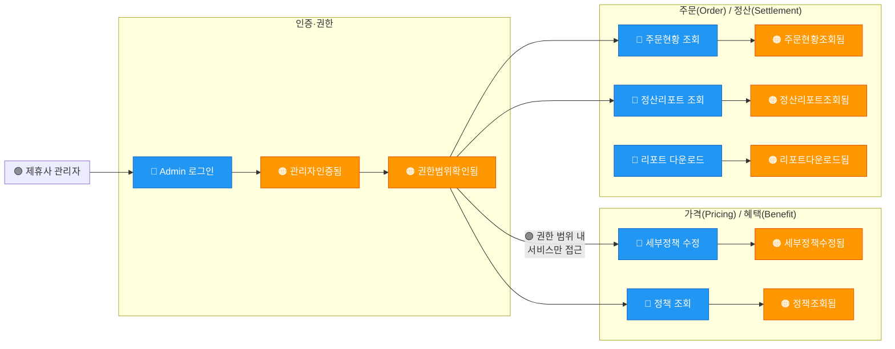

**주요 이벤트 목록:**

| # | 이벤트 (🟠) | 트리거 커맨드 (🔵) | 애그리거트 (🟡) | 정책 (🟣) |
|---|-----------|-----------------|---------------|----------|
| 1 | 관리자인증됨 | Admin 로그인 | 인증·권한 | 서비스 스코프 RBAC |
| 2 | 권한범위확인됨 | (인증 후) | 인증·권한 | 구독 서비스 + 역할 기반 |
| 3 | 세부정책수정됨 | 세부정책 수정 | 가격(Pricing) / 혜택(Benefit) | 운영자 상한 내에서만 수정 가능 (2-tier) |
| 4 | 주문현황조회됨 | 주문현황 조회 | 주문(Order) | 내 테넌트·서비스 범위만 |
| 5 | 정산리포트조회됨 | 정산리포트 조회 | 정산(Settlement) | 월 정산, 기간 필터 |

**🔥 핫스팟:**

> 마스터: [b2b-store-domain-decisions.md](../domain/b2b-store-domain-decisions.md)

- **D-11** 11-1 제휴사 관리자가 수정할 수 있는 정책 범위 (운영자 상한 이내 어디까지?)
- **D-11** 11-4 서비스별 RBAC — 도서몰 관리자가 음반몰 주문을 볼 수 있는가?

---

## 6. 비즈니스 영역과 핵심 개념

이벤트 스토밍에서 도출된 개념들을 기획에서 정의한 **13개 비즈니스 영역 + 3개 플랫폼 레이어**에 매핑한다. 각 영역 안에서 자기 상태(데이터)를 가지는 실체가 애그리거트/핵심 개념이다.

### 비즈니스 영역 (기획 정의, 13개)

```mermaid
flowchart TB
    subgraph DISPLAY_AREA["전시 영역"]
        direction TB
        A1["카탈로그(Catalog)"]
        A2["가격(Pricing)"]
        A3["재고(Inventory)"]
        A4["전시(Display)"]
        A5["검색(Search)"]
    end

    subgraph ORDER_AREA["주문 영역"]
        direction TB
        A6["장바구니(Cart)"]
        A7["주문(Order)"]
        A8["결제(Payment)"]
        A9["배송(Delivery)"]
        A10["클레임(Claim)"]
    end

    subgraph POST_AREA["구매 후 영역"]
        direction TB
        A11["정산(Settlement)"]
        A12["혜택(Benefit)"]
        A13["알림(Notification)"]
    end

    subgraph PLATFORM["플랫폼 레이어"]
        direction TB
        P1["테넌트 관리"]
        P2["인증·권한"]
        P3["서비스 카탈로그"]
    end
```

| 영역 구분 | 비즈니스 영역 | 포함된 핵심 개념 (애그리거트) | 비고 |
|----------|-------------|-------------------------|------|
| **전시** | 카탈로그(Catalog) | 상품 카탈로그, 카탈로그 오버레이 | 바자르 원본 + SF 오버레이 |
| **전시** | 가격(Pricing) | 가격정책, 가격오버레이, 할인율 | (tenant, service, policy_type) 키 |
| **전시** | 재고(Inventory) | 재고 가용성 | 바자르 재고 조회/캐시 |
| **전시** | 전시(Display) | 랜딩페이지, 레이아웃, SDUI 구성 | 테넌트별 랜딩·전시 커스터마이징 |
| **전시** | 검색(Search) | 검색 인덱스, 분야 필터 | AI검색 엔진 연동, 분야 제한 |
| **주문** | 장바구니(Cart) | 장바구니, 장바구니항목 | SF 독립 엔티티 |
| **주문** | 주문(Order) | 주문, 주문항목 | SF 독립 엔티티, 바자르는 이행만 |
| **주문** | 결제(Payment) | 결제, 결제수단 제한 | PG 결제 오케스트레이션, 뉴빌링 연동 |
| **주문** | 배송(Delivery) | 배송, 배송추적 | 바자르 이행 위임, 상태 추적 |
| **주문** | 클레임(Claim) | 취소, 환불, 반품 | 취소금액 산출, 환원 처리 |
| **구매 후** | 정산(Settlement) | 정산, 리포트 | 월 정산, 기간 필터 |
| **구매 후** | 혜택(Benefit) | 포인트원장, 쿠폰, 적립 | 포인트·쿠폰 차감/환원/적립 통합 |
| **구매 후** | 알림(Notification) | 알림 발송, 알림 설정 | 주요 상태 변경 시 알림 |

### 플랫폼 레이어 (3개)

| 플랫폼 레이어 | 포함된 핵심 개념 | 비고 |
|-------------|----------------|------|
| 테넌트 관리 | 테넌트, 서비스구독, 스키마 프로비저닝 | Schema per Tenant |
| 인증·권한 | 인증, 동의, 권한(RBAC) | Naru OIDC 위임 + SF 라우팅 |
| 서비스 카탈로그 | 도서몰/음반몰/만권당 서비스 정의 | 서비스별 정책·이벤트 분기의 기준 |

### 경계가 애매한 지점 — 기술 세션에서 결정

> 마스터: [b2b-store-domain-decisions.md](../domain/b2b-store-domain-decisions.md)

| 마스터 # | 영역 | 고민 | 판단 기준 |
|---------|------|------|----------|
| **D-04** 4-5 | 가격(Pricing) | 독립 영역으로 유지? 카탈로그에 포함? | 가격 변경이 상품 데이터 변경 없이 독립적으로 일어나는가 |
| **D-04** 4-2 | 재고(Inventory) | SF 소유? 바자르 의존? | SF가 재고 캐시를 가질 것인가 vs 매번 바자르에 실시간 조회 |
| **D-04** 4-3 | 검색(Search) | SF 소유? AI팀 의존? | SF가 검색 인덱스를 관리할 것인가 vs AI검색 엔진에 완전 위임 |
| **D-02** 2-6 | 혜택(Benefit) vs 결제(Payment) | 포인트 차감 주체는? | 혜택 차감이 결제 오케스트레이션 안인가 vs 독립적으로 작동하는가 |
| **D-01** | 정책 엔진 | 독립 영역? 각 영역에 내재? 공통 인프라? | 정책 규칙이 한 곳에서 관리되어야 하는가 vs 각 영역이 자체 정책을 갖는가 |

> **원칙**: "같이 변경되는 것은 같이 둔다, 따로 변경되는 것은 분리한다." 이벤트 타임라인에서 **같은 이벤트 묶음 안에 항상 같이 등장**하면 한 영역, **독립적으로 등장**하면 분리 후보.

---

## 7. 도메인 경계 맵핑 (초안)

> 워크숍에서 이벤트를 모두 붙인 후, 아래 표를 기준으로 경계선을 그린다.

```mermaid
flowchart TB
    subgraph PLATFORM["플랫폼 레이어"]
        direction LR
        BC_TENANT["BC: 테넌트 관리<br/>🟡 테넌트 · 서비스구독"]
        BC_AUTH["BC: 인증·권한<br/>🟡 인증 · 동의 · 권한"]
        BC_SVC["BC: 서비스 카탈로그<br/>🟡 서비스 정의"]
    end

    subgraph DISPLAY_BC["전시 영역"]
        direction LR
        BC_CATALOG["BC: 카탈로그(Catalog)<br/>🟡 상품 카탈로그"]
        BC_PRICING["BC: 가격(Pricing)<br/>🟡 가격정책 · 오버레이"]
        BC_INVENTORY["BC: 재고(Inventory)<br/>🟡 재고 가용성"]
        BC_DISPLAY["BC: 전시(Display)<br/>🟡 랜딩 · 레이아웃"]
        BC_SEARCH["BC: 검색(Search)<br/>🟡 검색 인덱스 · 필터"]
    end

    subgraph ORDER_BC["주문 영역"]
        direction LR
        BC_CART["BC: 장바구니(Cart)<br/>🟡 장바구니"]
        BC_ORDER["BC: 주문(Order)<br/>🟡 주문 · 주문항목"]
        BC_PAYMENT["BC: 결제(Payment)<br/>🟡 결제"]
        BC_DELIVERY["BC: 배송(Delivery)<br/>🟡 배송 · 추적"]
        BC_CLAIM["BC: 클레임(Claim)<br/>🟡 취소 · 환불"]
    end

    subgraph POST_BC["구매 후 영역"]
        direction LR
        BC_SETTLEMENT["BC: 정산(Settlement)<br/>🟡 정산 · 리포트"]
        BC_BENEFIT["BC: 혜택(Benefit)<br/>🟡 포인트 · 쿠폰 · 적립"]
        BC_NOTIFICATION["BC: 알림(Notification)<br/>🟡 알림 발송"]
    end

    subgraph EXT["외부"]
        NARU["🔴 Naru"]
        BAZAAR["🔴 바자르"]
        BILLING["🔴 뉴빌링"]
        AISEARCH["🔴 AI검색"]
    end

    BC_AUTH -.->|OIDC| NARU
    BC_CATALOG -.->|상품 데이터| BAZAAR
    BC_INVENTORY -.->|재고 조회| BAZAAR
    BC_DELIVERY -.->|주문 이행| BAZAAR
    BC_SEARCH -.->|검색 필터| AISEARCH
    BC_PAYMENT -.->|PG 실결제| BILLING
    BC_ORDER -->|결제 요청| BC_PAYMENT
    BC_PAYMENT -->|혜택 차감| BC_BENEFIT
    BC_PAYMENT -->|정산 데이터| BC_SETTLEMENT
    BC_CLAIM -->|혜택 환원| BC_BENEFIT
    BC_CLAIM -->|PG 취소| BC_PAYMENT
    BC_ORDER -->|알림| BC_NOTIFICATION
    BC_DELIVERY -->|알림| BC_NOTIFICATION
```

| Bounded Context | 영역 구분 | 핵심 애그리거트 | SF 소유 | 외부 의존 |
|----------------|----------|---------------|---------|----------|
| 테넌트 관리 | 플랫폼 | 테넌트, 서비스구독 | ✅ | - |
| 인증·권한 | 플랫폼 | 인증, 동의, 권한(RBAC) | ✅ (라우팅) | Naru (인증 실체) |
| 서비스 카탈로그 | 플랫폼 | 서비스 정의 | ✅ | - |
| 카탈로그(Catalog) | 전시 | 상품 카탈로그, 오버레이 | ✅ (오버레이) | 바자르(원본) |
| 가격(Pricing) | 전시 | 가격정책, 가격오버레이 | ✅ | - |
| 재고(Inventory) | 전시 | 재고 가용성 | 🔥 검토 필요 | 바자르(재고) |
| 전시(Display) | 전시 | 랜딩페이지, 레이아웃 | ✅ | - |
| 검색(Search) | 전시 | 검색 인덱스, 분야 필터 | 🔥 검토 필요 | AI검색 |
| 장바구니(Cart) | 주문 | 장바구니 | ✅ (독립 엔티티) | - |
| 주문(Order) | 주문 | 주문, 주문항목 | ✅ (독립 엔티티) | 바자르(이행) |
| 결제(Payment) | 주문 | 결제, 결제수단 제한 | ✅ | 뉴빌링(PG만) |
| 배송(Delivery) | 주문 | 배송, 배송추적 | ✅ (상태 추적) | 바자르(이행) |
| 클레임(Claim) | 주문 | 취소, 환불 | ✅ | 뉴빌링(PG 취소) |
| 정산(Settlement) | 구매 후 | 정산, 리포트 | ✅ | - |
| 혜택(Benefit) | 구매 후 | 포인트원장, 쿠폰, 적립 | ✅ | - |
| 알림(Notification) | 구매 후 | 알림 발송, 알림 설정 | ✅ | - |

---

## 8. 서비스 카탈로그 × 이벤트 교차

SaaS 구조에서 서비스 카탈로그가 이벤트 흐름에 미치는 영향:

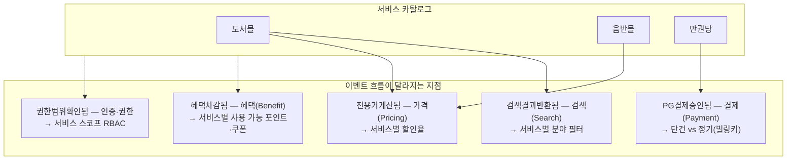

**워크숍에서 확인할 것:**
- 각 이벤트에 `service_type` 컨텍스트가 필요한지 체크
- 서비스에 따라 **이벤트 자체가 다른 것** (예: 만권당은 `구독생성됨` ↔ 전용몰은 `주문생성됨`) vs **같은 이벤트인데 정책이 다른 것** 구분

---

## 9. 워크숍 타임라인

| 시간 | 단계 | 활동 | 산출물 |
|------|------|------|--------|
| 00:00~00:10 | 인트로 | 규칙 설명, 색상 범례, **기획 산출물 공유** | - |
| 00:10~00:25 | Phase 1 | 여정 2(실구매자) — 기획 타임라인 이관 + 시스템 이벤트 보강 | 🟠 보강된 타임라인 |
| 00:25~00:55 | Phase 2 | 커맨드·액터·정책·외부 시스템 배치 | 🔵🟢🟣🔴 추가 |
| 00:55~01:10 | 휴식 | - | - |
| 01:10~01:30 | Phase 1-2 | 여정 1(운영자) + 여정 3(관리자) — 기획 결과 이관 + 보강 | 🟠🔵 추가 |
| 01:30~02:10 | Phase 3 | 애그리거트 도출 + BC 경계선 (가장 핵심) | 🟡 + 경계선 |
| 02:10~02:35 | Phase 4 | 기획 미해결 핫스팟 + §6 경계 5개 결정 | 🔥 분류 + 사진 |
| 02:35~02:50 | 마무리 | 핵심 결정 확인, DEV2-5298 액션 아이템 배분 | 회의록 |

### 역할

| 참석자 | 워크숍 역할 |
|--------|-----------|
| 김정민 (아키텍처) | **퍼실리테이터** — 진행, 타임키핑, 경계 토론 유도 |
| 조윤주 (기획) | 비즈니스 이벤트 보강, 현행 업무 흐름 공유 |
| 강인용 | 비즈니스/기획 관점 이벤트 보강 |
| 안혜련/이현민 (B2B BE) | 현행 시스템 이벤트 보강, "실제로는 이렇게 동작한다" |
| 조은흠 (FE) | 사용자 인터랙션 관점 이벤트, UI 이벤트 |
| 김규태 (팀장) | 핫스팟 의사결정, 우선순위 판단 |

---

## 10. 기대 산출물

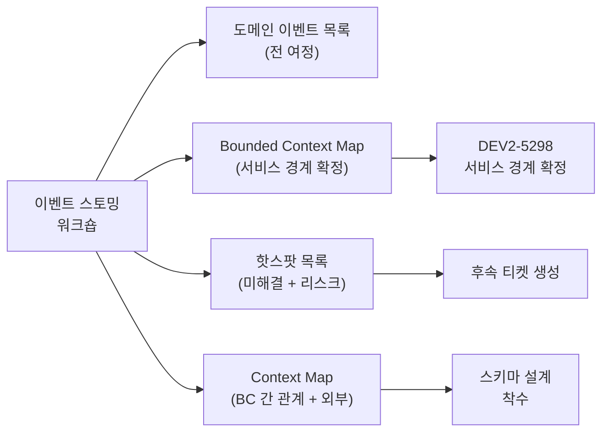

| 산출물 | 형식 | 용도 |
|--------|------|------|
| 도메인 이벤트 전체 목록 | 스프레드시트 or 마크다운 표 | 이벤트 기반 설계의 입력 |
| Bounded Context Map | Mermaid 다이어그램 | DEV2-5298 서비스 경계 확정 |
| 핫스팟 목록 | 마크다운 (질문 + 담당 + 기한) | 후속 티켓 → YouTrack |
| 여정별 이벤트 흐름도 | 벽 사진 + 디지털화 Mermaid | 팀 공유 문서, 온보딩 자료 |

---

## 11. 핵심 결정 사항 확인 체크리스트

워크숍 종료 시 아래 항목의 답이 있는지 확인:

- [ ] 여정 2(실구매자)의 이벤트 흐름이 전원 합의되었는가
- [ ] 주문 애그리거트의 경계: SF 독립 주문 vs 바자르 래핑 — 확정
- [ ] 결제(Payment) 경계: SF(혜택·할인·취소 오케스트레이션) vs 뉴빌링(PG만) — 확정
- [ ] 혜택(Benefit) 위치: SF 자체 소유 (포인트원장·쿠폰·적립 통합) — 확정
- [ ] 서비스 카탈로그 구독이 정책·결제·권한에 관통하는 구조 — 합의
- [ ] Bounded Context 수와 이름 — 잠정 확정
- [ ] BC 간 통신 방식 (동기 API vs 비동기 이벤트) — 방향 합의
- [ ] 핫스팟 목록 + 각 담당자 — 배분 완료
