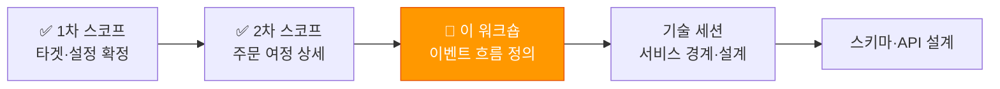
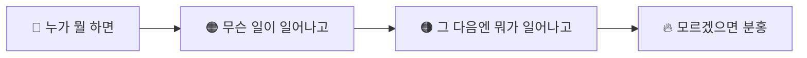
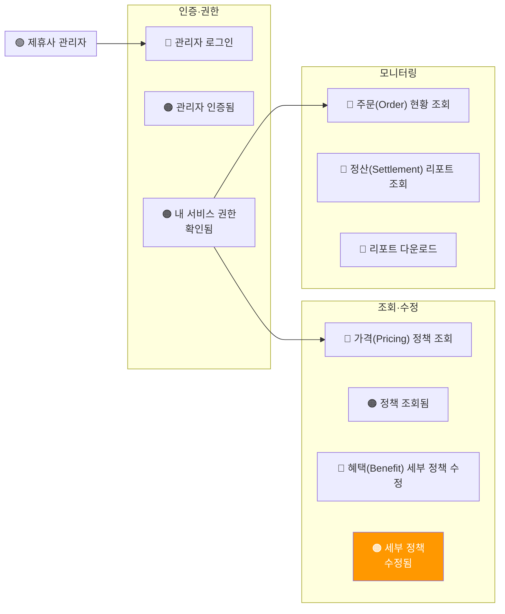
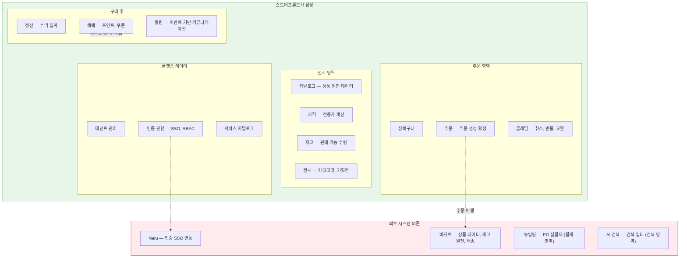
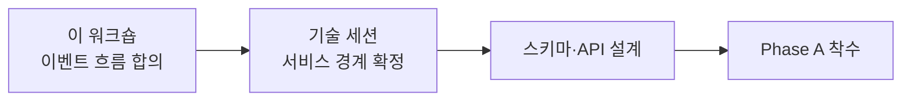

```mermaid
flowchart LR
    subgraph 생성["테넌트 관리"]
        OB1["🔵 테넌트 생성"]
        OE1["🟠 테넌트 생성됨"]
    end

    subgraph 서비스["서비스 카탈로그 선택"]
        OB2["🔵 서비스 카탈로그에서<br/>도서몰/음반몰/만권당 선택"]
        OE2["🟠 서비스 구독됨"]
        OE2a["🟠 서비스별<br/>설정 메뉴 생성됨"]
    end

    subgraph 정책["정책 설정"]
        OB3a["🔵 가격(Pricing) 정책 설정"]
        OB3b["🔵 결제(Payment) 수단 제한"]
        OB3c["🔵 카탈로그(Catalog) 분야 제한"]
        OB3d["🔵 혜택(Benefit) 포인트/쿠폰 설정"]
        OE3["🟠 정책 설정 완료됨"]
    end

    subgraph 활성화["활성화"]
        OB4["🔵 몰 활성화"]
        OE4["🟠 몰 활성화됨"]
        OE4a["🟠 실구매자<br/>접근 가능해짐"]
    end

    subgraph 모니터링["운영"]
        OB5["🔵 주문(Order) 현황 확인"]
        OB6["🔵 정산(Settlement) 확인"]
    end

    생성 --> 서비스 --> 정책 --> 활성화 --> 모니터링
```

# 스토어프론트 기획 워크숍 — 이벤트 흐름 정의

> **실행일: 2026-04-20 (월)**
> 목적: 유저 여정을 따라가며 **"시스템에서 무슨 일이 일어나는가"**를 전원이 합의
> 참석자 (7명): 김규태(팀장), 조윤주(기획), 강인용, 김정민(아키텍처), 조은흠(FE), 안혜련(B2B BE), 이현민(B2B BE)
> 소요: 90분
> 선행: 4/15 스코프 회의 결과 숙지 ([meeting-minutes-0415](../meetings/b2b-store-meeting-minutes-0415.md))
> 후속: 기술 세션에서 서비스 경계·설계 상세 ([event-storming-guide](./b2b-store-event-storming-guide.md))

---

## 이 워크숍이 필요한 이유

지금까지 **"뭘 만들 것인가"**(스코프)를 정했다. 이제 **"그래서 실제로 무슨 일이 일어나는가"**를 맞춰야 한다.



- **기획·운영 관점**: "제휴사가 가입하면 → 뭐가 일어나고 → 어디서 정책이 개입하고 → 누가 뭘 봐야 하는가"를 시간 순서로 정리
- **개발 관점**: "기존에는 어떻게 처리하고 → 신규에서는 어떻게 바뀌고 → 어디가 외부 시스템에 의존하는가"를 공유
- **팀장 관점**: 의사결정이 필요한 지점(핫스팟)을 한눈에 보고 즉시 결정

---

## 준비물

| 준비물 | 용도 |
|--------|------|
| 화이트보드 또는 긴 벽면 | 타임라인 |
| 포스트잇 3색 (주황, 파랑, 분홍) | 아래 참조 |
| 마커 (굵은 것) | 포스트잇에 한 줄로 쓰기 위해 |
| 4/15 회의 결과 프린트 또는 화면 | 참조용 |

### 포스트잇 색상 규칙 (3가지만)

복잡하게 가지 않는다. **3가지 색**이면 충분하다.

| 색상 | 의미 | 작성법 | 예시 |
|------|------|--------|------|
| 🟠 **주황** | **일어나는 일** | 과거형 — "~됨" | `주문 생성됨`, `포인트 차감됨` |
| 🔵 **파랑** | **사람이 하는 행동** | 명령형 — "~하다" | `상품 검색`, `결제 요청` |
| 🔥 **분홍** | **모르는 것 / 의견 다른 것** | 질문 또는 리스크 | `바자르 주문 API 있나?` |

> **규칙**: "일어나는 일(🟠)"을 시간 순서로 붙이고, 그 앞에 "누가 뭘 하길래 이게 일어났나(🔵)"를 붙인다. 모르겠으면 분홍(🔥)을 붙인다.

---

## 진행 순서

### Step 0. 인트로 (5분)

화면에 아래 그림을 띄운다:



"오늘은 유저가 우리 시스템을 쓸 때 **무슨 일이 시간 순서로 일어나는지** 벽에 붙이는 겁니다. 기술 얘기는 안 합니다. '그래서 뭐가 일어나?' 이것만 생각하세요."

---

### Step 1. 실구매자 여정 — "발견해서 받기까지" (40분)

> 핵심 여정. 여기에 시간을 가장 많이 쓴다.
> 고객 여정 한 줄 요약: **발견한다 → 담는다 → 결제한다 → 받는다 → 문제가 생기면 처리한다**

벽에 아래 타임라인을 미리 그려둔다:

```
  로그인     전시(발견)     장바구니(담기)     주문·결제     배송(받기)     클레임(문제처리)
────┼──────────┼───────────────┼───────────────┼─────────────┼──────────────────┼──→
```

#### 진행

1. **전원이 주황 포스트잇에** "이 여정에서 일어나는 일"을 쓴다 (3분, 조용히)
2. **한 명씩 돌아가며** 벽에 붙이고 한 줄 설명 — 해당 구간에 붙인다
3. 중복 합치고, 빠진 것 추가
4. 각 주황 앞에 **파랑 포스트잇** — "누가 뭘 하길래 이게 일어났나"
5. 모르는 것·의견 다른 것은 **분홍** 붙이기

#### 미리 준비한 뼈대 (퍼실리테이터용)

참석자가 막히면 아래를 힌트로 제시한다. **벽에 미리 붙이지 않는다** — 전원이 직접 도출하는 것이 목적.

```mermaid
flowchart LR
    subgraph 로그인["로그인"]
        B1["🔵 SSO 접근"]
        E1["🟠 인증됨"]
        E2["🟠 테넌트 식별됨"]
        E3["🟠 약관 동의됨"]
    end

    subgraph 전시["전시 영역 (발견)"]
        B2["🔵 상품 검색"]
        E4["🟠 검색결과반환됨"]
        E4a["🟠 전시페이지로드됨"]
        E5["🟠 전용가계산됨"]
        E5a["🟠 재고확인됨"]
    end

    subgraph 주문영역["주문 영역 (담기 → 결제 → 받기)"]
        B4["🔵 장바구니 담기"]
        E6["🟠 장바구니추가됨"]
        B5["🔵 주문하기"]
        E7["🟠 주문생성됨"]
        E7a["🟠 혜택차감됨<br/>(포인트/쿠폰)"]
        B6["🔵 결제 요청"]
        E10["🟠 PG결제승인됨"]
        E12["🟠 배송시작됨"]
    end

    subgraph 클레임["클레임 (문제처리)"]
        B7["🔵 취소 요청"]
        E14["🟠 취소요청됨"]
        E16["🟠 환불처리됨"]
    end

    subgraph 구매후["구매 후"]
        E17["🟠 정산집계됨"]
        E18["🟠 혜택적립됨"]
        E19["🟠 알림발송됨"]
    end

    로그인 --> 전시 --> 주문영역 --> 클레임
    주문영역 --> 구매후
```



#### 이 단계에서 나와야 하는 핵심 질문 (🔥)

> 마스터: [b2b-store-domain-decisions.md](../domain/b2b-store-domain-decisions.md). 아래는 이 여정에서 특히 답이 나와야 하는 **D-XX 포인트**.

| 마스터 # | 이 여정의 질문 | 누가 답하나 |
|---------|-------------|-----------|
| **D-07** | 현행 B2B 주문이 알라딘 표준 플로우 그대로인가, 분기인가? (+ A-01 바자르 이행 API 조사) | 안혜련/이현민 |
| **D-02** 2-6 | 혜택 차감(포인트/쿠폰)은 어디서 일어나나? | 김정민 |
| **D-02** 2-5 + **D-03** 3-2 | 부분 취소 시 혜택 먼저 돌려주나, PG 먼저 취소하나? | 조윤주 + 김정민 |
| **D-04** 4-3 + A-02 | 검색할 때 제휴사별 필터가 현재 되나? | 안혜련/이현민 (AI팀 확인은 A-02) |
| **D-08** | 대량구매 고객은 같은 흐름인가, 다른 흐름인가? | 조윤주 + 김규태 |

---

### Step 2. 운영자 여정 — "제휴사 몰 만들기" (15분)

벽 왼쪽 위에 별도 타임라인:

```
  테넌트 생성    서비스 카탈로그 선택    정책 설정    활성화    모니터링    정산
──────┼──────────────┼───────────────────┼──────────┼──────────┼──────────┼──→
```



**포인트:**
- 4/15에 확정된 **SF 필수 설정 5개**가 정책 설정 구간에 모두 나와야 한다
- **서비스 카탈로그 선택** 단계가 핵심 — "도서몰만 쓸 건지, 음반몰도 쓸 건지, 만권당도 쓸 건지" 선택하면 이후 가격·결제·혜택·권한이 전부 서비스별로 나뉜다
- 빠르게 진행 — 실구매자 여정만큼 복잡하지 않다

#### 핫스팟 (🔥)

> 마스터: [b2b-store-domain-decisions.md](../domain/b2b-store-domain-decisions.md)

| 마스터 # | 이 여정의 질문 | 누가 답하나 |
|---------|-------------|-----------|
| **D-09** | 기존 제휴사 추가할 때 실제로 뭘 하나? (코드 수정? DB?) — As-Is 조사 | 안혜련/이현민 |
| **D-10** | 서비스별 정책이 정말 다 다른가? (가격, 혜택, 결제 각각) | 조윤주 |

---

### Step 3. 제휴사 관리자 여정 — "내 몰 운영" (10분)



**포인트:**
- 운영자가 정한 **상한 안에서** 제휴사 관리자가 세부 조정 (2-tier 정책)
- 관리자가 볼 수 있는 범위 = 자기 테넌트 + 구독한 서비스 카탈로그만

#### 핫스팟 (🔥)

> 마스터: [b2b-store-domain-decisions.md](../domain/b2b-store-domain-decisions.md)

| 마스터 # | 이 여정의 질문 | 누가 답하나 |
|---------|-------------|-----------|
| **D-11** 11-1 | 관리자가 "수정"할 수 있는 범위가 구체적으로 뭔가? (가격, 혜택, 전시 중 어디까지) | 조윤주 + 김규태 |
| **D-11** 11-3 | 제휴사 관리자가 여러 서비스를 구독했을 때, 서비스별로 따로 보나? | 조윤주 |

---

### Step 4. 정리 + 의사결정 (20분)

#### 4-1. 외부 시스템 표시 (5분)

벽 위에 **빨간 마커**로 외부 시스템이 개입하는 지점을 표시한다:



**전원이 확인**: "초록 = 우리가 만드는 것, 빨강 = 외부에 의존하는 것"

#### 4-2. 핫스팟 의사결정 (15분)

분홍 포스트잇을 모아서 3가지로 분류:

| 분류 | 처리 | 예시 |
|------|------|------|
| **지금 결정** | 팀장이 즉시 결정 | "독립 주문 엔티티로 간다 — 확정" |
| **확인 후 결정** | 담당자 배정 + 기한 | "바자르 주문 API 스펙 확인 — 김정민, 다음주" |
| **나중에 결정** | MVP 이후로 미루기 | "모바일 지원 — 트리거 A" |

---

## 워크숍 타임테이블

| 시간 | 내용 | 주도 |
|------|------|------|
| 00:00~00:05 | 인트로, 포스트잇 3색 설명 | 김정민 |
| 00:05~00:45 | **실구매자 여정** — 이벤트 + 행동 + 핫스팟 | 전원 |
| 00:45~01:00 | **운영자 여정** — 빠르게 | 조윤주 주도 |
| 01:00~01:10 | **관리자 여정** — 빠르게 | 조윤주 주도 |
| 01:10~01:15 | 외부 시스템 표시 (초록/빨강) | 김정민 |
| 01:15~01:30 | 핫스팟 분류 + 의사결정 + 사진 촬영 | 김규태 |

### 역할

| 참석자 | 역할 |
|--------|------|
| 김규태 (팀장) | 핫스팟 의사결정, 우선순위 판단 |
| 조윤주 (기획) | 비즈니스 흐름 주도, 운영/관리자 여정 리드 |
| 강인용 | 비즈니스/기획 관점 이벤트 보강 |
| 안혜련/이현민 (레거시 BE) | **"현재는 이렇게 한다"** — As-Is 흐름의 핵심 소스 |
| 조은흠 (FE) | 사용자 화면 관점 — "여기서 사용자가 뭘 보나" |
| 김정민 (아키텍처) | 퍼실리테이터, 타임키핑, 외부 시스템 표시 |

---

## 산출물

| 산출물 | 형식 | 다음 단계 |
|--------|------|----------|
| 여정별 이벤트 타임라인 | 벽 사진 | 기술 세션 입력 |
| 핫스팟 목록 (분류됨) | 포스트잇 사진 + 정리 | "지금 결정" → 확정, "확인 후" → 티켓 |
| 외부 의존 지점 | 빨간 마커 사진 | 기술 세션에서 연동 설계 |
| As-Is vs To-Be 차이 | 회의 중 구두 → 메모 | 기존 레거시와 신규 차이 명확화 |

### 이 워크숍 다음은?



기획 워크숍에서 **"무슨 일이 일어나는가"**를 전원이 합의하면, 기술 세션에서 **"그 일들을 어떤 서비스가 담당하는가"**를 개발팀이 결정한다. 기획 워크숍의 결과물(이벤트 타임라인 + 핫스팟)이 기술 세션의 입력이 된다.
