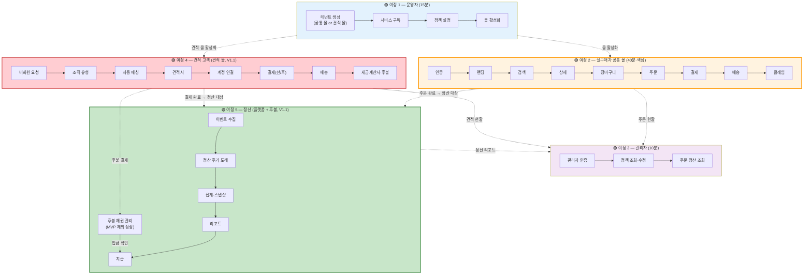
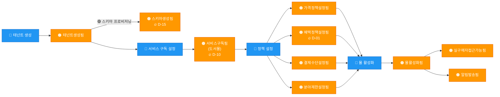
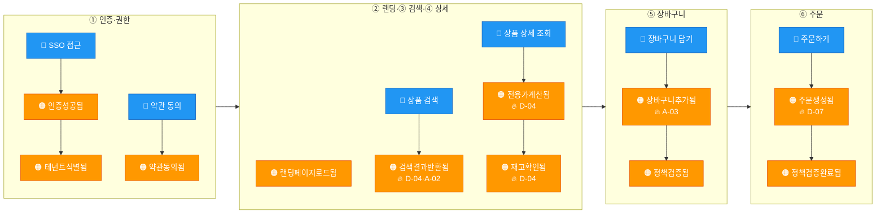
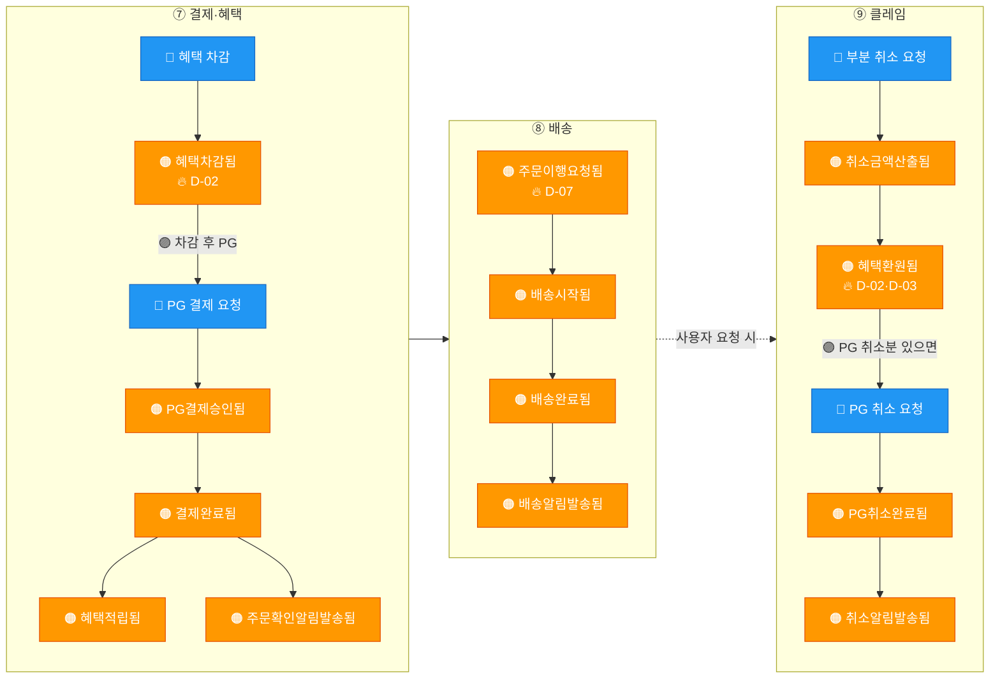
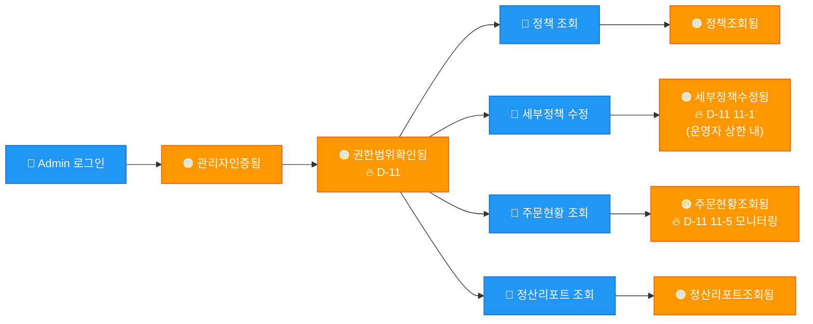
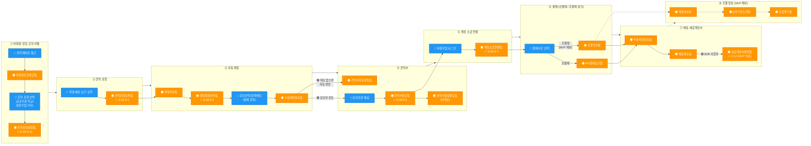
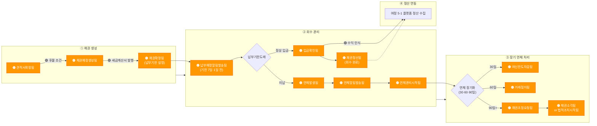
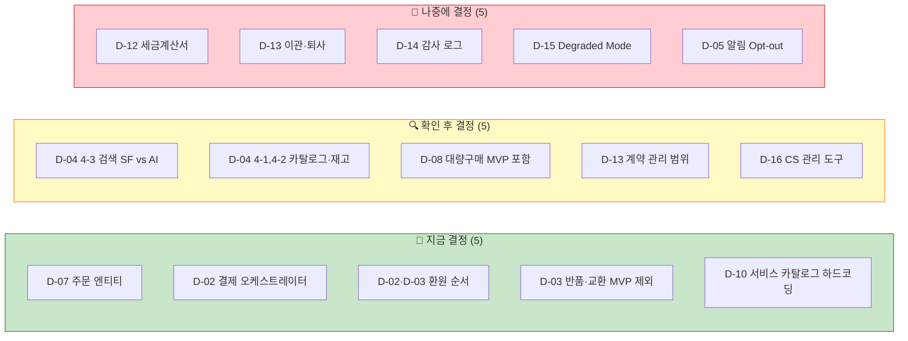

# 이벤트 스토밍 결과 시뮬레이션 — 사전 예측

> **목적**: 2026-04-20 이벤트 스토밍 워크숍의 예상 산출물을 사전에 시뮬레이션. 벽 출력·사전 배포·워크숍 진행 가속화에 사용.
> **대상**: 워크숍 참석자 7명 + 기술 세션 참석자
> **작성**: 2026-04-20 오전, 김정민 · **V1.1 반영**: 2026-04-21
> **정확도**: 예측 가능 약 80%. 나머지 20%(FE 화면·As-Is 디테일·Shadow path·마이그레이션)가 워크숍의 **진짜 가치**.
> **주의**: 본 문서의 🟠 이벤트는 **가설**. 워크숍 중 틀리면 떼고, 빠진 건 추가. "동의 압박"을 주려는 게 아님.
>
> **V1.1 반영 (4/21)**: **견적 고객(= 대량구매) 여정 신규 추가**. 공통 몰과 견적 몰은 다른 테넌트. AI검색 → 알리스(Alis) 명명 통일. 상세: `b2b-store-domain-v11-reflection.md`

---

## 목차

1. [사용법 — 워크숍 벽 구성](#사용법--워크숍-벽-구성)
2. [한 장 조감도](#한-장-조감도)
3. [여정 1 — 운영자 (15분)](#여정-1--운영자-신규-제휴사-몰-생성-15분)
4. [여정 2 — 실구매자 공통 몰 (40분·핵심)](#여정-2--실구매자-상품-구매-40분핵심)
5. [여정 3 — 관리자 (10분)](#여정-3--관리자-내-몰-운영-10분)
6. **[여정 4 — 견적 고객 (견적 몰, V1.1 신규)](#여정-4--견적-고객-견적-몰-v11-신규)**
7. **[여정 5 — 정산 (플랫폼 + 후불, 베스트 프랙티스)](#여정-5--정산-플랫폼--후불-베스트-프랙티스)**
8. [핫스팟 예상 분류 (3-bucket)](#핫스팟-예상-분류-3-bucket)
9. [As-Is vs To-Be 5개](#as-is-vs-to-be-5개)
10. [예상 액션 아이템](#예상-액션-아이템)
11. [예측 불가 영역 — 워크숍에서 집중할 곳](#-예측-불가-영역--워크숍에서-집중할-곳)
12. [예측 정확도 (항목별 신뢰도)](#예측-정확도-항목별-신뢰도)
13. [참석자별 사전 체크 포인트](#참석자별-사전-체크-포인트)

---

## 사용법 — 워크숍 벽 구성

### 워크숍 전 (참석자: 15분)

- 본 문서를 훑어보기
- **의견 다른 부분에 체크** 해오기
- 자기 역할 섹션([참석자별 사전 체크](#참석자별-사전-체크-포인트)) 확인

### 워크숍 벽 구성 (퍼실리테이터: 10분)

```
 ┌──────────────────────────────────────────┬──────────────────────────────┐
 │  ←  왼쪽 벽 (사전 붙임·시뮬레이션)         │   오른쪽 벽 (빈 공간)         │
 │                                          │                              │
 │  🟠 여정 1·2·3 타임라인                   │   ↓                          │
 │  🔴 외부 시스템 표시                      │   참석자가 자유 추가·수정      │
 │  🔥 D-01~D-16 핫스팟 라벨                 │   - FE 화면 상태              │
 │                                          │   - As-Is 디테일              │
 │                                          │   - Shadow path               │
 │                                          │   - 새 🔥                    │
 └──────────────────────────────────────────┴──────────────────────────────┘
```

**진행 방식**:
1. 왼쪽 벽 5분 설명 — 사전 시뮬레이션 공유
2. *"이 그림 맞나요? 틀린 건 떼고, 빠진 건 오른쪽에 붙여주세요"*
3. Phase 1 (이관·보강) 15분 → **5~10분으로 단축**
4. 절약된 시간을 **예측 불가 20%** (FE 관점·As-Is 디테일·Shadow path)에 투입

---

## 한 장 조감도



**요약 수치**
- 🟠 도메인 이벤트 예상 **40+개**
- 🔴 외부 시스템 **4개** — Naru · 공급시스템(현행 오픈마켓) · 뉴빌링 · AI검색
- 🔥 핫스팟 총 **16개** (D-01~D-16) — 지금 5 / 확인 후 5 / 나중에 5
- 🎯 예상 액션 아이템 **5개** + 티켓 업데이트

---

## 여정 1 — 운영자 "신규 제휴사 몰 생성" (15분)



**이 여정의 핵심 🔥**

| 🔥 | 왜 지금 논의 |
|----|------------|
| **D-01** 정책 엔진 위치 | 정책 설정 4개가 한 영역인지 4개 영역에 내재인지 결정 |
| **D-10** 서비스 카탈로그 MVP | 도서몰 1개 하드코딩 vs 3차원 `(tenant, service, policy)` |
| **D-15** 스키마 런타임 프로비저닝 | 안전성·롤백 절차 (첫 고객 온보딩 실패 시) |

---

## 여정 2 — 실구매자 "상품 구매" (40분·핵심)

### 전체 흐름



### 결제·클레임 (별도 확대)



### 🔴 이 여정의 외부 의존

| 단계 | 외부 시스템 | 관련 결정 |
|------|-----------|---------|
| ① 인증 | **Naru** (OIDC) | — |
| ③ 검색 | **AI검색** | D-04 4-3 + A-02 |
| ④ 상세 | **공급시스템** (현행 오픈마켓) | D-04 4-1, 4-4 |
| ⑤ 장바구니 | **공급시스템** (재고) | D-04 4-2 |
| ⑦ 결제 | **뉴빌링** (PG만) | D-02 |
| ⑧ 배송 | **공급시스템** (이행) | D-07 |
| ⑨ 클레임 | **뉴빌링** (PG 취소) | D-03 |

### 이 여정의 핵심 🔥 — 결정이 많이 나올 가능성

- **D-07** 독립 주문 엔티티 — KJM 잠정안 → 팀장 확정 예상
- **D-02** SF = 결제 오케스트레이터 — KJM 잠정안 → 확정 예상
- **D-02 2-5 + D-03 3-2** 환원 순서 (혜택 먼저 → PG 나중) — meeting-prep-0417 명시, 확정 예상
- **D-04 4-3** 검색 SF vs AI 의존 — A-02 조사 결과 대기

---

## 여정 3 — 관리자 "내 몰 운영" (10분)



**이 여정의 핵심 🔥**

| 🔥 | 내용 |
|----|------|
| **D-11 11-1** | 수정 범위 — 가격·혜택·전시 중 어디까지 |
| **D-11 11-3, 11-4** | 서비스별 RBAC — 도서몰 관리자가 음반몰 접근 가능? |
| **D-11 11-5~7** | 주문 상품 모니터링 — 개인별 / 부서별 / 전체 통계 |

---

## 여정 4 — 견적 고객 (견적 몰, V1.1 신규)

> **V1.1 (4/21) 반영**: 대량구매 고객 = 견적 고객으로 통합·재명명. 조직 유형 4개 (공공기관·학교·일반기업·기타). **공통 몰과 다른 테넌트(견적 몰)**. D-08 참조.

### 전체 흐름

```
비회원 요청 → 조직 유형 선택 → 자동 매칭 → 견적서 발행 → 결제 → 배송 → (세금계산서·후불 정산)
```



### 견적 특화 핫스팟

| 단계 | 관련 D-XX | 핵심 결정 |
|------|----------|---------|
| ① 조직 유형·인증 | D-11 11-8~11 | 인증 전에도 할인율 적용, 불일치 시 담당자 판단 |
| ② 비회원 요청 | D-08 8-1, 8-3 | 비회원 토큰 체계, 계정 소급 연결 식별자 |
| ③ 자동 매칭 | D-08 8-4, 8-5 | 매칭 엔진 구축 방식, 메모 처리 분기 |
| ④ 견적서 | D-08 8-6, 8-7 | 버전 관리, 결제 링크 전송 |
| ⑤ 계정 연결 | D-08 8-3 | 비회원→회원 전환 UX |
| ⑥ 결제 분기 | D-08 8-11, D-12 | 선결제·후결제 분기 시점 |
| ⑦ 세금계산서 | D-08 8-12, D-12 | MVP 수동 대응, 자동화 Phase |
| ⑧ 후불 정산 | D-08 8-13 | 채권·미납·입금 확인 자동화 (MVP 제외) |

### 견적 몰 외부 의존

| 단계 | 외부 | 비고 |
|------|------|------|
| ③ 매칭 | **알리스(Alis)** (상품 검색용) | 테넌트 필터 지원 여부(A-02) |
| ⑥ 결제 | **뉴빌링** | 선결제 PG |
| ⑦ 배송 | **공급시스템** (현행 오픈마켓) | 이행 위임 |
| ⑦ 세금계산서 | **국세청 API** (Phase 2) | MVP는 수동 대응 |

### 여정 2(공통 몰)와의 차이

| 측면 | 여정 2 (공통 몰) | 여정 4 (견적 몰) |
|------|----------------|----------------|
| 진입 | Naru 로그인 필수 | **비회원 가능** (요청 후 소급 연결) |
| 탐색 | 전시·카테고리 기반 | **파일 업로드 → 자동 매칭** |
| 가격 | 정가+테넌트 할인 | **수량 구간 + 조직 유형 할인율** |
| 결제 | 실시간 PG | **선결제 + 후결제 분기** |
| 정산 | 즉시·월 정산 | **후불 채권 관리 별도** |
| 세금계산서 | 필요 시 | **기본 발행** (B2B 사업자 대상) |

### 이 여정의 예측 정확도 및 불확실성

- 🟠 이벤트 예측 정확도: **60%** (신규 영역이라 이벤트 세부 미정)
- 🔥 핫스팟은 D-08·D-18에 정리됨
- **예측 불가**: 매칭 엔진 구현 방식, 후불 채권 실제 업무 프로세스, 조직 유형 인증 서류 검증 방법

---

## 여정 5 — 정산 (플랫폼 + 후불, 베스트 프랙티스)

> **V1.1**: 정산은 "플랫폼 운영 정산"(공통·견적 양 몰)과 "정산(후불)"(견적 몰 전용, MVP 제외 잠정) 2개로 분리. 본 여정은 **이벤트 스토밍 관점의 베스트 프랙티스**를 따라 설계.
>
> **적용 원칙 (정산 도메인 5가지 베스트 프랙티스)**
> 1. **Event Sourcing 친화** — 주문·결제·클레임 이벤트를 수집해 정산 스냅샷 도출. 원본 트랜잭션은 불변
> 2. **Append-Only + 역기입(Reversal)** — 정산 레코드는 수정 금지. 조정은 **반대 부호 신규 기입**으로
> 3. **멱등성 (Idempotency)** — 같은 정산 주기 키로 재실행해도 중복 생성 안 됨
> 4. **상태 머신 (Lifecycle)** — `DRAFT → CALCULATED → REVIEWED → LOCKED → PAID` 전이만 허용
> 5. **이중 대조 (Reconciliation)** — 뉴빌링·공급시스템과 주기별 금액 대조. 차이 → 조정 이벤트 생성

### 5-1. 플랫폼 정산 — 이벤트 수집·집계·지급

```mermaid
flowchart LR
    subgraph SRC["① 이벤트 수집 (Event Sourcing)"]
        S1["🟠 주문완료됨"] -->|"🟣 정산대상 추가"| S2["🟠 정산대상기록됨"]
        S3["🟠 PG결제승인됨"] -->|"🟣 수수료 예상 산출"| S4["🟠 PG수수료산출됨"]
        S5["🟠 혜택차감됨"] -->|"🟣 혜택 비용 기록"| S6["🟠 혜택비용기록됨"]
        S7["🟠 PG취소완료됨"] -->|"🟣 역기입 트리거"| S8["🟠 정산역기입예약됨"]
    end

    subgraph CYC["② 정산 주기 집계"]
        C1["🔵 정산주기스케줄러"] --> CE1["🟠 정산주기도래됨<br/>(월말/주말/일마감)"]
        CE1 --> C2["🔵 정산 집계 시작"]
        C2 --> CE2["🟠 정산집계시작됨<br/>(상태: DRAFT)"]
        CE2 -->|"🟣 이중 대조<br/>뉴빌링·공급시스템"| C3["🔵 금액 대조"]
        C3 --> CE3["🟠 대조완료됨<br/>(불일치 시 조정예약)"]
        CE3 --> CE4["🟠 정산스냅샷생성됨<br/>(상태: CALCULATED)"]
    end

    subgraph REV["③ 검토·확정"]
        CE4 --> R1["🔵 담당자 검토"]
        R1 --> RE1["🟠 정산검토완료됨<br/>(상태: REVIEWED)"]
        RE1 --> R2["🔵 정산 확정"]
        R2 --> RE2["🟠 정산마감됨<br/>(상태: LOCKED — 이후 수정 금지)"]
    end

    subgraph REP["④ 리포트·지급"]
        RE2 --> RE3["🟠 정산리포트생성됨"]
        RE3 -->|"🟣 지급 요청 생성"| RE4["🟠 지급요청생성됨"]
        RE4 -->|"🟣 회계 연동"| ACC["🔴 알라딘 회계"]
        ACC --> RE5["🟠 지급실행됨"]
        RE5 --> RE6["🟠 지급완료됨<br/>(상태: PAID)"]
        RE6 -->|"🟣 제휴사 알림"| RE7["🟠 정산알림발송됨"]
    end

    subgraph ADJ["⑤ 조정 (마감 후 클레임)"]
        ADJ1["🟠 마감후환불발생됨"] -->|"🟣 LOCKED 상태라 원 정산 수정 불가<br/>→ 다음 주기 역기입"| ADJ2["🟠 정산역기입예약됨"]
        ADJ2 --> ADJ3["🟠 다음주기적용됨"]
    end

    SRC --> CYC --> REV --> REP
    RE2 -.-> ADJ

    classDef evt fill:#ff9800,color:#fff,stroke:#e65100
    classDef cmd fill:#2196f3,color:#fff,stroke:#1565c0
    classDef ext fill:#f44336,color:#fff,stroke:#b71c1c
    class S1,S2,S3,S4,S5,S6,S7,S8,CE1,CE2,CE3,CE4,RE1,RE2,RE3,RE4,RE5,RE6,RE7,ADJ1,ADJ2,ADJ3 evt
    class C1,C2,C3,R1,R2 cmd
    class ACC ext
```



### 5-2. 후불 채권 관리 (견적 몰, MVP 제외 잠정)



### 5-3. 정산 도메인 Aggregate 제안

```
Settlement (Aggregate Root)                   — 정산 스냅샷
  ├─ period_key: "2026-04"                   — 멱등성 키
  ├─ tenant_id, store_type, service_type
  ├─ state: DRAFT | CALCULATED | REVIEWED | LOCKED | PAID
  ├─ SettlementLine[]                        — 복식 기입 라인 (append-only)
  │   ├─ type: REVENUE | FEE | BENEFIT_COST | REFUND_REVERSAL
  │   ├─ amount (+/-)                        — 부호로 차·대변 구분
  │   ├─ source_event_id                     — 원천 이벤트 역추적
  │   └─ created_at
  ├─ ReconciliationReport                    — 뉴빌링·공급시스템 대조
  └─ PaymentInstruction                      — 지급 요청

Receivable (Aggregate Root, 후불 전용)          — 채권
  ├─ quote_id, tenant_id
  ├─ state: PENDING | ISSUED | OVERDUE_30 | OVERDUE_60 | OVERDUE_90 | CLEARED | WRITTEN_OFF
  ├─ amount, due_date
  ├─ PaymentReceipt[]                        — 부분 입금 이력
  └─ CollectionAction[]                      — 독촉·연체 관리 이력
```

### 5-4. 주요 이벤트 목록

**플랫폼 정산 (MVP 포함)**

| # | 이벤트 (🟠) | 트리거 | 애그리거트 | 비고 |
|---|-----------|-------|---------|------|
| 1 | 정산대상기록됨 | 주문완료됨 수신 | Settlement | Event Sourcing 수집 |
| 2 | PG수수료산출됨 | PG결제승인됨 수신 | Settlement | 뉴빌링 수수료율 기반 |
| 3 | 혜택비용기록됨 | 혜택차감됨·혜택적립됨 수신 | Settlement | SF 자체 원장 비용 |
| 4 | 정산역기입예약됨 | PG취소완료됨·환불완료됨 | Settlement | 마감 후 클레임은 다음 주기 |
| 5 | 정산주기도래됨 | 월말·주말 스케줄러 | Settlement | 멱등성 키 = `(tenant, period)` |
| 6 | 정산집계시작됨 | 정산주기도래됨 | Settlement | 상태: DRAFT |
| 7 | 대조완료됨 | 뉴빌링·공급시스템 Reconciliation | ReconciliationReport | 불일치 시 조정 예약 |
| 8 | 정산스냅샷생성됨 | 대조완료됨 | Settlement | 상태: CALCULATED |
| 9 | 정산검토완료됨 | 담당자 검토 | Settlement | 상태: REVIEWED |
| 10 | 정산마감됨 | 담당자 확정 | Settlement | 상태: LOCKED, **이후 수정 금지** |
| 11 | 정산리포트생성됨 | 정산마감됨 | Settlement | PDF/Excel export |
| 12 | 지급요청생성됨 | 정산마감됨 | PaymentInstruction | 회계 시스템 연동 트리거 |
| 13 | 지급실행됨 | 회계 시스템 처리 | PaymentInstruction | 외부 회계 응답 |
| 14 | 지급완료됨 | 지급실행됨 | Settlement | 상태: PAID |
| 15 | 정산알림발송됨 | 지급완료됨 | Notification | 제휴사에게 리포트·명세 전달 |

**후불 채권 (MVP 제외 잠정)**

| # | 이벤트 | 트리거 | 애그리거트 |
|---|-------|-------|---------|
| 16 | 채권예정생성됨 | 견적서확정됨(후불) | Receivable |
| 17 | 채권확정됨 | 세금계산서발행됨 | Receivable |
| 18 | 납부예정알림발송됨 | 기한 N일 전 스케줄러 | Notification |
| 19 | 입금확인됨 | 은행 입금 대사 | Receivable |
| 20 | 채권정산됨 | 입금확인됨(전액) | Receivable |
| 21 | 연체발생됨 | 납부기한 초과 | Receivable |
| 22 | 여신한도차감됨 | 연체 30일 | Receivable·Contract |
| 23 | 거래정지됨 | 연체 60일 | Tenant Management |
| 24 | 채권소각됨 | 연체 90일+ 담당자 판단 | Receivable |

### 5-5. 외부 의존

| 단계 | 외부 | 역할 |
|------|------|------|
| ① 이벤트 수집 | **뉴빌링** | PG 결제·취소 원천 데이터 |
| ① 이벤트 수집 | **공급시스템** (오픈마켓) | 이행 완료 데이터 |
| ② 대조 | **뉴빌링·공급시스템** | 정산 주기별 총액 대조 |
| ④ 지급 | **알라딘 회계 시스템** | 지급 실행 (내부 외부) |
| ④ 지급 | **외부 송금 시스템** | 제휴사 계좌 이체 (회계 위임 or 직접) |
| 후불 ② | **세금계산서 시스템** | 채권 확정 트리거 |
| 후불 ② | **은행 입금 대사** | 입금 확인 자동화 (펌뱅킹 or 수기) |

### 5-6. 핵심 🔥 핫스팟

| # | 관련 D-XX | 이 여정의 질문 |
|---|----------|-------------|
| 1 | D-XX 신규 | **정산 주기** — 월 정산 기본? 제휴사별 주·일 정산 지원? |
| 2 | D-XX 신규 | **LOCKED 후 조정 정책** — 역기입 전용 vs 관리자 unlock 허용? **Append-Only 원칙 고수 권장** |
| 3 | D-XX 신규 | **이중 대조 주기** — 매일? 주 1회? 월 1회? (뉴빌링·공급시스템 장애 대비) |
| 4 | D-XX 신규 | **수수료율** 테넌트별 계약 반영 — Contract BC(D-13)에서 정의, 정산은 참조만 |
| 5 | D-XX 신규 | **지급 실행 위임** — 알라딘 회계가 직접? SF가 계좌이체 API 직접 호출? |
| 6 | D-02 2-5 | 마감 후 환불 처리 — 원 정산 수정 vs 역기입 (역기입 권장, Append-Only) |
| 7 | D-12 | 후불 세금계산서 발행 타이밍 — 견적 확정 시 vs 배송 완료 시 |
| 8 | 후불 신규 | **여신 한도**·**연체 등급** 자동화 수준 — 시스템 vs 담당자 |

### 5-7. 이 여정에 적용된 베스트 프랙티스 요약

| 원칙 | 적용 지점 | 이유 |
|------|---------|------|
| **Event Sourcing 친화** | ① 수집 (주문·결제·클레임 → 정산 라인) | 원본 불변, 정산은 파생 |
| **Append-Only** | SettlementLine[] 복식 기입 | 수정 대신 역기입으로 감사 추적 완전 |
| **멱등성** | `period_key = (tenant, period)` | 스케줄러 재실행·실패 복구 시 중복 방지 |
| **상태 머신** | `DRAFT → CALCULATED → REVIEWED → LOCKED → PAID` | 돌이킬 수 없는 전이 명확화 |
| **Reconciliation (이중 대조)** | ② 집계 전 뉴빌링·공급시스템 대조 | 외부 시스템 간 차액·누락 조기 발견 |
| **Side effects at boundaries** | 지급 실행은 회계 시스템 위임 | SF는 오케스트레이션만, 실행은 외부 |
| **Time zone 명시** | 정산 주기 경계 (월말 23:59:59 KST 등) | 주기 겹침·누락 방지 |

### 5-8. 여정 5의 예측 정확도

- 🟠 플랫폼 정산 이벤트 예측: **55%** — 베스트 프랙티스 기준이나 팀 확인 필요
- 🟠 후불 채권 이벤트: **40%** — MVP 제외로 미확정 (실제 업무 프로세스 조사 필요)
- **예측 불가**: 정산 주기(월/주/일), 지급 실행 주체(알라딘 회계 vs SF 직접), 여신 한도 자동화 수준, 세금계산서 발행 타이밍

### 5-9. 이벤트 스토밍 워크숍에서 보강할 부분

- ⚠️ 현재 PDF(4/22)에 **정산 이벤트 거의 없음** — "정산 리포트 조회"만 (여정 3)
- **여정 5 전체가 신규 추가** 필요. 워크숍 다음 세션에서 30~40분 별도 배정 권장
- 특히 **상태 머신(DRAFT → PAID)**과 **역기입 정책**은 정책(🟣 보라) 스티커로 벽에 명시
- Contract BC(D-13)와의 경계 — 수수료율 정의 vs 참조 분리

---

## 핫스팟 예상 분류 (3-bucket)



### 상세

| 분류 | D-XX | 제목 | 예상 판단 근거 |
|------|------|------|-------------|
| **지금 결정** | D-07 | 독립 주문 엔티티 + 공급시스템 이행 위임 | KJM 잠정안 존재, 팀장 확정 대기 |
| | D-02 | SF = 결제 오케스트레이터 | KJM 잠정안, 근거 명확 |
| | D-02 2-5 + D-03 3-2 | 부분 취소 환원 순서 (혜택 → PG) | meeting-prep-0417 시나리오 명시 |
| | D-03 3-3 | 반품·교환 MVP 제외 (취소만) | 4/17 회의 정합성 |
| | D-10 | 서비스 카탈로그 MVP 하드코딩 (도서몰 1개) | 스코프 확정 |
| **확인 후 결정** | D-04 4-3 | 검색 SF 자체 vs AI 의존 | A-02 결과 대기 |
| | D-04 4-1, 4-2 | 카탈로그·재고 실시간 vs 캐시 | 공급시스템 협의 필요 |
| | D-08 | 대량구매 MVP 포함 여부 | 팀장 + 조윤주 |
| | D-13 9-12 | 계약 관리 기능 범위 | 조윤주 확인 |
| | D-16 | CS 관리 도구 | A-04 조사 결과 |
| **나중에 결정** | D-12 | 세금계산서·법인카드·후결제 | Phase 2 |
| | D-13 | 테넌트 이관·관리자 퇴사 | 운영 관점 별도 세션 |
| | D-14 | 감사 로그 범위·저장 위치 | 아키텍처 세션 |
| | D-15 | 외부 Degraded Mode 정책 | 플랫폼 세션 |
| | D-05 5-4~6 | 알림 Opt-out 세부 | 별도 세션 |

---

## As-Is vs To-Be 5개

| # | 영역 | As-Is (현행) | To-Be (이 설계) |
|---|------|------------|--------------|
| 1 | 주문 | 알라딘 표준 + B2B 분기 (투비는 바자르 경유) | **SF 독립 주문 엔티티** |
| 2 | 결제 | 뉴빌링 위임 범위 불명확 | **SF 오케스트레이터**, 뉴빌링 = PG 실결제만 |
| 3 | 포인트 | 기존 공유 시스템 | **SF 자체 원장** (제휴 + 알라딘) |
| 4 | 인증 | 파트너 코드/SSO/커스텀 혼용 | **Naru 경유 멀티테넌트** |
| 5 | 테넌트 생성 | 코드 커스텀 + 수동 프로비저닝 | **설정 기반 SaaS** (D-09 As-Is 조사 필요) |

---

## 예상 액션 아이템

| # | 항목 | 담당 | 기한 |
|---|------|------|------|
| 1 | AI검색 테넌트 필터 지원 일정 공식 요청 (A-02) | 김정민 | 1주 |
| 2 | 공급시스템 주문 이행 방향 — 추상 계층 구축 여부 | 팀장 + 김정민 | 1주 |
| 3 | 땡큐 웹로그인 CS 도구 As-Is 조사 (A-04) | 안혜련·이현민 | 2주 |
| 4 | DEV2-5295 / 5296 / 5298 / 5288 / 5289 티켓 상태 업데이트 | 김정민 | 즉시 |
| 5 | 기술 세션 일정 확정 (guide.md 기반) | 김정민 | 3일 |

---

## ❗ 예측 불가 영역 — 워크숍에서 집중할 곳

시뮬레이션이 다루지 못하는 20%. **워크숍 시간을 여기에 쓰는 게 가치 최대화**.

| 영역 | 워크숍 담당 | 왜 사전 예측 불가 |
|------|----------|----------------|
| **FE 화면 상태 이벤트** | 조은흠 | 로딩·빈상태·에러·성공·부분 전이 — 문서 전체에 UI 상태 명세 거의 없음 |
| **As-Is 현행 디테일** | 안혜련·이현민 | 특히 **투비컨티뉴드의 바자르 경유 로직**의 구체 흐름 |
| **비즈니스 보강** | 강인용 | 기존 B2B 고객 실제 대화에서 나온 맥락 |
| **Shadow path** | 전원 | 인증 실패 재시도·약관 미동의 주문·세션 만료 중 결제·중복 클릭·네트워크 끊김 |
| **마이그레이션 핫스팟** | 조윤주 + 팀장 | 기존 제휴사의 **현행 → 신규 SF 전환** 전략 (decisions.md에도 없음) |
| **팀장 결정 성향** | 김규태 | "지금 결정" 5개 추정이 실제는 3~7개로 흔들릴 수 있음 |

---

## 예측 정확도 (항목별 신뢰도)

| 산출물 | 신뢰도 | 근거 |
|-------|------|------|
| 🟠 여정 1 (운영자) 타임라인 | **90%** | guide.md §5 여정1 거의 완성 |
| 🟠 여정 2 (실구매자) 핵심 이벤트 | **85%** | planning/guide 양쪽에 있음 |
| 🟠 여정 2 Shadow path | **30%** | 문서에 거의 없음 — 워크숍 핵심 |
| 🟠 여정 3 (관리자) 타임라인 | **85%** | guide.md §5 여정3 간결 |
| 🟠 여정 4 (견적 고객) | **60%** | V1.1 신규, 팀 검토 필요 |
| 🟠 여정 5 플랫폼 정산 | **55%** | 베스트 프랙티스 기준 가설 — 팀 확인 필수 |
| 🟠 여정 5 후불 채권 | **40%** | MVP 제외, 실제 업무 프로세스 조사 필요 |
| 🔴 외부 시스템 4~6개 | **95%** | 확정적 (정산은 회계·은행 추가) |
| 🔥 핫스팟 목록 (D-01~D-19) | **95%** | decisions.md 마스터 존재 |
| 🔥 핫스팟 3-분류 | **60%** | 팀장 판단 성향 불명 |
| As-Is vs To-Be 5개 | **85%** | meeting-prep-0417 명시 |
| 액션 아이템 | **70%** | 새 액션 30% 가능 |

---

## 참석자별 사전 체크 포인트

### 김규태 (팀장)

- [ ] 🎯 **"지금 결정" 5개** (D-07 / D-02 / 환원 순서 / 반품 MVP 제외 / 카탈로그 하드코딩) — 실제로 이 자리에서 결정 가능한지
- [ ] 대량구매 MVP 포함 여부 (D-08) — 방향성

### 조윤주 (기획)

- [ ] 여정 1 운영자 이벤트 누락 없는지 (정책 설정 4종으로 충분한가?)
- [ ] 여정 3 관리자 권한 범위 (D-11) — 구체적 시나리오
- [ ] 계약 관리 항목 목록 (D-13) — 수수료·데이터 활용 등
- [ ] 프로모션·기획전·공지·SDUI (4/17 신규) — 여정 어디에 붙나

### 강인용

- [ ] 기존 B2B 고객 대화에서 **이 시뮬레이션에 없는** 요구사항
- [ ] 마이그레이션 관련 — 기존 제휴사 전환 시 고려

### 안혜련·이현민 (B2B BE)

- [ ] **A-01 후속** — 공급시스템(현행 오픈마켓) 주문 이행 방식 (사전 발표 준비)
- [ ] **As-Is 디테일** — 특히 투비컨티뉴드 바자르 경유 로직
- [ ] D-09 제휴사 추가 현행 작업 목록
- [ ] D-16 CS 도구(땡큐 웹로그인) 기능 인벤토리 (A-04)
- [ ] A-03 장바구니 영속성 현황

### 조은흠 (FE)

- [ ] 여정 2 각 단계의 **화면 상태 이벤트** — 로딩·빈상태·에러·성공·부분
- [ ] 대량구매 담당자 UX 상상 (D-08과 연동)
- [ ] 포인트 전액 결제 시 "무결제" UX (D-12 12-7)

### 김정민 (퍼실리테이터)

- [ ] **A-02 결과** 발표 준비 — 알리스(Alis) 테넌트 필터
- [ ] 공급시스템 명명 규칙 합의 유도 (오늘 워크숍 시작 5분)
- [ ] 핫스팟 🔥이 사전 시뮬레이션 분류와 다를 때 **유연하게 재배치**
- [ ] **여정 5 (정산)** 베스트 프랙티스 — Append-Only·상태 머신·멱등성·역기입 개념 팀 공유
- [ ] 정산 주기·지급 실행 주체·여신 한도 자동화 수준 핫스팟 질문 준비

---

## 본 문서 업데이트 규칙

워크숍 종료 후 **1일 이내**에:

- 🟠 실제 타임라인 vs 예측 타임라인 **diff** 반영
- 🔥 핫스팟 분류 **실제 결과** 반영
- 예측 정확도 **실측값** 기입 (다음 이런 세션 때 참고)
- `decisions.md` D-XX 상태 업데이트 (지금 결정 → ✅)

---

## 관련 문서

- [planning.md](./b2b-store-event-storming-planning.md) — 워크숍 진행 방식
- [guide.md](./b2b-store-event-storming-guide.md) — 기술 세션용 상세
- [decisions.md](../domain/b2b-store-domain-decisions.md) — D-01~D-16 + A-01~A-04 마스터
- [meeting-prep-0420.md](../meetings/b2b-store-meeting-prep-0420.md) — 워크숍 사전 배포 체크리스트
- [meeting-minutes-0415.md](../meetings/b2b-store-meeting-minutes-0415.md) / [0417.md](../meetings/b2b-store-meeting-minutes-0417.md) — 선행 회의 결과
