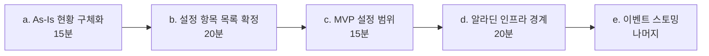
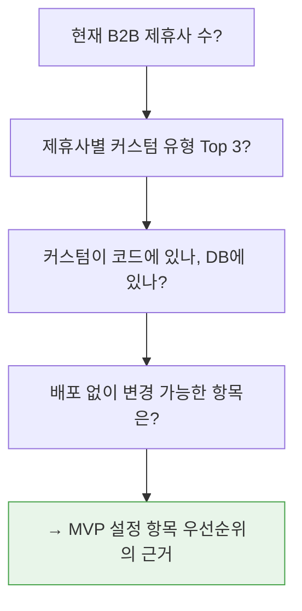
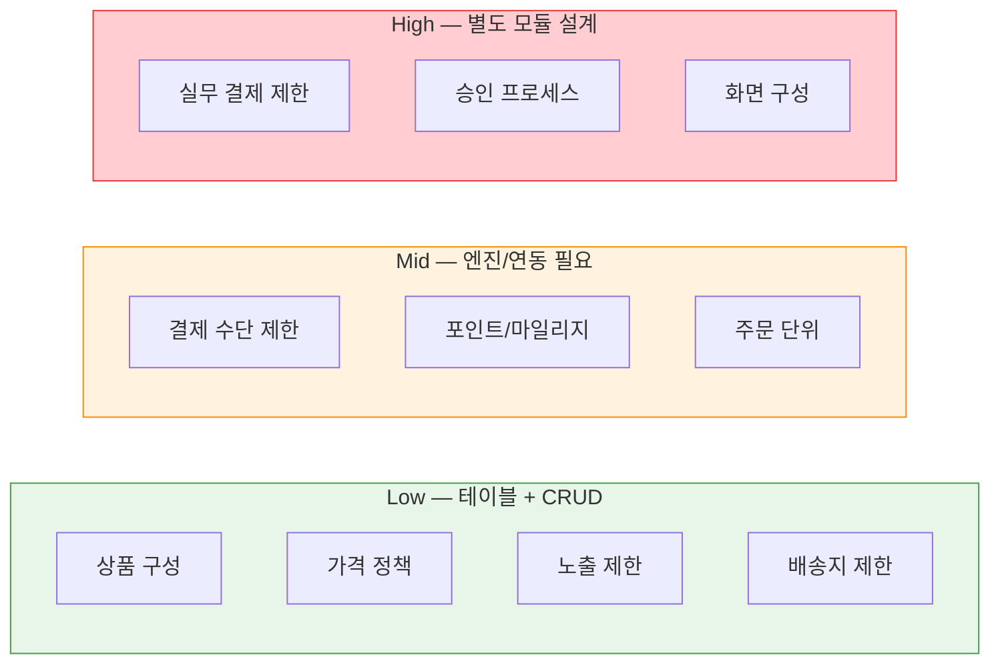
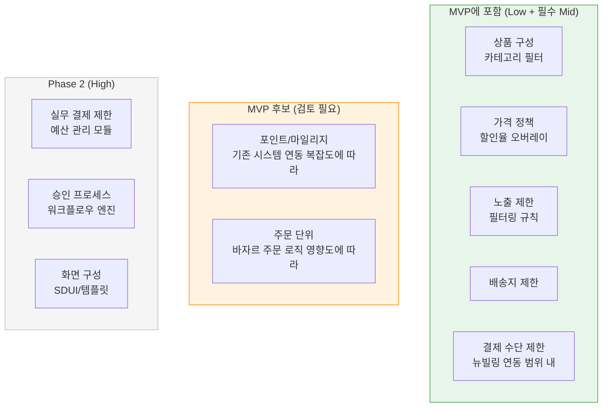
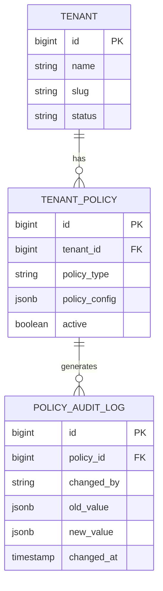
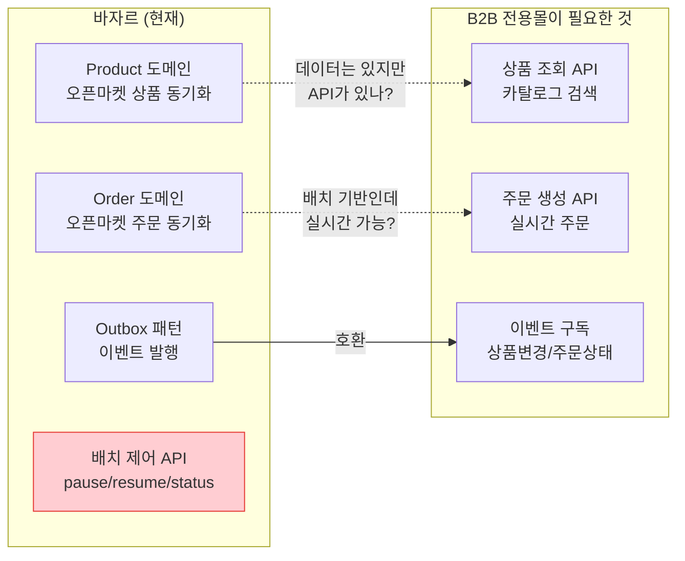
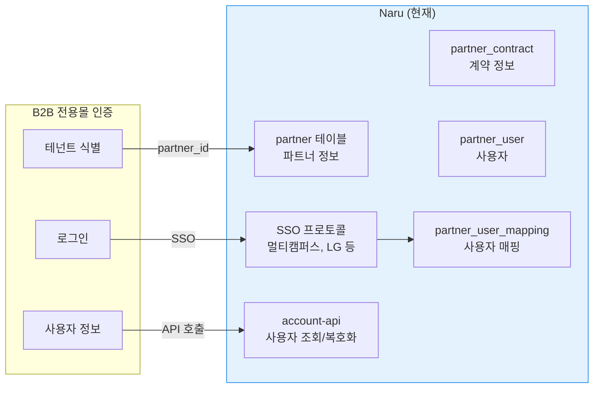
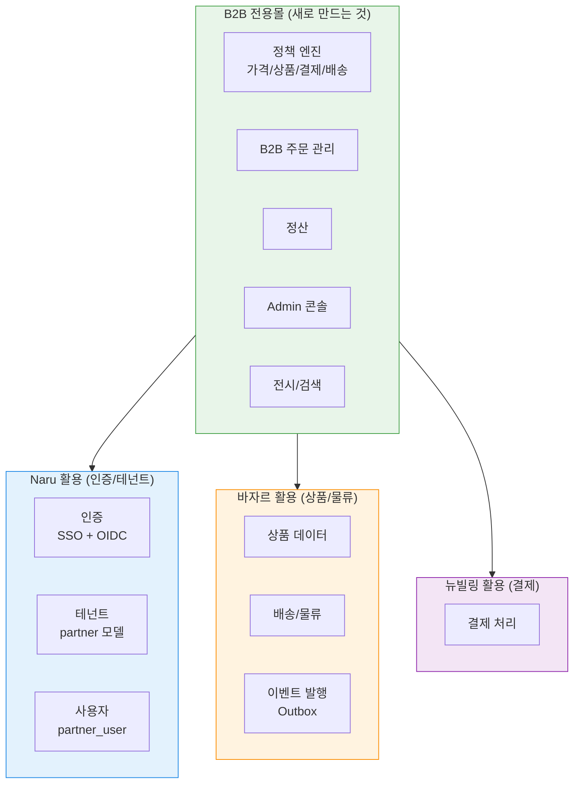

# B2B 전용몰 Scope 설정 회의 — 기술 관점 준비 자료

> 회의일: 2026-04-10(목) 15:00
> 목적: 프로젝트 방향성 및 범위(Scope) 설정
> 참석자: 팀장, 김정민(BE/아키텍처), 조은흠(FE), 안혜련(기획), 이현민(기획)
> 기반 문서: [b2b-store-ceo-review.md](../reviews/b2b-store-ceo-review.md) | [b2b-saas-platform-concept.md](../scope/b2b-saas-platform-concept.md)

---

## 회의 아젠다

---

## a. As-Is 현황 구체화 — 기술 관점 보강

### 기획에서 나온 문제점 + 기술적 원인

| 문제 (기획) | 기술적 원인 (확인 필요) | 회의에서 질문 |
|------------|----------------------|-------------|
| B2C/B2B 정책 충돌 | B2B 로직이 B2C 코드에 if/else로 박혀 있나? 별도 테이블? | 현재 B2B 분기가 코드에 몇 군데? |
| 제휴사별 커스텀 과부하 | 커스텀이 코드 수정인가, 설정값 변경인가 | 최근 제휴사 추가에 걸린 시간/공수? |
| 관리 가시성 부재 | 제휴사 설정이 어디에? DB? 코드? 설정 파일? | 제휴사 설정 변경 시 배포가 필요한가? |

### 확인이 필요한 현행 데이터

> **기술 코멘트**: 현행 커스텀이 코드에 박혀 있으면 "설정 기반"으로 전환하는 것 자체가 핵심 가치. DB에 이미 있다면 Admin UI만 만들면 되는 항목도 있을 수 있음.

---

## b. 설정 항목 목록 확정 — 기술 난이도 분석

기획 정의에서 나온 "설정만으로 제휴사별 맞춤형 몰 생성"을 구현하려면, 설정 항목별 기술 난이도를 알아야 한다.

### 설정 항목 후보 + 기술 구현 난이도

| 설정 항목 | 예시 | 기술 구현 | 난이도 | 비고 |
|----------|------|----------|:------:|------|
| **상품 구성** | A사: IT도서만, B사: 전체 | 카테고리 필터 테이블 | **Low** | 바자르 카테고리 매핑 활용 |
| **가격 정책** | A사 10% 할인, B사 정가 | 가격 오버레이 테이블 | **Low** | 할인율/특별가/정가 선택 |
| **결제 수단 제한** | A사 포인트+카드, B사 후불만 | 결제 정책 엔진 | **Mid** | 뉴빌링 지원 범위에 의존 |
| **포인트/마일리지** | A사 적립 3%, B사 없음 | 적립 정책 테이블 | **Mid** | 기존 포인트 시스템 연동? |
| **실무 결제 제한** | 부서별 예산, 월 한도 | 예산 관리 모듈 | **High** | B2B 전용 워크플로우 |
| **승인 프로세스** | 50만원 이상 팀장 승인 | 워크플로우 엔진 | **High** | 상태 머신 설계 필요 |
| **화면 구성** | A사 검색 중심, B사 카테고리 | SDUI / 템플릿 | **High** | FE 아키텍처에 직접 영향 |
| **노출 제한** | A사: 성인도서 제외 | 필터링 규칙 테이블 | **Low** | 카테고리 필터와 유사 |
| **배송지 제한** | A사: 본사만, B사: 자유 | 배송 정책 테이블 | **Low** | |
| **주문 단위** | 최소 수량, 박스 단위 | 주문 규칙 테이블 | **Mid** | 바자르 주문 로직 영향 |

### 난이도별 분류

> **회의에서 결정할 것**: Low 4개는 MVP 확정. Mid/High 중 MVP에 넣을 것은?

---

## c. MVP 설정 범위 — 기술 관점 제안

### MVP 추천 (기술 실현 가능성 기준)

### 정책 엔진 데이터 모델 (초안)

MVP Low 항목들은 하나의 정책 엔진으로 통합 가능:

`policy_type` 예시:
- `CATEGORY_FILTER`: `{"include": ["IT", "경영"], "exclude": ["성인"]}`
- `PRICE_OVERLAY`: `{"type": "DISCOUNT_RATE", "value": 10}`
- `PAYMENT_METHOD`: `{"allowed": ["CARD", "POINT"], "denied": ["DEFERRED"]}`
- `DELIVERY_RESTRICTION`: `{"type": "ADDRESS_LIST", "addresses": [...]}`

> **장점**: 신규 정책 타입 추가 시 코드 변경 최소화 (jsonb 활용). 운영자가 Admin에서 즉시 설정 가능.
> **주의**: jsonb 스키마 검증 로직 필요. 잘못된 설정이 들어가면 런타임 오류.

---

## d. 알라딘 인프라 경계 — 기존 시스템 분석

### 바자르 (BazaarServer) — 활용 가능 범위

바자르 프로파일(`catalog/bazaar.yaml`) 기반 분석:

| 항목 | 바자르 현황 | B2B 전용몰 활용 가능? |
|------|-----------|---------------------|
| **상품 데이터** | Product 도메인, 배치 동기화 | 가능 — 상품 원본 소스 |
| **주문 처리** | Order 도메인, 배치 기반 | **확인 필요** — REST API로 실시간 주문 가능? |
| **배송** | Fulfillment 도메인 | 가능 — 연동 |
| **이벤트 발행** | Transactional Outbox 패턴 있음 | **매우 유용** — 이벤트 기반 아키텍처와 직접 호환 |
| **API** | 배치 제어 API만 노출 | **GAP** — B2B용 상품/주문 REST API 없을 수 있음 |

**핵심 질문 (회의에서 확인)**:
- 바자르에 B2B용 상품 조회/주문 생성 REST API가 있는가?
- 없으면 바자르에 API를 추가할 것인가, 전용몰이 직접 DB를 읽을 것인가?
- 바자르의 Outbox 이벤트를 전용몰이 구독할 수 있는 인프라(MQ 등)가 있는가?

### Naru — 활용 가능 범위

Naru 프로파일(`catalog/naru.yaml`) 기반 분석:

| 항목 | Naru 현황 | B2B 전용몰 활용 가능? |
|------|----------|---------------------|
| **파트너 모델** | partner, partner_contract 테이블 | **직접 활용 가능** — 테넌트 = Naru 파트너 |
| **사용자 매핑** | partner_user, partner_user_mapping | **직접 활용 가능** — B2B 사용자 인증 |
| **SSO 인증** | 멀티프로토콜 (RSA, 커스텀 등) | **직접 활용 가능** — 제휴사별 인증 방식 |
| **API 키 인증** | account-api (내부 네트워크) | 전용몰 → Naru account-api 호출 가능 |
| **암호화** | KMS 봉투 암호화 | 전용몰이 직접 할 필요 없음 (Naru 위임) |

**핵심 발견**: Naru가 이미 "파트너(테넌트) + 사용자 + 인증"을 갖고 있다. B2B 전용몰이 인증/사용자를 처음부터 만들 필요가 없을 수 있음.

**확인 필요**:
- Naru partner 모델이 B2B 전용몰의 테넌트 요구사항을 충족하는가?
- partner_contract에 가격 정책/결제 조건을 확장할 수 있는가?
- 전용몰 전용 역할(구매자, 관리자, 열람자)을 Naru에 추가할 것인가, 전용몰에서 관리할 것인가?

### 뉴빌링 — 확인 필요 항목

| 항목 | 확인 필요 |
|------|----------|
| B2B 결제 수단 지원 | 후불 결제, PO 기반 결제, 월 정산 가능? |
| 멀티테넌시 | 제휴사별 결제 설정 분리 가능? |
| API 인터페이스 | REST API 명세 확인 필요 |
| 멱등성 | 이중 결제 방지 메커니즘 있는가? |

### 인프라 경계 종합

**경계 원칙:**
- **Naru 활용**: 인증/테넌트/사용자는 Naru에 위임. 전용몰은 Naru의 consumer.
- **바자르 활용**: 상품 데이터와 물류는 바자르에서 가져옴. API 유무 확인 필요.
- **뉴빌링 활용**: 결제는 뉴빌링에 위임. B2B 결제 수단 지원 범위 확인 필요.
- **전용몰 소유**: 정책 엔진, B2B 주문 관리, 정산, Admin, 전시.

---

## e. 이벤트 스토밍 — 기술 준비

### 기존 시스템에서 이미 존재하는 이벤트

바자르의 Outbox 패턴에서 발행되는 이벤트 (확인 필요):

| 도메인 | 예상 이벤트 | 전용몰에서 구독? |
|--------|-----------|:---:|
| Product | 상품 등록/수정/삭제 | O |
| Product | 가격 변경 | O |
| Order | 주문 생성/상태 변경 | O |
| Fulfillment | 배송 시작/완료 | O |

### 전용몰이 새로 발행해야 하는 이벤트

| 도메인 | 이벤트 | 구독자 |
|--------|--------|--------|
| 테넌트 | TenantCreated, TenantSuspended | Admin, 정산 |
| 정책 | PolicyUpdated | 캐시 갱신, 감사 로그 |
| 주문 | B2bOrderCreated, B2bOrderApproved | 바자르, 정산, 뉴빌링 |
| 결제 | PaymentRequested, PaymentConfirmed | 주문 상태, 정산 |
| 정산 | SettlementCalculated, SettlementConfirmed | Admin, 보고서 |

### 기술 스택 확정 (참고)

Approach B + 기존 시스템 참조:

| 항목 | B2B 전용몰 | 근거 |
|------|-----------|------|
| Language | Kotlin | 팀 정책, bazaar/naru와 동일 |
| Framework | Spring Boot 3.x | bazaar/naru와 동일 |
| Architecture | Hexagonal + DDD | bazaar/naru와 동일 |
| DB | PostgreSQL | bazaar/naru와 동일 |
| 이벤트 | Transactional Outbox | bazaar 패턴 재사용 |
| Frontend | Next.js | catalog에 명시 |
| Hosting | AWS ECS/EKS | bazaar/naru와 동일 |

---

## 회의 중 결정 기록 템플릿

| # | 주제 | 결정 | 근거 | 담당 | 기한 |
|---|------|------|------|------|------|
| a-1 | 현재 B2B 제휴사 수 | | | | |
| a-2 | 커스텀 유형 Top 3 | | | | |
| a-3 | 커스텀 위치 (코드/DB) | | | | |
| b-1 | MVP 설정 항목 | | | | |
| b-2 | Phase 2 설정 항목 | | | | |
| c-1 | MVP 설정 범위 최종 | | | | |
| d-1 | 바자르 API 현황 | | | KJM | |
| d-2 | Naru 테넌트 활용 여부 | | | KJM | |
| d-3 | 뉴빌링 B2B 지원 범위 | | | | |
| e-1 | 이벤트 스토밍 일정 | | | | |

---

## 기술적 리스크 (회의에서 공유)

| 리스크 | 영향 | 확률 | 대응 |
|--------|------|------|------|
| 바자르에 B2B용 REST API가 없음 | 아키텍처 변경 필요 (직접 DB 접근 or API 추가 개발) | 중 | 회의 전 API 현황 확인 |
| Naru partner 모델이 B2B 요구사항 불충분 | 테넌트 모델 자체 개발 필요 | 저 | Naru 테이블 구조 확인 |
| 뉴빌링이 후불/PO 결제 미지원 | 자체 결제 로직 개발 필요 (공수 대폭 증가) | 중 | 뉴빌링 담당자 확인 |
| 정책 엔진 jsonb 구조가 복잡해짐 | 런타임 오류, 디버깅 어려움 | 중 | JSON Schema 검증 도입 |
| MAX-API 전환 병행으로 리소스 분산 | 4월 MUST 결정 지연 | 고 | 우선순위 명확화 |

## 김정민 사전 조사 항목

회의 전에 아래 항목을 확인하면 회의 효율이 크게 올라갑니다:

- [ ] 바자르 상품/주문 REST API 존재 여부 (배치 외)
- [ ] 바자르 Outbox 이벤트 목록 및 구독 방법 (MQ? HTTP webhook?)
- [ ] Naru partner/partner_contract 테이블 스키마 확인 (B2B 테넌트로 확장 가능?)
- [ ] Naru에 역할(Role) 모델이 있는가? (구매자/관리자/열람자)
- [ ] 뉴빌링 API 명세 확인 (B2B 결제 수단 지원 범위)
- [ ] 현행 B2B 제휴사 설정이 어디에 있는가 (코드? DB? 설정 파일?)
