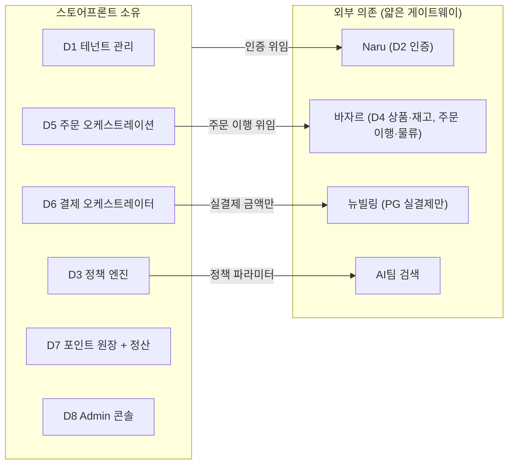

# 프로젝트 스코프 2차 — 주문 여정 상세

> 회의일: **2026-04-17(금)**
> 목적: 실 구매 고객의 **주문 여정** 단계별 상세화 + **도메인 경계** 추상화
> 참석자: 김규태(팀장), 조윤주(기획), 김정민(아키텍처), 조은흠(FE), 안혜련(B2B BE), 이현민(B2B BE)
> 전회 회의록: [b2b-store-meeting-minutes-0415.md](./b2b-store-meeting-minutes-0415.md) · [DEV2-A-1050](https://aladincommunication.youtrack.cloud/articles/DEV2-A-1050)
> 기반 문서: [b2b-store-scope-definition-0415.md](../scope/b2b-store-scope-definition-0415.md) · [multi-storefront-platform-direction.md](../scope/multi-storefront-platform-direction.md)

---

## 현재 위치

```
[완료] 1차 스코프             → [오늘] 주문 여정 상세        → [다음] 정책/테넌트 여정
      타겟·필수 설정 확정           여정 단계·도메인 경계             운영 여정 + 도메인 명세
```

## 회의 원칙

- 여정 단계 순서대로 **왼쪽에서 오른쪽으로** 따라가며 논의
- 각 단계마다 "**누가 / 무엇을 / 어느 도메인이 받는가**" 1문장 합의
- 기술 구현 세부(DB 스키마, API 시그니처)는 **다음 단계**로 미룸
- 의견이 갈리면 적어두고 진행

---

## 진행 순서 (총 90분)

### Step 1. 전회 확정 사항 확인 (5분)

화면에 띄우고 빠르게 확인:

- 타겟 고객군 4개 (대량구매 고객 포함)
- 계정 연동은 **Naru 경유 멀티테넌트**로 수렴
- SF 필수 설정 5개: 제휴사 생성 / 몰 On·Off / 분야 제어 / 제휴 포인트 개수·한도 / 가격·할인율
- 3가지 여정 분류, **오늘은 실 구매 고객 여정만** 다룬다

"이건 지난주 합의. 오늘은 이 중 **실구매자가 상품을 탐색해 결제·배송받기까지**를 단계별로 본다."

---

### 사전 정리 — KJM 준비 노트

회의 전 파악한 현황과 방향 메모. 회의에서 공유·검증한다.

**주문 (Q1·Q2)**
- 현행: 알라딘 표준 플로우 내에서 B2B 분기 처리. 투비(투비컨티뉴드)는 바자르를 통한 알라딘 주문 연동.
- **방향**: 스토어프론트가 **독립 주문 엔티티**를 소유하고, 해당 주문을 **바자르를 통해 연동** (이행 위임).
- → DEV2-5295 방향 잠정: (b) 독립 주문 도메인 + 바자르는 재고·물류 이행. 회의에서 확정.

**결제 (Q3)**
- 뉴빌링 단건결제 KB(REF-A-2070) 확인 완료. 현황:
  - API: `Ready → Approve → Cancel` (Strategy Pattern, Multi-PG)
  - PG: KCP, 토스페이먼츠, 토스, 네이버페이, 카카오페이, Inicis
  - 결제수단 enum: CARD(97), EASY(98), PAY(99), BANK(10), MOBILE(11), **POINT(12)**, **DEPOSIT(13)**, PREPAID(14), GIFT(15) 등
  - 취소: Full Cancel + **Partial Cancel** 지원 (멱등성 키, 분산 락 기반)
- **방향**: 단건결제(PG 결제) 연동을 먼저 하고, 복합 결제(포인트 혼합)는 후속.
- → 뉴빌링의 `POINT(12)` 타입이 파트너사 제휴 포인트를 태울 수 있는지 확인 필요. 현재는 PG 레벨 포인트(네이버페이 등) 전용으로 보임.

**포인트·결제수단 (Q4)**
- 파트너사 제휴 포인트: 종류가 여러 개(복지 포인트 2~3개 등). **알라딘 포인트**(적립금/마일리지) 연동도 필요.
- 추가 결제수단(예치금, 선불카드, 상품권 등)도 확인 필요.
- → 포인트·결제수단 전체 매트릭스를 회의에서 정리: (a) 뉴빌링이 이미 지원 (b) SF가 자체 구축 (c) 연동 대상.

**서비스 카탈로그 + 구독 모델 — SaaS 핵심 구조**

테넌트(제휴사)가 플랫폼이 제공하는 **서비스 카탈로그에서 원하는 서비스를 선택**해서 구성하고, 선택된 서비스 단위로 **권한·정책·설정 전부가 분기**되는 구조.

```
서비스 카탈로그 (플랫폼 레벨)
├── 도서몰
├── 음반몰
├── 만권당 (구독)
├── LMS
├── 대량구매
└── ...

테넌트 A (삼성전자 DS)
├── [구독] 도서몰 ✅
│   ├── 가격 정책: 정가 기준 15% 할인
│   ├── 결제: 단건 + 복지포인트 2개
│   ├── 분야 제한: IT도서만
│   └── 권한: 관리자 3명, 조회만
├── [구독] 음반몰 ✅
│   ├── 가격 정책: 판매가 기준 10% 할인
│   ├── 결제: 단건 + 복지포인트 1개
│   └── 분야 제한: 없음
├── [미구독] 만권당 ❌
└── [미구독] LMS ❌
```

**모든 설정이 서비스 단위로 분기된다:**

| 설정 영역 | 서비스별 분기 예시 |
|----------|-----------------|
| 가격 정책 | 도서몰은 15% 할인, 음반몰은 10% 할인 |
| 결제 수단 | 도서몰은 복지포인트 2개, 음반몰은 1개 |
| 결제 패턴 | 전용몰 = 단건, 만권당 = 정기(빌링키) |
| 분야/카테고리 제한 | 서비스마다 다른 노출 범위 |
| 수량/금액 한도 | 서비스마다 다른 주문 제한 |
| 부분 취소/환불 | 서비스별 환불 정책 |
| 포인트 | 서비스별 사용 가능 포인트 종류·한도 |
| 권한 (RBAC) | 서비스별 관리자 역할·권한 범위 |
| Admin 설정 UI | 구독한 서비스만 설정 메뉴 노출 |

**아키텍처 영향:**

- **D1 테넌트 관리**: 서비스 카탈로그 + 구독 관리(`tenant_service_subscription`) 추가
- **D3 정책 엔진**: 정책 키가 `(tenant_id, service_type, policy_type)` 3차원으로 확장
- **D6 결제 오케스트레이터**: `(tenant_id, service_type)` 조합으로 결제 플로우 분기
- **D8 Admin 콘솔**: 구독한 서비스만 설정 메뉴 노출, 서비스별 독립 설정 화면
- **D2 인증/권한**: RBAC가 서비스 스코프를 가짐 (도서몰 관리자 ≠ 음반몰 관리자)

> 기존 tenant model의 `tenant_module_subscription` 설계가 이 역할. MVP는 전용몰 단일 모듈이라 enum으로 시작하되, **설계는 서비스 카탈로그 구조를 전제**로 잡는다.

**SF ↔ 뉴빌링 역할 원칙 (단건·정기 공통)**
- **SF = 결제 오케스트레이터**: 할인·포인트·취소·정기결제 스케줄 등 모든 비즈니스 로직 소유. **서비스별 분기 포함.**
- **뉴빌링 = PG 게이트웨이**: 단건 실결제(Ready/Approve/Cancel) + 빌링키 발급만. 서비스 구분 무관.
- 정기결제 확장 시에도 뉴빌링은 빌링키 발급까지만, 스케줄·재시도·알림은 SF 자체 관리 (REF-A-1882 참조)

**대량구매 인증 (Q6)**
- 고민 중: **대량구매 전용 파트너 그룹**을 지정 → 간단한 인증만으로 주문 가능하도록.
- → `store_type='BULK_ORDER'` 테넌트에 전용 `auth_type` (예: `SIMPLE` / `PARTNER_CODE`) 추가? Naru OIDC 경유 여부 검토.

---

### Step 2. 주문 여정 단계 정의 (55분)

> 기준: scope 문서 여정 2 (B2B 제휴사 직원)를 중심으로, 대량구매 담당자 / B2C 확장 가능성을 함께 표기.

```
① 진입·인증  →  ② 랜딩  →  ③ 탐색·검색  →  ④ 상품 상세  →  ⑤ 장바구니 →  ⑥ 주문  →  ⑦ 결제  →  ⑧ 배송  →  ⑨ 취소·환불
```

각 단계를 다음 표로 채운다. 빈칸은 회의 중 결정.

| 항목 | 질문 |
|------|------|
| 행위자 | 누가 이 단계를 수행? |
| 입력 | 시스템에 무엇이 들어오나? |
| 출력 | 사용자/다음 단계로 무엇이 나가나? |
| 적용 정책 | 어떤 테넌트 정책이 개입? |
| 외부 의존성 | Naru / 바자르 / AI검색 / 뉴빌링 중 무엇? |
| 소유 도메인 | D1~D8 중 어디? |
| 예외 흐름 | 실패·미권한 시 어디로? |

---

#### ① 진입·인증

| 항목 | 초안 |
|------|------|
| 행위자 | 실구매자 (B2B 임직원 / 대량구매 담당자) |
| 입력 | 제휴사 SSO 엔드포인트 접근, Naru OIDC 토큰 |
| 출력 | 테넌트 식별 + 세션 |
| 적용 정책 | `auth_type` 분기, 약관/개인정보 동의 |
| 외부 의존성 | **Naru** (OIDC / oidc-inbound 프로토콜) |
| 소유 도메인 | **D2 인증** |
| 예외 흐름 | 미동의 → 동의 수집 플로우, 인증 실패 → Naru 에러 |

**논의 포인트**
- 대량구매 담당자의 인증 흐름이 B2B 임직원과 동일한가? (계약 체결 전 진입?)
- "기존 알라딘 일반 회원" 흐름은 MVP에 있는가? (D2 `auth_type='ALADIN'` — Phase 2 확정?)
- **KJM 검토 중**: 대량구매 전용 파트너 그룹을 지정해 간단한 인증만으로 주문 가능하게 하는 방안. `store_type='BULK_ORDER'` 테넌트에 간편 인증 경로를 둘 수 있는지

---

#### ② 랜딩

| 항목 | 초안 |
|------|------|
| 행위자 | 인증 통과 사용자 |
| 입력 | 테넌트 컨텍스트 |
| 출력 | `service_endpoint.landing_url`로 redirect |
| 적용 정책 | 랜딩 URL / 랜딩 레이아웃 |
| 외부 의존성 | 없음 |
| 소유 도메인 | **D1 테넌트 관리** + **D8 Admin 콘솔** (랜딩 설정 입력) |
| 예외 흐름 | 랜딩 미설정 → 기본 랜딩 |

**논의 포인트**
- "맞춤형 필터링 랜딩"(예: 멀티캠퍼스 — 특정 카테고리/가격 이하만) 수준의 커스터마이징을 **설정만으로** 감당할 수 있나? 템플릿 단위? URL 파라미터 전달 방식?

---

#### ③ 탐색·검색

| 항목 | 초안 |
|------|------|
| 행위자 | 실구매자 |
| 입력 | 키워드, 카테고리 필터 |
| 출력 | 상품 리스트 (테넌트 필터 적용) |
| 적용 정책 | 몰타입 제한, 분야 제한, 검색 범위 제한 |
| 외부 의존성 | **AI팀 검색엔진** (테넌트별 필터 파라미터 지원 필수) |
| 소유 도메인 | **D3 정책 엔진** (정책 정의) + **D4 상품/카탈로그** (호출) |
| 예외 흐름 | 검색엔진 장애 → 바자르 DB 직접 필터 폴백 |

**논의 포인트 (AI팀 협업)**
- AI팀 검색엔진이 **테넌트별 필터 파라미터**(몰타입, 카테고리, 분야)를 지원하는가/언제부터? (A4 액션)
- MVP 일정에 맞지 않으면 폴백(바자르 DB 직접 필터) 성능은? 감수할 만한가?

---

#### ④ 상품 상세

| 항목 | 초안 |
|------|------|
| 행위자 | 실구매자 |
| 입력 | 상품 ID + 테넌트 |
| 출력 | 상품 정보 + **제휴사 전용가** (오버레이 적용) |
| 적용 정책 | 가격 오버레이, 할인율 (정가/판매가 기준), 수량 제한 미리보기 |
| 외부 의존성 | **바자르** (원본 상품/가격) |
| 소유 도메인 | **D4 상품/카탈로그** + **D3 정책 엔진** |
| 예외 흐름 | 테넌트 구매 불가 상품 접근 → 404 또는 안내 |

**논의 포인트**
- 할인율 적용 단위: 제휴사 전체 / 카테고리는 MVP In. **상품 단위는 트리거 C(성능 검증 후)** — 유지?
- **B2B2B / 몰 별 상이한 할인율** (4/15 신규 요구사항)은 가격 오버레이 테이블에 어떻게 태깅? tenant_id + sub_tenant_id?

---

#### ⑤ 장바구니

| 항목 | 초안 |
|------|------|
| 행위자 | 실구매자 |
| 입력 | 상품 + 수량 |
| 출력 | 장바구니 스냅샷 |
| 적용 정책 | 수량 제한 (계정·기간), 금액 한도 |
| 외부 의존성 | 바자르 (재고 확인) |
| 소유 도메인 | **D5 주문** |
| 예외 흐름 | 수량 초과 → 차단, 재고 부족 → 안내 |

**논의 포인트**
- 장바구니 영속성: 스토어프론트 소유? 바자르 공유?

---

#### ⑥ 주문

| 항목 | 초안 |
|------|------|
| 행위자 | 실구매자 |
| 입력 | 장바구니 + 배송지 + 결제수단 선택 |
| 출력 | 주문 번호, 주문 상태 |
| 적용 정책 | 배송비 정책, 수량·금액 제한 재검증, 결제수단 제한 |
| 외부 의존성 | **바자르** (주문 이행 연동) |
| 소유 도메인 | **D5 주문** + **D3 정책 엔진** |
| 예외 흐름 | 정책 위반 → 차단, 바자르 주문 실패 → 롤백 |

**잠정 방향 (KJM)**
- **독립 주문 엔티티**를 SF가 소유 → 바자르에는 이행(재고·물류) 위임.
- 현행: 알라딘 표준 플로우 내 B2B 분기. 투비는 바자르를 통한 알라딘 주문 연동.
- → SF 주문 ≠ 바자르 주문. SF가 주문 생명주기(생성·정책검증·상태관리)를 소유하고, 바자르에 주문 이행 API 호출.

**회의에서 확정 필요**
- 이 방향 팀장 합의
- 바자르 주문 이행 API가 이 패턴을 수용 가능한지 (바자르팀 확인)

---

#### ⑦ 결제

| 항목 | 초안 |
|------|------|
| 행위자 | 실구매자 |
| 입력 | 주문 + 결제수단 조합 (포인트 + PG) |
| 출력 | 결제 완료 / 실패 |
| 적용 정책 | 결제수단 제한, 제휴 포인트 사용 한도(개수·%), 할인 |
| 외부 의존성 | **뉴빌링** (PG 실결제만) |
| 소유 도메인 | **D6 결제 오케스트레이터(SF)** + **D3 정책 엔진** |
| 예외 흐름 | 포인트 차감 실패 → 중단 / PG 결제 실패 → 포인트 환원 롤백 |

**잠정 방향 (KJM) — SF = 결제 오케스트레이터, 뉴빌링 = PG 게이트웨이**

뉴빌링은 제휴 포인트 미지원. 알라딘 포인트도 지원 여부 불확실. 따라서:

```
주문 금액 산출 (SF)
  ↓
할인 적용 (SF 정책 엔진)
  ↓
포인트 차감 (SF가 직접 처리 — 제휴 포인트, 알라딘 포인트 모두)
  ↓
실결제 금액 = 주문금액 - 할인 - 포인트
  ↓
실결제 금액만 뉴빌링 단건결제 호출 (Ready → Approve)
```

- **SF 소유**: 할인 계산, 포인트 차감/환원, 결제수단 제한, 결제 상태 관리, 부분취소 로직, 정기결제 스케줄·재시도
- **뉴빌링 소유**: PG 실결제 처리만 (카드/간편결제/계좌이체 등) + 빌링키 발급
- 뉴빌링은 **최종 실결제 금액**만 받는 순수 PG 게이트웨이 역할

**정기결제 확장 시에도 동일 원칙 (REF-A-1882 참조)**
- 뉴빌링에서 **빌링키(Billing Key) 발급까지만** 위임
- 정기 결제 시도, 스케줄 관리, 재시도 로직은 **SF가 소유**
- 현행 뉴빌링 정기결제: 빌링키 라이프사이클(REGISTER→ISSUE→ACTIVE→INACTIVE), 월말/고정일 정책, 재시도 최대 3회
- → SF는 이 중 빌링키 발급 API만 사용하고, 나머지(결제 주기·재시도·알림)는 자체 구현

**뉴빌링 단건결제(REF-A-2070) 현황**
- API: Ready → Approve → Cancel (Strategy Pattern, Multi-PG)
- PG: KCP, 토스페이먼츠, 네이버페이, 카카오페이, Inicis 등 6개
- Full Cancel + Partial Cancel 지원 (멱등성 키, 분산 락 기반)
- 결제수단 enum: CARD(97), EASY(98), PAY(99), BANK(10), MOBILE(11) 등

**포인트·결제수단 매트릭스**

| 유형 | 처리 주체 | 비고 |
|------|----------|------|
| PG 카드/간편결제/계좌이체 등 | **뉴빌링** | 실결제 금액에 대해서만 |
| **파트너사 제휴 포인트** (복지 포인트 2~3개) | **SF 자체 원장 + 차감** | 종류 다양, 뉴빌링 미지원 확실 |
| **알라딘 포인트** (적립금/마일리지) | **SF가 직접 차감** | 뉴빌링 지원 여부 불확실 → SF에서 처리하는 것이 안전 |
| 예치금/선불카드/상품권 | 확인 필요 | 실제 B2B 사용 여부에 따라 |

**회의에서 확정 필요**
- SF = 결제 오케스트레이터 방향 팀 합의
- 알라딘 포인트 차감 API 연동 방식 (기존 시스템 어디에 원장이 있는지 — 안혜련/이현민 확인)
- 포인트 차감 → PG 결제 사이의 **트랜잭션 보장 전략** (Saga? 보상 트랜잭션?)

---

#### ⑧ 배송

| 항목 | 초안 |
|------|------|
| 행위자 | 실구매자 (수취) |
| 입력 | 주문 번호 |
| 출력 | 배송 상태 |
| 적용 정책 | 배송비 정책 (알라딘 동일 / 제휴사 별도) |
| 외부 의존성 | **바자르** (물류), 알라딘 배송 |
| 소유 도메인 | **D5 주문** (조회 중심) |
| 예외 흐름 | 배송 제한(기간·방식)은 트리거 C — MVP 범위 아님 |

---

#### ⑨ 취소·환불

| 항목 | 초안 |
|------|------|
| 행위자 | 실구매자 / 제휴사 관리자 |
| 입력 | 주문 번호 + 취소 사유 + 취소 단위(전체·부분) |
| 출력 | 취소 상태, 환불 결과 |
| 적용 정책 | 제휴사별 부분 취소 로직, 할인 재계산 |
| 외부 의존성 | **뉴빌링** (PG 취소만 — 실결제 금액 부분) |
| 소유 도메인 | **D6 결제 오케스트레이터(SF)** + **D5 주문** |
| 예외 흐름 | 포인트 환원 실패 → 재시도 큐 / PG 취소 실패 → 보상 처리 |

**잠정 방향 (KJM) — 부분취소·할인 모든 처리는 SF**

SF가 결제 오케스트레이터이므로 취소도 SF가 전체 흐름을 제어한다:

```
부분 취소 요청 (SF)
  ↓
취소 금액 산출 + 할인 재계산 (SF 정책 엔진)
  ↓
포인트 환원 (SF — 제휴 포인트 / 알라딘 포인트 각각)
  ↓
PG 취소 금액 산출 = 실결제 중 취소분
  ↓
뉴빌링 Cancel API 호출 (PG 실결제 취소분만)
```

**부분 취소 시나리오**

| 시나리오 | SF 처리 | 뉴빌링 처리 |
|---------|---------|------------|
| (a) PG 100% 결제 → 부분 취소 | 할인 재계산 | Partial Cancel (실취소 금액) |
| (b) 포인트 3,000 + PG 7,000 → 2,000원 취소 | 포인트 환원 우선 (2,000) | 없음 (PG 취소 불필요) |
| (c) 포인트 3,000 + PG 7,000 → 5,000원 취소 | 포인트 환원 3,000 | Partial Cancel 2,000 |
| (d) 제휴 포인트A 1,000 + 포인트B 2,000 + PG 7,000 → 전체 취소 | 포인트A 환원 1,000 + 포인트B 환원 2,000 | Full Cancel 7,000 |

> **핵심**: 환원 순서 규칙(포인트 먼저 → PG 나중)과 할인 소멸 시 재계산 로직을 SF 정책 엔진이 소유.

**회의에서 확정 필요**
- 포인트 환원 우선 순서 (제휴 포인트 먼저? 알라딘 포인트 먼저?)
- 할인 조건 미충족 시(부분 취소로 인해) 할인 재계산·추가 차감 여부
- 포인트 환원 → PG 취소 사이 **실패 보상 전략** (포인트 환원 성공 + PG 취소 실패 시?)

---

### Step 3. 도메인 경계 추상화 (20분)

위 9단계에서 등장한 도메인(D1~D8)을 **스토어프론트 소유 / 외부 의존**으로 재배치한다.



> SF가 주문·결제·포인트·할인·취소의 **전체 비즈니스 로직을 소유**하고, 외부(뉴빌링·바자르·Naru)는 얇은 게이트웨이/이행 역할만 수행.

**합의가 필요한 경계**

| # | 경계 | KJM 잠정 방향 | 회의에서 확정 |
|---|------|-------------|-------------|
| B1 | D5 주문 | **(b) 독립 주문 도메인** + 바자르는 이행만 | 팀장 합의 |
| B2 | D6 결제 | **SF = 오케스트레이터** (할인·포인트·취소 전부), 뉴빌링 = PG 실결제만 | 팀장 합의 |
| B3 | D7 포인트 | **SF 자체 원장** (제휴 포인트 + 알라딘 포인트 모두) | 알라딘 포인트 기존 원장 확인 |
| B4 | D3 정책 엔진 | B2B2B / 몰 별 할인율을 `tenant_policy` 계층 구조로 수용 | 2-tier 모델 상세 |
| B5 | 서비스 카탈로그 × 전 도메인 | 테넌트가 서비스를 선택 구독하고, 구독 서비스 단위로 정책·권한·결제·설정 전부 분기 | MVP는 전용몰 단일이지만, 설계는 서비스 카탈로그 전제 |

---

### Step 4. 액션·다음 회의 (10분)

| # | 항목 | 담당 |
|---|------|------|
| N1 | 주문 여정 최종본 반영 → scope 문서 여정 2 갱신 | 조윤주 + 김정민 |
| N2 | B1~B4 경계 결정사항 → `b2b-store-tenant-model.md` 업데이트 | 김정민 |
| N3 | D7(제휴 포인트 원장) 설계 티켓 생성 | 김정민 |
| N4 | AI팀 검색엔진 일정 확인 공식 요청 | 김정민 |
| N5 | 3차 회의(운영자·제휴사 관리자 여정) 일정 확정 | 조윤주 |

---

## 내 티켓(DEV2-5283) 연관 — 문의·정의 필요 항목

### 오늘 직접 진전 가능 (4개)

| 티켓 | 요약 | 상태 | 여정 단계 / 경계 | 오늘 문의·정의 내용 |
|------|------|------|-----------------|-------------------|
| DEV2-5295 | 주문 흐름 결정 (바자르 활용 vs 독립) | Open | ⑥주문 / B1 | 현행 B2B 주문이 알라딘 표준 플로우를 타는지 별도 분기인지 (안혜련/이현민). 바자르 래핑 vs 독립 주문 엔티티 방향 (팀장 의사결정) |
| DEV2-5296 | 결제 연계 결정 (뉴빌링 API, B2B 결제수단) | Backlog | ⑦결제 / B2·B3 | 뉴빌링 처리 범위(공통 PG, 카드, 공통 부분취소) vs SF 처리 범위(제휴 포인트 원장, 제휴사 전용 부분취소) 경계 명시. 제휴 포인트 원장 위치 결정 (팀장 의사결정) |
| DEV2-5290 | 상품 연동 아키텍처 결정 | Open | ③탐색·검색, ④상품 상세 | AI팀 검색엔진 테넌트별 필터(몰타입/분야/카테고리) 지원 여부·일정 확인 결과 공유. 폴백(바자르 DB 직접 필터) MVP 감수 가능 여부. 가격 오버레이 적용 시점(실시간 vs 배치) |
| DEV2-5298 | 서비스 경계 확정 + Context Map | Open | Step 3 전체 | B1~B4 중 오늘 확정 가능 범위 합의. Context Map 초안 작성 일정 |

### 오늘 부분 확인 가능 (4개)

| 티켓 | 요약 | 상태 | 여정 단계 | 오늘 확인 포인트 |
|------|------|------|----------|----------------|
| DEV2-5289 | 인증 구조 결정 | Open | ①진입·인증 | 대량구매 담당자 인증 흐름 = B2B 임직원과 동일? `auth_type='ALADIN'`은 Phase 2 확정? |
| DEV2-5294 | 전시 모델 결정 (SDUI) | Open | ②랜딩 | 맞춤 필터링 랜딩(멀티캠퍼스 사례)을 SDUI 설정만으로 감당 가능? 별도 템플릿 필요? |
| DEV2-5288 | 플랫폼 통합 사용자 모델 | Open | 여정 3 (관리자) | 2-tier 정책 모델에서 제휴사 관리자의 개입 단계·권한 구체 사례 확인 |
| DEV2-5297 | 정산 모델 결정 | Backlog | ⑨취소·환불 | 복합 결제(카드 + 제휴 포인트 2개) 부분 취소 시 환원 순서 규칙 → 정산 모델에 영향. 시나리오 논의 시 메모 |

### 회의 질문 리스트

| # | 질문 | 관련 티켓 | 답변 대상 | 사전 파악 |
|---|------|----------|----------|----------|
| Q1 | 현행 B2B 주문이 알라딘 표준 플로우를 타나, 별도 분기가 있나? | DEV2-5295 | 안혜련/이현민 | **파악 완료** — 표준 플로우 내 분기. 투비는 바자르 경유 |
| Q2 | 바자르 주문 래핑 vs 독립 주문 엔티티 — 방향? | DEV2-5295 | 팀장 의사결정 | **KJM 잠정**: 독립 주문 엔티티 + 바자르 이행 위임 |
| Q3 | 뉴빌링 결제 연동 범위 — 단건결제 먼저? | DEV2-5296 | 전체 | **KJM 제안**: 단건결제(REF-A-2070) 먼저, 복합 결제는 후속 |
| Q4 | 포인트 체계 전체 그림 — 제휴 포인트 / 알라딘 포인트 / PG 포인트 경계 | DEV2-5296 | 전체 | 제휴 포인트 종류 다양 + 알라딘 포인트 연동 필요. 매트릭스 정리 필요 |
| Q5 | AI팀 검색엔진 테넌트별 필터 지원 일정 | DEV2-5290 | 김정민 (확인 결과 공유) | 미확인 |
| Q6 | 대량구매 담당자 인증 흐름 | DEV2-5289 | 전체 | **KJM 검토 중**: 전용 파트너 그룹 + 간편 인증 방안 |
| Q7 | B1~B4 경계 중 오늘 확정 가능한 범위 | DEV2-5298 | 전체 | B1(주문)은 잠정 방향 있음. B2(결제)는 단건 먼저로 축소 가능 |

> **팀장 의사결정 필요**: Q2(독립 주문 엔티티 방향 확정), Q3(단건결제 먼저 전략 합의)
> **전체 논의 필요**: Q4(포인트·결제수단 매트릭스), Q6(대량구매 인증 방식)

---

## 예상 난점

1. **B1 주문 경계 (바자르 활용 vs 독립)** — 결정이 늦어지면 Phase B 전체가 지연. 팀장 의사결정 필요.
2. **B3 제휴 포인트 원장 위치** — 뉴빌링 미지원이 확정되어 스토어프론트 소유가 되면 정산(D7)까지 영향. 복잡도 High.
3. **AI팀 검색엔진 일정** — 외부 팀 종속. 확답 전까지 Phase B MVP 검색 폴백 방안 준비 필요.

## 사전 배포 (4/16 오늘 중)

- 본 문서 공유
- 안혜련/이현민: 현행 B2B 주문/결제/취소 실태 **간단 노트** 사전 공유 요청 (특히 제휴 포인트 사용 사례)
- 김정민: 뉴빌링 팀에 **결제 범위 경계** 사전 질의
