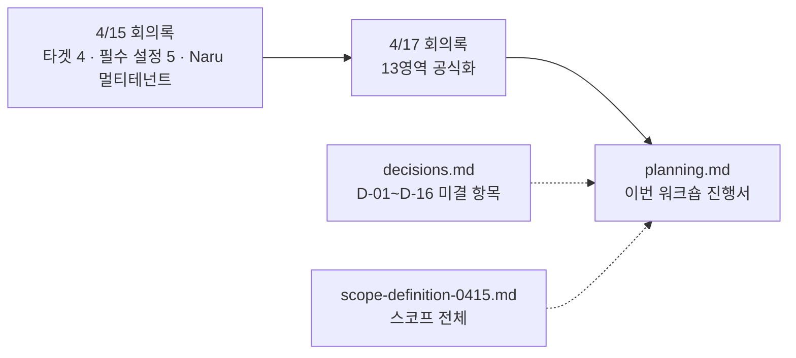
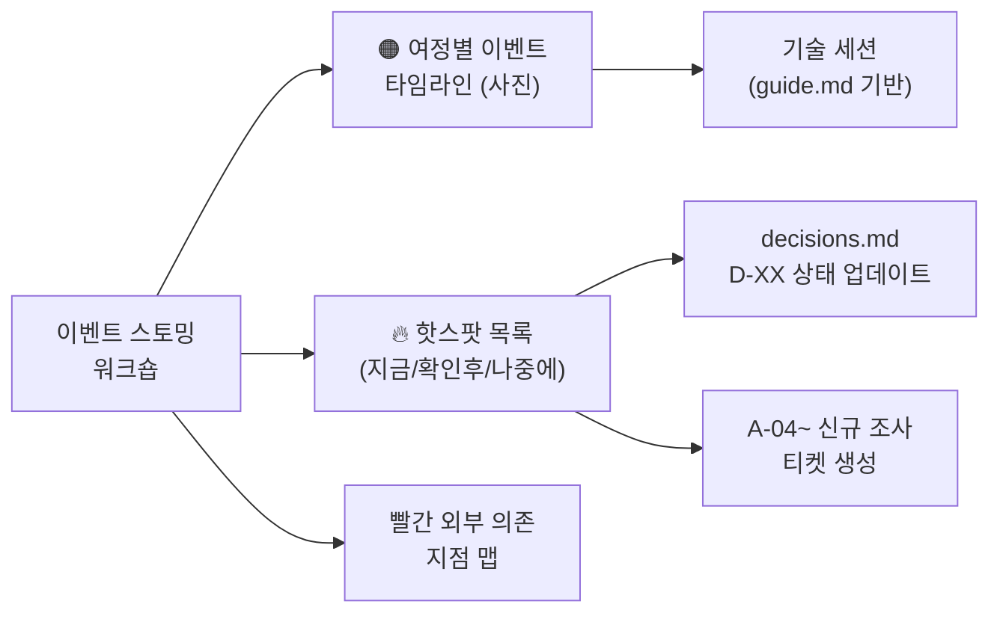

# 4/20 이벤트 스토밍 워크숍 — 사전 배포

> **실행일: 2026-04-20 (월)** · 소요 90분
> 목적: 유저 여정을 따라가며 **"시스템에서 무슨 일이 일어나는가"**를 전원이 합의
> 참석자 (7명): 김규태(팀장), 조윤주(기획), 강인용, 김정민(아키텍처, 퍼실리테이터), 조은흠(FE), 안혜련(B2B BE), 이현민(B2B BE)
> 상위 문서: [b2b-store-event-storming-planning.md](../event-storming/b2b-store-event-storming-planning.md)
> 기반 회의록: [b2b-store-meeting-minutes-0417.md](./b2b-store-meeting-minutes-0417.md) · [b2b-store-meeting-minutes-0415.md](./b2b-store-meeting-minutes-0415.md)

---

## 사전 배포 목적

참석자가 워크숍 전에 **읽고 와야 할 것**과 **준비해 올 것**을 한 페이지로. 본 문서는 `planning.md`의 시행 보조 자료다.

**워크숍 본체는 [planning.md](../event-storming/b2b-store-event-storming-planning.md)** — 진행 순서·포스트잇 규칙·여정별 뼈대는 거기 있음.

---

## 1. 워크숍 전 필독 (참석자 전원)



### 1.1 필수 (20분 투자)

| 문서 | 읽는 이유 | 시간 |
|------|----------|------|
| [planning.md](../event-storming/b2b-store-event-storming-planning.md) | **이번 워크숍 진행 방식** — 포스트잇 3색 규칙, 시간 배분, 여정 3개 | 5분 |
| [meeting-minutes-0417.md](./b2b-store-meeting-minutes-0417.md) | **13영역 공식 분류** 확정. 워크숍 벽 구조가 이 기준 | 10분 |
| [meeting-minutes-0415.md](./b2b-store-meeting-minutes-0415.md) | 타겟 고객 4개, SF 필수 설정 5개, Naru 멀티테넌트 | 5분 |

### 1.2 역할별 추가 자료

| 역할 | 추가 읽기 | 이유 |
|------|----------|------|
| 조윤주(기획), 강인용 | [scope-definition-0415.md](../scope/b2b-store-scope-definition-0415.md) | 고객 여정 3 + MVP 분류 전체 맥락 |
| 안혜련·이현민(B2B BE) | [meeting-prep-0417.md](./b2b-store-meeting-prep-0417.md) 주문 ⑥·⑦·⑨ | 현행 플로우 vs 신규 방향 |
| 김정민 | [decisions.md](../domain/b2b-store-domain-decisions.md) D-01~D-16 전체 | 퍼실리테이션 중 핫스팟 매핑 |
| 조은흠(FE) | [multi-storefront-platform-direction.md](../scope/multi-storefront-platform-direction.md) | 테넌트별 UI 컨셉 |

---

## 2. 참석자 사전 준비 요청

### 2.1 안혜련·이현민 — **A-01 바자르 이행 API 조사 결과** (필수)

이벤트 스토밍 핫스팟(D-07)의 전제. 워크숍에서 "모른다"로 남으면 Phase 1 재설계 리스크.

확인 항목:
- [ ] 바자르가 "외부 주문을 받아 이행"하는 API 존재하는가
- [ ] 요청·응답 스펙 (주문 정보 구조, 상태 콜백)
- [ ] 에러 모드 (재고 부족, 배송 실패)

**발표 시간**: 워크숍 Step 1 실구매자 여정 ⑥주문 구간 (5분)

### 2.2 김정민 — **A-02 AI검색 테넌트 필터 지원 여부** (필수)

이벤트 스토밍 핫스팟(D-04 4-3)의 전제.

확인 항목:
- [ ] AI검색 엔진이 `tenant_id` / `service_type` / `category` 필터 지원 여부
- [ ] 지원 일정이 MVP 일정과 맞는지
- [ ] 미지원 시 바자르 DB 직접 필터 폴백 타당성

**발표 시간**: 워크숍 Step 1 ③검색 구간 (3분)

### 2.3 조윤주 — **4/17 신규 검토 항목** 기획 초안 스케치

- 프로모션·기획전 기능 범위
- 공지(랜딩 팝업) 패턴
- 고객 CS 관리 화면 컨셉 (현 땡큐 웹로그인 대체)
- 계약 관리 항목 목록
- SDUI 커스텀 수준 — 블록 차트 형태

> 디테일은 워크숍 후 별도 세션. 지금은 **"이벤트 스토밍 여정에 이 기능이 어디에 붙는지"** 감만 있으면 됨.

### 2.4 김규태 — 핫스팟 의사결정 기준 사전 정리

워크숍 Step 4(핫스팟 분류) 때 "지금 결정 / 확인 후 결정 / 나중에 결정"을 빠르게 판단하기 위한 팀장 기준 사전 정리.

참조: `decisions.md`의 **D-01~D-16 16개 결정 목록 + A-01~A-03 조사 항목**.

### 2.5 조은흠(FE) — 사용자 화면 관점 이벤트 메모

"이 화면에서 사용자는 뭘 보나"를 3가지 여정(실구매자·운영자·관리자)별로 브레인스토밍. 워크숍 중 🟠 이벤트 보강용.

### 2.6 강인용 — 비즈니스·기획 관점 보강

현업에서 놓친 이벤트(알림·모바일 사용 시나리오·할인 연속 적용 등)가 있는지 자유 메모.

---

## 3. 준비물 (물리적)

| 준비물 | 담당 | 용도 |
|--------|------|------|
| 화이트보드 또는 긴 벽면 | 회의실 예약자 | 타임라인 |
| 포스트잇 3색 (🟠 주황·🔵 파랑·🔥 분홍) | 김정민 | 색상 규칙 필수 |
| 굵은 마커 (검정·빨강) | 김정민 | 빨강은 외부 시스템 표시 |
| 4/17 회의록 프린트 or 화면 | 김정민 | 13영역 기준 참조 |
| 카메라·스마트폰 | 전원 | Step 4 사진 촬영 |
| 디지털화 담당자 지정 | **김정민** | 사진 → Mermaid 전환 |

---

## 4. 워크숍 흐름 요약 (자세한 진행은 planning.md)

```
00:00  인트로·3색 규칙        (5분)   김정민
00:05  실구매자 여정           (40분)  전원 — 가장 중요
00:45  운영자 여정             (15분)  조윤주 주도
01:00  제휴사 관리자 여정      (10분)  조윤주 주도
01:10  외부 시스템 빨강 표시   (5분)   김정민
01:15  🔥 핫스팟 분류·의사결정 (15분)  김규태 주도
```

### 오늘 특히 답이 나와야 하는 것

**decisions.md D-XX 기준**

| 여정 구간 | 결정 대상 |
|----------|----------|
| 실구매자 ⑥주문 | D-07 (주문 플로우) — A-01 조사 결과 + 팀장 확정 |
| 실구매자 ⑦결제 | D-02 (혜택-결제 경계) — 오케스트레이터 방향 |
| 실구매자 ⑨클레임 | D-02 2-5 + D-03 3-2 (환원 순서) |
| 실구매자 ③검색 | D-04 4-3 (SF 자체 검색 vs AI 의존) — A-02 결과 기반 |
| 운영자 여정 | D-10 (서비스별 정책 매트릭스) — 서비스 카탈로그 차원 유지? |
| 관리자 여정 | D-11 11-1, 11-3 (수정·조회 범위) |

### 오늘 분류만 하고 결정은 미루는 것

| 항목 | 처리 |
|------|------|
| D-12 B2B 결제수단·세금계산서 | Phase 2 세션으로 이연 — 결제 파급도 큼 |
| D-13 테넌트·관리자 생명주기 | 별도 세션 (운영 관점) |
| D-14 감사 로그 | 별도 세션 (아키텍처 관점) |
| D-15 외부 장애 Degraded Mode | 별도 세션 (플랫폼 관점) |
| D-16 고객 CS 관리 | A-03(안혜련·이현민 조사) 후 결정 |

---

## 5. 산출물 (워크숍 종료 시)



| 산출물 | 형식 | 디지털화 담당 |
|--------|------|-------------|
| 여정별 🟠 이벤트 타임라인 | 벽 사진 | 김정민 → Mermaid 전환 |
| 🔥 핫스팟 분류 (3 bucket) | 포스트잇 사진 + 표 | 김정민 |
| 빨간 외부 의존 지점 | 사진 | 김정민 |
| 참석자별 액션 아이템 | 회의록 | 김정민 |

---

## 6. 다음 단계

- **4/20 + α일**: decisions.md D-XX 상태 업데이트 (워크숍 결과 기반)
- **4/21~22**: 기술 세션 일정 확정 ([guide.md](../event-storming/b2b-store-event-storming-guide.md) 기반)
- **4/말**: DEV2-5298 Bounded Context Map 초안 작성
- **5월 초**: 외주 인력 온보딩 문서 준비 (BE 1 + FE 1, 5월 투입)

---

## 체크리스트 — 오늘 오전까지 (김정민)

- [ ] 본 문서 참석자 7명에게 배포 (Slack + 이메일)
- [ ] 필수 사전 읽기 3개 문서 링크 공유
- [ ] A-01·A-02 결과 발표 시간 확보 확인 (안혜련·이현민·김정민)
- [ ] 회의실 예약 + 벽·포스트잇·마커 준비
- [ ] planning.md §1 뼈대 다이어그램 퍼실리테이터용 프린트
- [ ] decisions.md D-01~D-16 요약 한 장 출력 (핫스팟 결정 시 참조)
