# B2B 전용몰 리뷰 — 전체 그림

> 작성일: 2026-04-07 | 수정일: 2026-04-08 | 작성자: 김정민 | 상태: 리뷰 완료
> 기반 문서: [b2b-saas-platform-concept.md](../scope/b2b-saas-platform-concept.md)
> 관련 티켓: [DEV2-5283](https://aladincommunication.youtrack.cloud/issue/DEV2-5283)

## 프로젝트 정의

### 현행 문제점 (As-Is)

| 문제 | 설명 |
|------|------|
| **구조적 한계** | B2C와 동일 구조 내에서 B2B를 운영하여 정책 체계 충돌, 운영 복잡도 증가, 확장성 한계 |
| **커스터마이징 과부하** | 제휴사별 포인트 결제, 실무 결제 제한, 마일리지 정책 등 요구사항이 매우 다양하며, 매번 과도한 커스텀 개발 투입 |
| **관리 효율성 저하** | 각 제휴사별 설정 내용 및 정책을 한눈에 파악할 수 없음 |

### 핵심 정의 (To-Be)

> **B2B 고유의 거래 구조와 정책을 독립적으로 수용하기 위한 전용 커머스 플랫폼 구축 프로젝트**
>
> 운영자가 개발자의 도움 없이 설정만으로 제휴사별 맞춤형 몰을 즉시 생성할 수 있는 시스템.
> 알라딘의 인프라를 활용하되, 개별 상품 구성과 화면, 관리 기능을 독립적으로 운영할 수 있는 커머스 플랫폼.

### 기대 효과

| 효과 | 내용 |
|------|------|
| **운영/개발 효율성** | 반복적인 제휴 개발 업무 제거, 운영자가 유연하게 정책 설정 |
| **비즈니스 경쟁력** | 기업 고객 요구사항에 신속 대응(Time-to-Market), 매출 증대 기여 |
| **UX 향상** | B2B 고객 목적(검색 중심 등)에 최적화된 독립적 사용자 경험 |
| **기술 현대화** | 로직 재사용성, 서비스 분리 구조로 생산성 및 확장성 확보 |

### 전환 전략

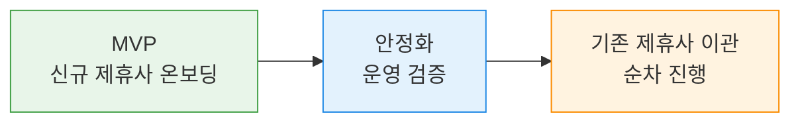

- **MVP**: 신규 제휴사부터 전용몰에서 시작
- **이후**: 기존 제휴사는 안정화 후 순차 이관 (별도 계획)

## Phase 0 확정 사항

| 결정 | 내용 | 근거 |
|------|------|------|
| 접근 방식 | **Approach B: 얇은 코어 인터페이스 선행** | 전용몰 선행하되, 테넌트/인증/결제 인터페이스를 먼저 정의하여 추출 비용 절감 |
| MVP 범위 | **전용몰만** (LMS, 만권당은 후순위) | Q3 개발 일정 역산, 가시적 결과물 우선 |
| MVP 대상 | **신규 제휴사부터** (기존 이관은 나중에) | 하위호환성 부담 없이 설계에 집중 |
| 외주 | **BE 1명 + FE 1명, 5월 투입** | |
| 코어 위치 | **전용몰 내 `core/` 패키지** | 물리적 분리 없이 패키지 경계로 관리, 나중에 추출 가능 |
| 확장: 이벤트 기반 | **채택** | 코어 인터페이스에 도메인 이벤트 계약 포함, LMS/만권당 확장 대비 |
| 확장: 가격 정책 | **채택** | 기존 B2B 운영 중이므로 파트너별 가격 조건 설계 필수 |

### 설계의 핵심 드라이버

프로젝트 정의에서 도출되는 아키텍처 핵심 요구사항:

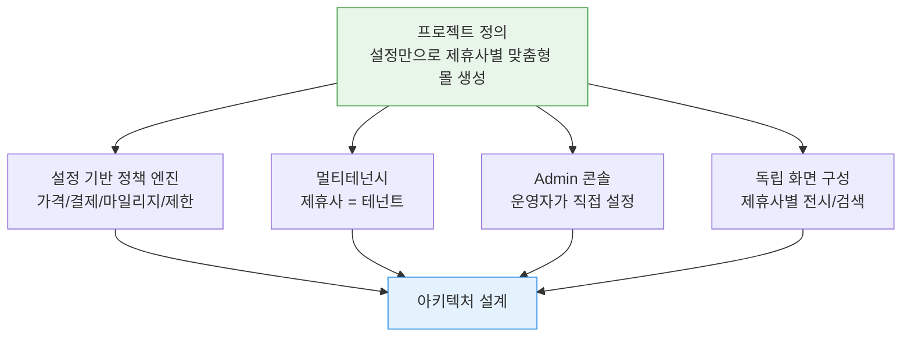

| 드라이버 | 아키텍처 영향 | 설계 시 결정 필요 |
|----------|-------------|------------------|
| **설정 기반 정책 엔진** | 제휴사별 정책을 코드가 아닌 데이터로 관리 | 설정 항목 목록, 정책 엔진 구조 |
| **멀티테넌시** | 테넌트 격리, DB 전략, 데이터 접근 제어 | 격리 수준, 자동 필터 메커니즘 |
| **Admin 콘솔** | 운영자 UI, 설정 CRUD, 제휴사별 대시보드 | Admin 범위, SDUI 활용 여부 |
| **독립 화면 구성** | 제휴사별 레이아웃/카테고리/검색 | 템플릿 vs SDUI vs 설정 기반 |

## 아키텍처 전체 그림

### 시스템 구성도

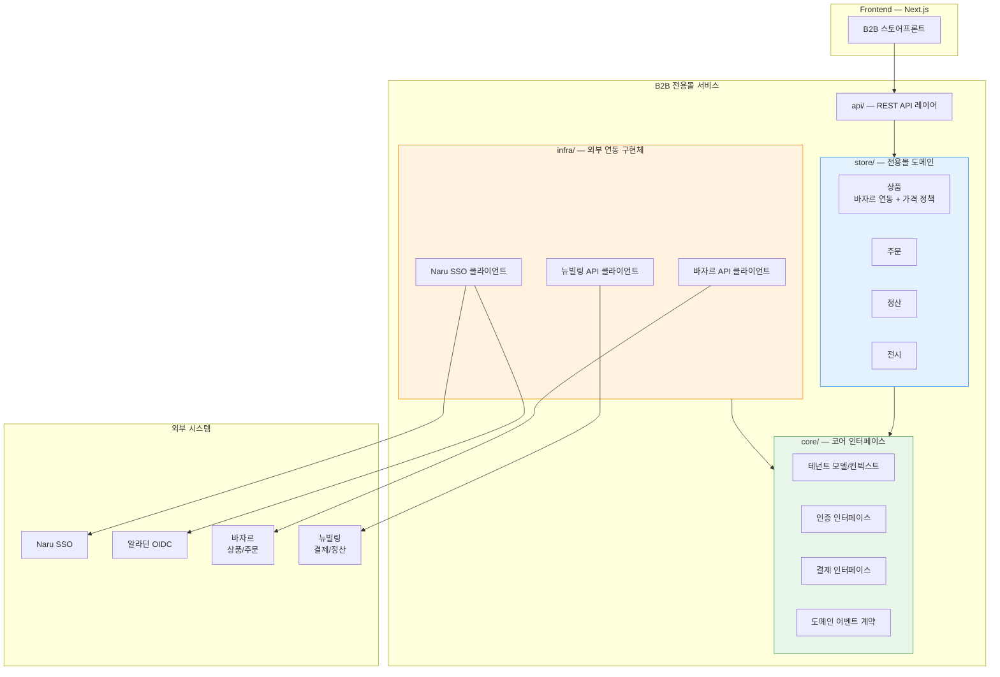

### 의존성 방향 규칙 (Hexagonal Architecture)

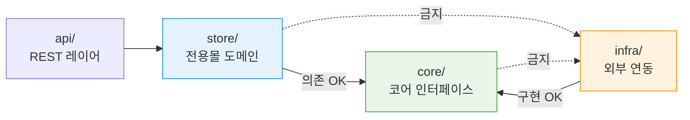

> **규칙**: `core/`는 어떤 외부 의존도 갖지 않는다. `store/`는 `core/`의 인터페이스를 통해 `infra/`를 사용한다. `infra/`는 `core/`의 인터페이스를 구현한다.

### 도메인 이벤트 흐름

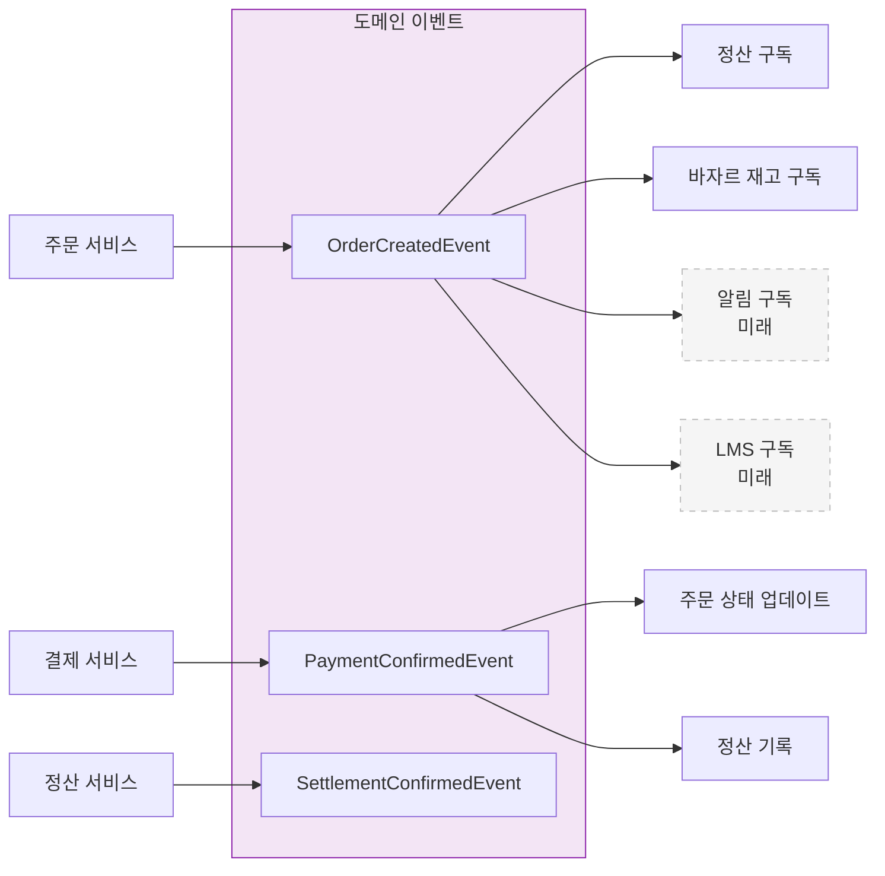

### 파트너 사용자 인증 흐름

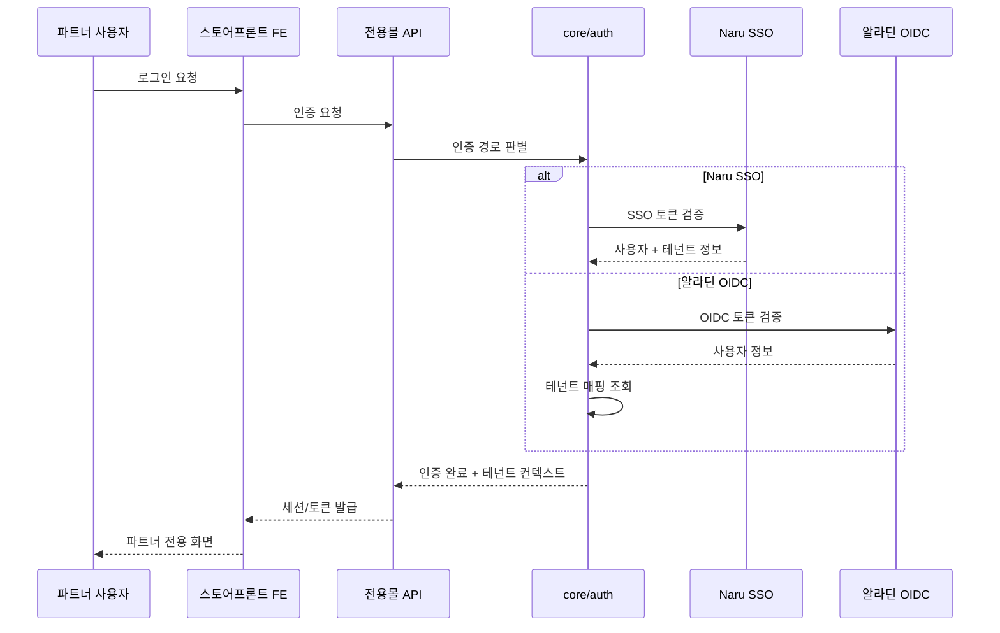

### 상품 조회 흐름 (가격 정책 포함)

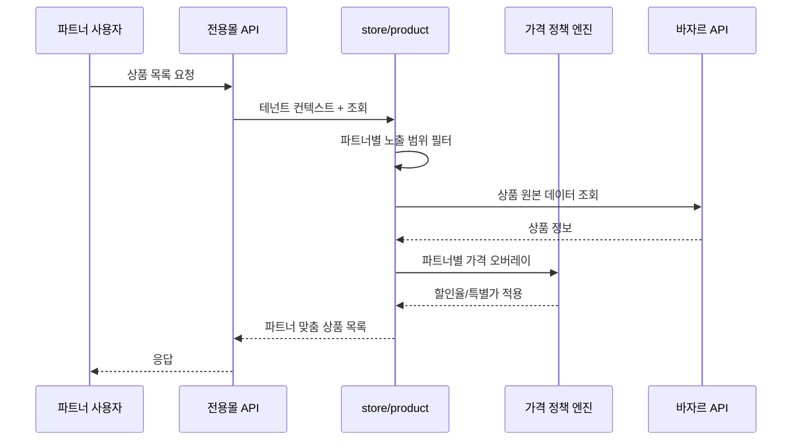

## 프로젝트 구조 (예상)

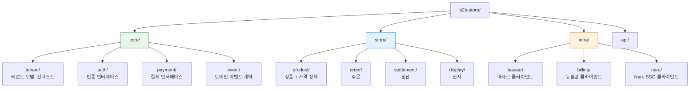

## CRITICAL GAP — 반드시 설계에서 해결

### 테넌트 간 데이터 격리 실패

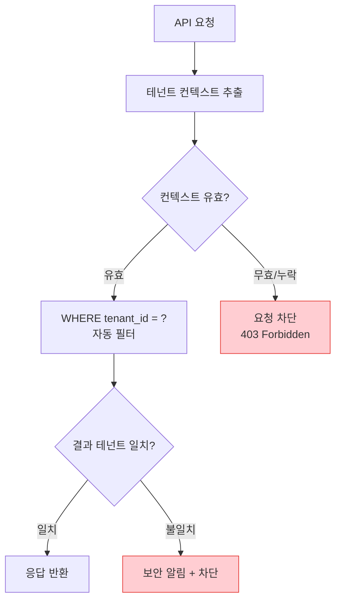

> **설계 원칙**: 모든 데이터 접근에 테넌트 필터가 자동 적용되어야 한다. 수동 WHERE 절에 의존하면 반드시 빠뜨린다. JPA/Hibernate Filter 또는 Row-Level Security 등 자동 메커니즘 필요.

### 가격 오버레이 불일치

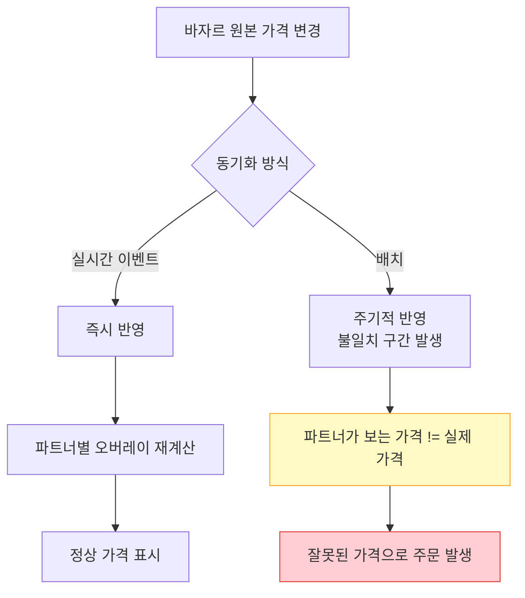

> **설계 질문**: 바자르 상품 가격 변경 시 전용몰에 어떻게 전파할 것인가? 배치라면 불일치 허용 범위는?

### 결제-주문 불일치

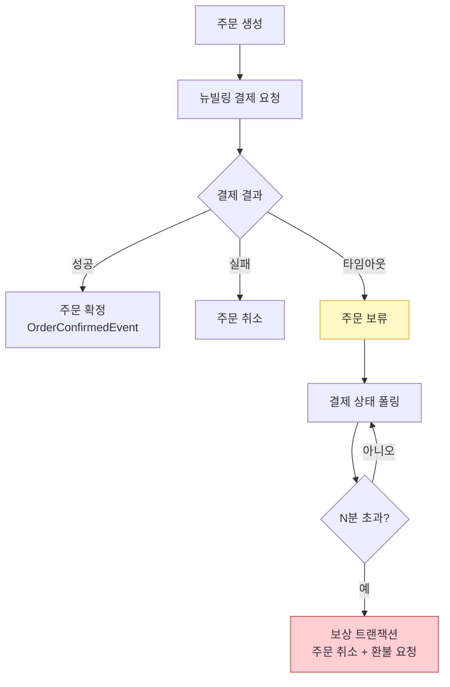

> **설계 원칙**: 결제와 주문은 분산 트랜잭션. Saga 패턴 또는 보상 트랜잭션 설계 필요. "결제됐는데 주문 없음"은 절대 허용 불가.

## 외부 연동 장애 대응 매트릭스

| 연동 시스템 | 장애 시나리오 | 전용몰 동작 | 설계 필요 |
|------------|-------------|------------|----------|
| 바자르 (상품) | API 타임아웃 | 캐시된 상품 데이터로 서비스 | 캐시 전략, TTL |
| 바자르 (상품) | 데이터 불일치 | 가격/재고 오차 발생 가능 | 동기화 주기, 불일치 알림 |
| 바자르 (주문) | 주문 API 실패 | 주문 불가, 사용자에게 안내 | 재시도 정책, fallback |
| 뉴빌링 (결제) | 결제 확인 지연 | 주문 보류 상태 | 폴링, 보상 트랜잭션 |
| 뉴빌링 (결제) | 이중 결제 | 중복 결제 발생 | 멱등성 키, 중복 체크 |
| Naru SSO | SSO 장애 | 로그인 불가 | fallback 인증 경로? |

## 의사결정 우선순위

### MUST — 4월 내 확정 (외주 투입 전)

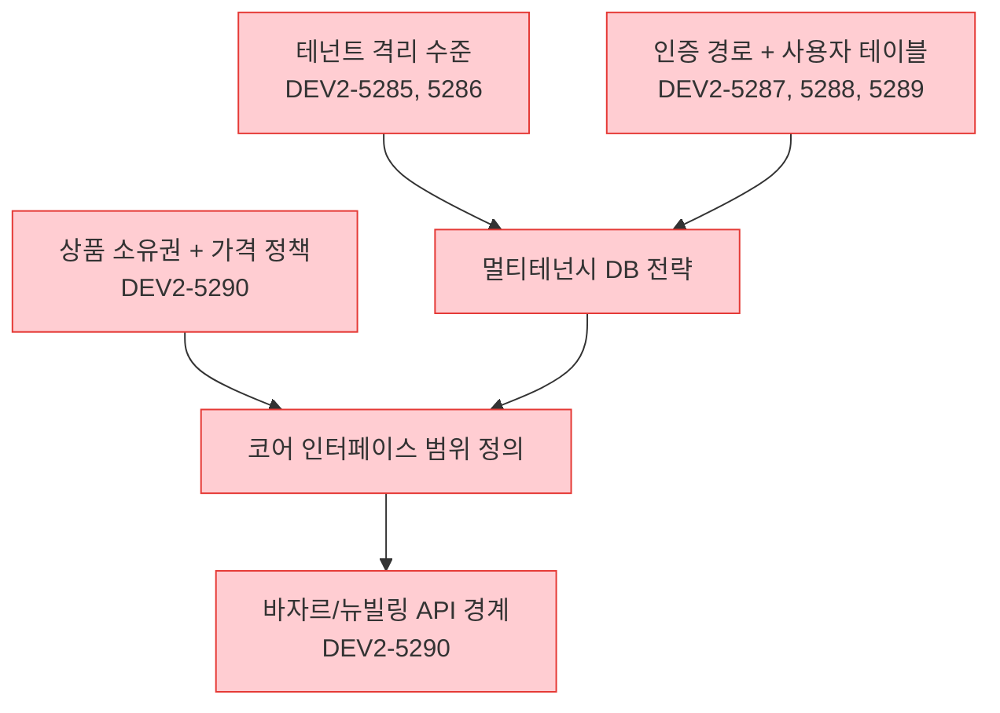

### SHOULD — Q2 내 확정

| 항목 | 티켓 | 비고 |
|------|------|------|
| Admin 커스터마이징 범위 | DEV2-5294 | SDUI 활용 여부 |
| 전시 모델 | DEV2-5294 | FE 구조 설계와 연동 |
| B2B 결제 수단 | DEV2-5296 | 뉴빌링 지원 범위 확인 |

### COULD — Q3 초 결정 가능

- 주문 상세 흐름 (바자르 활용 범위 세부)
- 정산 보고서 형태
- 모니터링/관측성 패턴

## 타임라인 (리뷰 반영)

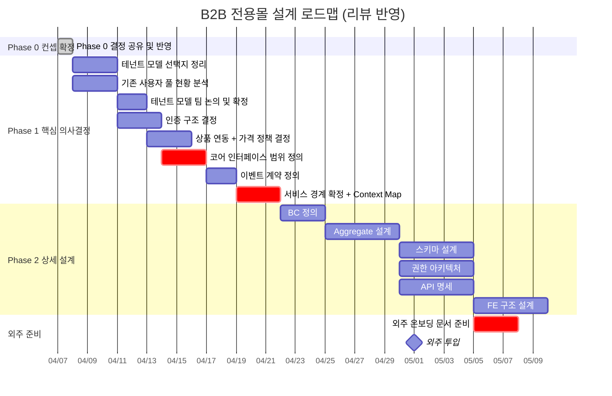

## DEFERRED (TODOS)

| 항목 | 우선순위 | Effort | 시점 | 비고 |
|------|---------|--------|------|------|
| 기존 제휴사 이관 전략 | P2 | M | MVP 안정화 후 | 순차 이관 계획, 하위호환성 검토 |
| 기존 B2B 데이터 마이그레이션 | P2 | S (설계) | 이관 전 | 파트너/계약/거래 이력 이관 방법 |
| 모니터링/관측성 설계 | P2 | S | Q3 초 | naru/bazaar 패턴 참조, 통합 모니터링 |
| 파트너 온보딩 셀프서비스 | P3 | M | Q4 이후 | MVP에서는 수동 온보딩 |
| 기대 효과 정량화 | P3 | S | 런칭 전 | 제휴사 추가 공수 절감률 등 KPI 설정 |

## 보안 체크리스트 (설계 시 반영)

| 위협 | 심각도 | 대응 방안 | 설계 반영 |
|------|--------|----------|----------|
| 테넌트 간 데이터 유출 | **HIGH** | 자동 테넌트 필터 (JPA Filter / RLS) | 필수 |
| 파트너 관리자 권한 상승 | **HIGH** | RBAC + 테넌트 스코프 검증 | 필수 |
| 결제 데이터 접근 제어 | **HIGH** | 뉴빌링 위임, 전용몰은 토큰만 보유 | 필수 |
| 바자르 API 키 관리 | **MED** | AWS Secrets Manager, 서비스 계정 분리 | 권장 |
| 테넌트 URL 조작 | **MED** | 세션 기반 테넌트 검증, URL만으로 판별 금지 | 필수 |

## 브레인스토밍 회의 어젠다 — 이벤트 스토밍 워크숍

### 왜 이벤트 스토밍인가

아직 서비스 경계가 잡히지 않은 단계에서 기술 의사결정(테넌트 격리, DB 전략 등)을 먼저 하면 도메인 이해 없이 아키텍처를 결정하게 된다. 이벤트 스토밍으로 도메인을 먼저 발견하면, 기술 결정이 자연스럽게 따라온다.

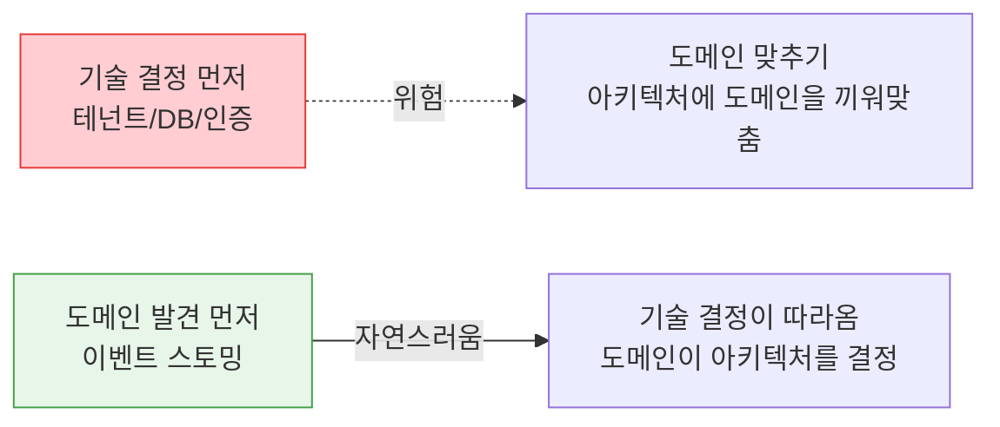

### 사전 준비

- **참석자**: 팀장, 김정민(BE/아키텍처), 조은흠(FE), 안혜련(기획), 이현민(기획)
- **사전 배포**: 이 문서 + [컨셉 문서](../scope/b2b-saas-platform-concept.md) (최소 하루 전)
- **각자 준비**: 기존 B2B 파트너가 구매하는 과정을 처음부터 끝까지 떠올려오기
- **김정민**: 바자르/뉴빌링 현재 API 상태 및 제약 조건 파악
- **준비물**: 포스트잇(또는 Miro/FigJam), 색상 범례 인쇄

### 회의 진행 (90분)

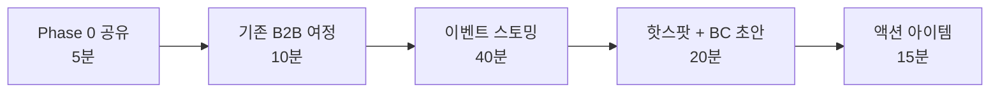

---

### Step 0: Phase 0 결정 공유 (5분)

확정된 사항을 빠르게 align:

| 결정 | 내용 |
|------|------|
| 접근 방식 | 전용몰 선행, 코어 인터페이스 먼저 정의 (Approach B) |
| MVP 범위 | 전용몰만 |
| 외주 | BE+FE 5월 투입 |
| 추가 스코프 | 이벤트 기반 아키텍처, 파트너별 가격 정책 |

---

### Step 1: 기존 B2B 여정 공유 (10분)

기획자/운영 경험이 있는 사람이 주도. 파트너가 현재 어떻게 구매하는지 전체 흐름을 나열한다.

**질문 가이드:**
- 파트너가 알라딘과 처음 거래를 시작할 때 어떤 과정을 거치나?
- 파트너 담당자가 상품을 고르고 주문하는 방법은?
- 결제는 어떻게 하나? (즉시 결제? 후불? PO?)
- 정산/수수료는 어떤 주기로 어떻게 처리하나?
- 파트너 유형(도서관/기업/학교 등)별로 다른 점은?

> 이 과정에서 **파트너 세그먼트 차이**, **비즈니스 모델**, **전환 전략**이 자연스럽게 드러난다.

---

### Step 2: Big Picture 이벤트 스토밍 (40분)

시간순으로 도메인 이벤트(과거형 동사)를 나열한다.

**이벤트 스토밍 색상 범례:**

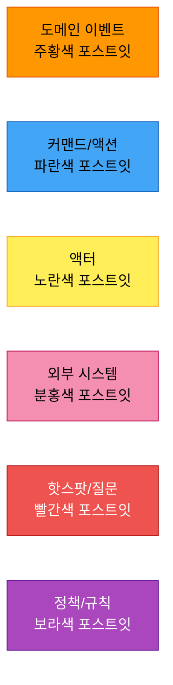

**예상되는 이벤트 흐름 (시작점, 회의에서 발전시킬 것):**

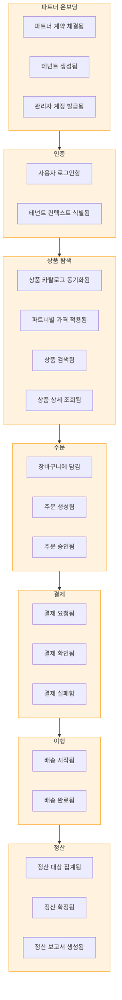

**진행 방법:**

- 처음 10분: 각자 이벤트를 포스트잇에 쓰고 시간순 배치 (조용히)
- 다음 15분: 전체 공유, 빠진 이벤트 추가, 순서 조정
- 다음 15분: 각 이벤트에 액터/외부 시스템/커맨드 추가

**이벤트별 확인 포인트:**

| 이벤트 | 확인할 것 |
|--------|----------|
| 파트너 계약 체결됨 | 누가 어떻게? 계약 조건(가격, 수수료)은 어디에? |
| 상품 카탈로그 동기화됨 | 바자르에서 어떤 주기로? 실시간 가능? |
| 파트너별 가격 적용됨 | 오버레이? 별도 테이블? 할인율 vs 특별가? |
| 주문 생성됨 | 바자르 주문 API 활용? 독립? |
| 주문 승인됨 | B2B에 승인 프로세스 있나? 파트너 유형별 다른가? |
| 결제 요청됨 | 즉시 결제? 후불? PO 기반? |
| 정산 확정됨 | 수수료 모델은? 주기는? |

---

### Step 3: 핫스팟 식별 + Bounded Context 초안 (20분)

**핫스팟 식별 (10분)**

이벤트 흐름에서 다음에 해당하는 곳에 빨간 포스트잇:
- 의견이 갈리는 곳
- "이건 잘 모르겠다"인 곳
- 파트너 유형별로 다른 곳
- 외부 시스템 의존이 강한 곳

> 핫스팟 = Phase 1에서 해결해야 할 의사결정 항목. 기존 MUST 6개와 매핑되거나, 새로운 항목이 발견될 수 있다.

**예상 핫스팟:**

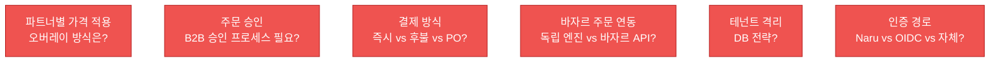

**Bounded Context 초안 (10분)**

이벤트를 클러스터링하여 도메인 경계를 그린다:

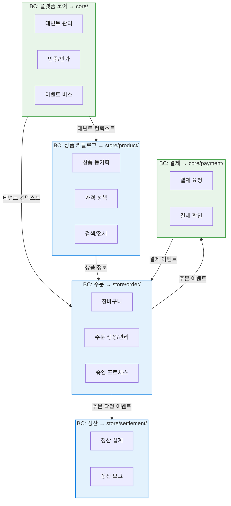

> 이 초안은 회의에서 이벤트 스토밍 결과에 따라 달라질 수 있다. 특히 "결제"가 코어인지 전용몰인지, "승인 프로세스"가 별도 BC인지는 핫스팟에서 논의.

---

### Step 4: 액션 아이템 정리 (15분)

**이벤트 스토밍 결과 정리:**
- 발견된 이벤트 목록 → 이벤트 계약 초안의 입력
- 핫스팟 목록 → Phase 1 티켓과 매핑, 누락된 티켓 식별
- BC 초안 → 서비스 경계 문서(DEV2-5298)의 입력

**기존 티켓과 매핑:**

| 핫스팟 | 관련 티켓 | 상태 |
|--------|----------|------|
| 테넌트 격리 | DEV2-5285, 5286 | Open |
| 인증 경로 | DEV2-5287, 5288, 5289 | Open |
| 상품/가격 | DEV2-5290 | Open |
| 주문 흐름 | DEV2-5295 | Open |
| 결제 | DEV2-5296 | Backlog |
| 정산 | DEV2-5297 | Backlog |
| 서비스 경계 | DEV2-5298 | Open |

**신규 티켓 후보 (이벤트 스토밍에서 발견될 수 있는 것):**
- 주문 승인 프로세스 설계 (B2B 특화)
- 이벤트 계약 정의 (도메인 이벤트 목록 + 페이로드)
- 코어 인터페이스 범위 정의

**다음 주 목표 설정:**
- DEV2-5284, 5299 → 상태 업데이트
- 이벤트 스토밍 결과 문서화
- 핫스팟별 담당자 + 기한 배정

### 상위 레벨 질문 — 이벤트 스토밍에서 답이 나오는 것

이벤트 스토밍을 하면 기술 결정 전에 아래 비즈니스 질문의 답이 자연스럽게 드러난다:

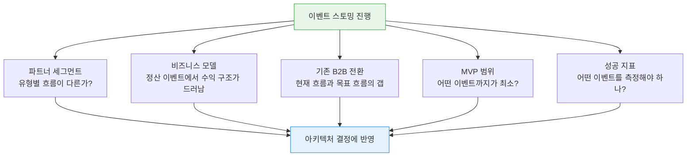

| 질문 | 이벤트 스토밍에서 어떻게 답이 나오나 |
|------|----------------------------------|
| 파트너 세그먼트 | "주문 승인됨" 이벤트가 파트너별로 다른 흐름인지 드러남 |
| 비즈니스 모델 | "정산 확정됨" 이벤트 주변에서 수수료 구조가 논의됨 |
| 전환 전략 | 기존 흐름 vs 목표 흐름 비교 시 갭 식별 |
| MVP 범위 | 전체 이벤트 중 "이것 없으면 서비스 불가"인 것이 MVP |
| 성공 지표 | 이벤트 흐름이 보이면 "어디를 측정할 것인가"가 명확해짐 |

## 다음 단계

- [ ] 이벤트 스토밍 워크숍 진행 (이 문서 기반)
- [ ] Phase 0 티켓 상태 업데이트 (DEV2-5284, DEV2-5299)
- [ ] 이벤트 스토밍 결과 문서화
- [ ] 핫스팟 → Phase 1 티켓 매핑 및 누락 티켓 생성
- [ ] 이벤트 계약 초안 작성 (이벤트 목록 + 페이로드)
- [ ] 코어 인터페이스 범위 문서 작성
- [ ] `catalog/b2b-store.yaml` TBD 항목 업데이트
- [ ] 외주 온보딩 문서 준비 (4월 말)
