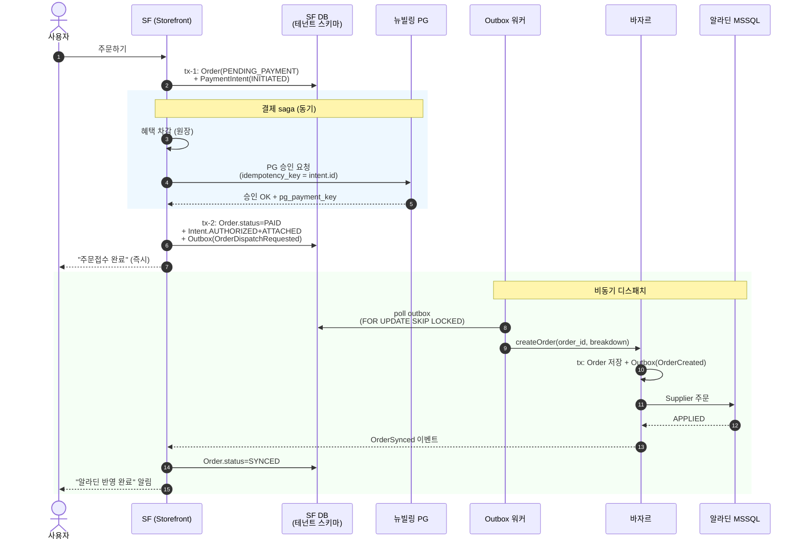
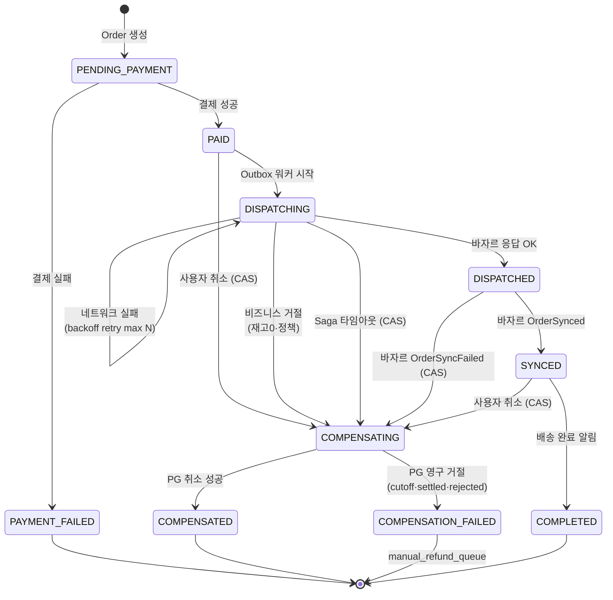
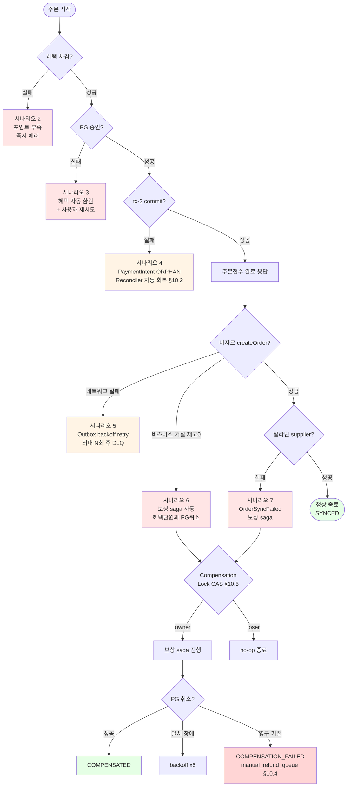
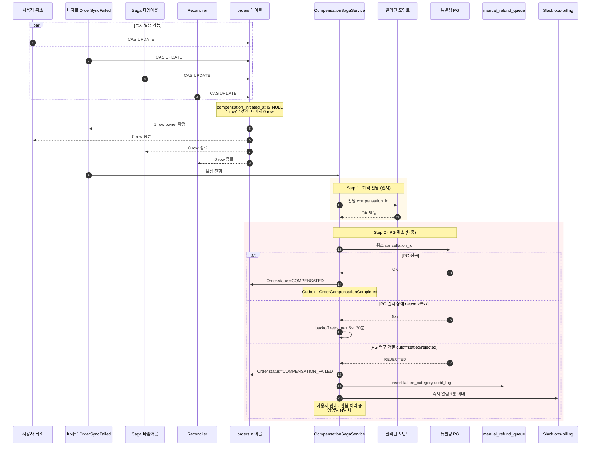
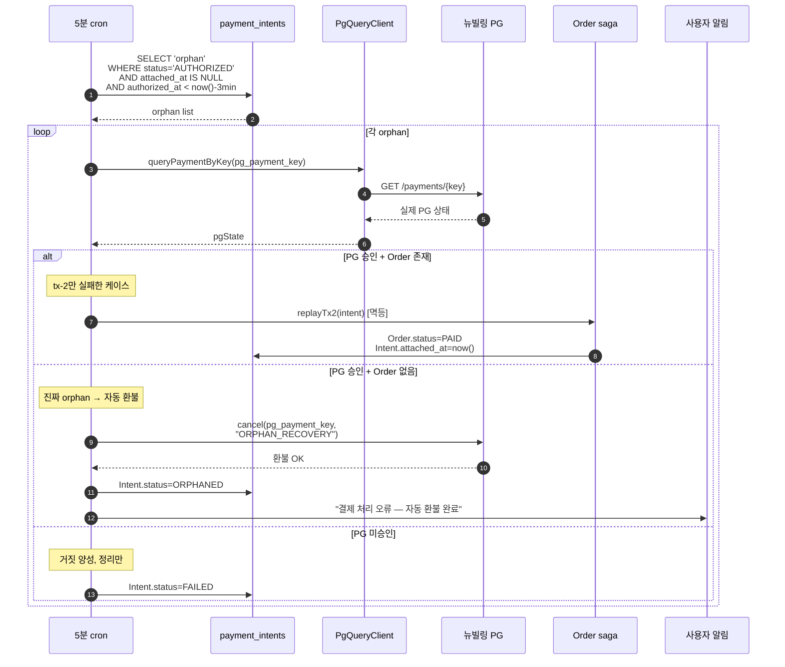
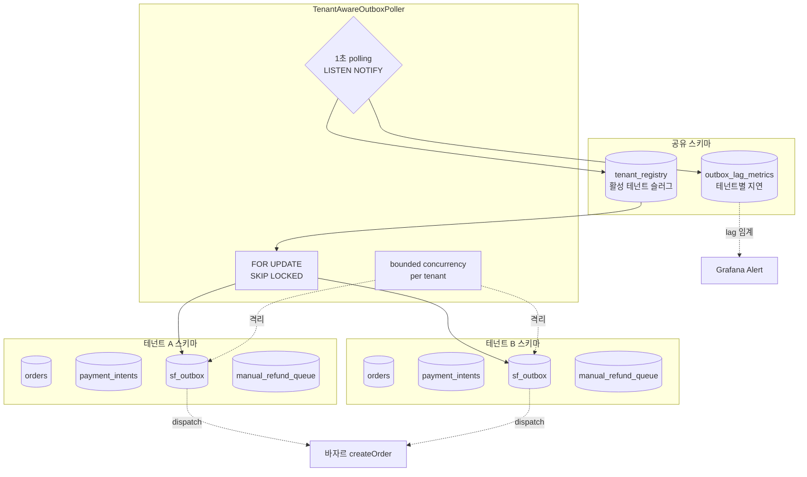
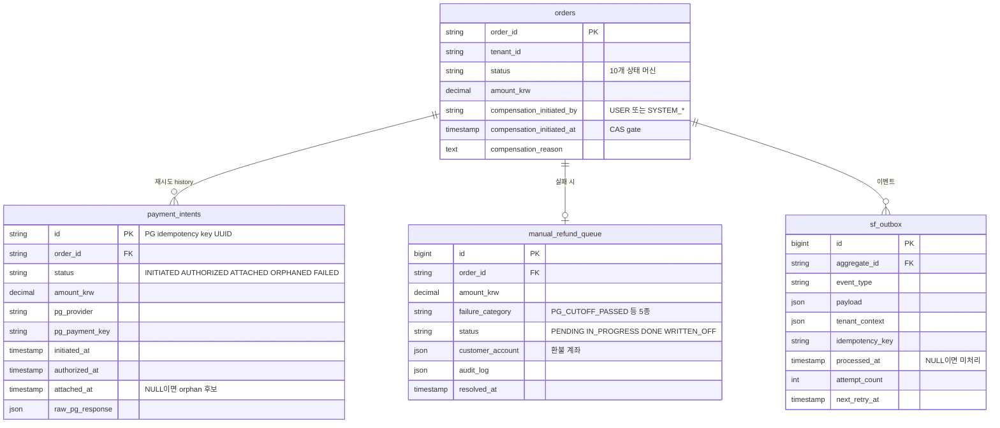
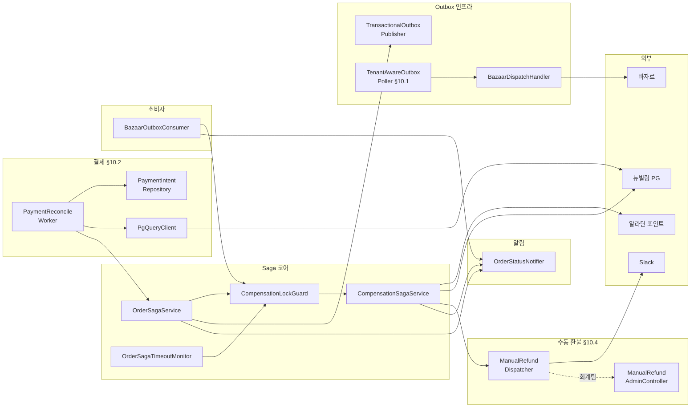

# 주문 오케스트레이션 — 코드리뷰 시각화 가이드

> **원본 설계**: [b2b-store-order-orchestration.md](../architecture/b2b-store-order-orchestration.md)
> **작성**: 2026-04-29, 김정민
> **목적**: 리뷰어용 보조 자료. 의사결정·근거는 원본 참조, 본 문서는 시각화·체크리스트만.
> **사용법**: 위→아래 순서로 읽으면 사용자 클릭 → terminal까지 흐름이 누적됨. 각 다이어그램 아래 §X.Y는 원본 섹션 번호.

---

## 목차

1. [전체 흐름 한눈에 보기 (Happy Path)](#1-전체-흐름-한눈에-보기-happy-path)
2. [Order Saga 상태 머신](#2-order-saga-상태-머신)
3. [실패 시나리오 7종 결정 트리](#3-실패-시나리오-7종-결정-트리)
4. [보상 Saga + Compensation Lock CAS](#4-보상-saga--compensation-lock-cas)
5. [PaymentIntent Reconciler (Orphan 회복)](#5-paymentintent-reconciler-orphan-회복)
6. [멀티테넌시 Outbox 워커 Fanout](#6-멀티테넌시-outbox-워커-fanout)
7. [데이터 모델 ER](#7-데이터-모델-er)
8. [컴포넌트 의존성](#8-컴포넌트-의존성)
9. [코드 리뷰 체크리스트](#9-코드-리뷰-체크리스트)

---

## 1. 전체 흐름 한눈에 보기 (Happy Path)

> 원본 §2.2 / §10.2(PaymentIntent) 반영

**리뷰 포커스**:
- 결제 동기 / 디스패치 비동기 분할 → SF 가용성이 바자르에 묶이지 않음 (§1.2 약점 1번 해소)
- PaymentIntent를 PG 호출 *전*에 INITIATED로 insert → tx-2 실패해도 reconciler가 추적 가능 (§10.2)
- 사용자는 즉시 "주문접수" 응답, 디스패치는 백그라운드 → p99 < 10초 SLA

---

## 2. Order Saga 상태 머신

> 원본 §3 / §10.5(CAS) / §10.4(COMPENSATION_FAILED) 반영

**Terminal states (4개)**:
- `PAYMENT_FAILED` — 결제 자체 실패, 사용자 재시도 유도
- `COMPENSATED` — 자동 보상 완료
- `COMPENSATION_FAILED` — 자동 보상 불가, 회계팀 수동 처리 (§10.4)
- `COMPLETED` — 정상 종료

**리뷰 포커스**:
- 모든 `COMPENSATING` 진입은 CAS 통과 필수 (§10.5 호출자 4명 다 통과해야)
- `DISPATCHING` self-loop = backoff retry 표현
- `COMPENSATION_FAILED`는 *시스템 내부* terminal, 외부 워크플로우(회계 백오피스)로 위임

---

## 3. 실패 시나리오 7종 결정 트리

> 원본 §5.1 시각화

**색상 범례**: 🟥 자동 보상 / 🟧 자동 회복 / 🟩 정상 / 🟫 사람 손

---

## 4. 보상 Saga + Compensation Lock CAS

> 원본 §5.2 / §10.5 / §10.4

**리뷰 포커스**:
- CAS 갱신 row 0건 시 *반드시* no-op 종료 (이중 saga 차단)
- 환원 순서 절대: 혜택 먼저 → PG 나중 (시간 창 짧은 PG 취소를 마지막에)
- PG 응답 분류 3종: 성공 / 일시 장애 / 영구 거절
- `manual_refund_queue.audit_log`에 시도 이력·처리자 기록 (회계 감사용)

---

## 5. PaymentIntent Reconciler (Orphan 회복)

> 원본 §10.2 / §4.4

**리뷰 포커스**:
- 3분 grace period (tx-2 정상 처리 대기)
- 24시간 초과 orphan은 사람 손으로 escalate (Slack alert + manual_refund_queue 등록)
- PG 조회 API 실패 시 다음 cron으로 미루기 (무한 루프 방지)
- 사용자 가시 SLA: "결제 후 5분 안에 주문 등록 또는 자동 환불 100%"

---

## 6. 멀티테넌시 Outbox 워커 Fanout

> 원본 §10.1

**리뷰 포커스**:
- outbox는 *반드시* 테넌트 스키마 안 (비즈니스 row와 같은 tx)
- 공유 스키마는 메타데이터 2개만 (`tenant_registry`, `outbox_lag_metrics`)
- 한 테넌트 outbox 폭증 → bounded concurrency로 다른 테넌트 격리
- 전환 트리거: N≥50 도달 시 partitioned shared table 검토

---

## 7. 데이터 모델 ER

> 원본 §4.3 / §4.4 / §4.5 / §4.6

**enum 상세**:
- `orders.status`: `PENDING_PAYMENT` / `PAID` / `DISPATCHING` / `DISPATCHED` / `SYNCED` / `COMPLETED` / `PAYMENT_FAILED` / `COMPENSATING` / `COMPENSATED` / `COMPENSATION_FAILED`
- `compensation_initiated_by`: `USER` / `SYSTEM_BAZAAR_FAIL` / `SYSTEM_TIMEOUT` / `SYSTEM_RECONCILER`
- `payment_intents.status`: `INITIATED` → `AUTHORIZED` → `ATTACHED` / `ORPHANED` / `FAILED`
- `manual_refund_queue.failure_category`: `PG_CUTOFF_PASSED` / `PG_ALREADY_SETTLED` / `PG_REJECTED` / `PG_TIMEOUT_EXHAUSTED` / `OTHER`
- `manual_refund_queue.status`: `PENDING` → `IN_PROGRESS` → `DONE` / `WRITTEN_OFF`

**리뷰 포커스**:
- `payment_intents` 1:N — 결제 재시도 시 새 intent (idempotency 분리)
- `manual_refund_queue` 1:0..1 — 정상이면 row 없음
- `sf_outbox.tenant_context` — 워커가 fanout 시 사용
- 전부 같은 테넌트 스키마 안 (멀티테넌시 격리)

---

## 8. 컴포넌트 의존성

> 원본 §7.1

**리뷰 포커스**:
- `CompensationLockGuard`가 4개 호출자(OS·CSS·OSTM·BOC)의 단일 진입점
- `PaymentReconcileWorker` → `OrderSagaService.replayTx2()` 멱등 보장
- 외부 호출 노드는 4개뿐 (PG·바자르·알라딘·Slack) — 통합 테스트 시 mock 대상

---

## 9. 코드 리뷰 체크리스트

### 9.1 Saga·트랜잭션 무결성

- [ ] tx-1, tx-2, tx-comp 각각이 **단일** DB 트랜잭션인가?
- [ ] outbox row insert가 비즈니스 row와 **같은** tx인가? (Transactional Outbox 핵심)
- [ ] 외부 호출(PG·바자르)이 DB 트랜잭션 *바깥*인가? (rollback hold·deadlock 방지)
- [ ] PaymentIntent insert가 PG 호출 *전*에 일어나는가? (orphan 추적 필수)

### 9.2 멱등성

- [ ] PG 승인 호출에 `payment_intents.id` 멱등 키?
- [ ] 바자르 `createOrder`에 `order_id` 멱등 키?
- [ ] 보상 외부 호출(`compensation_id`, `cancellation_id`)에 멱등 키?
- [ ] outbox 소비자가 동일 이벤트 2회 처리 시 외부 호출 1회만 발생?
- [ ] PaymentReconciler `replayTx2` 호출이 멱등인가?

### 9.3 Compensation Lock CAS (§10.5)

- [ ] `initiateCompensation()`이 `WHERE compensation_initiated_at IS NULL` 가드 포함?
- [ ] 갱신 row 0건 시 no-op 처리 + 로깅?
- [ ] 4개 트리거(USER·BAZAAR_FAIL·TIMEOUT·RECONCILER) 모두 동일 CAS 헬퍼 통과?
- [ ] CAS 실패가 정상 동작임을 단위 테스트로 검증?

### 9.4 PaymentIntent Reconciler (§10.2)

- [ ] orphan 정의 정확? (`AUTHORIZED + attached_at IS NULL + 3분 경과`)
- [ ] PG 조회 응답 3종 분기 모두 처리? (승인+Order존재 / 승인+Order없음 / 미승인)
- [ ] 자동 PG 취소 시 사용자 알림 발송?
- [ ] 24시간 초과 orphan → Slack alert + 사람 escalate?
- [ ] PG 조회 API 실패가 무한 루프 안 만드는가?

### 9.5 Manual Refund Queue (§10.4)

- [ ] PG 응답 분류가 정확한가? (일시 장애 vs 영구 거절)
- [ ] 영구 거절(cutoff·settled·rejected) 시 `COMPENSATION_FAILED` terminal 전이?
- [ ] Slack `#ops-billing` 알림 < 1분?
- [ ] `audit_log`에 처리자·근거 JSONB 기록?
- [ ] PENDING > 10건 누적 시 PagerDuty 에스컬레이션?
- [ ] 회계 백오피스에서 `WRITTEN_OFF` 처리 가능 + 감사 로그?

### 9.6 멀티테넌시 (§10.1)

- [ ] outbox 테이블이 **테넌트 스키마** 안에 있는가? (공유 스키마 X)
- [ ] 워커가 `tenant_registry` 기반으로 fanout?
- [ ] `SELECT FOR UPDATE SKIP LOCKED` 사용?
- [ ] 한 테넌트 폭증이 다른 테넌트 막지 않는가? (bounded concurrency)
- [ ] 테넌트별 lag을 `outbox_lag_metrics`에 기록?
- [ ] LISTEN/NOTIFY로 즉시 깨움 보강?

### 9.7 사용자 가시 SLA

- [ ] "주문접수 완료" / "반영 완료" 알림이 분리되어 있는가? (2단계 UX)
- [ ] PaymentIntent orphan 시 자동 환불 약관 명시?
- [ ] manual_refund_queue 진입 시 사용자 안내 문구가 명확한가? ("영업일 N일 내")
- [ ] 카테고리별 OOS rate 모니터링 대시보드 존재? (§10.3 트리거)

### 9.8 운영 가시성

- [ ] Grafana saga 상태별 분포 패널?
- [ ] Outbox lag (테넌트별) 패널?
- [ ] DLQ 카운트 + 알림?
- [ ] DISPATCHING 상태 N분 초과 alert?
- [ ] manual_refund_queue PENDING 누적 알림?

### 9.9 관계 문서 갱신

- [ ] `service-boundaries.md` §3.1 Order↔Bazaar 관계가 Partnership → 비동기 OHS로 갱신됨?
- [ ] `bazaar-coordination.md` 페이로드 계약이 본 설계와 정합? (`OrderSynced` / `OrderSyncFailed` 필드)
- [ ] 바자르 측 멱등성 보장 (동일 `idempotency_key` 시 같은 응답) 합의?

### 9.10 테스트 (검증 매트릭스 §9)

- [ ] tx-2 commit 실패 시 PaymentReconciler 자동 회복 통합 테스트?
- [ ] 바자르 다운 시뮬레이션 → SF 주문 수락 정상 E2E?
- [ ] OrderSyncFailed 주입 → 자동 보상 통합 테스트?
- [ ] 4개 보상 트리거 동시 발생 → CAS 1명만 진행 단위 테스트?
- [ ] PG 영구 거절 → manual_refund_queue 등록 통합 테스트?
- [ ] DISPATCHING 5분 초과 → Grafana alert 카오스 테스트?

---

## 참고

- 원본 설계 문서: [b2b-store-order-orchestration.md](../architecture/b2b-store-order-orchestration.md)
- 바자르 협업: [b2b-store-bazaar-coordination.md](../architecture/b2b-store-bazaar-coordination.md)
- 서비스 경계: [b2b-store-service-boundaries.md](../architecture/b2b-store-service-boundaries.md)
- CEO 리뷰 (4/8): [b2b-store-ceo-review.md](./b2b-store-ceo-review.md)
