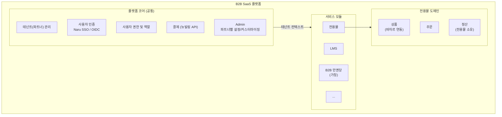
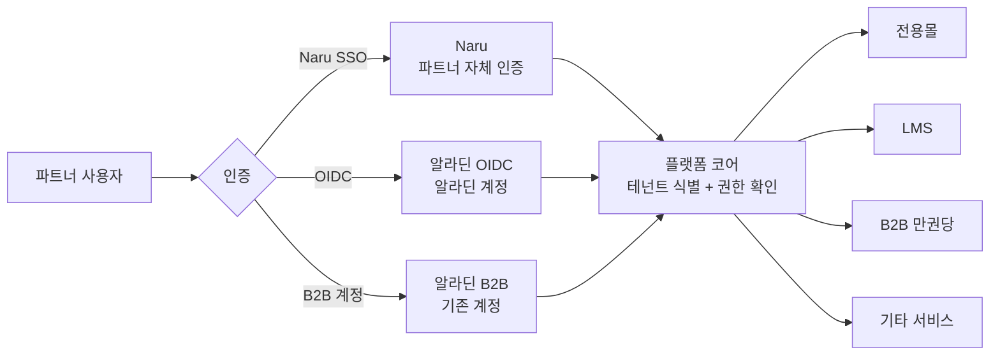
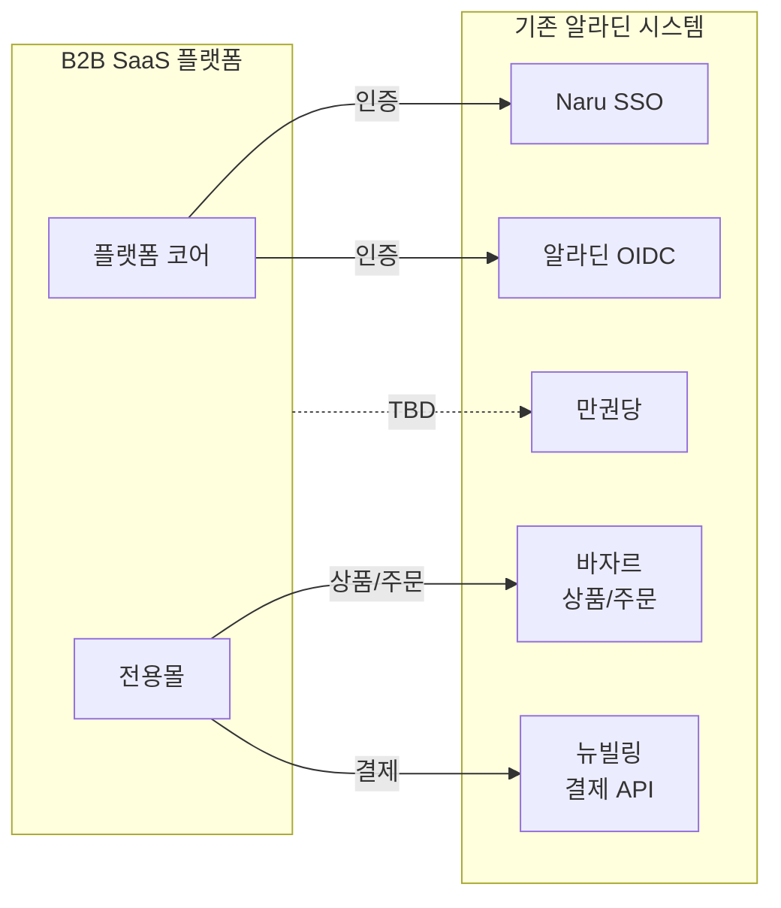
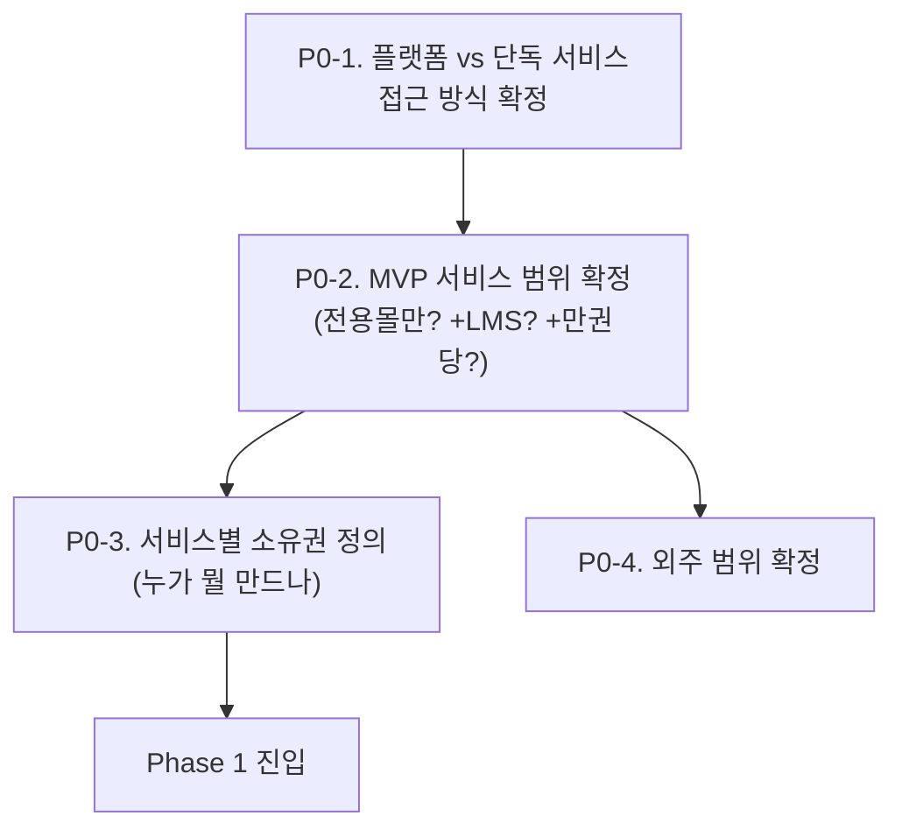
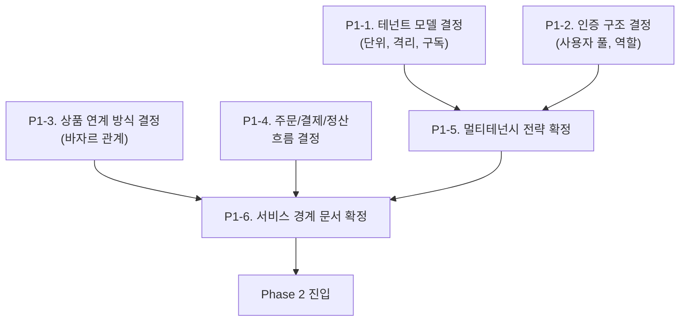
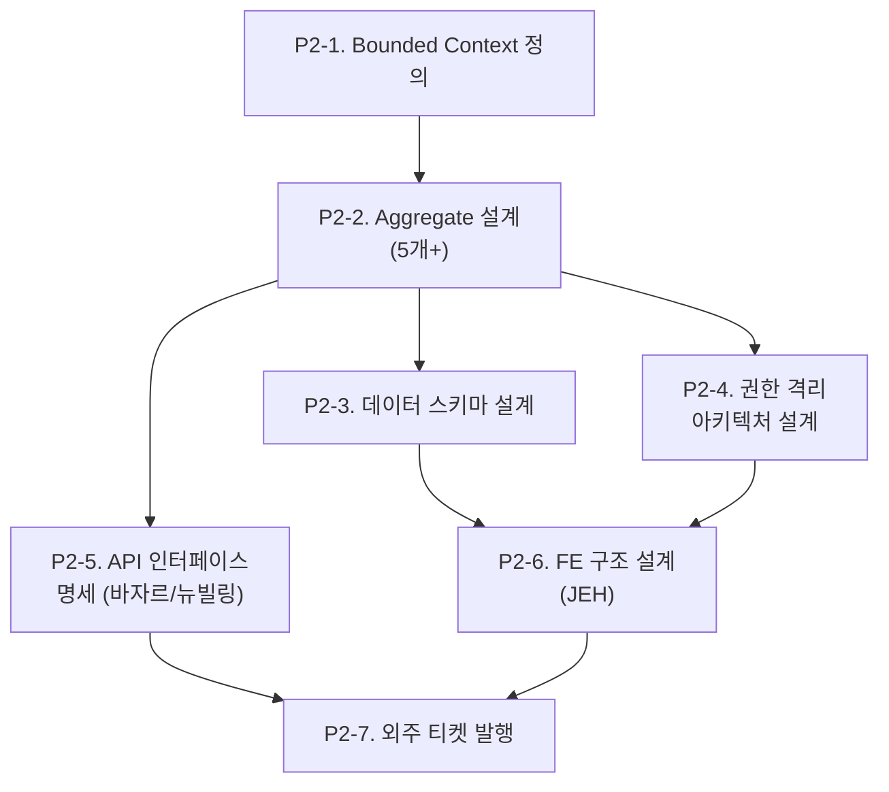
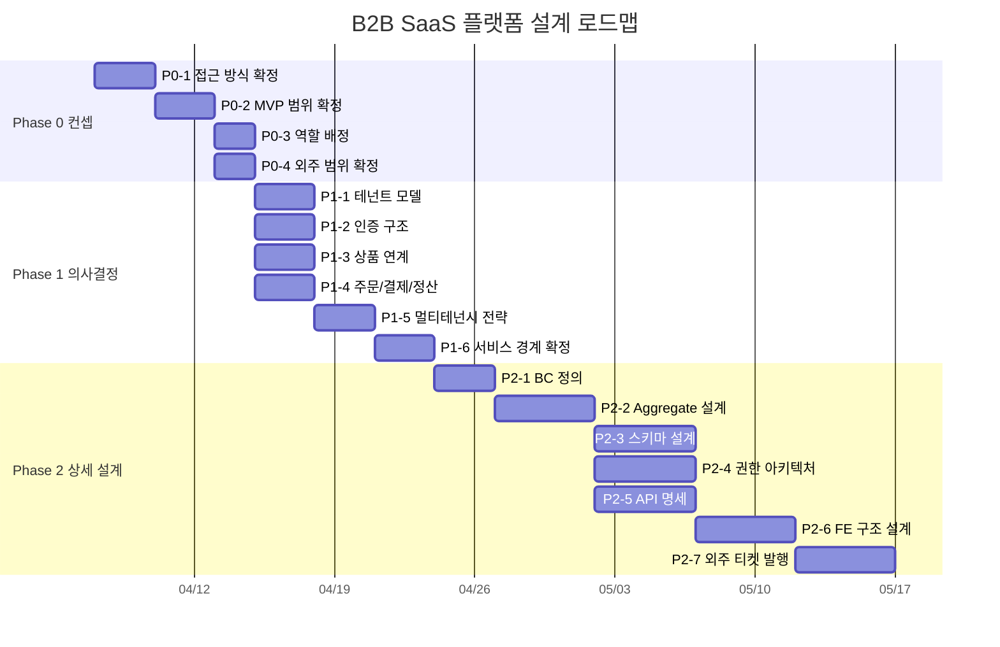

# B2B SaaS 플랫폼 컨셉 문서 (논의용 초안)

> 작성일: 2026-04-01 | 작성자: 김정민 | 상태: 컨셉 논의 단계

## 1. 배경

알라딘의 B2B 사업 확장을 위해, 파트너사에게 다양한 서비스를 SaaS 형태로 제공하는 플랫폼을 구축한다. 기존에 개별적으로 운영되던 B2B 서비스들(전용몰, LMS, 만권당 등)을 하나의 플랫폼 위에서 통합 관리한다.

## 2. 핵심 컨셉

### 플랫폼 = 테넌트 관리 코어 + 서비스 모듈

### 파트너 사용자의 서비스 이용 흐름

### 기존 시스템 연계 구조

## 3. 도메인별 논의 포인트

### 3.1 테넌트 관리 (플랫폼 코어)

**컨셉**: 파트너사 = 테넌트. 파트너사 단위로 서비스 구독, 사용자, 설정을 관리한다.

| 논의 필요 항목 | 선택지 | 비고 |
|--------------|--------|------|
| 테넌트 단위 | 파트너사(법인) / 파트너사 내 부서 | 결제·정산 주체와 일치해야 함 |
| 서비스 구독 모델 | 파트너별 서비스 선택 / 전체 제공 | A사는 몰+LMS, B사는 몰만 |
| 테넌트 격리 수준 | 논리적 격리(Shared DB) / 물리적 격리(Schema per Tenant) | 비용 vs 격리 트레이드오프 |

### 3.2 사용자 인증

**컨셉**: 파트너 사용자는 여러 인증 경로로 진입하지만, 플랫폼 내에서는 단일 사용자로 식별된다.

| 논의 필요 항목 | 선택지 | 비고 |
|--------------|--------|------|
| 사용자 테이블 소유 | 플랫폼 자체 / Naru partner_user_mapping 활용 | Naru 의존도 결정 |
| 파트너별 인증 방식 제한 | 가능 / 불가 | A사는 OIDC만, B사는 SSO만 |
| 사용자 역할 | 플랫폼 공통 역할 / 서비스별 역할 / 둘 다 | 구매자, 관리자, 열람자 등 |

### 3.3 상품

**컨셉**: 상품 원본은 바자르가 소유하고, 전용몰은 B2B 조건(가격, 노출 범위)을 오버레이한다.

| 논의 필요 항목 | 선택지 | 비고 |
|--------------|--------|------|
| 상품 소유권 | 바자르 원본 참조 / 독립 카탈로그 / 오버레이 방식 | |
| 파트너별 가격 정책 | 있음 (파트너마다 할인율 다름) / 없음 (동일 가격) | |
| 파트너별 노출 범위 | 있음 (A사는 IT도서만) / 없음 (전체 노출) | |
| 카테고리 커스터마이징 | 파트너별 재구성 / 숨김·표시만 / 없음 | |

### 3.4 주문

**컨셉**: B2B 특화 주문 흐름이 필요한지, 바자르 주문 엔진을 활용할 수 있는지 결정 필요.

| 논의 필요 항목 | 선택지 | 비고 |
|--------------|--------|------|
| 주문 엔진 | 바자르 API 활용 / 독립 주문 엔진 / 바자르 확장 | |
| B2B 특화 기능 필요 여부 | 대량주문 / PO 기반 주문 / 승인 프로세스 | 있다면 독립 엔진 필요 |
| 배송·물류 | 바자르 물류 연동 / 독립 | |

### 3.5 결제

**컨셉**: 뉴빌링 API를 통한 결제 처리. B2B 특화 결제 수단이 있는지 확인 필요.

| 논의 필요 항목 | 선택지 | 비고 |
|--------------|--------|------|
| B2B 결제 수단 | 즉시 결제(카드 등) / 후불 결제 / 월 정산 / PO 기반 | |
| 파트너별 결제 조건 | 다름 / 동일 | |

### 3.6 정산

**컨셉**: 정산은 전용몰이 소유한다. 파트너별 수수료 계산 및 정산 보고서를 제공한다.

| 논의 필요 항목 | 선택지 | 비고 |
|--------------|--------|------|
| 정산 주기 | 월 / 분기 / 파트너별 상이 | |
| 수수료 모델 | 정률 / 정액 / 파트너별 계약 | |
| 정산 보고서 | Admin에서 제공 / 별도 시스템 | |

### 3.7 Admin (파트너별 커스터마이징)

**컨셉**: Admin을 통해 파트너사마다 랜딩페이지, 카테고리, 서비스 구성을 커스터마이징한다.

| 논의 필요 항목 | 선택지 | 비고 |
|--------------|--------|------|
| 랜딩페이지 커스터마이징 | SDUI 기반 / 템플릿 선택 / 코드 수준 | JEH의 SDUI 이벤트 시스템 재활용 가능? |
| 커스터마이징 주체 | 알라딘 운영자 / 파트너사 관리자 / 둘 다 | |
| 테넌트 URL 구조 | 서브도메인 (partner.store.aladin.co.kr) / 경로 (/partner/) / 독립 도메인 | |

## 4. 기존 시스템 연계 맵

| 기존 시스템 | 연계 방식 | 역할 | 의존도 |
|-----------|----------|------|--------|
| Naru SSO | API 연동 | 파트너별 SSO 인증 | 높음 |
| 알라딘 OIDC | 프로토콜 연동 | 알라딘 계정 SSO | 중간 |
| 바자르 (BazaarServer) | REST API | 상품 데이터, 주문/물류 | 높음 |
| 뉴빌링 | REST API | 결제 처리 | 높음 |
| 만권당 (Max) | TBD | B2B 만권당 서비스 연동 | 미정 |

## 5. 열린 질문 (팀 논의 필요)

1. **플랫폼 코어를 먼저 만들고 전용몰을 올리나, 전용몰부터 만들면서 코어를 추출하나?**
   - 전자: 설계는 깔끔하지만 가시적 결과물이 늦음
   - 후자: 빠르게 전용몰을 만들고 공통 레이어를 리팩토링으로 추출

2. **LMS, B2B 만권당 등 다른 서비스의 타임라인은?**
   - 전용몰과 동시에? 후순위?
   - 다른 서비스의 요구사항이 플랫폼 코어 설계에 영향

3. **외주 개발자 범위는?**
   - 플랫폼 코어? 전용몰? FE만?
   - 팀 OKR KR6에서 외주 투입용 티켓 30개 사전 발행이 있음

4. **기존 B2B 사용자 마이그레이션은 필요한가?**
   - 기존 알라딘 B2B 계약 파트너들을 새 플랫폼으로 이관?

5. **MVP 범위는?**
   - 최소 런칭에 필요한 서비스와 기능은?

## 6. 설계 Task 분해

### Phase 0: 컨셉 확정 (팀 논의)

| Task | 내용 | 산출물 | 참여자 |
|------|------|--------|--------|
| P0-1 | 플랫폼 코어 선행 vs 전용몰 선행 접근 방식 확정 | 의사결정 기록 | 팀장, KJM |
| P0-2 | MVP에 포함할 서비스 모듈 확정 | MVP 범위 문서 | 팀장, 기획자, KJM |
| P0-3 | 플랫폼 코어 / 전용몰 / FE 담당자 배정 | 역할 매핑 | 팀장 |
| P0-4 | 외주 개발자 투입 범위 및 시점 확정 | 외주 범위 문서 | 팀장 |

### Phase 1: 도메인별 의사결정

| Task | 내용 | 산출물 | 의존 |
|------|------|--------|------|
| P1-1 | 테넌트 단위, 격리 수준, 구독 모델 결정 | 테넌트 모델 문서 | P0 완료 |
| P1-2 | 사용자 테이블 소유권, 인증 경로, 역할 모델 결정 | 인증 구조 문서 | P0 완료 |
| P1-3 | 상품 소유권, 가격 정책, 카테고리 커스터마이징 범위 결정 | 상품 연계 문서 | P0 완료 |
| P1-4 | 주문 엔진 선택, 결제 수단, 정산 모델 결정 | 주문/결제/정산 문서 | P0 완료 |
| P1-5 | P1-1,2 기반 DB 격리 전략, 권한 격리 방식 확정 | 멀티테넌시 전략 문서 | P1-1, P1-2 |
| P1-6 | 전체 도메인 의사결정 종합, 시스템 경계 확정 | 서비스 경계 문서 (Context Map) | P1-3~5 |

### Phase 2: 상세 설계

| Task | 내용 | 산출물 | 담당 | 의존 |
|------|------|--------|------|------|
| P2-1 | 서비스 경계 기반 BC 정의 | BC 정의서 | KJM | P1-6 |
| P2-2 | BC별 Aggregate Root, Entity, VO 정의 | 도메인 모델 문서 | KJM | P2-1 |
| P2-3 | 테넌시 전략 기반 테이블/인덱스 설계 | 스키마 설계 문서 | KJM | P2-2 |
| P2-4 | RBAC/ABAC + 테넌트 격리 설계 | 권한 아키텍처 문서 | KJM | P2-2 |
| P2-5 | 바자르/뉴빌링 연동 API 인터페이스 정의 | API 명세서 | KJM | P2-2 |
| P2-6 | 멀티테넌시 FE 라우팅, 컴포넌트 구조, SDUI 검토 | FE 설계 문서 | JEH | P2-3, P2-4 |
| P2-7 | 5W1H 기반 외주 티켓 발행 (BE+FE) | 티켓 30개+ | KJM, JEH, AHR, LHM | P2-5, P2-6 |

### 전체 타임라인 (예상)

## 7. 다음 단계

- [ ] Phase 0 팀 논의 진행 (이 문서 기반)
- [ ] 논의 결과에 따라 Phase 1 Task를 YouTrack 티켓으로 생성
- [ ] `catalog/b2b-store.yaml` 업데이트
- [ ] 확정된 범위로 Phase 2 상세 설계 착수
