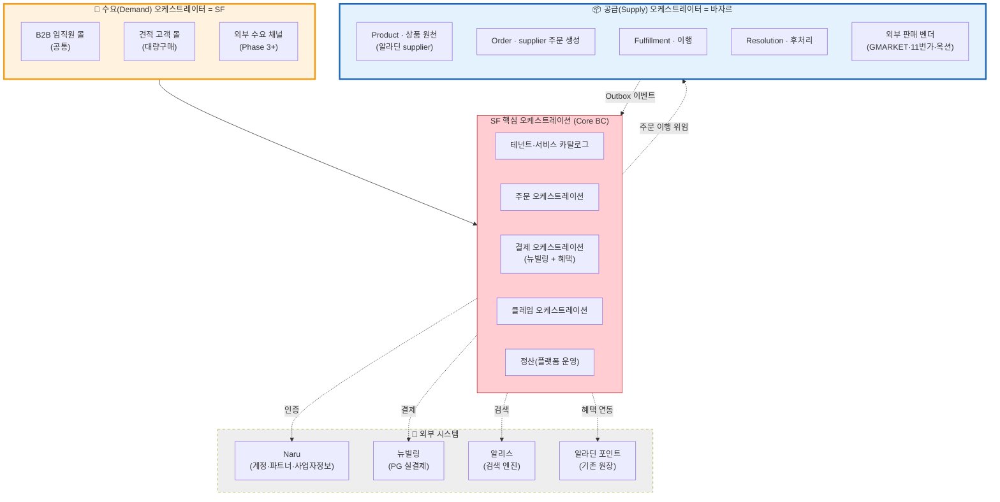
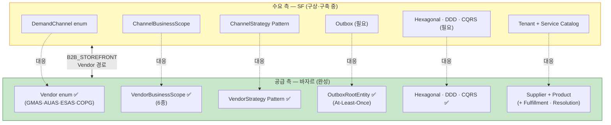
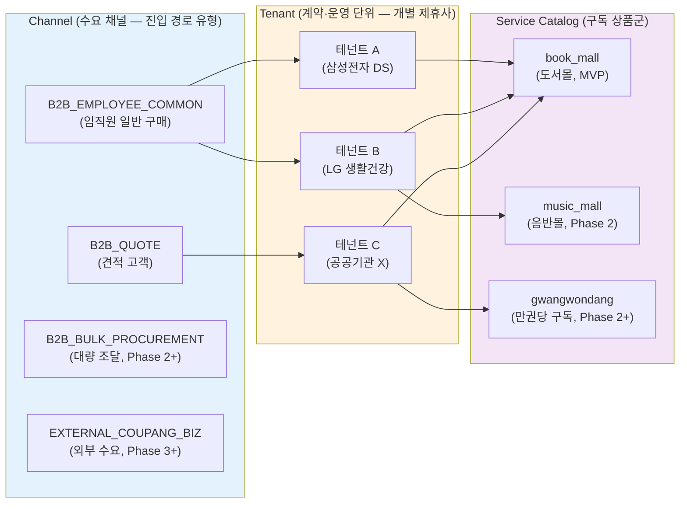
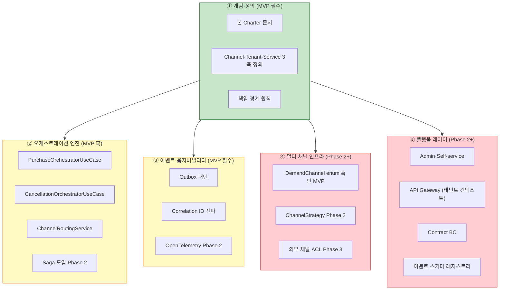
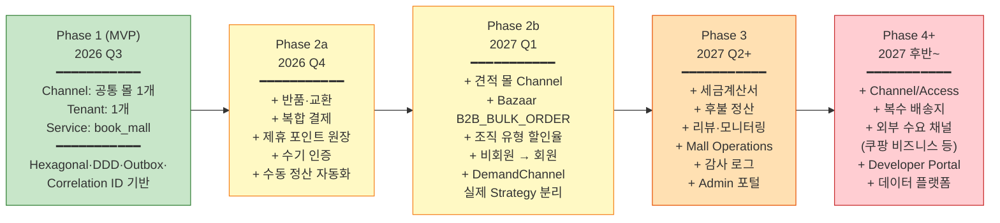

# 스토어프론트 Charter — 수요 오케스트레이터

> **작성일**: 2026-04-22
> **작성**: 김정민
> **상태**: Charter 초안 — 팀장·기획자 합의 후 공식화
> **목적**: "스토어프론트는 무엇인가 / 무엇이 아닌가"를 명시. 하위 모든 설계·로드맵·구인·계약의 기준점.
> **요청 계기**: SF가 "B2B 전용몰"로 협소하게 정의되어 있음. 바자르(공급 오케스트레이터)와 대칭되는 **"수요 오케스트레이터"** 정체성 필요.

---

## 목차

1. [정체성 선언](#1-정체성-선언)
2. [왜 "수요 오케스트레이터"인가](#2-왜-수요-오케스트레이터인가)
3. [책임 범위 (what we do)](#3-책임-범위-what-we-do)
4. [비책임 범위 (what we don't)](#4-비책임-범위-what-we-dont)
5. [바자르와의 대칭 관계](#5-바자르와의-대칭-관계)
6. [핵심 개념 — Channel · Tenant · Service](#6-핵심-개념--channel--tenant--service)
7. [성공 지표](#7-성공-지표)
8. [필요 기반 5개 카테고리 (MVP vs Phase 2+)](#8-필요-기반-5개-카테고리-mvp-vs-phase-2)
9. [기술 스택 정렬](#9-기술-스택-정렬)
10. [성장 로드맵](#10-성장-로드맵)
11. [관련 문서](#11-관련-문서)

---

## 1. 정체성 선언

> **스토어프론트(SF)는 알라딘의 "수요(Demand) 오케스트레이터"다.**
>
> 여러 수요 채널(B2B 전용몰·견적 고객·대량구매·향후 외부 수요 연계)을 통합해, 각 채널의 **테넌트 컨텍스트·정책·정산·결제·혜택·클레임**을 조율하고, 실제 **상품 원천과 이행은 바자르(공급 오케스트레이터)에 위임**한다.
>
> SF는 단일 B2B 전용몰이 아니다. **수요 측 알라딘 플랫폼의 진입 허브**이자 **채널별 비즈니스 규칙의 조율 엔진**이다.

---

## 2. 왜 "수요 오케스트레이터"인가

알라딘의 커머스 아키텍처는 **공급 / 수요 이중 오케스트레이터**로 진화 중:



**핵심**: 바자르가 **공급 측**(벤더·상품·이행)의 통합 허브라면, SF는 **수요 측**(채널·테넌트·고객·결제·혜택)의 통합 허브. 두 오케스트레이터가 **이벤트와 API로 연결**.

---

## 3. 책임 범위 (what we do)

### 3-1. 수요 채널 온보딩

새 수요 채널(몰·고객 유형·외부 연계)을 **설정만으로** 활성화.

- 테넌트 생성·서비스 카탈로그 구독·정책 설정·몰 활성화 (4/15 SF 필수 설정 5개)
- 채널 능력 매트릭스 정의 (직접 구매·견적·구독·대량 조달)
- Admin UI에서 개발자 개입 없이 운영자가 조작

### 3-2. 수요 측 비즈니스 규칙 집행

테넌트·채널·서비스·카테고리별 차등 정책을 **중앙 집행**.

- 가격 오버레이·할인율 (테넌트 계약 기반)
- 포인트·쿠폰·혜택 한도
- 분야·카테고리 노출 제한
- 결제수단 제한
- 인증·권한 (2-tier: 운영자 상한 + 제휴사 세부)
- 카테고리별 반품·배송 정책 (D-20)

### 3-3. 주문·결제·혜택·클레임 오케스트레이션

하나의 구매 여정에서 **여러 외부 시스템을 조율**.

```
SF 주문 ─▶ 혜택 차감 ─▶ PG 결제 ─▶ 바자르 이행 위임 ─▶ 배송 완료 ─▶ 정산 집계
    └─ 실패 시 보상 트랜잭션(혜택 환원) ──┘
```

- **SF = 결제 오케스트레이터** (뉴빌링 = PG 게이트웨이만)
- 혜택 차감·PG 결제·보상 Tx는 SF 소유 (D-02)
- 클레임 환원 순서 (혜택 먼저 → PG 나중) SF가 결정 (D-02 2-5, D-03 3-2)

### 3-4. 정산(플랫폼 운영)

수요 측 이벤트(주문·결제·클레임)를 집계해 **플랫폼 정산 스냅샷** 생성.

- Event Sourcing 친화·Append-Only·Idempotent·상태 머신 (여정 5 베스트 프랙티스)
- 서비스별·카테고리별 수수료 계산
- 바자르·뉴빌링과의 Reconciliation

### 3-5. 이벤트 발행·구독 (Outbox)

SF가 자체 Outbox로 이벤트 발행하고, 바자르 Outbox를 구독.

- 바자르 ↔ SF 이벤트 계약
- Correlation ID 전파
- 멱등성·재시도

### 3-6. 수요 통합 지표·모니터링

수요 측 KPI를 단일 대시보드로.

- 채널별 GMV·주문 수·전환율
- 결제 승인률·실패율·클레임 률
- 외부 의존 장애 감지

---

## 4. 비책임 범위 (what we don't)

SF가 **명시적으로 하지 않는 것**. 경계 밖은 외부 시스템 소유.

| 영역 | 소유 | SF 역할 |
|------|-----|--------|
| 상품 원천 데이터 | **바자르** (+ 알라딘 supplier) | 조회만 (ProductQueryPort) |
| 재고 실재고 | 바자르 → 알라딘 | 조회만. 수량 제한 정책만 SF |
| 주문 이행 (배송·전자책 제공·쿠폰 발행) | 바자르 Fulfillment | Outbox 이벤트 구독 |
| 교환·반품·취소 **실행** | 바자르 Resolution | SF가 요청, 바자르가 실행 |
| 벤더 통합 (오픈마켓·외부 마켓) | 바자르 Vendor | — (SF는 수요 측) |
| PG 실결제 | 뉴빌링 | 호출·결과 수신만 |
| 계정·인증·사업자정보 | Naru | OIDC 위임 + 부가 메타만 |
| 검색 엔진 | 알리스 | 쿼리 호출 |
| 알림 채널 (카톡·이메일·푸시) | 알라딘 알림 시스템 | 트리거만 SF |
| 세금계산서 발행 (Phase 2+) | 국세청 API·회계 시스템 | 발행 요청 이벤트만 |

### 명확한 원칙

- **상품·벤더 성격 종속 정책** → 바자르 (반품 가능 여부, 배송 방식)
- **고객·테넌트·채널 종속 정책** → SF (할인율, 포인트 한도, 분야 제한)
- **"플랫폼을 운영하기 위한 정산"** → SF / **"외부 판매 채널로의 수수료 정산"** → 바자르

---

## 5. 바자르와의 대칭 관계

바자르는 **공급 측 오케스트레이터로 성숙**(31K LOC Kotlin·Hexagonal·DDD·CQRS·Outbox·4개 벤더 실연동). SF는 같은 **대칭 구조**로 성장.



### 의도적 기술 스택 정렬

팀 간 **이해·재사용·이동**을 위해 바자르와 같은 스택 채택:

| 항목 | 바자르 | SF 권장 |
|------|------|--------|
| 언어 | Kotlin 2.0.20 | Kotlin 2.0.20 동일 |
| 프레임워크 | Spring Boot 3.5.3 | Spring Boot 3.5.3 동일 |
| 비동기 | Coroutines | Coroutines |
| Primary DB | PostgreSQL | PostgreSQL |
| 아키텍처 | Hexagonal + DDD + CQRS | Hexagonal + DDD + CQRS |
| 이벤트 | Outbox | Outbox |
| 벤더·채널 | Strategy Pattern | Strategy Pattern |

**이점**: 바자르 팀의 아키텍처 노하우·코드 패턴 그대로 차용. 5월 외주 인력도 "바자르를 배우면 SF도 이해"하는 구조.

---

## 6. 핵심 개념 — Channel · Tenant · Service

SF가 다루는 **세 축**이 명확히 구분돼야 수요 오케스트레이터로 작동.



### 각 축의 역할

| 축 | 정의 | 결정되는 것 |
|----|------|-----------|
| **Channel** | 수요 진입 경로 유형 | UX 플로우·결제 패턴·인증 방식 (Strategy Pattern 분기) |
| **Tenant** | 개별 제휴사 계약·운영 단위 | 격리·권한·데이터 소유권·정책 개별값 |
| **Service** | 구독하는 상품군 | 접근 가능 카테고리·정책 매트릭스 (D-10, D-20) |

### 조합 예시

- `(Channel=B2B_EMPLOYEE_COMMON, Tenant=삼성DS, Service=[book_mall])` → MVP Walking Skeleton
- `(Channel=B2B_QUOTE, Tenant=공공기관X, Service=[book_mall])` → 견적 몰 (Phase 2b)
- `(Channel=B2B_EMPLOYEE_COMMON, Tenant=LG생활, Service=[book_mall, music_mall])` → 다중 구독 (Phase 2)

---

## 7. 성공 지표

수요 오케스트레이터가 "잘 작동한다"의 의미:

### 7-1. 제품 지표

| 지표 | MVP (6개월) | Phase 2 (12개월) | Phase 3+ (24개월) |
|------|:---------:|:---------------:|:-----------------:|
| 라이브 Channel 수 | 1 (공통 몰) | 2 (+ 견적 몰) | 3+ |
| 라이브 Tenant 수 | 1 | 3~5 | 10+ |
| 활성 Service 수 | 1 (`book_mall`) | 2 (+ `music_mall`) | 3+ |
| 월 주문 건수 | 100~500 | 5,000~10,000 | 100,000+ |
| 월 GMV | 확정 필요 | 확정 필요 | — |

### 7-2. 기술 지표

| 지표 | 목표 |
|------|------|
| 주문 성공률 | 99.5% (결제·이행 성공) |
| 주문 p99 레이턴시 | < 3초 (Cart → 결제 완료) |
| 바자르 이행 요청 성공률 | 99.9% (Outbox 재시도 포함) |
| PG 승인률 | > 95% (뉴빌링) |
| Outbox 이벤트 처리 지연 | p99 < 10초 |
| 테넌트 온보딩 시간 | MVP 수동 (~1일) → Phase 2 설정만 (~1시간) → Phase 3 자가 (~30분) |

### 7-3. 운영 지표

- **"설정만으로 몰 생성"** 실현 여부 — 개발자 개입 없는 테넌트 온보딩 비율
- **장애 MTTR** (복구 시간) — Degraded Mode 발동 시나리오별
- **감사 추적 가능성** — 모든 정책 변경·주문 이력 추적 가능

---

## 8. 필요 기반 5개 카테고리 (MVP vs Phase 2+)

수요 오케스트레이터 완성을 위한 **5개 카테고리**. 각각 MVP에 최소 훅, Phase 2+에 실 구축.



### MVP 필수 5가지 (놓치면 Phase 2에 마이그레이션 지옥)

| # | 항목 | 최소 MVP 범위 |
|---|------|-------------|
| 1 | **Hexagonal + DDD + CQRS** 구조 | Core·Adapter·Port·UseCase 레이어 분리. 바자르 스타일 |
| 2 | **DemandChannel enum** (훅) | `B2B_EMPLOYEE_COMMON` 1개 활성. 나머지는 예약 |
| 3 | **오케스트레이터 서비스 이름·위치** | `PurchaseOrchestratorUseCase` 명시. Saga는 Phase 2 |
| 4 | **Outbox 패턴** | 바자르 구조 그대로 복사 |
| 5 | **Correlation ID 전파** | 주문 전 체인 (SF → 뉴빌링 → 바자르 → 알라딘 포인트) 동일 ID |

---

## 9. 기술 스택 정렬

바자르와 **의도적으로 동일 스택**. "SF를 이해하면 바자르를 이해, 역도 성립" 목표.

| 계층 | 스택 | 버전 | 바자르 정합 |
|------|-----|-----|:-------:|
| 언어 | Kotlin | 2.0.20 | ✅ |
| 프레임워크 | Spring Boot | 3.5.3 | ✅ |
| JVM | OpenJDK | 21 | ✅ |
| Primary DB | PostgreSQL | 최신 | ✅ |
| 멀티테넌시 | Schema per Tenant | — | 확장 |
| 비동기 | Coroutines | 1.9.0 | ✅ |
| 이벤트 | Outbox + Kafka or 자체 발행 워커 | — | ✅ |
| 인증 | JWT (JJWT) + Naru OIDC | 0.13.0 | ✅ |
| HTTP 클라이언트 | OkHttp | 4.12.0 | ✅ |
| DB 마이그레이션 | Flyway | 최신 | ✅ |
| 코드 품질 | Ktlint + Kover | 13.1.0 / 0.9.2 | ✅ |
| 테스트 | JUnit 5 + MockK | 5.13.4 / 1.13.12 | ✅ |
| 클라우드 | AWS SDK | 2.32.14 | ✅ |
| 배포 | Docker → ECR → ArgoCD (K8s) | — | ✅ |

---

## 10. 성장 로드맵



### Phase별 "수요 오케스트레이터" 성숙도

| Phase | 채널 | 성숙도 표시 |
|------|-----|---------|
| 1 | 1개 | 🟢 "단일 수요 채널 처리 가능" |
| 2a | 1개 (깊이↑) | 🟢 "기능 완성도 성숙" |
| 2b | 2개 | 🟡 "다중 채널 오케스트레이션 시작" (진짜 플랫폼 출발) |
| 3 | 2개 + 고급 기능 | 🟠 "운영 성숙·감사 추적" |
| 4+ | 3개+ (외부 포함) | 🔴 "수요 오케스트레이터 완성" |

**"진짜 오케스트레이터"는 Phase 2b부터**. 다중 Channel이 실제 운영에 들어가는 순간.

---

## 11. 관련 문서

### SF 내부 문서

- **스코프**: [b2b-store-scope-definition-0415.md](./b2b-store-scope-definition-0415.md)
- **플랫폼 방향**: [multi-storefront-platform-direction.md](./multi-storefront-platform-direction.md)
- **도메인 결정**: [../domain/b2b-store-domain-decisions.md](../domain/b2b-store-domain-decisions.md) — D-01~D-20
- **V1.1 반영**: [../domain/b2b-store-domain-v11-reflection.md](../domain/b2b-store-domain-v11-reflection.md)
- **MVP 정의**: [../domain/b2b-store-mvp-definition-0422.md](../domain/b2b-store-mvp-definition-0422.md)
- **DDD 분류**: [../architecture/b2b-store-ddd-classification.md](../architecture/b2b-store-ddd-classification.md)
- **테넌트 모델**: [../architecture/b2b-store-tenant-model.md](../architecture/b2b-store-tenant-model.md)
- **Naru OIDC**: [../architecture/b2b-store-naru-oidc-integration.md](../architecture/b2b-store-naru-oidc-integration.md)
- **바자르 연동**: [../architecture/b2b-store-bazaar-coordination.md](../architecture/b2b-store-bazaar-coordination.md)

### 이벤트 스토밍

- [b2b-store-event-storming-planning.md](../event-storming/b2b-store-event-storming-planning.md)
- [b2b-store-event-storming-guide.md](../event-storming/b2b-store-event-storming-guide.md)
- [b2b-store-event-storming-simulation.md](../event-storming/b2b-store-event-storming-simulation.md) — 5여정 포함

### 바자르 측 참조

- `bazaar/BazaarServer/docs/architecture/ARCHITECTURE.md` (김규태, 2025-10-27)
- `bazaar/BazaarServer/bazaar-base/.../constants/Vendor.kt`

### 상위 티켓

- DEV2-5283 (B2B 스토어프론트 전체)
- DEV2-5298 (서비스 경계·Context Map)

---

## 이 Charter의 사용법

### 신규 합류자 온보딩

1. 본 문서부터 읽음 → **"SF는 수요 오케스트레이터다"** 맥락 획득
2. `b2b-store-ddd-classification.md` → BC·아키텍처 이해
3. `b2b-store-bazaar-coordination.md` → 공급 측 연동 이해
4. `b2b-store-mvp-definition-0422.md` → MVP 범위 이해

### 의사결정 시 기준점

새 요구사항이 들어올 때:
1. **§3 책임 범위에 해당하는가?** → Yes면 SF에서 처리
2. **§4 비책임 범위에 해당하는가?** → Yes면 외부 시스템으로 위임
3. **Channel·Tenant·Service 중 어느 축에 영향?** → 명확히 구분
4. **Phase 몇에 적합?** → §10 로드맵 참조

### 업데이트 규칙

본 Charter는 **살아있는 문서**이나 **변경은 보수적으로**. 제품 정체성이 흔들리면 하위 모든 결정이 흔들림.

- **§1 정체성**: 팀장·경영진 합의 후에만 변경
- **§3·§4 책임 경계**: 새 외부 시스템 추가·책임 재배치 시 갱신
- **§7 성공 지표**: 분기별 리뷰
- **§10 로드맵**: Phase 종료 시 다음 Phase 상세화
- **§8 필요 기반**: 새 카테고리 발견 시 추가

---

## 한 줄 선언

**SF는 알라딘 커머스의 수요 측 두뇌다. 바자르가 공급 측 두뇌이듯, 두 두뇌가 이벤트·API로 연결되어 하나의 플랫폼을 구성한다.**
