# 스토어프론트 상세 온보딩 브리프

>  목적: `storefront-quick-brief.md`를 읽은 뒤, 스토어프론트를 새로 맡는 담당자가 서비스의 정체성, MVP 범위, 주요 설계 결정을 더 깊게 이해하도록 정리한다.  
> 기준: 4/22 MVP 확정, 4/28 서비스 경계·주문 오케스트레이션, 4/29 관리자·운영 범위 결정이 최신 기준이다.

---

## 1. 한 줄 정의

**스토어프론트(Storefront, SF)는 알라딘 커머스의 수요 오케스트레이터다.**

운영자가 고객군, 테넌트, 서비스, 정책을 조합해 독립적인 커머스 경험을 만들 수 있게 하고, 상품 원천·재고·이행은 바자르에, 인증은 Naru에, 실결제는 뉴빌링에 위임한다.

짧게 말하면:

> 바자르가 공급 측 두뇌라면, 스토어프론트는 수요 측 두뇌다.  
> SF는 "B2B 전용몰 하나"가 아니라 여러 몰·채널을 운영하기 위한 멀티테넌트 커머스 플랫폼이다.

### 전체 그림

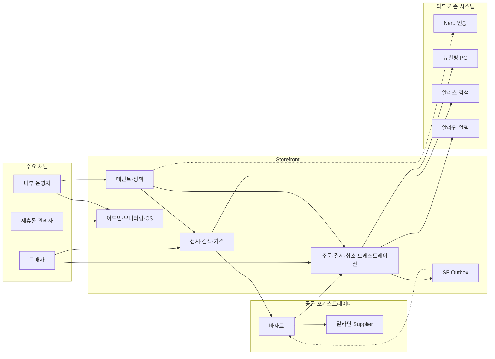

---

## 2. 왜 만드는가

기존 B2B·제휴몰 요구는 파트너마다 인증, 가격, 노출 범위, 결제수단, 포인트, 관리자 조회 범위가 달라 반복 커스텀 개발이 필요하다.

스토어프론트의 목표는 이 반복을 줄이고, **설정만으로 새 몰을 만들고 운영하는 구조**를 만드는 것이다.

핵심 가치는 세 가지다.

| 가치 | 설명 |
|---|---|
| 멀티테넌트 | 제휴사·고객사별 데이터와 정책을 분리한다. |
| 정책 기반 운영 | 가격, 노출, 결제, 포인트, 배송비, 회원 제한을 설정으로 제어한다. |
| 외부 시스템 오케스트레이션 | Naru·바자르·뉴빌링·알리스·알림 시스템을 하나의 구매 여정 안에서 조율한다. |

---

## 3. 핵심 개념 3개

| 개념 | 의미 | 예시 |
|---|---|---|
| Channel | 사용자가 들어오는 수요 채널·흐름 | 임직원 일반 구매, 견적 고객, 향후 외부 수요 채널 |
| Tenant | 계약·운영 단위 | 삼성DS몰, LG생활건강몰, 공공기관 견적몰 |
| Service | 테넌트가 구독하는 상품군·서비스 | `book_mall`, 향후 `music_mall`, 만권당 등 |

MVP에서는 `Channel = 공통 몰`, `Tenant = 첫 고객사 1개`, `Service = book_mall`을 기본으로 시작한다.

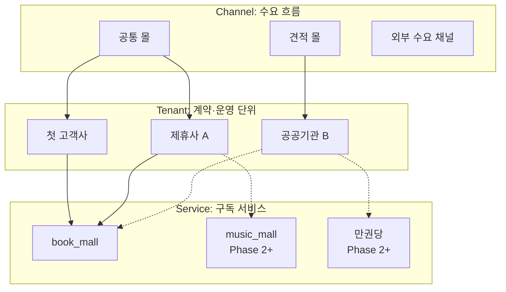

상품 카테고리와 서비스는 분리한다.

| 축 | 의미 | MVP |
|---|---|---|
| `category` | 상품 속성 | 도서 |
| `service_type` | 테넌트 구독 서비스 | `book_mall` 하드코딩, 확장 훅만 준비 |

---

## 4. MVP 기준 성공 정의

MVP의 성공 정의는 다음 문장이다.

> **테넌트 고객이 도서 N권을 주문해서 받고, 필요하면 취소할 수 있다.**

현재 문서상 첫 고객은 "테넌트 고객"으로 잡혀 있으며, 제휴사 고객 또는 대량구매 고객 가능성을 열어둔다. 다만 실제 구현의 기본 Walking Skeleton은 일반 구매형 도서몰 흐름이다.

### 구매자 Walking Skeleton

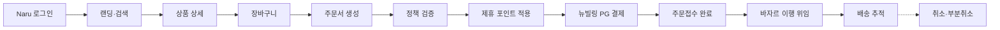

```text
Naru 로그인
→ 랜딩·검색·카테고리 탐색
→ 상품 상세·전용가·재고 확인
→ 장바구니
→ 주문서 생성·정책 검증
→ 제휴사 포인트 단건 적용 + 뉴빌링 PG 결제
→ 주문접수 완료
→ 바자르 이행 위임
→ 배송 상태 추적
→ 필요 시 취소·부분취소
```

---

## 5. MVP 포함 범위

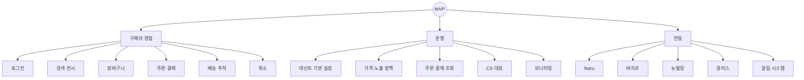

| 영역 | MVP 범위 |
|---|---|
| 인증·권한 | Naru 로그인, JWT 검증, 테넌트 라우팅. 관리자 권한은 최소 2-tier 구조 |
| 테넌트 관리 | 1개 테넌트 기본 구조, 이름·로고 설정, Schema per Tenant |
| 전시·카탈로그 | 바자르 상품 조회, 가격 오버레이, 기본 랜딩, 카테고리, 큐레이션, 베스트셀러·신간 |
| 검색 | 알리스 단순 검색, 테넌트 노출 범위 필터 필요 |
| 가격·재고 | 테넌트별 고정 할인율, 바자르 재고 실시간 조회 |
| 장바구니·주문 | 세션 기반 장바구니, 독립 주문 엔티티, 정책 검증 |
| 결제·혜택 | 뉴빌링 단건 결제 + 제휴사 전용 포인트 단건 |
| 배송 | 바자르 이행 상태 추적, 단일 배송지. 멀티배송지는 구조만 준비 |
| 클레임 | 취소·부분취소만. 반품·교환은 Phase 2 |
| 알림 | 주문·배송 거래성 알림. 배송지 입력 시 동의받은 연락처 기반 알림톡 |
| 모니터링 | 내부 운영자·제휴몰 관리자 주문현황·주문량 조회 |
| CS | 어드민에서 문의 내용 조회·대응. 채널은 후속 결정 |
| 정산 | 자동화 제외. MVP는 수동 CSV 또는 운영 대응 |

---

## 6. MVP 제외 또는 후순위

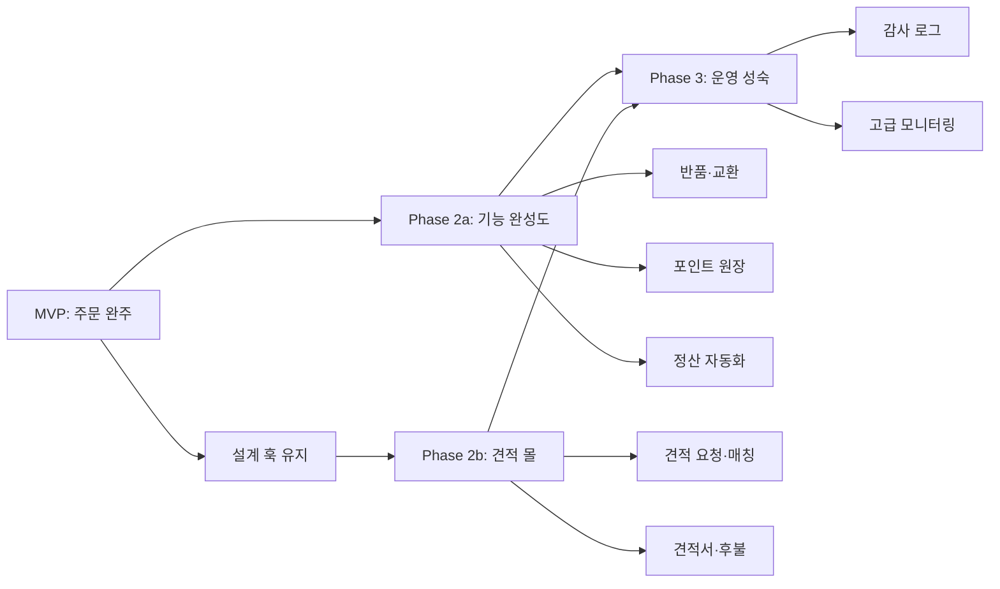

| 항목 | 시점 |
|---|---|
| 견적 몰 전체 플로우 | Phase 2b |
| 반품·교환 | Phase 2 |
| 제휴 포인트 원장 고도화, 복수 포인트 | Phase 2 |
| 알라딘 포인트·쿠폰·적립금 연동 | Phase 2 또는 V1.1 |
| 세금계산서·후불 정산 | 견적 몰 이후 |
| 자동 정산, 고급 매출 리포트 | Phase 2+ |
| 몰 On/Off, 전용 URL | Phase 2 |
| 운영자 주문 상태 수동 변경 | MVP 제외. 시스템 saga 자동 전이만 허용 |
| 리뷰, 계약/제휴, 채널/접근 고도화 | Phase 2+ |
| 다중 서비스 섞어 담기 고도화 | Phase 2+ |

중요한 원칙: **MVP에서 제외하더라도 스키마·인터페이스·확장 훅은 가능한 한 남긴다.** 실구현만 Phase를 나눈다.

---

## 7. 주요 역할

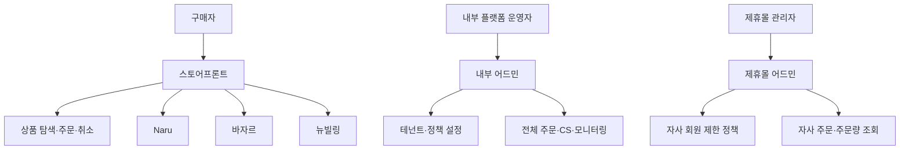

| 역할 | 하는 일 |
|---|---|
| 구매자 | 전용몰에 접속해 상품을 탐색하고 주문·결제·취소한다. |
| 내부 플랫폼 운영자 | 테넌트 생성, 상품 노출 범위, 가격·결제·배송비 정책, 주문·CS·모니터링을 관리한다. |
| 제휴몰 관리자 | 자기 테넌트의 회원 제한 정책, 주문현황, 주문·취소 내역, 기본 정책을 조회하거나 일부 설정한다. |
| 바자르 | 상품 원천, 재고, 주문 이행, 배송, 공급 취소·반품·교환 실행을 맡는다. |
| Naru | 인증, 파트너·사용자 매핑, 사업자정보 마스터를 맡는다. |
| 뉴빌링 | PG 실결제를 맡는다. SF는 결제 오케스트레이션만 한다. |

---

## 8. 서비스 경계

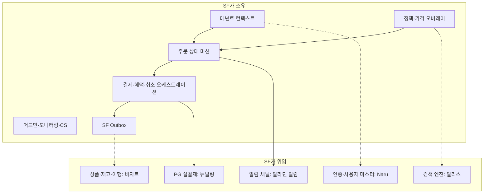

스토어프론트가 소유하는 것:

- 테넌트 컨텍스트와 테넌트별 정책
- 가격 오버레이, 노출 범위, 구매·배송 제한
- 주문 상태 머신과 결제·혜택·취소 오케스트레이션
- 제휴사 포인트 단건 처리
- 모니터링, CS, 운영자·제휴몰 관리자 화면
- SF Outbox, 이벤트 발행·구독, 장애 복구 흐름

스토어프론트가 소유하지 않는 것:

- 상품 원천 데이터, 실재고, 이행, 배송 실행: 바자르
- PG 실결제: 뉴빌링
- 계정 인증·파트너 사용자 매핑: Naru
- 검색 엔진: 알리스
- 주문 이후 알림 채널: 알라딘 알림 시스템

경계 원칙:

| 정책 성격 | 소유 |
|---|---|
| 고객·테넌트·채널 종속 정책 | SF |
| 상품·벤더·이행 종속 정책 | 바자르 |
| PG 승인·취소 실행 | 뉴빌링 |
| 인증·사용자 마스터 | Naru |

---

## 9. 기술 설계 핵심

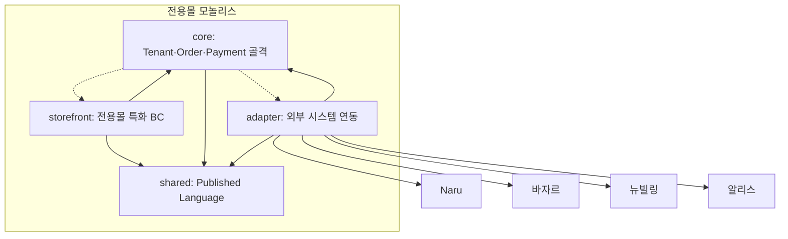

점선은 금지해야 하는 의존 방향이다. 코어가 전용몰 구현이나 외부 어댑터를 직접 알게 되면, 두 번째 몰·채널이 생길 때 코어 추출 비용이 커진다.

| 항목 | 결정 |
|---|---|
| 출발 구조 | 전용몰 단일 모놀리스 |
| 아키텍처 | Hexagonal + DDD + CQRS |
| 언어·프레임워크 | Kotlin 2.0.x, Spring Boot 3.5.x |
| DB | PostgreSQL |
| 멀티테넌시 | Schema per Tenant, 단일 DB로 시작 |
| 테넌트 URL | `{slug}.store.aladin.co.kr` 서브도메인 |
| 패키지 경계 | `core/`, `storefront/`, `adapter/`, `shared/` |
| 외부 연동 | ACL/OHS 어댑터로 격리 |
| 이벤트 | Transactional Outbox, At-Least-Once, 멱등 소비 |
| 주문·결제 | Order ↔ Payment만 강한 Partnership, Order ↔ Bazaar는 비동기 OHS |
| 장애 복구 | PaymentIntent + Reconciler, 보상 saga, Manual Refund Queue |

MVP에서는 MSA로 시작하지 않는다. 코어를 패키지로 분리해 두고, 두 번째 몰·채널이 등장하거나 팀·트래픽 분리가 필요할 때 추출한다.

---

## 10. 주문 오케스트레이션 핵심

결제는 동기로 처리하고, 바자르 이행 위임은 비동기로 처리한다.

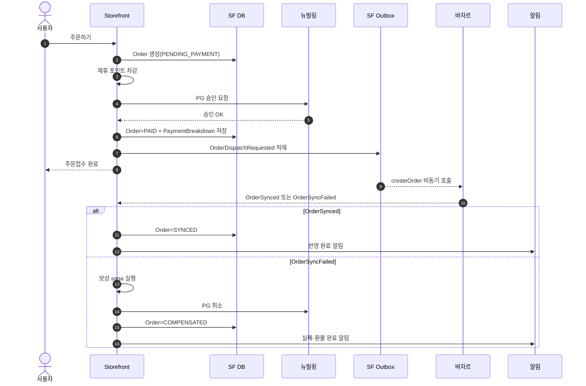

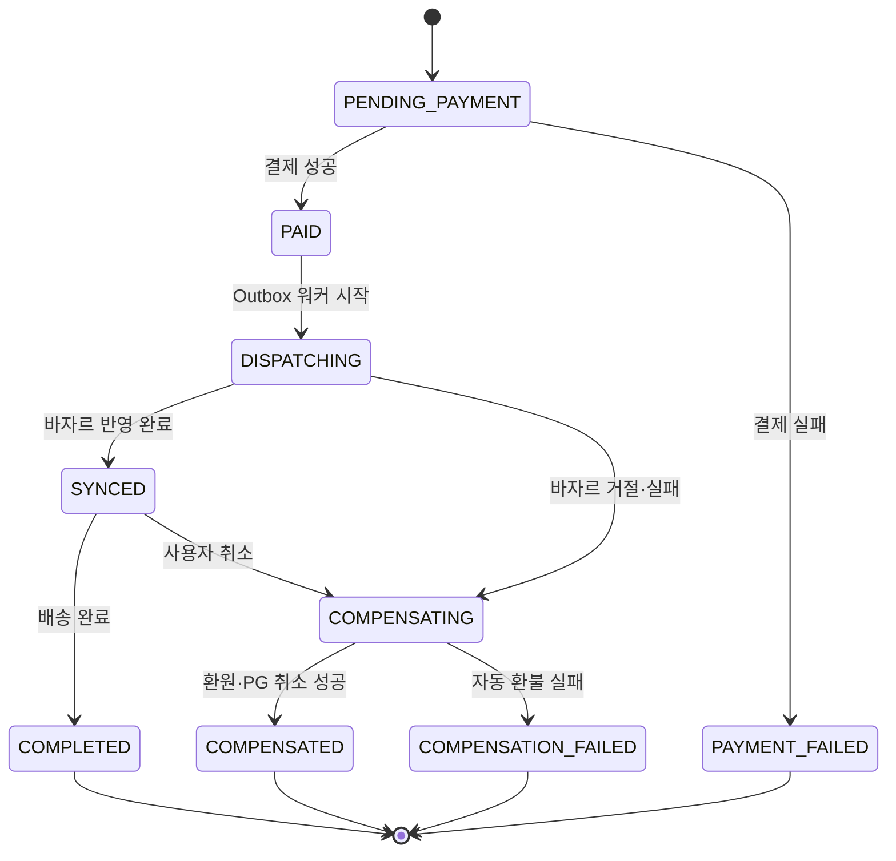

```text
사용자 주문
→ SF Order 생성
→ 제휴 포인트 차감
→ 뉴빌링 PG 승인
→ SF Order = PAID
→ SF Outbox에 OrderDispatchRequested 저장
→ 사용자에게 "주문접수 완료" 즉시 응답
→ SF Outbox 워커가 바자르 createOrder 호출
→ 바자르가 알라딘 supplier 주문 생성
→ 바자르 Outbox 이벤트를 SF가 수신
→ 성공 시 SYNCED/배송 진행, 실패 시 자동 보상
```

실패 처리:

| 실패 | 처리 |
|---|---|
| PG 승인 실패 | 포인트 환원 후 사용자에게 결제 실패 |
| 바자르 네트워크 장애 | Outbox 재시도. 사용자 주문은 접수 상태 유지 |
| 바자르 비즈니스 거절·알라딘 주문 실패 | 자동 보상 saga: 포인트 환원 + PG 취소 |
| PG 취소 영구 실패 | `manual_refund_queue`로 회계·CS 수동 처리 |

운영자는 MVP에서 주문 상태를 수동 변경하지 않는다. 상태 전이는 시스템 이벤트와 saga만 수행한다.

---

## 11. 어드민 MVP

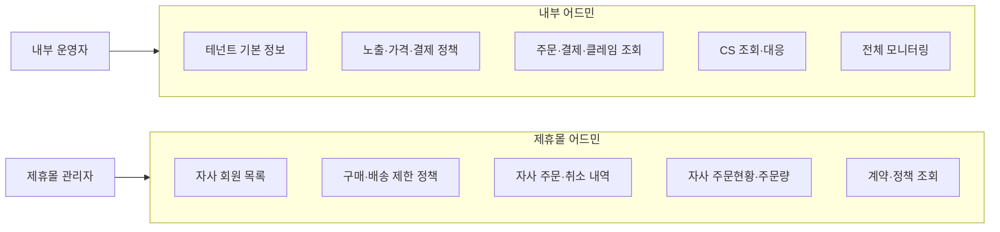

내부 어드민:

- 테넌트 기본 정보: 이름·로고
- 상품 노출 범위
- 가격 정책
- 결제 정책: 제휴 포인트 On/Off, 한도, 뉴빌링 수단
- 배송비 정책: 무료/유료 및 플랫폼 기본 배송비 정책 참조
- 베스트셀러·신간: 알라딘 B2C 데이터 + 테넌트 노출 필터
- 주문·결제·클레임 조회
- CS 조회·대응
- 거래성 알림 관리
- 전체 테넌트 주문현황·주문량 모니터링

제휴몰 어드민:

- 자사 회원 목록 조회
- 회원별 구매·배송 제한 정책
- 자사 주문현황·주문량 조회
- 자사 주문·취소 내역 조회
- 계약·할인율·결제수단·정책 조회

---

## 12. 특히 기억할 결정

| 결정 | 내용 |
|---|---|
| D-20 | 상품 카테고리와 서비스 구독은 분리한다. MVP는 `book_mall` 고정, 카테고리 섞어 담기는 허용한다. |
| D-21 | Approval BC는 만들지 않는다. 회원별 구매·배송 제한 정책으로 해결한다. |
| D-22 | MVP 혜택은 제휴사 전용 포인트 단건만. 알라딘 포인트는 MVP 제외다. |
| D-23 | 모니터링은 MVP 포함이다. 제휴몰 관리자 주문현황·주문량 뷰가 필요하다. |
| D-24 | 베스트셀러·신간은 알라딘 B2C 데이터에 테넌트 노출 범위 필터를 적용한다. |
| D-25 | 주문 상태 운영자 수동 변경은 MVP 제외다. |
| D-26 | 몰 On/Off는 MVP 제외다. |
| D-27 | 배송비 기본 정책은 테넌트 설정이 아니라 플랫폼 레벨 별도 영역이다. |

---

## 13. 아직 확인이 필요한 것

| 항목 | 왜 중요한가 |
|---|---|
| 첫 고객사 확정 | 대량구매 고객이 먼저 오면 결제·배송·관리자 범위가 달라질 수 있다. |
| 알리스 테넌트 필터 지원 | 검색 결과가 테넌트 정책을 지키는지 결정한다. |
| 바자르 API·Outbox 페이로드 계약 | 주문 이행, 실패 코드, 멱등성, 이벤트 스키마를 확정해야 한다. |
| 정책 엔진 위치 | 독립 Policy BC로 둘지, 각 영역에 내재할지 미결이다. |
| 테넌트 컨텍스트 전달 방식 | 요청 헤더, 게이트웨이, 이벤트 스냅샷 등 구현 방식 확정 필요. |
| CS 채널 | 자체 구축인지 기존 알라딘 채널 활용인지 결정 필요. |
| 알림 동의 UX | 배송지 입력 시 연락처 동의를 어떻게 받을지 법적·UX 검토가 필요하다. |
| Outbox 폴링 vs CDC | 운영 비용과 처리 지연에 영향이 있다. |

문서를 읽을 때 주의할 점: 4/15~4/21 문서에는 당시 미확정이거나 가설인 표현이 남아 있다. 최신 기준은 4/22 MVP 확정, 4/28 서비스 경계·주문 오케스트레이션, 4/29 관리자 범위 문서를 우선한다.

---

## 14. 로드맵 요약

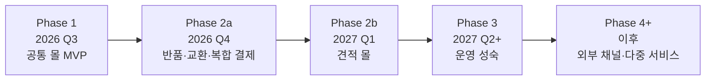

| Phase | 시점 | 목표 |
|---|---|---|
| Phase 1 | 2026 Q3 | 공통 몰 MVP. 1테넌트, 도서몰, 주문·결제·배송·취소 완주 |
| Phase 2a | 2026 Q4 | 반품·교환, 복합 결제, 제휴 포인트 원장, 수동 정산 자동화 |
| Phase 2b | 2027 Q1 | 견적 몰. 견적 요청·매칭·견적서·결제 흐름 |
| Phase 3 | 2027 Q2+ | 세금계산서, 후불 정산, 리뷰, 고급 모니터링, 감사 로그 |
| Phase 4+ | 이후 | 외부 수요 채널, 커스텀 도메인, 복수 배송지, 다중 서비스 확장 |

---

## 15. 새 담당자 추천 읽기 순서

1. `README.md`: 문서 구조 파악
2. `scope/storefront-as-demand-orchestrator.md`: SF 정체성
3. `domain/b2b-store-mvp-definition-0422.md`: MVP 범위
4. `meetings/b2b-store-mvp-summary-0417-0422.md`: 팀 공유용 MVP 요약
5. `architecture/b2b-store-service-boundaries.md`: 서비스 경계·Context Map
6. `architecture/b2b-store-order-orchestration.md`: 주문·결제·바자르 saga
7. `architecture/b2b-store-tenant-model.md`: 멀티테넌시
8. `architecture/b2b-store-bazaar-coordination.md`: 바자르 연동
9. `admin/b2b-store-admin-scope-0423.md`: 관리자·운영 범위
10. `domain/b2b-store-domain-decisions.md`: D-01~D-27 결정 마스터

---

## 16. 30초 설명 스크립트

스토어프론트는 알라딘의 멀티테넌트 커머스 플랫폼입니다. 사용자가 들어오는 수요 채널과 테넌트별 정책을 SF가 관리하고, 상품·재고·이행은 바자르, 인증은 Naru, 실결제는 뉴빌링에 맡깁니다. MVP는 도서몰 기준으로 테넌트 고객이 로그인해서 상품을 검색하고, 장바구니에 담고, 제휴 포인트와 PG로 결제하고, 바자르 이행을 통해 배송받고, 필요하면 취소하는 흐름을 완주시키는 것입니다. 동시에 내부 운영자와 제휴몰 관리자가 최소한의 설정·조회·CS·모니터링을 할 수 있어야 합니다.
