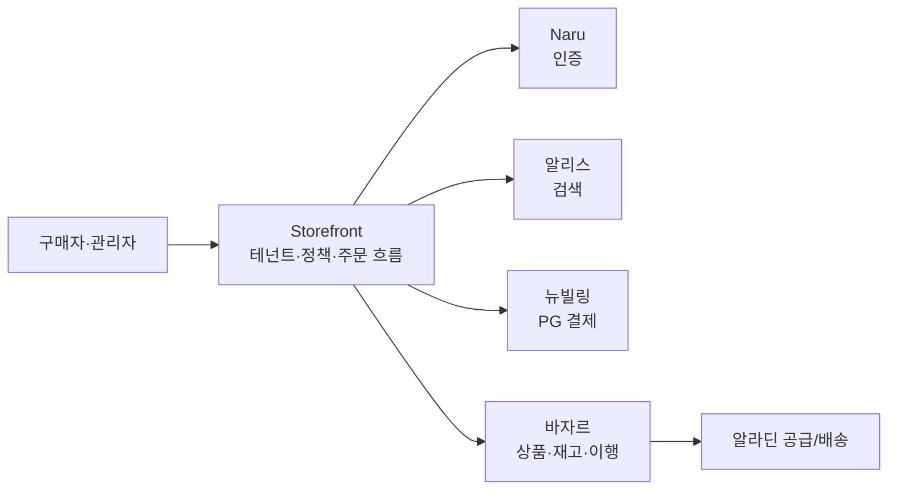

# 스토어프론트 1페이지 요약

> 목적: 스토어프론트를 처음 듣는 사람에게 먼저 공유하는 초간단 설명 문서  
> 상세 설명은 `storefront-onboarding-brief.md`에서 이어서 본다.

---

## 한 줄 정의

**스토어프론트(Storefront, SF)는 알라딘의 여러 커머스 몰을 설정 기반으로 만들고 운영하기 위한 멀티테넌트 커머스 플랫폼이다.**

조금 더 풀면, SF는 고객이 들어오는 **수요 채널**을 관리하고, 상품·재고·배송 같은 공급 영역은 바자르에 맡기는 **수요 오케스트레이터**다.

---

## 왜 필요한가

제휴사마다 요구하는 몰의 조건이 다르다.

- 로그인 방식
- 노출할 상품 범위
- 할인율과 가격 정책
- 결제수단과 제휴 포인트
- 관리자 조회·운영 범위

이걸 매번 커스텀 개발하지 않고, **테넌트와 정책을 설정해서 새 몰을 만들 수 있게 하는 것**이 스토어프론트의 목표다.

---

## 전체 구조



SF가 직접 모든 것을 만들지 않는다. SF는 각 시스템을 연결하고, 테넌트별 정책과 구매 흐름을 조율한다.

---

## MVP에서 만들 것

MVP의 성공 정의는 단순하다.

> **테넌트 고객이 도서를 주문해서 받고, 필요하면 취소할 수 있다.**

구매자 기준 흐름:

```text
로그인 → 상품 검색·탐색 → 장바구니 → 주문 → 결제 → 배송 추적 → 취소
```

MVP 포함 범위:

| 영역 | 내용 |
|---|---|
| 로그인 | Naru 기반 로그인 |
| 상품·전시 | 바자르 상품 조회, 기본 랜딩, 카테고리, 검색 |
| 가격·정책 | 테넌트별 할인율, 노출 범위, 구매 제한 |
| 주문·결제 | 주문 생성, 제휴 포인트 단건, 뉴빌링 PG 결제 |
| 배송·취소 | 바자르 이행 상태 추적, 취소·부분취소 |
| 어드민 | 테넌트 설정, 주문 조회, CS, 주문현황 모니터링 |

---

## SF가 맡는 것과 맡지 않는 것

| 구분 | 담당 |
|---|---|
| 테넌트·정책·가격 오버레이 | SF |
| 주문·결제·취소 흐름 조율 | SF |
| 상품 원천·재고·이행·배송 실행 | 바자르 |
| 인증·사용자 매핑 | Naru |
| PG 실결제 | 뉴빌링 |
| 검색 엔진 | 알리스 |

핵심 원칙:

> 고객·테넌트·채널에 따라 달라지는 정책은 SF가 맡고, 상품·재고·배송처럼 공급에 가까운 일은 바자르가 맡는다.

---

## 지금은 하지 않는 것

MVP에서는 아래를 무리해서 넣지 않는다.

- 견적 몰 전체 흐름
- 반품·교환
- 복수 포인트·포인트 원장 고도화
- 세금계산서·후불 정산
- 리뷰·고급 모니터링
- 몰 On/Off, 전용 URL
- 운영자 주문 상태 수동 변경

대신 나중에 확장할 수 있도록 스키마·인터페이스 훅은 남긴다.

---

## 30초 설명

스토어프론트는 알라딘의 커머스 인프라를 조합해서 제휴사별 몰을 빠르게 만들고 운영하는 플랫폼입니다. SF는 테넌트, 정책, 가격, 주문 흐름을 관리하고, 상품·재고·배송은 바자르, 인증은 Naru, 결제는 뉴빌링에 맡깁니다. MVP는 도서몰 기준으로 고객이 로그인해서 상품을 주문하고 배송받고 필요하면 취소하는 흐름을 완주시키는 것입니다.

---

## 다음에 볼 문서

- `storefront-onboarding-brief.md`: 상세 온보딩 브리프
- `scope/storefront-as-demand-orchestrator.md`: SF 정체성
- `domain/b2b-store-mvp-definition-0422.md`: MVP 범위
- `architecture/b2b-store-service-boundaries.md`: 서비스 경계
