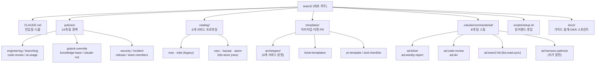
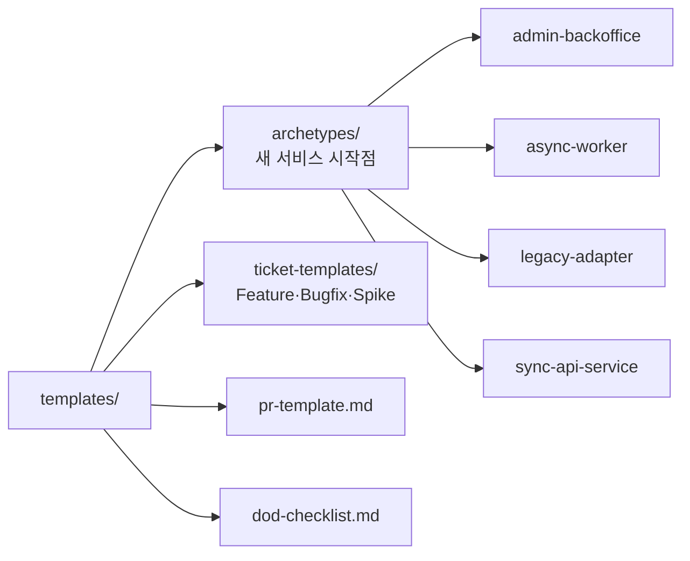
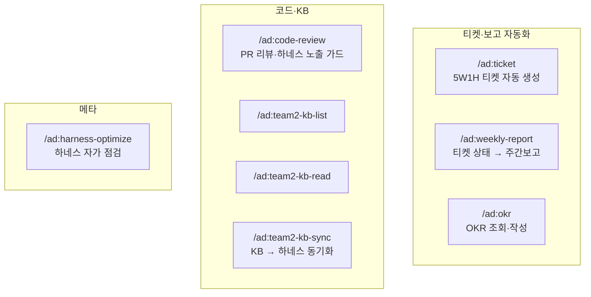
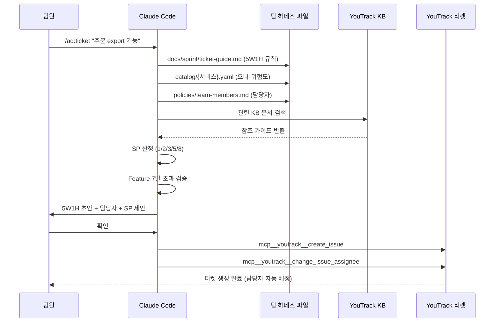
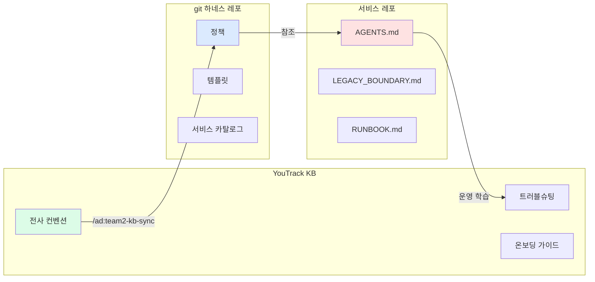
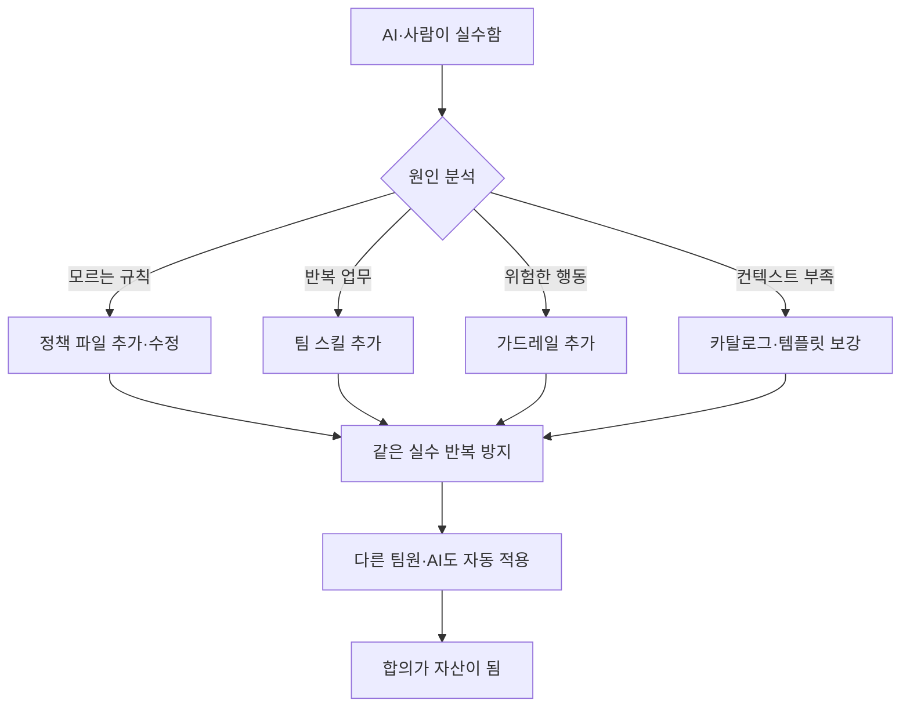
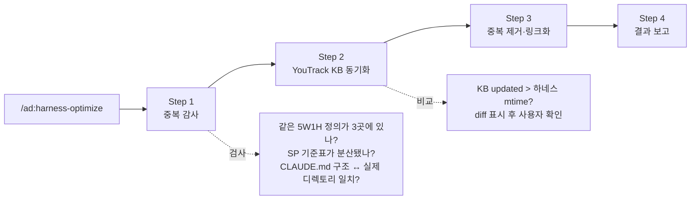
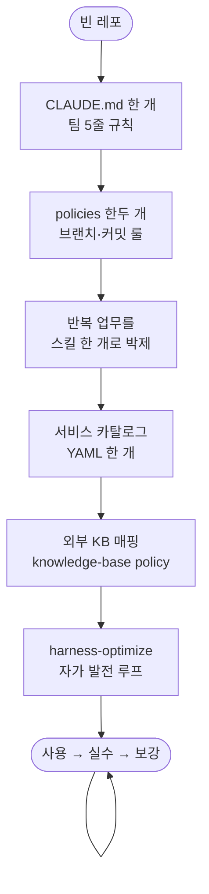

# 팀 하네스 설계 — 사람과 AI가 같은 규칙으로 일하는 법

> 개발 2팀 하네스(`team2/` 레포)를 어떤 컨셉으로 설계했는지에 대한 문서.
> 기술공유 세션 발표 자료로도 사용 가능.

## TL;DR

- **문제**: AI가 우리 팀 컨벤션을 모르고, 팀 정책이 슬랙·노션·머릿속에 흩어져 있다.
- **해법**: 팀 합의를 git에 두고, 사람과 AI가 같은 source of truth를 본다.
- **결과**: 반복 업무가 슬래시 커맨드 한 줄이 되고, 규칙은 사용하면서 스스로 진화한다.

---

## 1. 왜 만들었나

세 가지 관찰에서 시작했다.

1. **AI가 우리 컨벤션을 모른다.** 매 대화마다 "우리는 feature/{이슈ID} 브랜치를 쓰고…"를 다시 입력해야 했다.
2. **팀 정책이 흩어져 있다.** 새 멤버가 들어오면 어디서부터 읽어야 할지 모른다.
3. **같은 실수가 반복된다.** 가드레일이 없으면 사람이든 AI든 같은 실수를 또 한다.

이 세 가지를 한 번에 푸는 방법이 **하네스(harness)** 다. 사람과 AI가 같은 환경에서 같은 규칙으로 일하게 만드는 인프라다.

---

## 2. 설계 원칙 (세 줄)

```
1. 팀 합의는 git에 둔다           (Prompt as Code)
2. 한 정보는 한 파일에만 둔다      (Single Source of Truth)
3. AI가 실수하면 환경을 보강한다   (모델이 아니라 하네스를 고친다)
```

이 세 줄이 모든 디렉토리 구조와 스킬 설계의 기준이다.

---

## 3. 전체 구조



각 디렉토리는 명확한 책임을 가진다. **한 책임은 한 디렉토리.**

---

## 4. 진입점: `CLAUDE.md`

AI가 레포를 처음 만났을 때 읽는 파일. 단 71줄.

핵심 설계 결정 두 가지:

- **정책 본문을 넣지 않는다.** 링크만. 본문은 `policies/`에.
- **5줄 핵심 규칙은 위에 둔다.** 브랜치 이름, 커밋 형식, 작업 시작점.

```markdown
## 핵심 규칙

- 브랜치: feature/{이슈ID} | 커밋: [{이슈ID}] 작업 내용
- 모든 작업은 YouTrack 티켓(5W1H)에서 시작
- Feature ≤ 1주 / Task ≤ 1일 — 초과 시 분할
- DB/SP 변경 별도 승인, 프로덕션 배포 사람 승인
- 신규 백엔드 Kotlin + Spring Boot, SP 직접 호출 금지
```

이 파일은 "지도"고, 본문은 따로 있다. 그래서 가볍게 유지된다.

별도 정책으로도 박아둠 → `policies/claude-md-policy.md`:

> 서비스 CLAUDE.md는 50줄 이하 목표. 길어지면 팀 하네스로 옮기거나 다른 파일로 분리.

---

## 5. 정책 파일 (`policies/`)

14개 파일, 각 50~250줄. **한 정책 한 파일.**

| 정책 파일 | 무엇을 정하나 |
|---|---|
| `engineering-policy.md` | 기술 스택 (신규 Kotlin+Spring Boot, .NET 금지) |
| `branching-strategy.md` | `feature/{이슈ID}` / `[{이슈ID}] 커밋` |
| `code-review-policy.md` | 1명 이상 승인, 셀프 머지 금지 |
| `release-policy.md` | 프로덕션 배포 사람 승인 필수 |
| `ai-usage-policy.md` | AI가 할 수 있는 것/없는 것 |
| `gstack-override-policy.md` | 외부 AI 도구가 우리 컨벤션 어기지 않게 |
| `knowledge-base-policy.md` | git vs YouTrack KB 분담 |
| `claude-md-policy.md` | CLAUDE.md 최소화 규칙 |
| `legacy-modernization-policy.md` | 레거시 현대화 트랙 (observe/wrap/extract/freeze) |
| `aws-secrets-convention.md` | secret 네이밍 (`sm-{service}-{module}-{env}-{resource}`) |
| `mermaid-convention.md` | 다이어그램 작성 규칙 |
| `security-policy.md` / `incident-response.md` | 보안 / 장애대응 |
| `team-members.md` | 팀원·서비스 오너 매핑 |

설계 포인트:

- **짧게 쓴다.** 대부분 50줄 이하. 길어지면 안 읽는다.
- **합의 단위로 분리한다.** 새 합의가 생기면 새 파일을 만든다.
- **Git 변경 이력이 곧 정책 변경 이력.** PR 리뷰 거쳐야 변경 가능.

---

## 6. 서비스 카탈로그 (`catalog/`)

각 서비스의 메타데이터를 YAML로 박아둔다. `_template.yaml` 표준화.

```yaml
service_id: ""
type: ""              # legacy / new
owners:
  primary: ""
  backup: ""
runtime:
  type: ""            # spring-boot / dotnet / nextjs
  version: ""
  language: ""
data:
  main_db: ""
  direct_sp_write: false
risk:
  change_frequency: ""   # high / medium / low
  incident_impact: ""
modernization:
  track: ""              # observe / wrap / extract / freeze
  status: ""
```

왜 분리했나?

- CLAUDE.md에 6개 서비스 정보를 다 넣으면 너무 무겁다.
- AI는 **해당 서비스 작업할 때만** 그 카탈로그를 읽으면 된다.
- 카탈로그를 보면 "이 서비스 owner는 누구, 위험도는 얼마, 현대화 어디까지 갔나"가 한눈에 보인다.

`/ad:ticket` 같은 스킬이 카탈로그를 자동으로 읽어서 담당자를 배정한다.

---

## 7. 템플릿 (`templates/`)



- **archetypes**: 4개 서비스 원형. 새 서비스 만들 때 어느 원형에 가까운지 정하고 시작.
- **ticket-templates**: 티켓 유형별로 5W1H 채우는 가이드. `/ad:ticket` 스킬이 참조.
- **pr-template / dod-checklist**: PR마다 적용. 빠뜨릴 수 없게.

---

## 8. 팀 스킬 (`.claude/commands/ad/`) ★ 핵심

반복 업무를 슬래시 커맨드로 박제한다. 8개 스킬, 각 1~7KB의 마크다운.



스킬 한 개의 구조 (예: `ad:ticket`):

```
1. 사용법 (예시 입력 1~2줄)
2. 참조 문서 표 (어떤 정책·가이드를 읽을지)
3. 핵심 규칙 요약
4. 환경변수
5. 실행 지침 (8단계)
6. 출력 형식 (5W1H 템플릿)
7. 후속 작업 안내
```

스킬 설계 원칙:

- **본문 복사 금지.** 정책·가이드는 링크로 참조한다.
- **검증 게이트 박는다.** 예: Feature 7일 초과 시 생성 차단.
- **사람 승인 게이트.** YouTrack 반영 전 항상 사용자 확인.

---

## 9. YouTrack 통합 — 티켓 자동 생성 흐름

`/ad:ticket "주문 export 기능"` 한 줄이 아래 흐름을 다 돌린다.



핵심: **사람이 한 줄 말하면, 정책·카탈로그·KB·기간 검증·담당자 배정이 한 번에 적용된다.** 빠뜨릴 수 없다.

---

## 10. 지식베이스 동기화 — git ↔ YouTrack KB

전사 KB(YouTrack)와 팀 git 레포는 **역할이 다르다.** 무엇을 어디에 둘지를 정책으로 정했다 (`policies/knowledge-base-policy.md`).



분담 기준:

| 항목 | git | KB |
|---|---|---|
| 정책·규칙 | O | |
| 템플릿 | O | |
| 카탈로그 | O | |
| 컨벤션 상세 가이드 | | O |
| 트러블슈팅 | | O |
| 온보딩 | | O |
| 회의록·결정사항 | | O |

**매핑 테이블** (정책에 박혀있다):

| KB 문서 | 하네스 파일 |
|---|---|
| `REF-A-625` (Git Flow) | `policies/branching-strategy.md` |
| `REF-A-1958` (Clean Architecture) | `policies/engineering-policy.md` |
| `REF-A-3131` (Backend Env) | `catalog/naru.yaml`, `catalog/bazaar.yaml` |

KB가 변경되면 `/ad:team2-kb-sync REF-A-625` 한 줄로 하네스 갱신 제안을 받는다. 사람 확인 후 PR.

---

## 11. 팀 공통 규칙 — 5줄로 압축

CLAUDE.md 최상단에 박혀있는, AI가 가장 먼저 읽는 5줄:

```
1. 브랜치: feature/{이슈ID}
2. 커밋: [{이슈ID}] 작업 내용
3. 모든 작업은 YouTrack 티켓(5W1H)에서 시작
4. Feature ≤ 1주 / Task ≤ 1일 (필수)
5. DB/SP 변경 별도 승인, 프로덕션 배포 사람 승인
```

이 5줄이 안 지켜지는 패턴이 발견되면 → 가드레일로 박는다 (`/ad:ticket`의 7일 검증, `gstack-override-policy`의 커밋 형식 강제 등).

---

## 12. 외부 도구 길들이기 — `gstack-override-policy`

gstack 같은 외부 AI 스킬은 자체 컨벤션이 있다 (예: conventional commits `feat: …`).

우리 팀은 `[T2-123] 작업 내용` 형식을 쓴다. 외부 도구가 우리 규칙을 어기지 않게 명시적으로 오버라이드.

```markdown
### 커밋 메시지 형식
- gstack 기본: <type>: <summary>
- 팀 규칙: [{이슈ID}] 작업 내용
- /ship의 bisected commit에도 이 형식 적용
- VERSION/CHANGELOG 커밋도 동일

### Co-Authored-By 삽입 금지
- gstack 기본: Co-Authored-By: Claude … 자동 삽입
- 팀 규칙: 일체 삽입 금지
```

외부 도구가 들어와도 우리 컨벤션이 우선한다. 외부 도구 → 어댑터 정책 → 우리 규칙.

---

## 13. 자가 발전 — 규칙이 스스로 진화하는 방법

이게 하네스의 진짜 가치다. **사용하면서 좋아진다.**

### AI 실수 → 하네스 보강 루프



실제 적용 사례:

| 실수 | 보강 |
|---|---|
| 코드리뷰 시 PR 본문에 로컬 하네스 경로 노출 | `ad:code-review`에 노출 금지 가드 + memory에 박음 |
| Feature가 1주 넘는데 그냥 생성됨 | `ad:ticket`에 7일 검증·차단 추가 |
| gstack `/ship`이 Co-Authored-By를 자동 삽입 | `gstack-override-policy.md`에 금지 명시 |
| AI가 SP 직접 호출 코드를 썼음 | `ai-usage-policy.md` + 서비스 `LEGACY_BOUNDARY.md` 보강 |

### `/ad:harness-optimize` — 하네스 자가 점검 스킬

정기적으로 하네스 자체를 검사한다.



핵심 원칙: **Source of Truth 1개, 나머지는 링크.** 본문이 여러 곳에 복사되면 정책이 분기한다.

---

## 14. 효과 (정성)

발표할 때 "이걸로 뭐가 좋아졌나"는 청중이 가장 궁금해 하는 부분.

| 항목 | 전 | 후 |
|---|---|---|
| 티켓 5W1H 작성 | 누락·형식 일관성 없음 | `/ad:ticket` 한 줄, 자동 검증 |
| 주간보고 작성 | 매주 30분 수작업 | 티켓 상태 자동 동기화로 5분 |
| 신입 온보딩 | 슬랙·노션·머릿속 헤맴 | CLAUDE.md → policies/ 한 번 |
| AI 작업물 일관성 | 매번 컨텍스트 붙여넣기 | 자동 적용, 가드레일 작동 |
| 정책 변경 추적 | 슬랙 합의 → 잊힘 | git PR로 이력 남음 |
| 외부 도구 컨벤션 충돌 | gstack이 멋대로 커밋 | gstack-override로 강제 |

---

## 15. 다른 팀에 적용하려면 (Adoption Path)

처음부터 다 만들 필요 없다. 이 순서로 쌓는다.



첫 단계(CLAUDE.md 한 개)만 해도 가치 있다. 세 번째 단계(반복 업무 스킬화)까지 가면 ROI가 확연하다. 마지막 자가 발전 루프는 1년 안에 도달한다.

---

## 16. 한 줄 요약

> **하네스 = 사람과 AI가 같은 규칙으로 일하기 위한 환경.**
> 모델이 좋아지길 기다리지 않는다. 환경을 좋게 만든다.
> 팀이 합의하면 → git에 둔다 → AI가 읽는다 → 자동 적용된다 → 실수하면 보강한다.

---

## 부록 A. 발표 진행 순서 제안 (35분 기준)

| 시간 | 섹션 | 내용 |
|---|---|---|
| 0~3분 | TL;DR · 왜 만들었나 | 1, 2번 |
| 3~8분 | 설계 원칙 + 폴더 구조 | 2, 3번 (Mermaid 1) |
| 8~13분 | CLAUDE.md + 정책 + 카탈로그 | 4, 5, 6번 |
| 13~18분 | 템플릿 + 팀 스킬 | 7, 8번 |
| 18~25분 | YouTrack 통합 + KB 동기화 (라이브 데모 권장) | 9, 10번 (Mermaid 2, 3) |
| 25~30분 | 자가 발전 루프 | 13번 (Mermaid 5) |
| 30~33분 | 효과 + 다른 팀 적용 | 14, 15번 (Mermaid 6) |
| 33~35분 | Q&A 도입 + 한 줄 요약 | 16번 |

라이브 데모로 보여주면 좋은 것:
1. `CLAUDE.md` → `policies/` 링크 타고 들어가기
2. `/ad:ticket` 실행해서 자동으로 카탈로그·KB 읽는 모습
3. `/ad:harness-optimize 감사` 실행 → 중복 발견 → 정리 제안

---

## 부록 B. 참고 파일

- `CLAUDE.md` — 진입점
- `policies/claude-md-policy.md` — 진입점 설계 철학
- `policies/ai-usage-policy.md` — AI 가드레일 + 하네스 개선 루프
- `policies/knowledge-base-policy.md` — git ↔ KB 분담
- `policies/gstack-override-policy.md` — 외부 도구 어댑터
- `.claude/commands/ad/ticket.md` — 가장 정교한 스킬 예시
- `.claude/commands/ad/harness-optimize.md` — 자가 점검 스킬
- `catalog/_template.yaml` — 서비스 프로파일 표준
