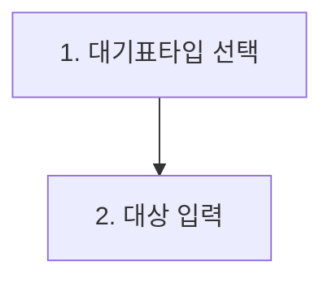
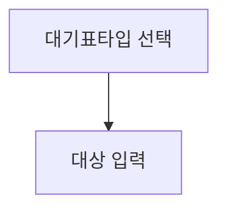
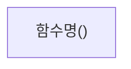
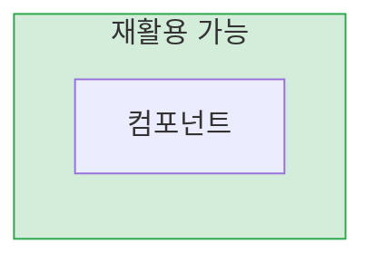

# Mermaid 다이어그램 작성 컨벤션

> YouTrack KB, Typora 등 다양한 마크다운 뷰어에서 정상 렌더링되도록 하기 위한 규칙

## 노드 텍스트 규칙

### 번호 매기기 금지

노드 텍스트 안에 `1. `, `2. ` 등의 번호를 사용하면 마크다운 ordered list로 파싱되어 "Unsupported markdown: list" 오류가 발생한다.





화살표 레이블도 동일하다.

```mermaid
%% BAD
    A -->|"1. 페이지 접속"| B
```

```mermaid
%% GOOD
    A -->|페이지 접속| B
```

순서를 표현해야 하면 노드 ID나 화살표 연결 순서로 표현한다.

### 괄호 사용 주의

노드 텍스트에 `()`를 직접 쓸 수 있지만, 반드시 `["..."]` 형태로 감싸야 한다. `()` 자체가 Mermaid의 둥근 노드 문법이기 때문이다.

```mermaid
%% BAD - 괄호가 노드 형태로 해석될 수 있음
flowchart TD
    A(함수명())
```



## subgraph 규칙

### style 지시어에 한글 이름 사용 금지

subgraph에 `style` 지시어를 적용할 때 한글 이름을 직접 참조하면 파싱이 실패한다. 반드시 영문 ID를 부여하고, 한글은 표시 레이블로만 사용한다.

```mermaid
%% BAD - style에 한글 참조
graph LR
    subgraph "재활용 가능"
        A["컴포넌트"]
    end
    style 재활용 가능 fill:#d4edda
```



### subgraph 안의 direction 지시어

일부 렌더러에서 subgraph 내부의 `direction TB` 등이 무시되거나 오류가 발생한다. 복잡한 subgraph 중첩보다는 단순한 구조를 우선한다.

## 호환성 체크리스트

문서 작성 후 아래 항목을 확인한다.

| 항목 | 확인 |
|------|------|
| 노드 텍스트에 `숫자. ` 패턴 없음 | |
| 화살표 레이블에 `숫자. ` 패턴 없음 | |
| 모든 특수문자 포함 노드는 `["..."]`로 감쌈 | |
| subgraph style 참조는 영문 ID 사용 | |
| Typora에서 렌더링 확인 | |

## 권장 다이어그램 유형

| 용도 | 다이어그램 | 예시 |
|------|-----------|------|
| 프로세스 흐름 | `flowchart TD` / `flowchart LR` | 사용자 시나리오, 업무 절차 |
| 시스템 간 통신 | `sequenceDiagram` | API 호출 흐름, 인증 플로우 |
| 데이터 구조 | `erDiagram` | DB 테이블 관계 |
| 클래스 구조 | `classDiagram` | 핵심 클래스 관계 |
| 시스템 구성 | `graph TB` / `graph LR` | 아키텍처 구성도 |
